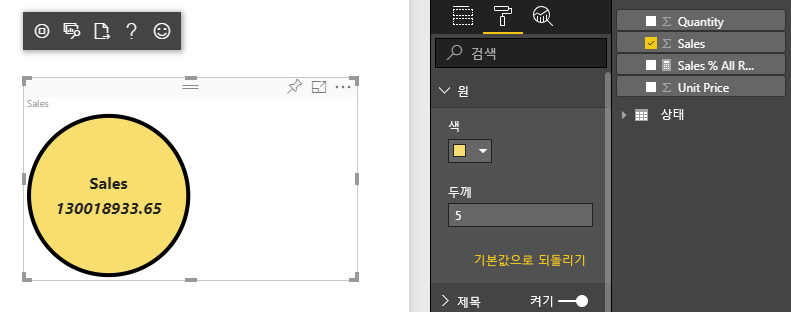
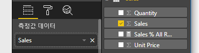

# <a name="tutorial-create-a-react-based-visual"></a>자습서:  React 기반 시각적 개체 만들기

이 자습서에서는 [React](https://reactjs.org/)를 사용하여 Power BI 시각적 개체를 만드는 방법을 설명합니다. 이 시각적 개체는 원 안에 값을 표시합니다. 시각적 개체에는 사용자 지정을 위한 적응형 크기 및 설정이 있습니다. 이 문서의 정보를 사용하여 React를 기반으로 고유한 Power BI 시각적 개체를 만들 수 있습니다.



이 자습서에서는 다음 작업을 수행하는 방법을 알아봅니다.

> [!div class="checklist"]
>
> * 개발 환경 설정
> * React 시각적 개체 만들기
> * 시각적 개체 기능 구성
> * Power BI에서 데이터 렌더링
> * 시각적 개체 크기 조정
> * 시각적 개체를 사용자 지정할 수 있도록 설정

## <a name="prerequisites"></a>필수 조건

* **Power BI Pro** 계정. 시작하기 전에 [무료 평가판에 등록](https://powerbi.microsoft.com/pricing/)하세요.
* [Visual Studio Code](https://www.visualstudio.com/)
* Windows 사용자의 경우 [Windows PowerShell](/powershell/scripting/install/installing-windows-powershell) 버전 4 이상, OSX 사용자의 경우 [터미널](https://macpaw.com/how-to/use-terminal-on-mac)
* [Power BI 시각적 개체 개발을 위한 환경 설정](environment-setup.md)에 설명된 환경입니다.

## <a name="getting-started"></a>시작

시작하려면 `pbiviz`를 사용하여 최소 Power BI 시각적 개체를 만듭니다. 프로젝트 및 프로젝트 구조에 대한 자세한 내용은 [Power BI 시각적 개체 프로젝트 구조](visual-project-structure.md)를 참조하세요. 이 시각적 개체의 전체 소스 코드는 [Circle Card React 시각적 개체](https://github.com/Microsoft/powerbi-visuals-circlecard-react)를 참조하세요.

[GitHub](https://github.com/Microsoft/powerbi-visuals-circlecard-react)에서 시각적 개체의 전체 소스 코드를 복제하거나 다운로드할 수 있습니다.

1. PowerShell을 열고 다음 명령을 실행합니다.

   ```powershell
   pbiviz new ReactCircleCard
   ```

   이 명령은 *ReactCircleCard* 라는 폴더를 만듭니다.

1. 디렉터리를 해당 폴더로 변경하고 Visual Studio Code를 엽니다.

   ```powershell
   cd ./ReactCircleCard
   code .
   ```

1. 시각적 개체에 대한 개발자 서버를 시작합니다.

   ```powershell
   pbiviz start
   ```

   

이 기본 시각적 개체는 업데이트 횟수를 나타냅니다. 다음 단계에서 원 카드로 변환해 보겠습니다.

## <a name="change-the-visual-to-a-circle-card"></a>시각적 개체를 원 카드로 변경

이 기본 시각적 개체는 업데이트 횟수를 나타냅니다. 다음으로 이 시각적 개체를 측정값 및 제목을 나타내는 원 카드로 변환합니다.

1. 다음 명령을 실행하여 필요한 종속성을 설치합니다.

   ```powershell
   npm i react react-dom
   ```

1. 다음 명령을 실행하여 React 16과 해당 버전의`react-dom` 및 typings를 설치합니다.

   ```powershell
   npm i @types/react @types/react-dom
   ```

1. React 구성 요소 클래스를 만듭니다. Visual Studio Code에서 **파일** > **새 파일** 을 선택합니다. 다음 코드를 파일에 복사합니다.

    ```typescript
    import * as React from "react";

    export class ReactCircleCard extends React.Component<{}>{
        render(){
            return (
                <div className="circleCard">
                    Hello, React!
                </div>
            )
        }
    }

    export default ReactCircleCard;
    ```

1. **다른 이름으로 저장** 을 선택합니다. *src* 디렉터리로 이동합니다. ‘구성 요소’ 이름을 입력합니다. **파일 형식** 에서 **TypeScript React** 를 선택합니다.

1. *src/visual.ts* 를 엽니다. 현재 코드를 다음 코드로 바꿉니다.

    ```typescript
    "use strict";
    import powerbi from "powerbi-visuals-api";

    import DataView = powerbi.DataView;
    import VisualConstructorOptions = powerbi.extensibility.visual.VisualConstructorOptions;
    import VisualUpdateOptions = powerbi.extensibility.visual.VisualUpdateOptions;
    import IVisual = powerbi.extensibility.visual.IVisual;

    import "./../style/visual.less";

    export class Visual implements IVisual {

        constructor(options: VisualConstructorOptions) {

        }

        public update(options: VisualUpdateOptions) {

        }
    }
    ```

1. 방금 추가한 React 종속성 및 구성 요소를 가져옵니다.

    ```typescript
    import * as React from "react";
    import * as ReactDOM from "react-dom";
    ...
    import ReactCircleCard from "./component";
    ```

   기본 Power BI TypeScript 설정은 React *tsx* 파일을 허용하지 않습니다. Visual Studio Code는 `component`를 오류로 강조 표시합니다.

1. *tsconfig.json* 파일을 열고 `compilerOptions` 항목의 시작 부분에 두 줄을 추가합니다.

    ```json
    {
      "compilerOptions": {
        "jsx": "react",
        "types": ["react", "react-dom"],
        //...
      }
    }
    ```

   `component` 오류가 사라질 것입니다.

   구성 요소를 렌더링하려면 대상 HTML 요소를 추가합니다. 이 요소는 생성자에 전달되는 `VisualConstructorOptions`의 `HTMLElement`입니다.

1. 다음 코드와 같이 `Visual` 클래스를 수정합니다.

    ```typescript
      private target: HTMLElement;
      private reactRoot: React.ComponentElement<any, any>;

      constructor(options: VisualConstructorOptions) {
          this.reactRoot = React.createElement(ReactCircleCard, {});
          this.target = options.element;

          ReactDOM.render(this.reactRoot, this.target);
      }
    ```

1. 다음 명령을 사용하여 변경 내용을 저장하고 기존 코드를 실행합니다.

    ```bash
    pbiviz start
    ```

   > [!NOTE]
   > 이전에 `pbiviz`를 실행한 경우에는 다시 시작하여 *tsconfig.json* 에서 변경 내용을 적용해야 합니다.

  

## <a name="configure-capabilities"></a>기능 구성

시각적 개체의 기능을 구성할 수 있습니다.

1. `capabilities.json` 엽니다. `dataRoles`에서 `Category Data` 개체를 제거합니다. `ReactCircleCard`에는 단일 값이 표시되므로 `Measure Data`만 필요합니다. 이제 `dataRoles` 키가 다음과 같이 표시됩니다.

    ```json
    "dataRoles": [
        {
            "displayName": "Measure Data",
            "name": "measure",
            "kind": "Measure"
        }
    ],
    ```

1. `objects` 키의 콘텐츠를 모두 제거합니다. 나중에 이를 채울 것입니다.

    ```json
        "objects": {},
    ```

1. `dataViewMappings` 속성의 다음 코드를 복사합니다. 값 `max: 1`은 하나의 측정값 열만 제출할 수 있음을 의미합니다.

    ```json
        "dataViewMappings": [
            {
                "conditions": [
                    {
                        "measure": {
                            "max": 1
                        }
                    }
                ],
                "single": {
                    "role": "measure"
                }
            }
        ]
    ```

이제 `Fields` 창의 데이터를 시각적 개체 설정으로 가져올 수 있습니다.



## <a name="receive-properties-from-power-bi"></a>Power BI로부터 속성 수신

React를 사용하여 데이터를 렌더링할 수 있습니다. 구성 요소는 자체 상태의 데이터를 표시할 수 있습니다.

1. *src/component.tsx* 를 수정합니다.

    ```javascript
    export interface State {
        textLabel: string,
        textValue: string
    }

    export const initialState: State = {
        textLabel: "",
        textValue: ""
    }

    export class ReactCircleCard extends React.Component<{}, State>{
        constructor(props: any){
            super(props);
            this.state = initialState;
        }

        render(){
            const { textLabel, textValue } = this.state;

            return (
                <div className="circleCard">
                    <p>
                        {textLabel}
                        <br/>
                        <em>{textValue}</em>
                    </p>
                </div>
            )
        }
    }
    ```

1. *styles/visual.less* 를 편집하여 새 태그의 스타일을 추가합니다.

    ```css
    .circleCard {
        position: relative;
        box-sizing: border-box;
        border: 1px solid #000;
        border-radius: 50%;
        width: 200px;
        height: 200px;
    }

    p {
        text-align: center;
        line-height: 30px;
        font-size: 20px;
        font-weight: bold;

        position: relative;
        top: -30px;
        margin: 50% 0 0 0;
    }
    ```

1. 시각적 개체는 현재 데이터를 `update` 메서드의 인수로 받습니다. *src/visual.ts* 를 열고 `ReactCircleCard.update`에 코드를 추가합니다.

    ```typescript
    //...
    import { ReactCircleCard, initialState } from "./component";
    //...

    export class Visual implements IVisual {
        //...
        public update(options: VisualUpdateOptions) {

            if(options.dataViews && options.dataViews[0]){
                const dataView: DataView = options.dataViews[0];

                ReactCircleCard.update({
                    textLabel: dataView.metadata.columns[0].displayName,
                    textValue: dataView.single.value.toString()
                });
            } else {
                this.clear();
            }
        }

        private clear() {
            ReactCircleCard.update(initialState);
        }
    }
    ```

    이 코드는 `DataView`에서 `textLabel` 및 `textValue`를 선택하고, 데이터가 존재하면 구성 요소 상태를 업데이트합니다.

1. 업데이트를 구성 요소 인스턴스로 보내려면 `ReactCircleCard` 클래스에 다음 코드를 삽입합니다.

    ```typescript
        private static updateCallback: (data: object) => void = null;

        public static update(newState: State) {
            if(typeof ReactCircleCard.updateCallback === 'function'){
                ReactCircleCard.updateCallback(newState);
            }
        }

        public state: State = initialState;

        public componentWillMount() {
            ReactCircleCard.updateCallback = (newState: State): void => { this.setState(newState); };
        }

        public componentWillUnmount() {
            ReactCircleCard.updateCallback = null;
        }
    ```

1. 시각적 개체를 테스트합니다. `pbiviz start`가 실행되었는지 확인하고 모든 파일을 저장합니다. 시각적 개체를 새로 고칩니다.

   

## <a name="make-component-resizable"></a>구성 요소 크기를 조정 가능하도록 설정

이 섹션에서는 구성 요소의 크기를 조정할 수 있도록 설정합니다. 현재 구성 요소는 너비와 높이가 고정되어 있습니다.

`options` 개체에서 시각적 개체 뷰포트의 현재 크기를 가져옵니다.

1. *src/visual.ts* 를 엽니다. `IViewport` 인터페이스를 가져오고 `viewport` 속성을 `visual` 클래스에 추가합니다.

    ```typescript
    import IViewport = powerbi.IViewport;

    //...

    export class Visual implements IVisual {
        private viewport: IViewport;
        //...
    }
    ```

1. 다음 코드를 `visual`의 `update` 메서드에 추가합니다.

    ```typescript
      if (options.dataViews && options.dataViews[0]) {
          const dataView: DataView = options.dataViews[0];

          this.viewport = options.viewport;
          const { width, height } = this.viewport;
          const size = Math.min(width, height);

          ReactCircleCard.update({
              size,
              //...
          });
      }
    ```

1. *src/component.tsx* 에서 `State` 인터페이스에 속성을 추가합니다.

    ```typescript
    export interface State {
        //...
        size: number
    }

    const initialState: State = {
        //...
        size: 200
    }
    ```

1. *src/component.tsx* 에서 `render` 메서드를 다음과 같이 변경합니다.

    ```typescript
        render() {
            const { textLabel, textValue, size } = this.state;

            const style: React.CSSProperties = { width: size, height: size };

            return (
                <div className="circleCard" style={style}>
                    {/* ... */}
                </div>
            )
        }
    ```

1. *style/visual.less* 의 `width` 및 `height` 규칙을 `min-width` 및 `min-height`으로 바꿉니다.

    ```css
        min-width: 200px;
        min-height: 200px;
    ```

이제 뷰포트 크기를 조정할 수 있습니다. 원 지름은 너비 또는 높이의 최소 크기에 해당합니다.

## <a name="make-your-power-bi-visual-customizable"></a>Power BI 시각적 개체를 사용자 지정할 수 있도록 설정

이 섹션에서는 시각적 개체를 사용자 지정할 수 있도록 설정합니다.

1. *capabilities.json* 을 엽니다. `objects` 속성에 다음 설정을 추가합니다.

    ```json
    //...
        "objects": {
            "circle": {
                "displayName": "Circle",
                "properties": {
                    "circleColor": {
                        "displayName": "Color",
                        "description": "The fill color of the circle.",
                        "type": {
                            "fill": {
                                "solid": {
                                    "color": true
                                }
                            }
                        }
                    },
                    "circleThickness": {
                        "displayName": "Thickness",
                        "description": "The circle thickness.",
                        "type": {
                            "numeric": true
                        }
                    }
                }
            }
        },
    //...
    ```

1. *src/settings.ts* 의 기존 코드를 다음 코드로 바꿉니다.

    ```typescript
    "use strict";

    import { dataViewObjectsParser } from "powerbi-visuals-utils-dataviewutils";
    import DataViewObjectsParser = dataViewObjectsParser.DataViewObjectsParser;

    export class CircleSettings {
        public circleColor: string = "white";
        public circleThickness: number = 2;
    }

    export class VisualSettings extends DataViewObjectsParser {
        public circle: CircleSettings = new CircleSettings();
    }
    ```

1. *src/visual.ts* 의 맨 위에 다음 `import` 문을 추가합니다.

    ```typescript
    import VisualObjectInstance = powerbi.VisualObjectInstance;
    import EnumerateVisualObjectInstancesOptions = powerbi.EnumerateVisualObjectInstancesOptions;
    import VisualObjectInstanceEnumerationObject = powerbi.VisualObjectInstanceEnumerationObject;

    import { VisualSettings } from "./settings";

    ```

1. *src/visual.ts* 에 `enumerateObjectInstances` 메서드를 추가합니다. 이 메서드는 시각적 개체 설정을 적용하는 데 사용됩니다.

    ```typescript
    export class Visual implements IVisual {
        private settings: VisualSettings;

        //...

        public enumerateObjectInstances(
            options: EnumerateVisualObjectInstancesOptions
        ): VisualObjectInstance[] | VisualObjectInstanceEnumerationObject {

            return VisualSettings.enumerateObjectInstances(this.settings || VisualSettings.getDefault(), options);
        }
    }
    ```

1. 이제 `dataView` 개체가 설정을 받을 수 있도록 코드를 추가합니다.

    ```typescript
        public update(options: VisualUpdateOptions) {

            if(options.dataViews && options.dataViews[0]){
                //...
                this.settings = VisualSettings.parse(dataView) as VisualSettings;
                const object = this.settings.circle;

                ReactCircleCard.update({
                    borderWidth: object && object.circleThickness ? object.circleThickness : undefined,
                    background: object && object.circleColor ? object.circleColor : undefined,
                    //...
                });
            }
        }
    }
    ```

1. 먼저 `State`에 다음 값을 추가하여 *src/component.tsx* 에 해당 변경 내용을 적용합니다.

    ```typescript
    export interface State {
        //...
        background?: string,
        borderWidth?: number
    }
    ```

1. 그런 다음 `render` 메서드에 다음 코드를 추가합니다.

    ```typescript
        const { /*...*/ background, borderWidth } = this.state;

        const style: React.CSSProperties = { /*...*/ background, borderWidth };
    ```

    

## <a name="next-steps"></a>다음 단계

Power BI 개발에 대한 자세한 내용은 [Power BI 시각적 개체에 대한 지침](guidelines-powerbi-visuals.md) 및 [Power BI의 시각적 개체](power-bi-visuals-concept.md)를 참조하세요.