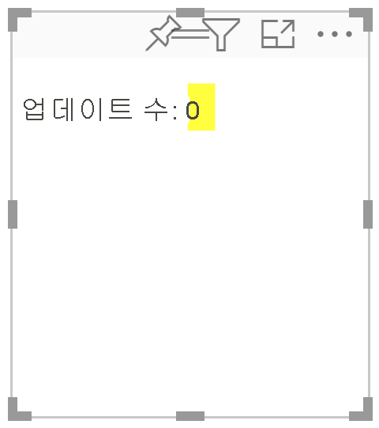
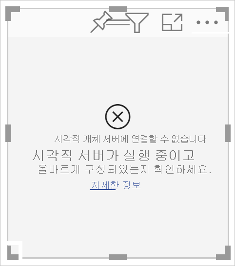
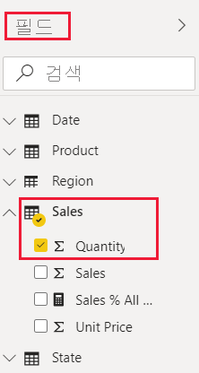
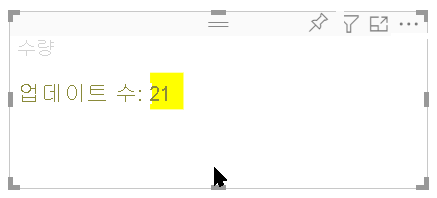
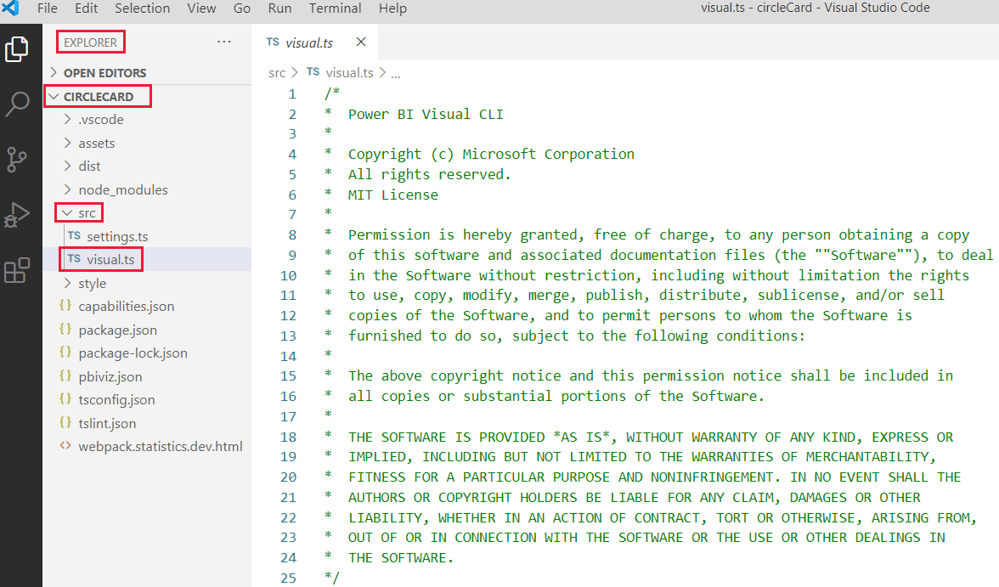
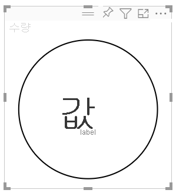

# <a name="tutorial-develop-a-power-bi-circle-card-visual"></a>자습서:  Power BI 원 카드 시각적 개체 개발

개발자는 Power BI 시각적 개체를 직접 만들 수 있습니다. 이러한 시각적 개체는 개발자 본인, 본인이 속한 조직 또는 제3자가 사용할 수 있습니다.

이 자습서에서는 원 안에 서식이 지정된 측정값을 표시하는 원 카드라는 Power BI 시각적 개체를 개발합니다. 원 카드 시각적 개체는 채우기 색 및 윤곽선 두께를 사용자 지정할 수 있습니다.

이 자습서에서는 다음 작업 방법을 알아봅니다.
> [!div class="checklist"]
> * 시각적 개체에 대한 개발 프로젝트 만들기
> * D3 시각적 개체 요소를 사용하여 시각적 개체 개발
> * 데이터를 처리하도록 시각적 개체 구성

## <a name="prerequisites"></a>전제 조건

Power BI 시각적 개체 개발을 시작하기 전에, 이 섹션에 나열된 모든 것이 준비되어 있는지 확인합니다.

* **Power BI Pro** 계정이 필요합니다. 계정이 없는 경우 [평가판에 가입](https://powerbi.microsoft.com/pricing/)하세요.

* [VS Code(Visual Studio Code)](https://www.visualstudio.com/) VS Code는 JavaScript 및 TypeScript 애플리케이션 개발에 적합한 IDE(통합 개발 환경)입니다.

* [Windows PowerShell](/powershell/scripting/install/installing-windows-powershell) 버전 4 이상(Windows인 경우). 또는 [터미널](https://macpaw.com/how-to/use-terminal-on-mac)(OSX인 경우).

* Power BI 시각적 개체를 개발할 준비가 완료된 환경. [Power BI 시각적 개체 개발을 위한 환경을 설정하세요](environment-setup.md).

* 이 자습서에서는 **미국 영업 분석** 보고서를 사용합니다. 이 보고서를 [다운로드](https://microsoft.github.io/PowerBI-visuals/docs/step-by-step-lab/images/US_Sales_Analysis.pbix)하여 Power BI 서비스에 업로드해도 되고 자체 보고서를 사용해도 됩니다. Power BI 서비스 및 파일 업로드에 대한 자세한 내용은 [Power BI 서비스에서 만들기 시작](../../fundamentals/service-get-started.md) 자습서를 참조하세요.

## <a name="create-a-development-project"></a>개발 프로젝트 만들기

이 섹션에서는 원 카드 시각적 개체에 대한 프로젝트를 만듭니다.

1. PowerShell을 열고 프로젝트를 만들려는 폴더로 이동합니다.

2. 다음 명령을 입력합니다.

    ```PowerShell
    pbiviz new CircleCard
    ```

3. 프로젝트의 폴더로 이동합니다.

    ```powershell
    cd CircleCard
    ```

4. 원 카드 시각적 개체를 시작합니다. 시각적 개체는 컴퓨터에서 호스트되는 동안 실행됩니다.

    ```powershell
    pbiviz start
    ```
    >[!IMPORTANT]
    >자습서를 마칠 때까지 PowerSell 창을 닫지 마세요. 시각적 개체의 실행을 중지하려면 Ctrl+C를 입력하고, 일괄 처리 작업을 종료하라는 메시지가 표시되면 Y를 입력하고 *Enter* 키를 누릅니다.

## <a name="view-the-circle-card-in-power-bi-service"></a>Power BI 서비스에서 원 카드 보기

Power BI 서비스에서 원 카드 시각적 개체를 테스트하기 위해 **미국 영업 분석** 보고서를 사용하겠습니다. 이 보고서를 [다운로드](https://microsoft.github.io/PowerBI-visuals/docs/step-by-step-lab/images/US_Sales_Analysis.pbix)하여 Power BI 서비스에 업로드할 수 있습니다.

자체 보고서를 사용하여 원 카드 시각적 개체를 테스트할 수도 있습니다.

>[!NOTE]
>계속하기 전에, [시각적 개체 개발자 설정을 활성화](environment-setup.md#set-up-power-bi-service-for-developing-a-visual)했는지 확인합니다.

1. [PowerBI.com](https://powerbi.microsoft.com/)에 로그인하여 **미국 영업 분석** 보고서를 엽니다.

2. **추가 옵션** > **편집** 을 선택합니다.

    >[!div class="mx-imgBorder"]
    >

3. Power BI 서비스 인터페이스 아래쪽에서 **새 페이지** 단추를 클릭하여 테스트할 새 페이지를 만듭니다.

    >[!div class="mx-imgBorder"]
    >![Power BI 서비스의 [새 페이지] 단추 스크린샷](media/develop-circle-card/new-page.png)

4. **시각화** 창에서 **개발자 시각적 개체** 를 선택합니다.

    >[!div class="mx-imgBorder"]
    >![[시각화] 창의 [개발자 시각적 개체] 스크린샷](media/develop-circle-card/developer-visual.png)

    이 시각적 개체는 컴퓨터에서 실행하는 사용자 지정 시각적 개체를 나타냅니다. [사용자 지정 시각적 개체 디버깅](environment-setup.md#set-up-power-bi-service-for-developing-a-visual) 설정이 활성화된 경우에만 사용할 수 있습니다.

5. 시각적 개체가 보고서 캔버스에 추가되었는지 확인합니다.

    >[!div class="mx-imgBorder"]
    >

    update 메서드가 호출된 횟수를 표시하는 간단한 시각적 개체입니다. 이 단계에서는 시각적 개체가 아직 데이터를 검색하지 않습니다.

    >[!NOTE]
    >시각적 개체가 연결 오류 메시지를 표시하면 브라우저에서 새 탭을 열고 `https://localhost:8080/assets/status`로 이동한 다음, 이 주소를 사용하도록 브라우저에 권한을 부여합니다.
    >
    >

6. 새로운 시각적 개체를 선택한 상태에서 **필드** 창으로 이동하고, **영업** 을 확장하고, **수량** 을 선택합니다.

    >[!div class="mx-imgBorder"]
    >

7. 시각적 개체가 어떻게 응답하는지 테스트하려면 시각적 개체의 크기를 조정합니다. 시각적 개체의 크기를 조정할 때마다 *업데이트 횟수* 값이 증가합니다.

    >[!div class="mx-imgBorder"]
    >

## <a name="add-visual-elements-and-text"></a>시각적 요소 및 텍스트 추가

이 섹션에서는 시각적 개체를 원으로 바꾸고 텍스트를 표시하는 방법을 배웁니다.

>[!NOTE]
>이 자습서에서는 [VS Code(Visual Studio Code)](https://code.visualstudio.com/)를 사용하여 Power BI 시각적 개체를 개발합니다.

### <a name="modify-the-visuals-file"></a>시각적 개체 파일 수정

코드 줄을 삭제하고 추가하여 **visual.ts** 파일을 설정합니다.

1. VS Code에서 프로젝트를 엽니다( **파일** > **폴더** 열기).

2. **탐색기 창** 에서 **src** 폴더를 확장한 다음, **visual.ts** 파일을 선택합니다.

    >[!div class="mx-imgBorder"]
    >

    > [!IMPORTANT]
    > **visual.ts** 파일의 맨 위에 있는 설명을 확인합니다. Power BI 시각적 개체 패키지를 사용할 권한은 MIT(매사추세츠공과대학교) 라이선스의 약관에 따라 무료로 부여됩니다. 계약의 일부로 파일 맨 위에 설명을 남겨 두어야 합니다.

3. *visual.ts* 파일에서 다음 코드 줄을 제거합니다.

    * *VisualSettings* 가져오기:
        ```typescript
        import { VisualSettings } from "./settings";
        ```

    * 네 개의 클래스 수준 private 변수 선언.

    * *생성자* 내부의 모든 코드 줄

    * *update* 메서드 내부의 모든 코드 줄

    * *parseSettings* 및 *enumerateObjectInstances* 메서드를 포함하여 *update* 메서드 아래의 나머지 코드 줄

4. 가져오기 섹션의 끝에 다음 코드 줄을 추가합니다.

    * *IVisualHost* - 시각적 개체 호스트(Power BI)와 상호 작용하는 데 사용되는 속성 및 서비스 컬렉션입니다.

         ```typescript
        import IVisualHost = powerbi.extensibility.IVisualHost;
        ```

    * *D3 라이브러리*

        ```typescript
        import * as d3 from "d3";
        type Selection<T extends d3.BaseType> = d3.Selection<T, any,any, any>;
        ```
    
        >[!NOTE]
        >설치 과정에서 이 라이브러리를 설치하지 않은 경우 [D3 JavaScript 라이브러리를 설치](environment-setup.md#d3-javascript-library)합니다.

5. *Visual* 클래스 선언 아래에 다음 클래스 수준 속성을 삽입합니다. `private`으로 시작하는 코드 줄을 추가하기만 하면 됩니다.

    ```typescript
    export class Visual implements IVisual {
        // ...
        private host: IVisualHost;
        private svg: Selection<SVGElement>;
        private container: Selection<SVGElement>;
        private circle: Selection<SVGElement>;
        private textValue: Selection<SVGElement>;
        private textLabel: Selection<SVGElement>;
        // ...
    }
    ```

6. **visual.ts** 파일을 저장합니다.

### <a name="add-a-circle-and-text-elements"></a>원 및 텍스트 요소 추가

D3 SVG(Scalable Vector Graphics)를 추가합니다. 이렇게 하면 3개의 셰이프(원 1개와 텍스트 요소 2개)를 만들 수 있습니다.

1. VS Code에서 **visual.ts** 를 엽니다.

2. 다음 코드를 ‘생성자’에 추가합니다.

    ```typescript
    this.svg = d3.select(options.element)
        .append('svg')
        .classed('circleCard', true);
    this.container = this.svg.append("g")
        .classed('container', true);
    this.circle = this.container.append("circle")
        .classed('circle', true);
    this.textValue = this.container.append("text")
        .classed("textValue", true);
    this.textLabel = this.container.append("text")
        .classed("textLabel", true);
    ```

    >[!TIP]
    >가독성을 개선하기 위해, 코드 조각을 프로젝트에 복사할 때마다 문서의 서식을 지정하는 것이 좋습니다. VS Code에서 아무 곳이나 마우스 오른쪽 단추로 클릭하고 *문서 서식 지정* (Alt+Shift+F)을 선택합니다.

3. **visual.ts** 파일을 저장합니다.

### <a name="set-the-width-and-height"></a>너비 및 높이 설정

시각적 개체의 너비와 높이를 설정하고, 시각적 요소의 특성과 스타일을 초기화합니다.

1. VS Code에서 **visual.ts** 를 엽니다.

2. 다음 코드를 *update* 메서드에 추가합니다.

    ```typescript
    let width: number = options.viewport.width;
    let height: number = options.viewport.height;
    this.svg.attr("width", width);
    this.svg.attr("height", height);
    let radius: number = Math.min(width, height) / 2.2;
    this.circle
        .style("fill", "white")
        .style("fill-opacity", 0.5)
        .style("stroke", "black")
        .style("stroke-width", 2)
        .attr("r", radius)
        .attr("cx", width / 2)
        .attr("cy", height / 2);
    let fontSizeValue: number = Math.min(width, height) / 5;
    this.textValue
        .text("Value")
        .attr("x", "50%")
        .attr("y", "50%")
        .attr("dy", "0.35em")
        .attr("text-anchor", "middle")
        .style("font-size", fontSizeValue + "px");
    let fontSizeLabel: number = fontSizeValue / 4;
    this.textLabel
        .text("Label")
        .attr("x", "50%")
        .attr("y", height / 2)
        .attr("dy", fontSizeValue / 1.2)
        .attr("text-anchor", "middle")
        .style("font-size", fontSizeLabel + "px");
    ```

3. **visual.ts** 파일을 저장합니다.

### <a name="optional-review-the-code-in-the-visuals-file"></a>(선택 사항) 시각적 개체 파일의 코드를 검토합니다.

*visuals.ts* 파일의 코드가 다음과 비슷한지 확인합니다.

```typescript
/*
*  Power BI Visual CLI
*
*  Copyright (c) Microsoft Corporation
*  All rights reserved.
*  MIT License
*
*  Permission is hereby granted, free of charge, to any person obtaining a copy
*  of this software and associated documentation files (the ""Software""), to deal
*  in the Software without restriction, including without limitation the rights
*  to use, copy, modify, merge, publish, distribute, sublicense, and/or sell
*  copies of the Software, and to permit persons to whom the Software is
*  furnished to do so, subject to the following conditions:
*
*  The above copyright notice and this permission notice shall be included in
*  all copies or substantial portions of the Software.
*
*  THE SOFTWARE IS PROVIDED *AS IS*, WITHOUT WARRANTY OF ANY KIND, EXPRESS OR
*  IMPLIED, INCLUDING BUT NOT LIMITED TO THE WARRANTIES OF MERCHANTABILITY,
*  FITNESS FOR A PARTICULAR PURPOSE AND NONINFRINGEMENT. IN NO EVENT SHALL THE
*  AUTHORS OR COPYRIGHT HOLDERS BE LIABLE FOR ANY CLAIM, DAMAGES OR OTHER
*  LIABILITY, WHETHER IN AN ACTION OF CONTRACT, TORT OR OTHERWISE, ARISING FROM,
*  OUT OF OR IN CONNECTION WITH THE SOFTWARE OR THE USE OR OTHER DEALINGS IN
*  THE SOFTWARE.
*/
"use strict";

import "core-js/stable";
import "./../style/visual.less";
import powerbi from "powerbi-visuals-api";
import VisualConstructorOptions = powerbi.extensibility.visual.VisualConstructorOptions;
import VisualUpdateOptions = powerbi.extensibility.visual.VisualUpdateOptions;
import IVisual = powerbi.extensibility.visual.IVisual;
import EnumerateVisualObjectInstancesOptions = powerbi.EnumerateVisualObjectInstancesOptions;
import VisualObjectInstance = powerbi.VisualObjectInstance;
import DataView = powerbi.DataView;
import VisualObjectInstanceEnumerationObject = powerbi.VisualObjectInstanceEnumerationObject;
import IVisualHost = powerbi.extensibility.IVisualHost;
import * as d3 from "d3";
type Selection<T extends d3.BaseType> = d3.Selection<T, any, any, any>;

export class Visual implements IVisual {
    private host: IVisualHost;
    private svg: Selection<SVGElement>;
    private container: Selection<SVGElement>;
    private circle: Selection<SVGElement>;
    private textValue: Selection<SVGElement>;
    private textLabel: Selection<SVGElement>;

    constructor(options: VisualConstructorOptions) {
        this.svg = d3.select(options.element)
            .append('svg')
            .classed('circleCard', true);
        this.container = this.svg.append("g")
            .classed('container', true);
        this.circle = this.container.append("circle")
            .classed('circle', true);
        this.textValue = this.container.append("text")
            .classed("textValue", true);
        this.textLabel = this.container.append("text")
            .classed("textLabel", true);
    }

    public update(options: VisualUpdateOptions) {
        let width: number = options.viewport.width;
        let height: number = options.viewport.height;
        this.svg.attr("width", width);
        this.svg.attr("height", height);
        let radius: number = Math.min(width, height) / 2.2;
        this.circle
            .style("fill", "white")
            .style("fill-opacity", 0.5)
            .style("stroke", "black")
            .style("stroke-width", 2)
            .attr("r", radius)
            .attr("cx", width / 2)
            .attr("cy", height / 2);
        let fontSizeValue: number = Math.min(width, height) / 5;
        this.textValue
            .text("Value")
            .attr("x", "50%")
            .attr("y", "50%")
            .attr("dy", "0.35em")
            .attr("text-anchor", "middle")
            .style("font-size", fontSizeValue + "px");
        let fontSizeLabel: number = fontSizeValue / 4;
        this.textLabel
            .text("Label")
            .attr("x", "50%")
            .attr("y", height / 2)
            .attr("dy", fontSizeValue / 1.2)
            .attr("text-anchor", "middle")
            .style("font-size", fontSizeLabel + "px");
    }
}
```

### <a name="modify-the-capabilities-file"></a>기능 파일 수정

기능 파일에서 불필요한 코드 줄을 삭제합니다.

1. VS Code에서 프로젝트를 엽니다( **파일** > **폴더** 열기).

2. **capabilities.json** 파일을 선택합니다.

    >[!div class="mx-imgBorder"]
    >

3. 모든 개체 요소(줄 14-60)를 제거합니다.

4. **capabilities.json** 파일을 저장합니다.

### <a name="restart-the-circle-card-visual"></a>원 카드 시각적 개체를 다시 시작합니다.

시각적 개체의 실행을 중지했다가 다시 시작합니다.

1. 시각적 개체가 실행 중인 PowerShell 창에서 Ctrl+C를 입력하고, 일괄 처리 작업을 종료하라는 메시지가 표시되면 Y를 입력하고 *Enter* 키를 누릅니다.

2. PowerShell에서 시각적 개체를 시작합니다.

    ```powershell
    pbiviz start
    ```

### <a name="test-the-visual-with-the-added-elements"></a>추가된 요소를 사용하여 시각적 개체 테스트

시각적 개체가 새로 추가된 요소를 표시하는지 확인합니다.

1. Power BI 서비스에서 *Power BI 미국 영업 분석* 보고서를 엽니다. 다른 보고서를 사용하여 원 카드 시각적 개체를 개발하는 경우 해당 보고서로 이동합니다.

2. 시각적 개체의 모양이 원형인지 확인합니다.

    >[!div class="mx-imgBorder"]
    >

    >[!NOTE]
    >시각적 개체가 아무 것도 표시하지 않는 경우 **필드** 창에서 **수량** 필드를 개발자 시각적 개체로 끌어옵니다.

3. 시각적 개체 크기를 조정합니다.

    원 및 텍스트가 시각적 개체의 크기에 맞게 스케일링됩니다. update 메서드는 시각적 개체의 크기를 조정할 때 호출되며, 호출의 결과로 시각적 요소가 다시 스케일링됩니다.

### <a name="enable-auto-reload"></a>자동 다시 로드 사용

프로젝트 변경 내용을 저장할 때마다 시각적 개체가 자동으로 다시 로드되도록 이 설정을 사용하세요.

1. *Power BI 미국 영업 분석* 보고서(또는 원 카드 시각적 개체가 들어 있는 프로젝트)로 이동합니다.

2. 원 카드 시각적 개체를 선택합니다.

3. 부동 도구 모음에서 **자동 다시 로드 설정/해제** 를 선택합니다.

    >[!div class="mx-imgBorder"]
    >![원 카드 시각적 개체 부동 도구 모음에서 [자동 다시 로드 설정/해제] 옵션을 클릭하는 스크린샷](media/develop-circle-card/toggle-auto-reload.png)

## <a name="get-the-visual-to-process-data"></a>데이터를 처리하는 시각적 개체 가져오기

이 섹션에서는 데이터 역할 및 데이터 보기 매핑을 정의합니다. 또한 시각적 개체에서 표시하는 값의 이름을 표시하도록 시각적 개체를 수정합니다.

### <a name="configure-the-capabilities-file"></a>기능 파일 구성

**capabilities.json** 파일을 수정하여 데이터 역할 및 데이터 보기 매핑을 정의합니다.

* **데이터 역할 정의**

    *측정값* 형식의 단일 데이터 역할을 사용하여 *dataRoles* 배열을 정의합니다. 이 데이터 역할을 *측정값* 이라고 하며 *측정값* 으로 표시됩니다. 이 데이터 역할은 측정값 필드 또는 합계 필드를 전달할 수 있습니다.

    1. VS Code에서 **capabilities.json** 파일을 엽니다.

    2. **dataRoles** 배열(줄 3-12) 내부의 모든 콘텐츠를 제거합니다.

    3. 다음 코드를 **dataRoles** 배열에 삽입합니다.

        ```json
        {
            "displayName": "Measure",
            "name": "measure",
            "kind": "Measure"
        }
        ```

    4. **capabilities.json** 파일을 저장합니다.

* **데이터 보기 매핑 정의**

    *dataViewMappings* 배열에서 *측정값* 이라는 필드를 정의합니다. 이 필드를 데이터 역할에 전달할 수 있습니다.

    1. VS Code에서 **capabilities.json** 파일을 엽니다.

    2. **dataViewMappings** 배열(줄 10-30) 내부의 모든 콘텐츠를 제거합니다.

    3. 다음 코드를 **dataViewMappings** 배열에 삽입합니다.

        ```json
        {
            "conditions": [
                { "measure": { "max": 1 } }
            ],
            "single": {
                "role": "measure"
            }
        }
        ```

    4. **capabilities.json** 파일을 저장합니다.

### <a name="optional-review-the-capabilities-file-code-changes"></a>(선택 사항) 기능 파일 코드 변경 내용 검토

원 카드 시각적 개체가 *측정값* 필드를 표시하는지 확인하고, *데이터 보기 표시* 옵션을 사용하여 변경한 내용을 검토합니다. 

1. Power BI 서비스에서 *Power BI 미국 영업 분석* 보고서를 엽니다. 다른 보고서를 사용하여 원 카드 시각적 개체를 개발하는 경우 해당 보고서로 이동합니다.

2. 이제 *측정값* 이라는 필드를 사용하여 원 카드 시각적 개체를 구성할 수 있습니다. **필드** 창의 요소를 *측정값* 필드로 끌어 놓을 수 있습니다.

    >[!div class="mx-imgBorder"]
    >

    > [!Note]
    > 시각적 개체 프로젝트에는 아직 데이터 바인딩 논리가 포함되지 않습니다.

3. 부동 도구 모음에서 **데이터 보기 표시** 를 선택합니다. 

    >[!div class="mx-imgBorder"]
    >

4. 세 점을 선택하여 표시를 확장하고, **단일** 을 선택하여 값을 확인합니다.

    >[!div class="mx-imgBorder"]
    >

5. **메타데이터** 를 확장하고 **열** 배열을 확장한 다음, **형식** 및 **displayName** 값을 검토합니다.

    >[!div class="mx-imgBorder"]
    >

6. 시각적 개체로 다시 토글하려면 시각적 개체 위에서 움직이는 도구 모음에서 **데이터 보기 표시** 를 선택합니다.

### <a name="configure-the-visual-to-consume-data"></a>데이터를 사용하도록 시각적 개체 구성

원 카드 시각적 개체에서 데이터를 사용할 수 있도록 **visual.ts** 파일을 변경합니다.

1. VS Code에서 **visual.ts** 파일을 엽니다.

2. 다음 줄을 추가하여 `powerbi` 모듈에서 `DataView` 인터페이스를 가져옵니다.

    ```typescript
    import DataView = powerbi.DataView;
    ```

3. *update* 메서드에서 다음을 수행합니다.

    * 다음 명령문을 첫 번째 명령문으로 추가합니다. 이 명령문은 쉽게 액세스할 수 있도록 변수에 *dataView* 를 할당하고, *dataView* 개체를 참조하는 변수를 선언합니다.

        ```typescript
        let dataView: DataView = options.dataViews[0];
        ```

    * **.text("Value")** 를 다음 코드 줄로 바꿉니다.

        ```typescript
        .text(<string>dataView.single.value)
        ```

    * **.text("Label")** 를 다음 코드 줄로 바꿉니다.

        ```typescript
        .text(dataView.metadata.columns[0].displayName)
        ```

4. **visual.ts** 파일을 저장합니다.

5. Power BI 서비스에서 시각적 개체를 검토합니다. 이제 시각적 개체가 값 및 표시 이름을 표시합니다.

## <a name="next-steps"></a>다음 단계

> [!div class="nextstepaction"]
> [원 카드 시각적 개체에 서식 지정 옵션 추가](custom-visual-develop-tutorial-format-options.md)

> [!div class="nextstepaction"]
> [Power BI 가로 막대형 차트 시각적 개체 만들기](create-bar-chart.md)

> [!div class="nextstepaction"]
> [생성한 Power BI 시각적 개체를 디버그하는 방법 알아보기](visuals-how-to-debug.md)

> [!div class="nextstepaction"]
> [Power BI 시각적 개체 프로젝트 구조](visual-project-structure.md)
