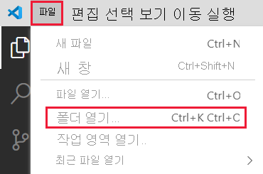

# <a name="set-up-your-environment-for-developing-a-power-bi-visual"></a>Power BI 시각적 개체 개발을 위한 환경 설정

이 문서에서는 Power BI 시각적 개체를 개발하기 위한 환경을 설정하는 방법을 알아봅니다.

개발을 시작하기 전에 **node.js** 및 **pbiviz** 패키지를 설치해야 합니다. 또한 인증서를 만들고 설치해야 합니다. 로컬 환경이 설정되면 Power BI 시각적 개체를 개발하기 위해 Power BI 서비스를 구성해야 합니다.

이 문서에서는 다음을 수행하는 방법을 알아봅니다.
> [!div class="checklist"]
> * *nodes.js* 를 설치합니다.
> * *pbiviz* 를 설치합니다.
> * 인증서를 만들고 설치합니다.
> * 시각적 개체 개발을 위한 Power BI 서비스를 설정합니다.
> * 추가 라이브러리를 설치합니다(시각적 개체 개발에 필요).

## <a name="install-nodejs"></a>node.js 설치

*Node.js* 는 Chrome의 V8 JavaScript 엔진을 기준으로 하는 JavaScript 런타임입니다. 이를 통해 개발자는 JavaScript에서 만든 모든 앱을 실행할 수 있습니다.

1. *node.js* 를 설치하려면 웹 브라우저에서 [node.js](https://nodejs.org)로 이동합니다.

2. 최신 MSI 설치 관리자를 다운로드합니다.

3. 설치 관리자를 실행한 다음, 설치 단계를 따릅니다. 사용권 계약의 약관에 동의하고 기본값을 그대로 사용합니다.

4. 컴퓨터를 다시 시작합니다.

## <a name="install-pbiviz"></a>pbiviz 설치

JavaScript를 사용하여 작성된 *pbiviz* 도구는 *pbiviz* 패키지의 시각적 개체 소스 코드를 컴파일합니다.

*pbiviz* 패키지는 필요한 모든 스크립트와 자산을 포함하는 압축된 Power BI 시각적 개체 프로젝트입니다.

1. Windows PowerShell을 열고 다음 명령을 입력합니다.

    ```powershell
    npm i -g powerbi-visuals-tools
    ```

## <a name="create-and-install-a-certificate"></a>인증서 만들기 및 설치

클라이언트(사용자 컴퓨터)와 서버(Power BI 서비스)가 안전하게 상호 작용하려면 [SSL(Secure Sockets Layer) 인증서](create-ssl-certificate.md)가 필요합니다. 안전한 상호 작용을 보장하는 인증서가 없으면 브라우저에 의해 차단됩니다.

# <a name="windows"></a>[Windows](#tab/windows)

이 프로세스에서는 **인증서 가져오기 마법사** 를 실행하는 PowerShell 명령을 실행하는 방법에 대해 설명합니다. 아래 단계에 따라 마법사에서 인증서를 구성합니다.

>[!IMPORTANT]
>이 절차 중에는 PowerShell 창을 닫지 마세요.

1. Windows PowerShell을 열고 다음 명령을 입력합니다.

    ```powershell
    pbiviz --install-cert
    ```

    이 명령은 다음과 같은 두 가지 작업을 수행합니다.
    * *암호* 를 반환합니다. 이 경우 *암호* 는 9765328806094입니다.
    * 또한 인증서 가져오기 마법사를 시작합니다.
    
    >[!div class="mx-imgBorder"]
    >

2. 인증서 가져오기 마법사에서 저장소 위치가 *현재 사용자* 로 설정되어 있는지 확인하고 **다음** 을 선택합니다.

    >[!div class="mx-imgBorder"]
    >

3. **가져올 파일** 창에서 **다음** 을 선택합니다.

4. **프라이빗 키 보호** 창의 *암호* 텍스트 상자에 PowerShell 명령(1단계)을 실행할 때 받은 암호를 붙여넣고 **다음** 을 선택합니다. 이 예제에서 암호는 9765328806094입니다.

    >[!div class="mx-imgBorder"]
    >

5. **인증서 저장소** 창에서 **모든 인증서를 다음 저장소에 저장** 옵션을 선택하고 **찾아보기** 를 선택합니다.

    >[!div class="mx-imgBorder"]
    >

6. **인증서 저장소 선택** 창에서 **신뢰할 수 있는 루트 인증 기관** 을 선택한 다음, ‘확인’을 선택합니다. 

    >[!div class="mx-imgBorder"]
    >

7. **인증서 저장소** 창에서 *다음* 을 선택합니다.

    >[!div class="mx-imgBorder"]
    >

8. **인증서 가져오기 마법사 완료** 창에서 설정을 확인하고 **마침** 을 선택합니다.

    >[!NOTE]
    >보안 경고가 표시되면 **예** 를 선택합니다.


# <a name="osx"></a>[OSX](#tab/sdk2osx)

1. 왼쪽 상단의 자물쇠가 잠겨 있으면 이를 선택하여 잠금을 해제합니다. *localhost* 를 검색하고 인증서를 두 번 클릭합니다.

    

2. **항상 신뢰** 를 선택하고 창을 닫습니다.

    

3. 사용자 이름과 암호를 입력하고 **설정 업데이트** 를 선택합니다.

    

4. 열려 있는 브라우저를 모두 닫습니다.

> [!NOTE]
> 인증서가 인식되지 않으면 컴퓨터를 다시 시작합니다.

---

## <a name="optional-verify-that-your-environment-is-set-up"></a>(선택 사항) 사용자 환경이 설정되었는지 확인

Power BI 시각적 개체 도구 패키지가 설치되었는지 확인합니다. PowerShell에서 `pbiviz` 명령을 실행하고 지원되는 명령 목록을 포함하여 출력을 검토합니다.

>[!div class="mx-imgBorder"]
>

## <a name="set-up-power-bi-service-for-developing-a-visual"></a>시각적 개체 개발을 위한 Power BI 서비스 설정

Power BI 시각적 개체를 개발하려면 Power BI 서비스에서 사용자 지정 시각적 개체 디버깅을 사용하도록 설정해야 합니다. 이 섹션의 지침에 따라 이 옵션을 사용하도록 설정합니다.

1. [PowerBI.com](https://powerbi.microsoft.com/)에 로그인합니다.

2. **설정** > **설정** > **설정** 으로 이동합니다.

    >[!div class="mx-imgBorder"]
    >

3. **일반** 탭에서 **개발자** 를 선택합니다. **개발자 설정** 에서 **개발자 시각적 개체를 사용하여 사용자 지정 시각적 개체 디버깅 사용** 확인란을 선택하고 **적용** 을 선택합니다.

    >[!div class="mx-imgBorder"]
    >

## <a name="install-development-libraries"></a>개발 라이브러리 설치

고유한 Power BI 시각적 개체를 개발하려면 추가 라이브러리를 설치해야 합니다. 이 섹션에서는 이러한 라이브러리를 설치하고 성공적으로 설치되었는지 확인하는 방법을 설명합니다.

이 문서에 나열된 라이브러리를 설치하려면 PowerShell을 열고 각 구성 요소에 대한 설치 명령을 입력합니다.

>[!NOTE]
>이러한 라이브러리가 컴퓨터에 설치되면 모든 Power BI 시각적 개체 프로젝트에 사용할 수 있습니다. 이는 머신당 한 번의 설치 절차입니다.


### <a name="d3-javascript-library"></a>D3 JavaScript 라이브러리

[D3](https://d3js.org/)는 웹 브라우저에서 동적 대화형 데이터 시각화를 생성하기 위한 JavaScript 라이브러리입니다. 광범위하게 구현된 SVG(Scalable Vector Graphics), HTML5 및 CSS 표준을 기반으로 합니다.

```powershell
npm i d3@^5.0.0 --save
```

### <a name="typescript-definitions"></a>TypeScript 정의

JavaScript의 상위 집합인 [TypeScript](https://www.typescriptlang.org/)에서 Power BI 시각적 개체를 개발할 수 있도록 TypeScript 정의를 설치합니다.

```powershell
npm i @types/d3@^5.0.0 --save
```

### <a name="core-js"></a>core-js

[core-js](https://www.npmjs.com/package/core-js)는 ECMAScript용 폴리필을 포함하는 JavaScript용 모듈식 표준 라이브러리입니다.

```powershell
npm i core-js@3.2.1 --save
```

### <a name="powerbi-visual-api"></a>powerbi-visual-api

Power BI 시각적 개체 API 정의를 설치합니다.

```powershell
npm i powerbi-visuals-api --save-dev
```

### <a name="optional-verify-that-the-d3-library-is-installed"></a>(선택 사항) D3 라이브러리가 설치되었는지 확인

[Visual Studio Code](https://code.visualstudio.com/)(VS Code)는 TypeScript 애플리케이션 개발에 적합한 IDE(통합 개발 환경)입니다. 이 섹션에서는 VS Code를 사용하여 Power BI 시각적 개체를 개발하는 데 필요한 D3 라이브러리가 올바르게 설치되어 있는지 확인합니다.

>[!NOTE]
>이 섹션에서 설명하는 확인 프로세스에서는 기존 Power BI 시각적 개체 프로젝트가 있다고 가정합니다. Power BI 시각적 개체 프로젝트가 없는 경우 [원 카드 프로젝트 만들기](develop-circle-card.md#create-a-development-project) 지침에 따라 만들 수 있습니다.

1. VS Code를 엽니다.

    >[!TIP]
    >다음 명령을 실행하여 PowerShell에서 VS Code를 열 수 있습니다.
    >
    >```powershell
    >code .
    >```
2. VS Code에서 **파일** 메뉴를 열고 **폴더 열기** 를 선택합니다.

    >[!div class="mx-imgBorder"]
    >

3. **폴더 열기** 창에서 Power BI 시각적 개체 프로젝트가 포함된 폴더를 선택하고 **폴더 선택** 을 선택합니다.

    >[!div class="mx-imgBorder"]
    >

4. **탐색기 창** 에서 **node_modules** 폴더를 확장하고 **d3** 라이브러리가 설치되었는지 확인합니다.

    >[!div class="mx-imgBorder"]
    >

5. **탐색기 창** 에서 **node_modules > @types > d3** 를 확장하고 **index.t.ds** 파일이 설치되었는지 확인합니다.

    >[!div class="mx-imgBorder"]
    >

## <a name="next-steps"></a>다음 단계

> [!div class="nextstepaction"]
> [Power BI 원 카드 시각적 개체 만들기](develop-circle-card.md)

> [!div class="nextstepaction"]
> [Power BI 가로 막대형 차트 시각적 개체 만들기](create-bar-chart.md)