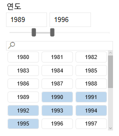
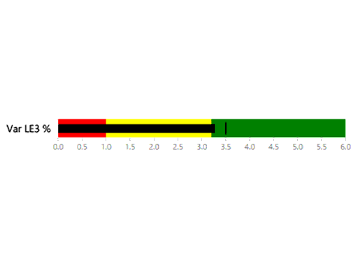
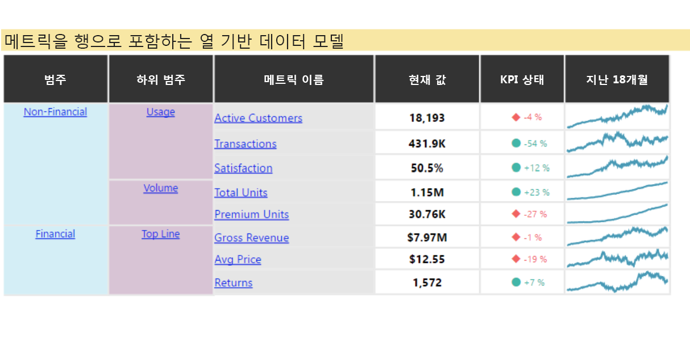
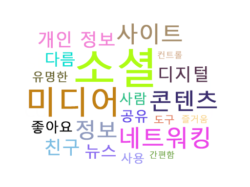
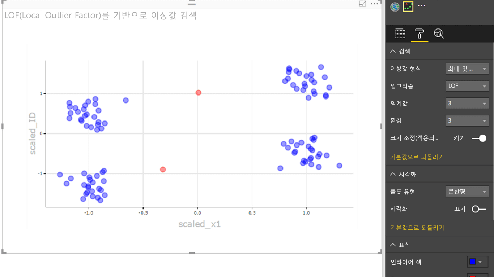

# Power BI 시각적 개체 샘플

GitHub에서 이러한 Power BI 시각적 개체를 다운로드, 사용 및 수정할 수 있습니다. 다음 샘플에서는 Power BI를 사용하여 개발할 때 일반적인 상황을 처리하는 방법을 보여 줍니다.

## 슬라이서

슬라이서는 보고서에서 다른 시각화에 표시된 데이터의 부분을 좁힙니다. 슬라이서는 Power BI에서 데이터를 필터링하는 여러 방법 중 하나입니다.

|   |  | |
| ------------- | ------------- | -------------|
| [Chiclet Slicer](https://github.com/Microsoft/powerbi-visuals-chicletslicer/)(치클릿 슬라이서)   다른 시각적 개체에서 캔버스 내 필터로 사용되는 이미지 또는 텍스트 단추를 표시합니다. | [타임라인 슬라이서](https://github.com/Microsoft/powerbi-visuals-timeline/)  날짜별로 필터링되는 그래픽 날짜 범위 선택기입니다. | [슬라이서 샘플](https://github.com/Microsoft/powerbi-visuals-sampleslicer/)  고급 필터링 API를 사용하는 방법을 보여 줍니다.

## 차트

가로 막대형 차트, 원형 차트, 단어 클라우드 등 갤러리를 통해 아이디어를 제공합니다.

|   |  | |
| ------------- | ------------- | -------------|
| [Aster Plot](https://github.com/Microsoft/powerbi-visuals-asterplot/)(별표 그림)   표준 도넛형 차트에서 두 번째 값을 사용하여 스윕 각도를 움직이는 변형입니다. | [글머리 기호 차트](https://github.com/Microsoft/powerbi-visuals-bulletchart/)  목표를 추적하는 데 유용한 컨텍스트를 제공하는 추가 시각적 요소가 포함된 가로 막대형 차트입니다. | [Chord](https://github.com/Microsoft/powerbi-visuals-chord/)(현)  행렬에 있는 데이터 간의 관계를 표시하는 그래픽 메서드입니다.
|  | |  
| [점 그림](https://github.com/Microsoft/powerbi-visuals-dotplot/)  보기 편한 방식으로 빈도의 분포를 보여 줍니다. | [Dual KPI](https://github.com/Microsoft/powerbi-visuals-dualkpi/)(이중 KPI)  공동 타임라인에서 추세를 보여 주는 시간에 따른 두 측정값을 효율적으로 시각화합니다. | [Enhanced Scatter](https://github.com/Microsoft/powerbi-visuals-enhancedscatter/)(향상된 분산형)  기존 분산형 차트가 향상된 차트입니다.
| | | 
| [Force Graph](https://github.com/Microsoft/powerbi-visuals-forcegraph/)  곡선 경로가 포함된 힘 레이아웃 다이어그램으로, 엔터티 간 연결을 표시하는 데 유용합니다. | [Gantt](https://github.com/Microsoft/powerbi-visuals-gantt/)  프로젝트 타임라인 또는 일정을 리소스와 함께 보여 주는 가로 막대형 차트입니다. | [Table Heatmap](https://github.com/Microsoft/powerbi-visuals-heatmap/)(테이블 Heatmap)  표의 색상을 사용하여 데이터를 직관적이면서도 간단하게 비교합니다.
|  |  |  
| [히스토그램 차트](https://github.com/Microsoft/powerbi-visuals-histogram/)  연속 간격 또는 특정 기간 동안 데이터의 배포를 시각화합니다. | [LineDot 차트](https://github.com/Microsoft/powerbi-visuals-linedotchart/)  애니메이션 점을 통해 독자를 데이터에 몰입시키는 애니메이션 꺽은선형 차트입니다. | [Mekko 차트](https://github.com/Microsoft/powerbi-visuals-mekkochart/)  100% 누적 세로 막대형 차트와 100% 누적 가로 막대형 차트의 조합이 하나의 보기에 통합된 형태입니다.
|  |  |  
| [Multi KPI](https://github.com/microsoft/PowerBI-visuals-MultiKPI/)(다중 KPI)   지원 데이터의 여러 스파크라인과 함께 주요 KPI를 사용하는 강력한 다중 KPI 시각화입니다. | [Power KPI](https://github.com/microsoft/PowerBI-visuals-PowerKPI/)  현재 날짜, 값 및 차이에 대한 다중 꺾은선형 차트 및 레이블을 포함하는 강력한 KPI 표시기입니다. | [Power KPI Matrix](https://github.com/microsoft/PowerBI-visuals-PowerKPIMatrix/)(Power KPI 행렬)  간단하고 읽기 쉬운 목록에서 균형 성과 기록표와 무제한의 메트릭 및 KPI를 모니터링합니다.
| |  |  
| [펄스 차트](https://github.com/Microsoft/powerbi-visuals-pulsechart/)  주요 이벤트를 사용하여 주석을 추가하는 이 꺾은선형 차트는 데이터를 사용하여 스토리를 알려 주는 데 매우 적합합니다.| [방사형 차트](https://github.com/Microsoft/powerbi-visuals-radarchart/)  범주 축에 그려진 여러 측정값을 제공하여 특성을 비교하는 데 유용합니다. | [Sankey 차트](https://github.com/Microsoft/powerbi-visuals-sankey/)  계열의 너비가 흐름의 수량에 비례하는 흐름 다이어그램입니다.
|  | | 
| [Stream graph](https://github.com/Microsoft/powerbi-visuals-streamgraph/)(스트림 그래프)  평활 보간을 이용한 누적 영역형 차트로, 시간 경과에 따른 값을 표시하는 데 사용되는 경우가 많습니다. | [선버스트 차트](https://github.com/Microsoft/powerbi-visuals-sunburst/)  계층 구조 데이터를 시각화하기 위한 다단계 도넛형 차트입니다.| [Tornado chart](https://github.com/Microsoft/powerbi-visuals-tornado/)(토네이도 차트)  두 그룹 간에 변수의 상대적 중요도를 비교합니다.
 | 
 | [Word Cloud](https://github.com/Microsoft/powerbi-visuals-wordcloud/)(워드 클라우드)  데이터의 높은 빈도의 텍스트에서 재미있는 시각적 개체 만들기

## WebGL

WebGL을 통해 웹 콘텐츠가 OpenGL ES 2.0을 기반으로 하는 API를 사용하여 HTML 캔버스에서 2D 및 3D 렌더링을 수행할 수 있습니다.

| |
| ------------- |
| [전 세계 지도](https://github.com/Microsoft/powerbi-visuals-globemap/)  대화형 3D 지도에 위치 표시

## R 시각적 개체

이 샘플에서는 R 시각적 개체와 R 스크립트의 분석 및 시각적 기능을 활용하는 방법을 보여 줍니다.

| | | |
|------------- |------------- |------------- |------------- |
| [연결 규칙](https://github.com/Microsoft/powerbi-visuals-assorules/)  if-then 문을 사용하여 서로 관련이 없어 보이는 데이터 간 관계 파악 | [클러스터링](https://github.com/Microsoft/powerbi-visuals-clustering-kmeans/)  K-평균 알고리즘을 사용하여 데이터에서 유사성 그룹 찾기 | [이상값이 있는 클러스터링](https://github.com/microsoft/PowerBI-visuals-dbscan/)  데이터에서 유사성 그룹 및 이상값 찾기
|  |  |  
| [상관 관계 그림](https://github.com/Microsoft/powerbi-visuals-corrplot/)  데이터 테이블에서 가장 상관 관계가 높은 변수를 강조 표시 | [의사 결정 트리 차트](https://github.com/Microsoft/powerbi-visuals-decision-tree/)  재귀 분할을 사용하여 통계적 확률을 확인하기 위한 트리 형태 계통도 | [TBATS 예측](https://github.com/Microsoft/powerbi-visuals-forcasting-tbats/)  TBATS 모델을 사용하여 여러 계절성이 있는 계열에 대해 시계열 예측
|  |  |  
| [ARIMA를 사용한 예측](https://github.com/Microsoft/powerbi-visuals-forcastingarima/)  ARIMA(자동 회귀 통합 이동 평균)를 사용하여 과거 데이터를 기반으로 미래 값 예측 | [깔때기형 그림](https://github.com/Microsoft/powerbi-visuals-funnel/)  깔때기형 그림을 사용하여 데이터에서 이상값 찾기 | [이상값 검색](https://github.com/Microsoft/powerbi-visuals-outliers-det/)  가장 적절한 방법과 플롯을 사용하여 데이터 이상값 찾기
|  |  | 
| [스플라인 차트](https://github.com/Microsoft/powerbi-visuals-spline/)  잡음이 있는 데이터를 시각화 및 이해 | [시계열 분해 차트](https://github.com/Microsoft/powerbi-visuals-timeseriesdecomposition/)  "Loess를 이용한 계절 및 추세 분석"을 사용하여 시계열 구성 요소 이해 | [시계열 예측 차트](https://github.com/Microsoft/powerbi-visuals-forcasting-exp/)  지수평활법 모델을 사용하여 이전에 관찰된 값을 기반으로 미래 값 예측

## 다음 단계

Power BI 시각적 개체 만들어 보려면 [자습서: Power BI 시각적 개체 개발](custom-visual-develop-tutorial.md)을 참조하세요.
