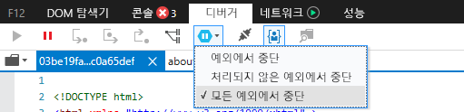
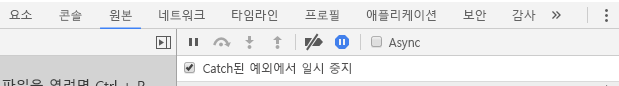

# <a name="how-to-debug-power-bi-visuals"></a>Power BI 시각적 개체를 디버그하는 방법

이 페이지에는 시각적 개체를 빌드하는 동안 디버깅을 위한 몇 가지 팁이 나와 있습니다. 기본 단계를 포함하며 표준 프런트 엔드 애플리케이션과 Power BI 시각적 개체 디버깅의 차이점을 보여 줍니다.
이 문서를 읽은 후 중단점을 사용하여 Power BI 시각적 개체를 디버그하고, 예외를 기록하고, Chrome 및 Edge에서 예외를 catch할 수 있습니다.

## <a name="using-breakpoints"></a>중단점 사용

시각적 개체의 JavaScript는 시각적 개체를 업데이트할 때마다 완전히 다시 로드되므로 디버그 시각적 개체를 새로 고치면 추가된 중단점이 손실됩니다. 이 문제를 해결하려면 코드에서 `debugger` 문을 사용하세요. 코드에서 `debugger`를 사용하는 동안 자동 다시 로드를 해제하는 것이 좋습니다.

```typescript
public update(options: VisualUpdateOptions) {
    console.log('Visual update', options);
    debugger;
    this.target.innerHTML = `<p>Update count: <em>${(this.updateCount</em></p>`;
}
```


## <a name="showing-exceptions"></a>예외 표시

시각적 개체에서 작업하는 경우 모든 오류가 Power BI 서비스에 의해 ‘소비됨’으로 표시됩니다. 이는 오동작 시각적 개체 때문에 전체 앱이 불안정해지지 않게 하기 위한 Power BI의 의도적인 기능입니다.

이 문제를 해결하려면 예외를 catch하고 기록하는 코드를 추가하거나 catch된 예외에서 중단하도록 디버거를 설정합니다.


## <a name="log-exceptions"></a>예외 기록

Power BI 시각적 개체에서 예외를 기록하려면 다음 코드를 시각적 개체에 추가하여 예외 로깅 데코레이터를 정의합니다.

```typescript
export function logExceptions(): MethodDecorator {
     return function (target: Object, propertyKey: string, descriptor: TypedPropertyDescriptor<Function>)
    : TypedPropertyDescriptor<Function> {
            
        return {
            value: function () {
                try {
                    return descriptor.value.apply(this, arguments);
                } catch (e) {
                    console.error(e);
                    throw e;
                }
            }
        }
    }
}
```
그런 다음 모든 함수에서 이 데코레이터를 사용하여 오류 로깅을 볼 수 있습니다.

```typescript
@logExceptions()
public update(options: VisualUpdateOptions) {
```

## <a name="break-on-exceptions"></a>예외에서 중단

Catch된 예외에서 중단하도록 브라우저를 설정할 수도 있습니다. 그러면 오류가 발생하는 모든 위치에서 코드 실행이 중지되며 해당 위치에서 디버그할 수 있습니다.

### <a name="edge"></a>Edge

1. 개발자 도구(F12)를 엽니다.
2. **디버거** 탭으로 이동합니다.
3. **예외에서 중단** 아이콘(일시 중지 기호가 있는 육각형)을 클릭합니다.
4. **모든 예외에서 중단**을 선택합니다.



## <a name="chrome"></a>Chrome

1. 개발자 도구(F12)를 엽니다.
2. **원본** 탭으로 이동합니다.
3. **예외에서 중단** 아이콘을 클릭합니다(일시 중지 기호가 있는 일단 정지 표지).
4. **Catch된 예외에서 일시 중지** 확인란을 선택합니다.



## <a name="next-steps"></a>다음 단계
* [Power BI 시각적 개체 문제 해결](power-bi-custom-visuals-troubleshoot.md)
* 자세한 내용 및 질문과 대답은 [Power BI 시각적 개체에 대한 질문과 대답](power-bi-custom-visuals-faq.md#organizational-power-bi-visuals)을 참조하세요.
