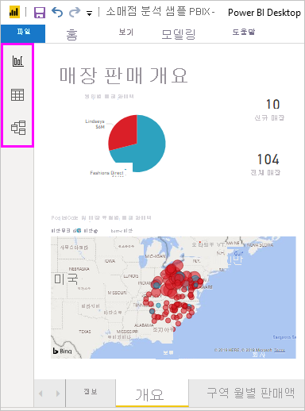
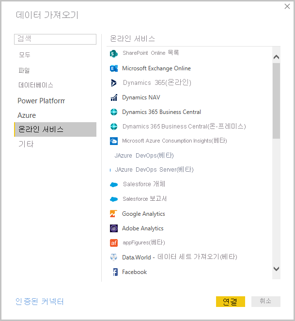
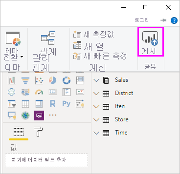

# Power BI Desktop이란?

*Power BI Desktop*은 데이터를 연결, 변환 및 시각화할 수 있도록 로컬 컴퓨터에 설치하는 무료 애플리케이션입니다. Power BI Desktop을 사용하면 여러 다양한 데이터 원본에 연결하고 데이터 모델로 결합(‘모델링’이라고도 함)할 수 있습니다. 이러한 데이터 모델을 통해 시각적 개체 및 시각적 개체 컬렉션을 작성하여 조직 내 다른 사용자와 보고서로 공유할 수 있습니다. 비즈니스 인텔리전스 프로젝트에서 작업하는 대부분의 사용자는 Power BI Desktop을 사용하여 보고서를 만든 후 ‘Power BI 서비스’를 사용하여 다른 사용자와 해당 보고서를 공유합니다.

Power BI Desktop의 가장 일반적인 용도는 다음과 같습니다.

* 데이터에 연결
* 데이터 모델을 만들기 위해 해당 데이터 변환 및 정리
* 데이터의 시각적 표시를 제공하는 차트 또는 그래프와 같은 시각적 개체 만들기
* 하나 이상의 보고서 페이지에서 시각적 개체 모음인 보고서 만들기
* Power BI 서비스를 사용하여 다른 사용자와 보고서 공유

사용자, 주로 해당 작업을 담당하는 사용자는 ‘데이터 분석가’(‘분석가’라고도 함) 또는 비즈니스 인텔리전스 전문가(‘보고서 작성자’라고도 함)로 간주되는 경우가 많습니다. 하지만 자신을 분석가나 보고서 작성자로 간주하지 않는 사용자가 Power BI Desktop을 사용하여 매력적인 보고서를 만들거나 다양한 원본에서 데이터를 끌어와 동료 및 조직과 공유할 수 있는 데이터 모델을 빌드하는 경우도 많습니다.

> [!IMPORTANT]
> Power BI Desktop은 매월 고객 피드백과 새로운 기능을 통합하여 업데이트되고 릴리스됩니다. 최신 버전의 Power BI Desktop만 지원되며, Power BI Desktop 지원을 문의하는 고객에게는 최신 버전으로 업그레이드할지 묻는 메시지가 표시됩니다. 최신 버전의 Power BI Desktop은 [Microsoft Store](https://aka.ms/pbidesktopstore)에서 가져오거나 컴퓨터에 [다운로드](https://www.microsoft.com/download/details.aspx?id=58494)하여 설치하는 지원되는 모든 언어를 포함하는 단일 실행 파일로 가져옵니다.

Power BI Desktop에서 사용할 수 있는 뷰는 세 가지가 있으며, 이러한 뷰는 캔버스 왼쪽에서 선택할 수 있습니다. 뷰는 다음과 같은 순서로 표시됩니다.
* **보고서**: 이 뷰에서는 보고서 및 시각적 개체를 만듭니다. 대부분의 작성 시간 동안 이 뷰에서 작업합니다.
* **데이터**: 이 뷰에서는 보고서와 연결된 데이터 모델에 사용되는 테이블과 측정값, 기타 데이터를 확인하고 보고서 모델에서 사용하는 데 가장 적합하도록 데이터를 변환합니다.
* **모델**: 이 뷰에서는 데이터 모델의 테이블 간 관계를 확인하고 관리합니다.

다음 이미지는 캔버스의 왼쪽에 표시되는 세 가지 뷰를 보여줍니다.

 

## 데이터에 연결
Power BI Desktop을 시작하는 첫 번째 단계는 데이터에 연결하는 것입니다. Power BI Desktop에서 연결할 수 있는 데이터 원본은 여러 가지가 있습니다. 

데이터에 연결하려면 다음을 수행합니다.

1. **홈** 리본에서 **데이터 가져오기** > **더 보기**를 선택합니다. 

   **데이터 가져오기** 창이 표시되고, Power BI Desktop이 연결할 수 있는 여러 범주를 보여 줍니다.

   

2. 데이터 형식을 선택하면 Power BI Desktop이 자동으로 데이터 원본에 연결하는 데 필요한 URL 및 자격 증명 같은 정보를 요청하는 메시지가 표시됩니다.

   

3. 하나 이상의 데이터 원본에 연결한 후 데이터를 유용하게 변환할 수 있습니다.

## 데이터 변환 및 정리, 모델 만들기

Power BI Desktop에서는 기본 제공 [Power Query 편집기](../transform-model/desktop-query-overview.md)를 사용하여 데이터를 정리하고 변환할 수 있습니다. Power Query 편집기를 통해 데이터 형식 변경, 열 제거 또는 여러 원본의 데이터 결합과 같은 작업을 수행하여 데이터를 변경합니다. 이 과정은 조각과 비슷합니다. 큰 점토(또는 데이터) 블록으로 시작한 후 데이터 셰이프가 원하는 모양이 될 때까지 필요에 따라 조각을 깎아내거나 다른 조각을 추가합니다. 

Power Query 편집기를 시작하려면 다음을 수행합니다.

- **홈** 리본에서 **쿼리 편집** > **쿼리 편집**을 선택합니다.

   **Power Query 편집기** 창이 표시됩니다.

   

데이터 변환에서 수행하는 각 단계(예: 테이블 이름 바꾸기, 데이터 형식 변환 또는 열 삭제)는 Power Query 편집기에 의해 기록됩니다. 이 쿼리가 데이터 원본에 연결할 때마다 해당 단계가 수행되므로 데이터는 항상 지정된 방식으로 셰이핑됩니다.

다음 이미지는 셰이핑되고 모델로 전환된 쿼리에 대한 **Power Query 편집기** 창을 보여줍니다.

 

데이터가 원하는 상태가 되면 시각적 개체를 만들 수 있습니다. 

## 시각적 개체 만들기 

데이터 모델이 있으면 ‘필드’를 보고서 캔버스로 끌어 ‘시각적 개체’를 만들 수 있습니다. 시각적 개체는 모델의 데이터를 그래픽으로 표현한 것입니다. Power BI Desktop에서 선택할 수 있는 다양한 유형의 시각적 개체가 있습니다. 다음 시각적 개체는 단순 세로 막대형 차트를 표시합니다. 

시각적 개체를 만들거나 변경하려면 다음을 수행합니다. 

- **시각화** 창에서 시각적 개체 아이콘을 선택합니다. 

   

   보고서 캔버스에 시각적 개체가 이미 선택되어 있으면 선택되어 있는 시각적 개체가 사용자가 선택한 유형으로 변경됩니다. 

   캔버스에 시각적 개체가 선택되어 있지 않으면 선택 항목에 따라 새 시각적 개체가 만들어집니다.

## 보고서 만들기

Power BI Desktop에서 모델을 만드는 데 사용한 데이터의 다양한 측면을 보여 주는 시각적 개체 컬렉션을 만들려는 경우가 많습니다. 하나의 Power BI Desktop 파일에 있는 시각적 개체 모음을 ‘보고서’라고 합니다. Excel 파일이 하나 이상의 워크시트를 포함하는 것처럼 보고서는 하나 이상의 페이지를 포함할 수 있습니다.

Power BI Desktop을 통해 여러 원본의 데이터를 사용하여 조직의 다른 사용자와 공유할 수 있는 통합 보고서인 복잡하고 시각적으로 풍부한 보고서를 만들 수 있습니다.

다음 이미지에는, 이미지 아래쪽 탭에 표시된 대로, **개요**라는 Power BI Desktop 보고서의 첫 번째 페이지가 표시되어 있습니다. 

## 보고서 공유

보고서를 다른 사용자와 공유할 준비가 되면 Power BI 서비스에 해당 보고서를 ‘게시’하여 조직에서 Power BI 라이선스가 있는 모든 사용자가 해당 보고서를 사용할 수 있게 합니다. 

Power BI Desktop 보고서를 게시하려면 다음을 수행합니다. 

1. **홈** 리본에서 **게시**를 선택합니다.

   

   Power BI Desktop에서 Power BI 계정을 사용하여 Power BI 서비스에 연결합니다. 

2. Power BI는 작업 영역, 팀 작업 영역, Power BI 서비스의 다른 위치 등 보고서를 공유할 Power BI 서비스의 위치를 선택하라는 메시지를 표시합니다. 

   Power BI 서비스에 보고서를 공유하려면 Power BI 라이선스가 있어야 합니다.

## 다음 단계

Power BI Desktop을 시작하려면 먼저 애플리케이션을 다운로드하여 설치해야 합니다. Power BI Desktop을 가져오는 방법은 두 가지가 있습니다.

* [Windows 스토어에서 Power BI Desktop 가져오기](https://aka.ms/pbidesktopstore)
* [웹에서 Power BI Desktop 다운로드](https://www.microsoft.com/download/details.aspx?id=58494)