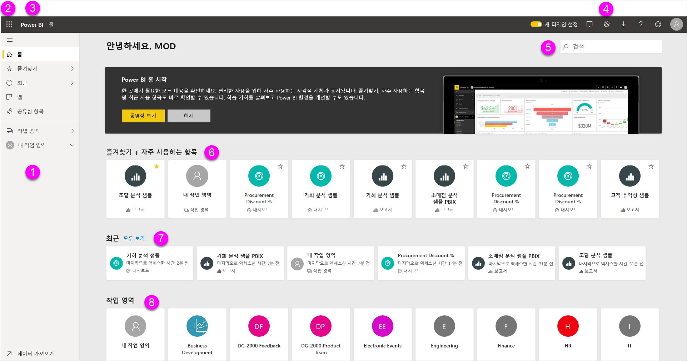
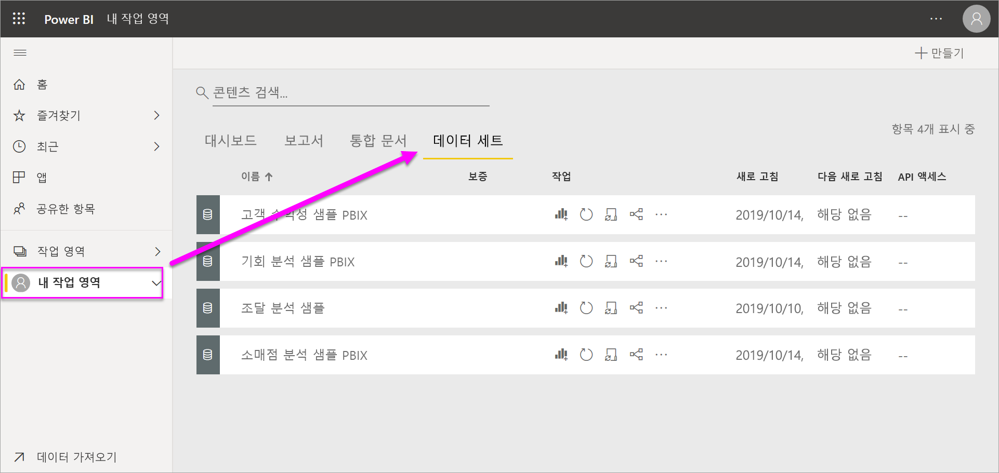
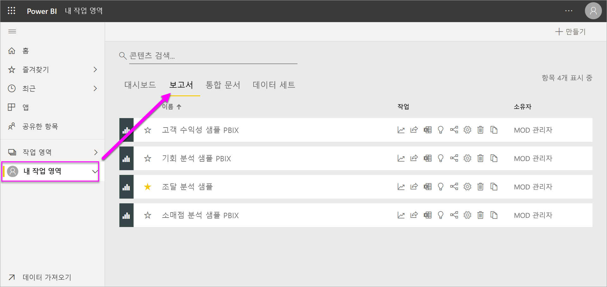
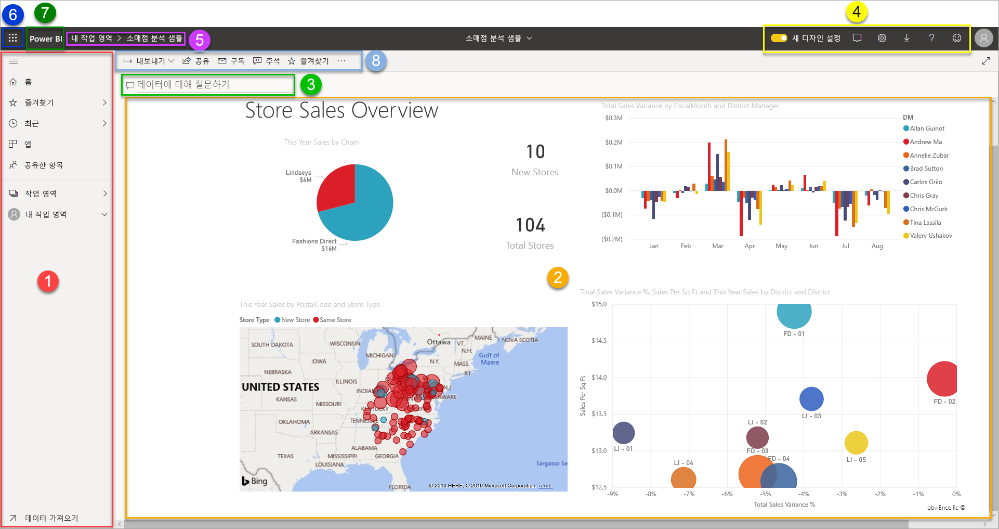
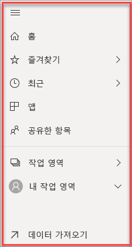

# Power BI 서비스의 디자이너를 위한 기본 개념

이 문서는 Power BI 서비스에 익숙해지도록 도와주기 위한 것입니다. 즉, 이 서비스의 여러 요소가 무엇이고, 이 요소가 함께 어떻게 작동하고, 이 요소를 어떻게 사용하는지를 소개합니다. 이미 [Power BI 서비스에 등록](service-self-service-signup-for-power-bi.md)하고 [일부 데이터를 추가](../connect-data/service-get-data.md)한 경우 이 문서를 더 잘 활용할 수 있습니다. 디자이너의 일반적인 워크플로는 보통 Power BI Desktop에서 보고서를 만드는 것으로 시작합니다. 그런 다음 이 보고서를 Power BI 서비스에 게시하고 계속 수정할 수 있습니다. Power BI 서비스에서 보고서를 기반으로 대시보드를 만들 수도 있습니다. 

이 문서를 위해, 자체 보고서가 아직 없는 경우 [Power BI 샘플](../create-reports/sample-datasets.md) 중 하나를 설치해 보세요.

브라우저에서 Power BI 서비스를 열면 홈 화면에서 시작합니다. 표시될 수 있는 요소는 다음과 같습니다.

1. 탐색 창
2. Microsoft 365 앱 시작 관리자
3. Power BI 홈 단추
4. 아이콘 단추(설정, 도움말 및 피드백 포함)
5. 검색 상자
6. 자주 사용하는 대시보드, 보고서 및 작업 영역
7. 최근의 대시보드, 보고서 및 작업 영역
8. 사용자 작업 영역

사용자와 보고서 및 대시보드의 최종 사용자도 브라우저에서 Power BI 서비스를 열면 시작 환경이 같습니다.

이러한 기능은 나중에 자세히 살펴보고 먼저 몇 가지 Power BI 개념에 대해 검토해 보겠습니다. 또는 이 비디오를 먼저 시청하면 좋습니다.  이 비디오에서는 Power BI 서비스의 기본 개념을 검토하고 간략한 둘러보기를 제공합니다.

<iframe width="560" height="315" src="https://www.youtube.com/embed/B2vd4MQrz4M" frameborder="0" allowfullscreen></iframe>

## Power BI 개념
Power BI의 다섯 가지 주요 구성 요소는 *대시보드*, *보고서*, *통합 문서*, *데이터 세트* 및 *데이터 흐름* 입니다. 이러한 구성 요소는 모두 *작업 영역* 에 구성되고 *용량* 에 생성됩니다.  다섯 가지 구성 요소를 살펴보기 전에 용량 및 작업 영역을 이해하는 것이 중요하므로 용량 및 작업 영역부터 살펴보겠습니다.

## 용량
용량은 Power BI 콘텐츠를 호스트하고 전달하는 데 사용되는 리소스(스토리지, 프로세서 및 메모리) 세트를 나타내는 핵심적인 Power BI 개념입니다. 용량은 _공유_ 또는 _전용_ 입니다. 공유 용량은 다른 Microsoft 고객과 공유되는 반면, 전용 용량은 고객 한 명이 전적으로 사용합니다. 전용 용량은 [구독](../admin/service-premium-what-is.md)이 필요하며, [프리미엄 용량 관리](../admin/service-premium-capacity-manage.md) 문서에 자세히 설명되어 있습니다.

기본적으로 작업 영역은 공유 용량에 생성됩니다. 공유 용량에서는 워크로드가 다른 고객과 공유된 계산 리소스에서 실행됩니다. 용량이 리소스를 공유해야 하므로, 최대 모델 크기(1GB) 및 최대 일일 새로 고침 빈도(하루 8회)와 같은 “공정한 실행”을 보장하기 위해 제한 사항이 적용됩니다.

## 작업 영역
작업 영역은 용량에 생성됩니다. 기본적으로, 작업 영역은 Power BI의 대시보드, 보고서, 통합 문서, 데이터 세트 및 데이트 흐름의 컨테이너입니다.

작업 영역에는 다음과 같은 두 종류가 있습니다. ‘내 작업 영역’ 및 ‘작업 영역’. 

- *내 작업 영역* 은 Power BI 고객이 콘텐츠를 작업하는 개인적인 작업 영역입니다. 내 작업 영역에는 본인만 액세스할 수 있습니다. 내 작업 영역에서 대시보드 및 보고서를 공유할 수 있습니다. 대시보드 및 보고서를 협업하거나 앱을 만들려는 경우 작업 영역에서 작업해야 합니다.

-  ‘작업 영역’은 동료들과 콘텐츠를 공유하고 협업하는 데 사용됩니다. 작업 영역에 동료를 추가하고 대시보드, 보고서, 통합 문서 및 데이터 세트를 협업할 수 있습니다. 한 가지 예외를 제외하고, 모든 작업 영역 구성원에게 Power BI Pro 라이선스가 있어야 합니다. [새 작업 영역](../collaborate-share/service-create-the-new-workspaces.md)에 대해 자세히 알아보세요. 

    작업 영역은 조직을 위한 ‘앱’을 만들어 게시하고 관리하는 공간이기도 합니다. 작업 영역은 Power BI 앱을 구성할 콘텐츠를 위한 준비 영역이자 컨테이너라고 생각하면 됩니다. 그렇다면 *앱* 이란 무엇일까요? 앱은 조직의 Power BI 소비자에게 주요 메트릭을 제공하도록 빌드된 대시보드 및 보고서의 컬렉션입니다. 앱은 대화형이지만 소비자가 편집할 수는 없습니다. 앱에 대한 액세스 권한이 있는 동료인 앱 소비자는 Pro 라이선스가 반드시 필요하지는 않습니다.  

일반적으로 공유하는 방법에 대해 자세히 알아보려면 [작업에서 대시보드를 공유하는 방법](../collaborate-share/service-how-to-collaborate-distribute-dashboards-reports.md)부터 시작하세요.

이제 다섯 가지 Power BI 구성 요소로 넘어갑니다.

## 데이터 흐름
조직에서 *데이터 흐름* 을 사용하여 서로 다른 원본의 데이터를 통합할 수 있습니다. 데이터 흐름은 선택 사항이며, 복잡하거나 큰 프로젝트에서 자주 사용됩니다. 데이터 흐름은 데이터 세트에서 사용하기 위해 준비된 데이터를 나타냅니다. 그러나 보고를 위한 원본으로 데이터 흐름을 직접 사용할 수는 없습니다. 데이터 흐름은 Microsoft 데이터 커넥터의 광범위한 컬렉션을 활용하여 온-프레미스 및 클라우드 기반 데이터 원본에서 데이터를 수집할 수 있도록 합니다.

데이터 흐름은 작업 영역(‘내 작업 영역’ 아님)에서만 만들어지고 관리되며, Azure Data Lake Storage Gen2의 CDM(Common Data Model)에 엔터티로 저장됩니다. 일반적으로 최신 데이터를 저장하기 위해 반복적으로 새로 고치도록 예약됩니다. 데이터 세트에서 사용하고 잠재적으로 다시 사용할 데이터를 준비하는 데 적합합니다. 자세한 내용은 [Power BI의 셀프 서비스 데이터 준비](../transform-model/dataflows/dataflows-introduction-self-service.md) 문서를 참조하세요.

데이터가 없는 대시보드나 보고서를 가질 수 없으므로(빈 대시보드와 빈 보고서가 있을 수 있지만 데이터가 있어야 유용함) **데이터 세트** 를 소개하겠습니다.

## 데이터 세트
*데이터 세트* 는 *가져오기* 또는 *연결* 할 데이터의 컬렉션입니다. Power BI를 사용하면 모든 종류의 데이터 세트에 연결하고 가져와서 같은 위치에 모두 함께 표시할 수 있습니다. 데이터 세트는 데이터 흐름에서 데이터를 가져올 수도 있습니다.

데이터 세트는 *작업 영역* 과 연결되며, 단일 데이터 세트는 여러 작업 영역의 일부가 될 수 있습니다. 작업 영역을 열면 **데이터 세트** 탭 아래에 연결된 데이터 세트가 나열됩니다. 나열된 각 데이터 세트는 OneDrive의 Excel 통합 문서, 온-프레미스 SSAS 테이블 형식 데이터 세트, Salesforce 데이터 세트 등 데이터의 단일 원본을 나타냅니다. 여러 가지 다양한 데이터 원본이 지원되며 계속해서 새로 추가할 예정입니다. [Power BI에서 사용할 수 있는 데이터 세트 유형](../connect-data/service-get-data.md) 목록을 참조하세요.

아래 예제에서는 “영업 및 마케팅” 작업 영역을 선택하고 **데이터 세트** 탭을 클릭했습니다.

**하나의** 데이터 세트...

* 하나 또는 여러 개의 작업 영역에서 반복해서 사용할 수 있습니다.
* 여러 보고서에서 사용할 수 있습니다.
* 해당 데이터 세트의 시각화가 여러 대시보드에 표시될 수 있습니다.

  

[데이터 세트에 연결하거나 데이터 세트를 가져오려면](../connect-data/service-get-data.md) 탐색 창의 맨 아래에 있는 **데이터 가져오기** 를 선택합니다. 지침에 따라 특정 원본에 연결하거나 가져오고 활성 작업 영역에 데이터 세트를 추가합니다. 새 데이터 세트는 노란색 별표로 표시됩니다. Power BI에서 작업을 수행해도 기본 데이터 세트는 변경되지 않습니다.

단일 작업 영역 구성원에 의해 추가된 데이터 세트는 *관리자*, *구성원* 또는 *참가자* 역할로 다른 작업 영역 구성원에게 제공됩니다.

데이터 세트는 새로 고침, 이름 변경, 탐색 및 제거가 가능합니다. 데이터 세트를 통해 보고서를 처음부터 새로 만들거나, [빠른 정보 활용](../create-reports/service-insights.md)을 실행하여 보고서를 만듭니다.  데이터 세트를 이미 사용 중인 보고서 및 대시보드를 보려면 **관련 항목 보기** 를 선택합니다. 데이터 세트를 탐색하려면 그것을 선택합니다. 시각화를 만들어 데이터를 살펴보기를 시작할 수 있는 보고서 편집기에서 데이터 세트를 여는 작업을 실제로 수행하고 있습니다.

이제 다음 항목인 보고서를 살펴보겠습니다.

### 심층 분석
* [Power BI 서비스의 데이터 세트](../connect-data/service-datasets-understand.md)
* [Power BI 서비스의 데이터 세트 모드](../connect-data/service-dataset-modes-understand.md)
* [Power BI 프리미엄이란?](../admin/service-premium-what-is.md)
* [Power BI에 대한 데이터 가져오기](../connect-data/service-get-data.md)
* [Power BI에 대한 샘플 데이터 세트](../create-reports/sample-datasets.md)

## 보고서
Power BI 보고서는 꺽은선형 차트, 맵 및 트리맵과 같은 하나 이상의 시각화가 있는 페이지입니다. 시각화는 **_시각적 개체_** 라고도 합니다. 보고서의 모든 시각화는 단일 데이터 세트에서 제공합니다. Power BI 내에서 처음부터 보고서를 만들거나, 동료와 공유하는 대시보드를 사용하여 가져올 수도 있고, Power BI, Excel, Power BI Desktop, 데이터베이스 및 SaaS 애플리케이션에서 데이터 세트에 연결할 때 보고서를 만들 수 있습니다.  예를 들어 파워 뷰 시트가 포함된 Excel 통합 문서에 연결하면 Power BI에서 해당 시트를 기반으로 보고서를 만듭니다. 또한 SaaS 애플리케이션에 연결하면 Power BI에서 미리 작성된 보고서를 가져옵니다.

보고서를 보고 상호 작용하는 다음 두 가지 모드가 있습니다. *읽기용 보기* 및 *편집용 보기*. 보고서를 열면 읽기용 보기로 열립니다. 편집 권한이 있는 경우 왼쪽 위 모서리에 **보고서 편집** 이 표시되고 보고서를 편집용 보기에서 볼 수 있습니다.  보고서가 작업 영역에 있는 경우 *관리자*, *구성원* 또는 *참가자* 역할을 사용하는 모든 사용자가 이를 편집할 수 있습니다. 이러한 사용자는 해당 보고서에 대한 편집용 보기의 탐색, 디자인, 빌드 및 공유 기능 모두에 액세스할 수 있습니다. 보고서를 공유하는 사람들은 읽기용 보기에서 보고서를 탐색하고 상호 작용할 수 있습니다.

작업 영역을 열면 **보고서** 탭 아래에 연결된 보고서가 나열됩니다. 나열된 각 보고서는 단 하나의 기본 데이터 세트를 기반으로 하는 하나 이상의 시각화 페이지를 나타냅니다. 보고서를 열려면 보고서를 선택합니다.

앱을 열면 대시보드가 제공됩니다.  기본 보고서에 액세스하려면 보고서에서 고정한 대시보드 타일(나중에 타일 추가)을 선택합니다. 보고서에서 모든 타일이 고정된 것이 아니므로 보고서를 찾으려면 타일 몇 개를 클릭해야 할 수 있다는 사실을 참고하세요.

기본적으로 보고서는 읽기용 보기로 열립니다.  **보고서 편집** 을 선택하여 필요한 권한이 있는 경우 편집용 보기에서 엽니다.

아래 예제에서는 “영업 및 마케팅” 작업 영역을 선택하고 **보고서** 탭을 클릭했습니다.

**하나의** 보고서는...

* 단일 작업 영역에 포함되어 있습니다.
* 해당 작업 영역 내의 여러 대시보드에 연결할 수 있습니다. 해당 보고서에서 고정된 타일이 여러 대시보드에 나타날 수 있습니다.
* 하나의 데이터 세트의 데이터를 사용하여 만들 수 있습니다. Power BI Desktop에서는 한 보고서의 단일 데이터 세트로 둘 이상의 데이터 원본을 결합하고 해당 보고서를 Power BI로 가져올 수 있습니다.

  

### 심층 분석
- [데이터 세트를 가져와 Power BI 서비스에서 보고서 만들기](../create-reports/service-report-create-new.md)
- [Power BI 모바일 앱에 대해 보고서를 최적화합니다.](../create-reports/desktop-create-phone-report.md)

## 대시보드
*대시보드* 는 **Power BI 서비스에서** 사용자가 직접 만드는 요소이거나 **Power BI 서비스에서** 동료가 만들어 사용자와 공유하는 요소입니다. 또한 0개 이상의 타일 및 위젯이 포함된 단일 캔버스입니다. 보고서 또는 [질문 및 답변](../consumer/end-user-q-and-a.md)에서 고정된 각 타일에는 데이터 세트에서 만들고 대시보드에 고정된 단일 [시각화](../visuals/power-bi-report-visualizations.md)가 표시됩니다. 전체 보고서 페이지는 단일 타일로 대시보드에 고정할 수도 있습니다. 대시보드에 타일을 추가할 수 있는 여러 가지 방법이 있지만 이 개요 항목에서 다루기엔 너무 많습니다. 자세히 알아보려면 [Power BI의 대시보드 타일](../create-reports/service-dashboard-tiles.md)을 참조하세요.

대시보드를 만드는 이유는 무엇인가요?  다음은 몇 가지 이유입니다.

* 의사 결정을 내리는 데 필요한 모든 정보를 한 눈에 보기 위해서
* 비즈니스에 가장 중요한 정보를 모니터링하기 위해서
* 모든 동료가 동일한 페이지에서 동일한 정보를 보고 사용하도록 하기 위해서
* 비즈니스, 제품, 사업부, 마케팅 캠페인 등의 상태를 모니터링하기 위해서
* 더 큰 대시보드의 개인 설정된 보기를 만들어 자신에게 중요한 모든 메트릭을 표시하기 위해서

작업 영역을 열면 **대시보드** 탭 아래에 연결된 대시보드가 나열됩니다. 대시보드를 열려면 대시보드를 선택합니다. 앱을 열면 대시보드가 표시됩니다.  각 대시보드는 기본 데이터 세트의 일부 하위 세트에 대한 사용자 지정 보기를 나타냅니다.  대시보드 소유자는 기본 데이터 세트 및 보고서에 액세스하여 편집할 수도 있습니다.  대시보드가 사용자와 공유된 경우 대시보드 및 기본 보고서와 상호 작용할 수 있지만 변경 내용을 저장할 수는 없습니다.

사용자나 동료가 [대시보드를 공유](../collaborate-share/service-share-dashboards.md)할 수 있는 방법은 여러 가지가 있습니다. Power BI Pro는 대시보드를 공유하고 공유한 대시보드를 보는 데 필요합니다.

**하나의** 대시보드는...

* 단일 작업 영역과 연결됩니다.
* 여러 데이터 세트의 시각화를 표시할 수 있습니다.
* 여러 보고서의 시각화를 표시할 수 있습니다.
* 다른 도구(예: Excel)에서 고정된 시각화를 표시할 수 있습니다.

  

### 심층 분석
* [빈 대시보드를 생성한 다음 데이터를 가져옵니다](../create-reports/service-dashboard-create.md)
* [대시보드 복제](../create-reports/service-dashboard-copy.md)
* [대시보드의 휴대폰 보기 만들기](../create-reports/service-create-dashboard-mobile-phone-view.md)

## 통합 문서
통합 문서는 특별한 종류의 데이터 세트입니다. 위에서 **데이터 세트** 섹션을 읽었다면 통합 문서에 대해 알아야 하는 내용은 거의 모두 알게 된 것입니다. 하지만 Power BI가 Excel 통합 문서를 어떨 때는 **데이터 세트** 로 분류하고, 어떨 때는 **통합 문서** 로 분류하는 이유를 궁금해 하는 분들이 있을 것입니다.

Excel 파일에 **데이터 가져오기** 를 사용할 때는 파일 *가져오기* 또는 *연결* 중 한 방법을 사용할 수 있습니다. 연결을 선택하면 통합 문서가 Excel Online에서와 같이 Power BI에 나타납니다. 하지만, Excel Online과는 달리 통합 문서의 요소를 대시보드에 고정하는 데 도움이 되는 몇 가지 훌륭한 기능이 제공됩니다.

Power BI에서는 통합 문서를 편집할 수 없습니다. 하지만 일부 내용을 변경해야 할 경우 편집을 클릭한 다음 Excel Online에서 통합 문서를 편집하거나 컴퓨터의 Excel에서 열어볼 수 있습니다. 적용한 모든 변경 내용이 OneDrive의 통합 문서에 저장됩니다.

### 심층 분석
* [Excel 통합 문서 파일에서 데이터 가져오기](../connect-data/service-excel-workbook-files.md)
* [Excel에서 Power BI로 게시](../connect-data/service-publish-from-excel.md)

## 내 작업 영역의 대시보드
작업 영역 및 구성 요소를 살펴보았습니다. Power BI 서비스에서 대시보드 환경을 구성하는 부분을 종합하여 검토해 보겠습니다.

### 1. **탐색 창**
탐색 창을 사용하여 Power BI 구성 요소인 대시보드, 보고서, 통합 문서 및 데이터 세트와 작업 영역을 찾아보고 드나들 수 있습니다.  

  

* **데이터 가져오기** 를 선택하여 [Power BI에 데이터 세트, 보고서 및 대시보드를 추가](../connect-data/service-get-data.md)합니다.
* 이 아이콘을 사용하여 탐색 창 확장 및 축소 .
* **즐겨찾기** 를 선택하여 즐겨 찾는 콘텐츠를 열거나 관리합니다.
* **최근** 을 선택하여 가장 최근에 방문한 콘텐츠를 보고 엽니다.
* **앱** 을 선택하여 앱을 보거나, 열거나, 삭제합니다.
* 동료가 콘텐츠를 공유했습니까? **공유한 항목** 을 선택하여 해당 컨텐츠를 검색 및 정렬한 후 필요한 항목을 찾습니다.
* **작업 영역** 을 선택하여 작업 영역을 표시하고 엽니다.

다음 요소를 한 번 클릭합니다.

* 아이콘 또는 제목을 콘텐츠 보기로 열기
* 오른쪽 화살표(>)를 통해 즐겨찾기, 최근 항목 및 작업 영역에 대한 플라이아웃 메뉴를 엽니다.
* 펼침 단추 아이콘을 통해 대시보드, 보고서, 통합 문서 및 데이터 세트의 스크롤 가능한 **내 작업 영역** 목록 표시.

### 2. **캔버스**
대시보드를 열었기 때문에 캔버스 영역에 시각화 타일이 표시됩니다. 예를 들어 보고서 편집기를 연 경우 캔버스 영역에 보고서 페이지가 표시됩니다.

대시보드는 [타일](../create-reports/service-dashboard-tiles.md)로 구성됩니다.  타일은 보고서 편집용 보기, 질문 및 답변, 기타 대시보드에서 생성되고, Excel, SSRS 등에서 고정될 수 있습니다. [위젯](../create-reports/service-dashboard-add-widget.md)이라는 특수한 형식의 타일은 대시보드에 직접 추가됩니다. 대시보드에 나타나는 타일은 보고서 작성자/소유자가 특별히 대시보드에 배치한 것입니다.  대시보드에 타일을 추가하는 동작을 *고정* 이라고 합니다.

자세한 내용은 [대시보드](#dashboards)(위)를 참조하세요.

### 3. **질문 및 답변 질문하기 상자**
데이터를 탐색하는 한 가지 방법은 질문을 하여 Power BI 질문 및 답변에서 시각화 형태로 답변을 제공하도록 하는 것입니다. 질문 및 답변을 사용하여 대시보드 또는 보고서에 콘텐츠를 추가할 수 있습니다.

질문 및 답변은 대시보드에 연결된 데이터 세트에서 답변을 찾습니다.  연결된 데이터 세트는 해당 대시보드에 고정된 타일이 하나 이상 있는 데이터 세트입니다.

질문 입력을 시작하는 즉시 질문 및 답변 페이지로 이동합니다. 입력할 때 질문 및 답변을 사용하면 적절하게 질문을 하고 고쳐 말하기, 자동 채우기, 제안 등으로 최상의 답변을 찾을 수 있습니다. 원하는 시각화(답변)가 있으면 대시보드에 고정합니다. 자세한 내용은 [Power BI의 질문 및 답변](../consumer/end-user-q-and-a.md)을 참조하세요.

### 4. **검정 머리글 표시줄 아이콘**
오른쪽 위에 있는 아이콘은 설정, 알림, 다운로드, 도움말 보기, **새로운 디자인** 켜기 혹은 끄기 및 Power BI 팀에 피드백 제공을 위한 리소스입니다.  

### 5. **대시보드 제목**(탐색 경로. 즉, 이동 경로)
활성 상태인 작업 영역과 대시보드를 파악하는 것이 항상 쉬운 일은 아니므로 Power BI에서는 자동으로 탐색 경로를 생성합니다.  이 예에서는 작업 영역(내 작업 영역) 및 대시보드 제목(소매점 분석 샘플)이 보입니다.  보고서를 열면 탐색 경로의 끝에 보고서의 이름이 추가될 것입니다.  경로의 각 섹션은 활성 하이퍼링크입니다.  

대시보드 제목 다음에 나오는 "C" 아이콘을 주목하세요. 이 대시보드에는 "기밀"이라는 [데이터 분류 태그](../create-reports/service-data-classification.md)가 있습니다. 이 태그는 데이터의 민감도 및 보안 수준을 식별합니다. 관리자가 데이터 분류를 설정한 경우 모든 대시보드에는 기본 태그 집합이 있습니다. 대시보드 소유자는 대시보드의 적절한 보안 수준에 맞게 태그를 변경해야 합니다.

### 6. **Microsoft 365 앱 시작 관리자**
앱 시작 관리자에서 모든 Microsoft 365 앱을 한 번의 클릭으로 쉽게 사용할 수 있습니다. 여기에서 이메일, 문서, 일정 등을 빠르게 시작할 수 있습니다.

### 7. **Power BI 홈**
**Power BI** 를 선택하면 Power BI 홈으로 돌아갑니다.

   

### 8. **회색 메뉴 모음에서 레이블이 지정된 아이콘**
이 화면 영역에는 콘텐츠와 상호 작용하는 데 사용되는 추가 옵션이 제공됩니다(이 경우 대시보드와 상호 작용).  보이는 레이블이 지정된 아이콘 외에도 **추가 옵션(...)** 을 선택하면 대시보드를 복제, 인쇄 및 새로 고침하는 옵션 등이 표시됩니다.

   

## 다음 단계
- [Power BI란?](power-bi-overview.md)  
- [Power BI 비디오](videos.md)  
- [보고서 편집기 - 둘러보기](../create-reports/service-the-report-editor-take-a-tour.md)
- 궁금한 점이 더 있나요? [Power BI 커뮤니티에 질문합니다.](https://community.powerbi.com/)