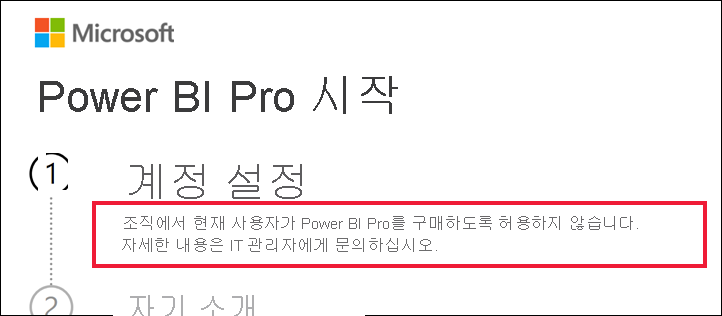

# Power BI Pro 구매를 사용할 수 없는 경우 수행할 작업

Power BI Pro를 구매하려고 했고 조직에서 해당 사용자의 구매를 허용하지 않는다는 메시지를 받았습니다. 일부 조직에서는 여러 가지 이유로 구성원의 셀프 서비스 Power BI Pro 구매를 차단합니다.  예를 들어 조직에 모든 라이선스 및 구독을 중앙 IT 부서나 지원 센터에서 관리하는 정책이 있을 수 있습니다. 

## 솔루션
구매를 완료하려면 IT 부서 또는 지원 센터에 연락하여 [해당 지침에 따라 라이선스를 제공](../admin/service-admin-manage-licenses.md)할 것을 요청합니다.

## 다음 단계
[라이선스 유형별 Power BI 기능](service-features-license-type.md)