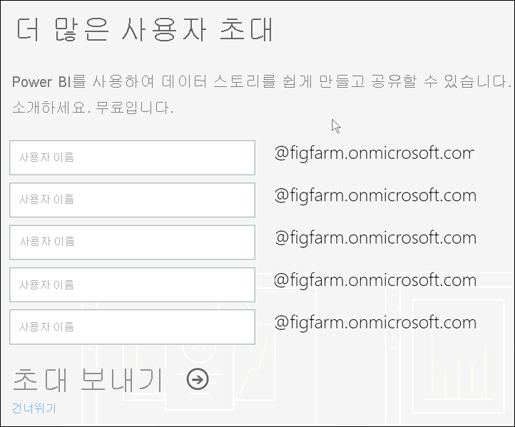

# 개별적으로 Power BI 서비스에 가입

Power BI는 개인 데이터 분석 및 시각화 도구가 될 수 있으며 그룹 프로젝트, 사업부 또는 회사 전체의 분석 및 의사 결정 엔진 역할도 할 수 있습니다. 이 문서에서는 개인으로 Power BI에 등록하는 방법을 설명합니다. 전역 관리자 또는 대금 청구 관리자인 경우 [조직의 Power BI 라이선스](../admin/service-admin-licensing-organization.md)를 참조하세요.

## Power BI란?
Power BI는 직관적인 사용자 환경과 인텔리전트 데이터 시각화를 결합하여 더 심층적인 데이터 인사이트를 제공하는 통합 셀프 서비스 및 엔터프라이즈 비즈니스 인텔리전스 플랫폼입니다. 보고서는 Microsoft 도구(예: Teams, SharePoint, PowerPoint) 또는 다른 생산성 제품 내에서 공유할 수 있습니다. 이 제품은 두 개의 관련 애플리케이션이 포함된 온라인 SaaS(Software as a Service) 제품으로 제공됩니다. 하나는 보고서를 만들기 위한 Power BI Desktop이라는 Microsoft Windows 데스크톱 애플리케이션이며, 다른 하나는 iOS 및 Android 디바이스에서 보고서를 사용하기 위한 네이티브 모바일 BI 앱입니다. 

Desktop, 서비스 및 모바일 앱의 세 가지 요소는 사용자가 자신 또는 자신의 역할을 가장 효과적으로 수행하는 방식으로 비즈니스 인사이트를 만들고, 공유하고, 사용하도록 설계되었습니다.

## Power BI 서비스에 가입
이 문서에서는 **Power BI 서비스**에 개별적으로 가입하는 단계에 대해 설명합니다. Power BI Desktop을 다운로드하거나 모바일 앱을 설치하는 데 도움이 필요하면 다음 문서를 참조하세요.
- [Power BI Desktop(평가판 다운로드 가능)](desktop-get-the-desktop.md)    
- [Power BI 모바일 앱(평가판 다운로드 가능)](../consumer/mobile/mobile-apps-for-mobile-devices.md)

## 지원되는 이메일 주소

등록 프로세스를 시작하기 전에 Power BI에 등록하는 데 사용할 수 있는 메일 주소 유형을 알아보는 것이 중요합니다.

* Power BI는 등록할 회사 또는 학교 이메일 주소가 필요합니다. 고객 메일 서비스 또는 전자 통신 공급자가 제공하는 메일 주소로는 등록할 수 없습니다. 여기에는 outlook.com, hotmail.com, gmail.com 등이 포함됩니다. 회사 또는 학교 계정이 없는 경우 [다른 가입 방법에 대해 알아보세요](../admin/service-admin-signing-up-for-power-bi-with-a-new-office-365-trial.md).

* .gov 또는 .mil 주소로 Power BI에 등록할 수 있지만 다른 프로세스가 필요합니다. 자세한 내용은 [Power BI 서비스에 US Government 조직 등록](../admin/service-govus-signup.md)을 참조하세요.

## Power BI 서비스에 등록

Power BI 계정에 등록하려면 다음 단계를 수행합니다. 이 프로세스를 완료하면 내 작업 영역을 사용하여 Power BI 서비스를 직접 체험하거나, Power BI 프리미엄 용량에 할당된 Power BI 작업 영역에서 콘텐츠를 사용하거나, 개별 Power BI Pro 평가판을 시작하는 데 사용할 수 있는 Power BI(평가판) 라이선스가 제공됩니다. 자세한 내용은 [라이선스 유형별 Power BI 기능](service-features-license-type.md)을 참조하세요. 

정확한 가입 단계는 조직 및 프로세스를 시작하기 위해 클릭하는 항목에 따라 달라질 수 있습니다. 이러한 이유로 아래에 표시된 모든 화면이 표시되지 않을 수 있습니다. Power BI 서비스에 개별적으로 가입하는 다양한 방법이 있으며, 이 문서의 단계는 가장 일반적인 두 가지 방법에 적용됩니다.      
- **평가판 사용** 또는 **평가판 시작** 단추를 선택합니다1.     
- Power BI 대시보드, 보고서 또는 앱에 대한 링크가 포함된 이메일을 받습니다. 이전에 Power BI 계정에 로그인하지 않았습니다.

    1 powerbi.microsoft.com, 관련 Microsoft 제품, 설명서 및 마케팅 문서에서 **평가판 사용** 형식의 단추를 확인할 수 있습니다.

### 1단계

- [powerbi.microsoft.com](https://powerbi.com)에서 **평가판 시작** 또는 **평가판 사용**을 선택합니다. 단추를 두 번 선택해야 할 수도 있습니다.

        

- 또는 Power BI 대시보드, 보고서 또는 앱에 대한 이메일 링크를 선택합니다.

        

1. Microsoft 365에서 사용자를 인식하며 Microsoft 서비스가 이미 설치되어 있다고 파악하고 있습니다. **로그인**을 선택합니다.

        
    
1. 다음 대화 상자 중 하나를 받을 수 있습니다. 
    - 메시지가 표시되면 조직 계정을 사용하여 로그인합니다.

            

    - 다음과 같은 메시지가 표시되면 hotmail, gmail 또는 outlook과 같은 소비자 주소가 아니라 회사 또는 학교 이메일 주소를 사용해야 합니다. 위의 [지원되는 이메일 주소](#supported-email-addresses)를 참조하세요.

       
   
    - 다음과 같은 메시지가 표시되면 사용 약관을 검토합니다. 동의하면 **시작**을 선택합니다. 

        

1. 필요에 따라 조인할 일부 동료를 초대합니다.

       

1. 이 시점에서 Microsoft가 [새 테넌트를 설정](../admin/service-admin-signing-up-for-power-bi-with-a-new-office-365-trial.md)하는 경우 기다려야 할 수 있습니다. 그렇지 않으면 브라우저에서 Power BI 서비스가 열립니다.

        

## 개별 Power BI Pro 평가판에 가입
Power BI 계정에 처음 로그인하는 것을 축하합니다! 이제 평가판 라이선스가 있습니다2. Power BI 서비스 검색을 시작하면 개별 Power BI Pro 평가판으로 업그레이드할 것인지 묻는 팝업이 표시됩니다. [Power BI 서비스의 일부 기능에는 Pro 라이선스가 필요합니다](../consumer/end-user-license.md). 개별 Power BI Pro 60일 평가판을 시작하려면 **평가판 시작**을 선택합니다.  

    

2 일부 조직에서는 기본 Power BI 계정이 Power BI **Pro** 라이선스일 수 있습니다. 예를 들어 일부 버전의 Microsoft 365에는 Power BI Pro 라이선스가 포함되어 있습니다. 사용자 라이선스를 조회하는 방법을 알아보려면 [내가 보유한 라이선스는 무엇인가요?](../consumer/end-user-license.md)를 참조하세요.

## 평가판 만료

개별 Power BI Pro 평가판이 만료되면 라이선스가 Power BI(평가판) 라이선스로 다시 변경됩니다. 평가판은 확장할 수 없습니다. Power BI Pro 라이선스가 필요한 기능에 더 이상 액세스할 수 없습니다. 자세한 내용은 [라이선스 유형별 기능](service-features-license-type.md)을 참조하세요.    

Power BI(무료) 라이선스가 충분한 경우에는 다른 작업을 수행할 필요가 없습니다. Power BI Pro 기능을 활용하려면 **지금 구입**을 선택하거나 [Power BI 가격](https://powerbi.microsoft.com/pricing)을 방문하여 Pro 라이선스를 구입합니다.

      

셀프 서비스 구입을 사용할 수 없는 경우 Power BI Pro 라이선스 구입에 대해 관리자에게 문의하세요.

## 등록 프로세스 문제 해결

대부분의 경우 설명한 프로세스에 따라 Power BI에 등록할 수 있습니다. 다음 표에서는 등록할 수 없게 하는 몇 가지 문제와 가능한 해결 방법을 설명합니다.

| 증상/오류 메시지 | 원인 및 해결 방법 |
| ----------------------- | -------------------- |
| <strong>개인 메일 주소(예: nancy@gmail.com)</strong> 등록 중에 다음과 유사한 메시지를 받게 됩니다.    ‘개인 메일 주소를 입력했습니다. 귀사의 데이터를 안전하게 저장할 수 있도록 업무용 메일 주소를 입력하세요.’    또는    *개인 메일 주소인 것 같습니다. 회사의 다른 사람과 연결할 수 있도록 회사 주소를 입력하세요. 걱정하지 마세요. 사용자의 주소를 공유하지 않습니다.* | Power BI는 소비자 메일 서비스나 전자 통신 공급자가 제공하는 메일 주소를 지원하지 않습니다.    등록을 완료하려면 회사 또는 학교에서 할당한 메일 주소를 사용하여 다시 시도하세요.    여전히 등록할 수 없고 보다 고급의 설치 프로세스를 완료하려면 [새 Microsoft 365 평가판 구독을 등록하고 해당 메일 주소를 사용하여 등록](../admin/service-admin-signing-up-for-power-bi-with-a-new-office-365-trial.md)하면 됩니다.    기존 사용자를 [게스트로 초대](../admin/service-admin-azure-ad-b2b.md)할 수도 있습니다. |
| **셀프 서비스 등록 사용 안 함**: 등록 중에 다음과 같은 메시지를 받게 됩니다.    *등록하면 완료할 수 없습니다. IT 부서에서 Microsoft Power BI에 대한 등록을 해제했습니다. 연락하여 등록을 완료합니다.*    | 조직의 [글로벌 관리자](https://docs.microsoft.com/azure/active-directory/users-groups-roles/directory-assign-admin-roles.md)가 Power BI에 대한 셀프 서비스 가입을 사용하지 않도록 설정했습니다.    가입을 완료하려면 글로벌 관리자에게 문의하여 [지침에 따라 가입을 사용하도록 설정](../admin/service-admin-disable-self-service.md)하세요.    파트너를 통해 Microsoft 365에 등록한 경우에도 이 문제가 발생할 수 있습니다. 이 경우 Microsoft 365 제공을 담당하는 조직에 문의하세요. |
| **메일 주소는 Microsoft 365 ID가 아님** 등록 중에 다음과 같은 메시지를 받게 됩니다.    *contoso.com에서 사용자를 찾을 수 없습니다.  회사 또는 학교에서 다른 ID를 사용하나요?    로그인을 시도했으나 작동하지 않는 경우 IT 부서에 문의합니다.* | 조직에서 전자 메일 주소와 다른 ID를 사용하여 Microsoft 365 및 기타 Microsoft 서비스에 로그인합니다.  예를 들어 전자 메일 주소는 Nancy.Smith@contoso.com이지만 ID는 nancys@contoso.com입니다.    등록을 완료하려면 Microsoft 365 또는 다른 Microsoft 서비스에 로그인하기 위해 조직에서 할당받은 ID를 사용합니다.  이에 대해 잘 모르는 경우 글로벌 관리자에게 문의하세요.    여전히 등록할 수 없고 보다 고급의 설치 프로세스를 완료하려면 [새 Microsoft 365 평가판 구독을 등록하고 해당 메일 주소를 사용하여 등록](../admin/service-admin-signing-up-for-power-bi-with-a-new-office-365-trial.md)하면 됩니다. |
Power BI 로그인에서 암호를 인식하지 못합니다.  |  몇 번 시도하는 경우도 있습니다. 암호를 여러 번 다시 시도했지만 여전히 로그인할 수 없는 경우 Incognito(Chrome) 또는 InPrivate(Edge) 모드에서 브라우저를 실행해 보세요.

## 다음 단계

[라이선스 유형별 Power BI 기능](../consumer/end-user-features.md)    
[도움말 찾기 팁](../fundamentals/service-tips-for-finding-help.md)    

궁금한 점이 더 있나요? [Power BI 커뮤니티에 질문합니다.](https://community.powerbi.com/)
