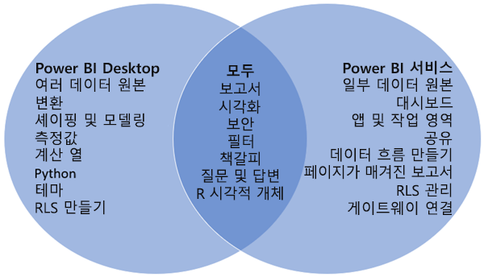

# Power BI Desktop 및 Power BI 서비스 비교

Power BI Desktop과 Power BI 서비스를 비교한 벤 다이어그램에서 중간 영역은 두 영역이 어떻게 겹치는지를 보여 줍니다. Power BI Desktop 또는 서비스에서 수행할 수 있는 몇 가지 작업입니다. 벤 다이어그램의 양쪽 측면에는 애플리케이션과 서비스에 고유한 기능이 표시됩니다.  

**Power BI Desktop** 은 로컬 컴퓨터에 무료로 설치하는 완전한 데이터 분석 및 보고서 작성 도구입니다. 이 도구에 포함된 쿼리 편집기를 사용하면 다양한 데이터 원본에 연결하고 데이터 모델로 결합(모델링이라고도 함)할 수 있습니다. 그런 다음, 해당 데이터 모델을 기반으로 하여 보고서를 디자인합니다. [Power BI Desktop 시작 가이드](desktop-getting-started.md)가 이 과정을 안내합니다.

**Power BI 서비스** 는 클라우드 기반 서비스입니다. 팀과 조직을 위한 간단한 보고서 편집 및 협업을 지원합니다. Power BI 서비스의 데이터 원본에도 연결할 수는 있지만 모델링에는 제한이 있습니다.

비즈니스 인텔리전스 프로젝트에서 작업하는 대부분의 Power BI 보고서 디자이너는 **Power BI Desktop** 을 사용하여 Power BI 보고서를 만든 다음, **Power BI 서비스** 를 사용하여 보고서를 공동 작업하고 배포합니다.

또한 Power BI 서비스는 Power BI Premium 용량으로 지원되는 작업 영역에서 페이지를 매긴 보고서를 호스트합니다. Power BI Report Builder로 페이지를 매긴 보고서를 만들 수도 있습니다. "Power BI Premium에서 페이지를 매긴 보고서란?" 문서에서 [Power BI 보고서와 페이지를 매긴 보고서 비교](../paginated-reports/paginated-reports-report-builder-power-bi.md#compare-power-bi-reports-and-paginated-reports)를 참조하세요. 이동하세요.

## Power BI 보고서 편집

애플리케이션과 서비스 둘 다에서 Power BI 보고서를 빌드하고 편집합니다. 보고서에는 시각적 개체 및 시각적 개체의 컬렉션이 포함된 하나 이상의 페이지가 있을 수 있습니다. 책갈피, 단추, 필터 및 드릴스루를 추가하여 보고서 탐색을 향상합니다.

Power BI Desktop과 서비스의 보고서 편집기는 유사합니다. 다음 세 가지 섹션으로 구성되어 있습니다.  

1. Power BI Desktop과 서비스에 따라 달라지는 위쪽 탐색 창    
2. 보고서 캔버스     
3. **필드**, **시각화** 및 **필터** 창

이 비디오는 Power BI Desktop의 보고서 편집기를 보여줍니다. 

<iframe width="560" height="315" src="https://www.youtube.com/embed/IkJda4O7oGs" frameborder="0" allowfullscreen></iframe>

## Power BI 서비스의 작업

### 협업

보고서를 만든 후에는 사용자와 동료가 공동 작업을 수행하는 **Power BI 서비스** 의 *작업 영역* 에 보고서를 저장할 수 있습니다. 해당 보고서 위에 *대시보드* 를 빌드합니다. 그런 다음, 해당 대시보드와 보고서를 조직 내/외부의 보고서 소비자와 공유합니다. 보고서 소비자는 편집용 보기가 아닌 ‘읽기용 보기’의 Power BI 서비스에서 봅니다. 소비자는 보고서 작성자에게 제공되는 일부 기능에 액세스할 수 없습니다.  데이터 세트를 공유하고, 다른 사용자가 데이터 세트에서 고유한 보고서를 작성하도록 허용할 수도 있습니다. 자세한 내용은 [Power BI 서비스의 협업](../collaborate-share/service-new-workspaces.md)을 참조하세요.

### 데이터 흐름을 사용하여 셀프 서비스 데이터 준비

데이터 흐름은 조직이 여러 원본의 데이터를 통합하고 모델링을 위해 준비하는 데 도움이 됩니다. 분석가는 익숙한 셀프 서비스 도구를 사용하여 쉽게 데이터 흐름을 만들 수 있습니다. 분석가는 데이터 흐름을 사용하여 데이터 원본 연결, ETL 논리, 새로 고침 일정 등을 정의하여 빅 데이터를 수집, 변환, 통합 및 강화합니다. 자세한 내용은 [데이터 흐름을 사용하여 셀프 서비스 데이터 준비](../transform-model/dataflows/dataflows-introduction-self-service.md)를 참조하세요.

## 다음 단계

[Power BI Desktop이란?](desktop-what-is-desktop.md)

Power BI 서비스에서 [보고서 만들기](../create-reports/service-report-create-new.md)

[보고서 디자이너에 대한 기본 개념](service-basic-concepts.md)

궁금한 점이 더 있나요? [Power BI 커뮤니티를 이용하세요.](https://community.powerbi.com/)