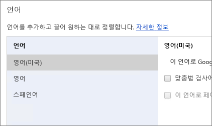
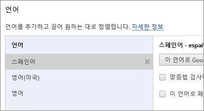
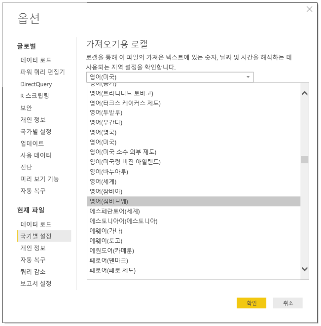
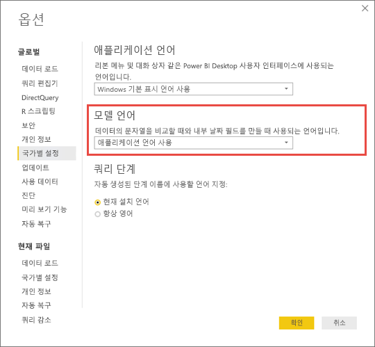

# Power BI에 지원되는 언어 및 국가/지역

이 문서에서는 Power BI 서비스, Power BI Desktop 및 Power BI 설명서에서 지원하는 언어 및 국가/지역 목록을 다룹니다.

## Power BI를 사용할 수 있는 국가 및 지역
Power BI를 사용할 수 있는 국가 및 지역 목록은 [국제 지원 가용성 목록](https://products.office.com/business/international-availability)을 참조하세요. 

## Power BI 서비스에 대한 언어
브라우저의 Power BI 서비스는 다음 44개 언어로 제공됩니다.

* 아랍어
* 바스크어-바스크어
* 불가리아어-Български
* 카탈로니아어-català
* 중국어(간체)-中文(简体)
* 중국어(번체)-中文(繁體)
* 크로아티아어-hrvatski
* 체코어-čeština
* 덴마크어-dansk
* 네덜란드어-네덜란드어
* 영어-영어
* 에스토니아어-eesti
* 핀란드어-suomi
* 프랑스어-français
* 갈리시아어-galego
* 독일어-Deutsch
* 그리스어-Ελληνικά
* 히브리어
* 힌디어-हिंदी
* 헝가리어-magyar
* 인도네시아어-바하사 인도네시아어
* 이탈리아어-italiano
* 일본어-日本語
* 카자흐어-Қазақ
* 한국어-한국어
* 라트비아어-latviešu
* 리투아니아어-lietuvių
* 말레이어-바하사 말레이어
* 노르웨이어(복말)-norsk(복말)
* 폴란드어-Polski
* 포르투갈어(브라질)-Português
* 포르투갈어(포르투갈)-Português
* 루마니아어-română
* 러시아어-Русский
* 세르비아어(키릴자모)-српски
* 세르비아어(라틴 문자)-srpski
* 슬로바키아어-slovenčina
* 슬로베니아어-slovenski
* 스페인어-español
* 스웨덴어-svenska
* 태국어-ไทย
* 터키어-Türkçe
* 우크라이나어-українська
* 베트남어-Tiếng Việt

### 번역 내용
Power BI는 메뉴, 단추, 메시지 및 기타 환경 요소를 해당 언어로 번역합니다. 예를 들어 Power BI는 자동으로 생성된 제목, 필터, 도구 설명 등의 보고서 콘텐츠를 변환합니다. 그러나 데이터는 자동으로 변환되지 않습니다. 히브리어와 같이 오른쪽에서 왼쪽으로 쓰기 언어를 사용하는 경우 보고서 내에서 시각적 개체의 레이아웃이 변경되지 않습니다.

이번에 몇 가지 기능은 영어로만 제공됩니다.

* Microsoft Dynamics CRM, Google 분석, Salesforce 등의 서비스에 연결할 때 Power BI에서 생성되는 대시보드 및 보고서 사용자 언어로 자신만의 대시보드 및 보고서를 작성할 수도 있습니다.
* 질문과 대답을 통한 데이터 탐색

추가된 기능이 기타 언어로 제공될 수 있도록 노력하겠습니다. 

### Power BI 서비스에서 해당 언어를 선택합니다.
1. Power BI 서비스에서 **설정** 아이콘 을 선택합니다. > **설정**.
2. **일반** 탭 > **언어** 에서.
3. 언어 > **적용** 을 선택합니다.

### 브라우저에서 해당 언어를 선택합니다.
Power BI는 컴퓨터의 언어 기본 설정에 따라 언어를 검색합니다. 이러한 기본 설정을 액세스하고 변경하는 방법은 운영 체제 및 브라우저에 따라 달라질 수 있습니다. Internet Explorer 및 Google Chrome에서 이러한 기본 설정에 액세스하는 방법은 다음과 같습니다.

#### Internet Explorer(버전 11)
1. 브라우저 창의 오른쪽 위 모서리에 있는 **도구** 단추를 클릭합니다.
   
   
2. **인터넷 옵션** 을 클릭합니다.
3. 모양 아래의 일반 탭에 있는 인터넷 옵션 대화 상자에서 **언어** 단추를 클릭합니다.

#### Google Chrome(버전 42)
1. 브라우저 창의 오른쪽 위 모서리에 있는 메뉴 단추를 클릭합니다.
   
   
2. **설정** 을 클릭합니다.
3. **고급 설정 표시** 를 클릭합니다.
4. 언어에서 **언어 및 입력 설정** 단추를 클릭합니다.
5. **추가** 를 클릭하고 언어를 선택한 다음, **확인** 을 클릭합니다.
   
   
   
   새로운 언어는 목록 끝에 있습니다. 
6. 목록의 맨 위에 새 언어를 끌어놓고 **이 언어로 Google Chrome 표시** 를 클릭합니다.
   
   
   
   브라우저를 닫았다가 다시 열어서 변경 사항을 확인해야 합니다.

## Power BI Desktop의 언어 또는 로캘 선택
Power BI Desktop을 얻는 방법은 두 가지입니다. 독립 실행형 설치 프로그램으로 다운로드하거나 Windows 스토어에서 설치할 수 있습니다.

* Windows 스토어에서 Power BI Desktop을 설치하면 모든 언어가 설치되고 Windows 기본 언어에 해당하는 언어가 표시됩니다.
* Power BI Desktop을 독립 실행형 설치 관리자로 다운로드하면 설치 관리자를 실행할 때 기본 언어를 선택할 수 있습니다. 나중에 날짜를 변경할 수 있습니다.
* 특정 보고서를 위한 [데이터를 가져올 때 사용할 로캘을 선택](#choose-the-locale-for-importing-data-into-power-bi-desktop)할 수도 있습니다.

> [!NOTE]
> Power BI Report Server에 최적화된 Power BI Desktop 버전을 설치하는 경우 다운로드할 때 언어를 선택합니다. 자세한 내용은 [Power BI Report Server에 최적화된 Power BI Desktop 설치](../report-server/install-powerbi-desktop.md)를 참조하세요.

### Power BI Desktop 언어 선택 
1. Power BI Desktop을 [Windows 스토어에서](https://aka.ms/pbidesktopstore) 설치하거나 [독립 실행형 설치 프로그램](https://aka.ms/pbiSingleInstaller)으로 설치합니다.
2. 언어를 변경하려면 Windows 메뉴에서 **설정** 을 선택합니다.

3. **Windows 설정** 에서 **시간 및 언어** 를 선택합니다.
   
     
4. **언어** 를 선택하고 언어를 선택합니다. 필요한 경우 **Microsoft Store에서 Windows 표시 언어 추가** 를 선택합니다.
   
     
   
     다음에 Power BI Desktop을 시작하면 기본값으로 설정한 언어가 사용됩니다. 

기본값을 재정의하고 Windows 언어 이외의 언어로 Power BI Desktop을 사용하려면 다음을 수행합니다.
1. Power BI Desktop에서 **파일** > **옵션 및 설정** > **옵션** 으로 이동합니다.
2. **전역 설정** 아래에서 **국가별 설정** 을 선택합니다.
3. **애플리케이션 언어** 상자에서 다른 로캘을 선택합니다. 

Power BI Desktop의 언어 지원은 애플리케이션 언어 드롭다운에서 표시되는 언어로 제한됩니다.

### Power BI Desktop 기본 번호 및 날짜 서식 지정 확인

Power BI Desktop은 Windows 지역 설정에서 기본 번호 및 날짜 서식 지정을 가져옵니다. 필요한 경우 해당 설정을 확인하거나 변경할 수 있습니다.

1. Windows 메뉴에서 **설정** 을 선택합니다.

2. **Windows 설정** 에서 **시간 및 언어** 를 선택합니다.
   
     

3. **지역** > **추가 날짜, 시간 및 지역 설정** 을 선택합니다.

    :::image type="content" source="media/supported-languages-countries-regions/power-bi-service-region-settings.png" alt-text="추가 날짜, 시간 및 지역 설정":::

4. **시계 및 지역** 에서 **날짜, 시간 또는 숫자 서식 변경** 을 선택합니다.

    :::image type="content" source="media/supported-languages-countries-regions/power-bi-service-check-region-settings.png" alt-text="시계 및 지역 설정":::

5. **Windows 표시 언어 일치** 가 선택되어 있는지 확인하거나 필요한 경우 변경합니다.

    :::image type="content" source="media/supported-languages-countries-regions/power-bi-service-match-windows.png" alt-text="Windows 표시 언어 일치":::

### Power BI Desktop으로 데이터를 가져올 때 사용할 로캘 선택
Power BI Desktop을 다운로드하든 Windows 스토어에서 설치하든 특정 보고서에 대한 로캘을 Power BI Desktop 버전의 로캘이 아닌 다른 로캘로 선택할 수 있습니다. 로캘은 데이터 원본에서 데이터를 가져올 때 Power BI가 데이터를 해석하는 방식을 변경합니다. 예를 들어 "3/4/2017"은 4월 3일 또는 3월 4일 중 무엇으로 해석되나요?

1. Power BI Desktop에서 **파일** > **옵션 및 설정** > **옵션** 으로 이동합니다.
2. **현재 파일** 에서 **국가별 설정** 을 선택합니다.
3. **가져오기용 로캘** 상자에서 다른 로캘을 선택합니다. 
   
   
4. **확인** 을 선택합니다.

### Power BI Desktop에서 모델 언어 선택

Power BI Desktop 애플리케이션의 언어를 설정할 수 있을 뿐만 아니라 모델 언어도 설정할 수 있습니다. 모델 언어는 다음 두 가지에 주로 영향을 미칩니다.

- 문자열 비교 및 정렬 방법. 예를 들어 터키어는 데이터베이스의 데이터 정렬에 따라 문자 i가 두 가지로 표기되기 때문에 문자열을 정렬할 경우 다른 순서로 정렬될 수 있습니다. 
- Power BI Desktop이 날짜 필드에서 숨겨진 날짜 테이블을 만들 때 사용하는 언어. 필드 이름의 예로는 월/Monat/Mois 등이 있습니다.

> [!NOTE]
> Power BI의 모델은 현재 대/소문자(또는 가나)를 구분하지 않는 로캘을 사용하므로 “ABC” 및 “abc”는 같은 것으로 처리됩니다. “ABC”가 먼저 데이터베이스에 로드되면 “Abc”와 같이 대/소문자로만 구분되는 다른 문자열이 별도의 값으로 로드되지 않습니다.
> 
>

모델 언어를 설정하는 방법은 다음과 같습니다.

1. Power BI Desktop에서 **파일** > **옵션 및 설정** > **옵션** 으로 이동합니다.
2. **글로벌** 아래에서 **국가별 설정** 을 선택합니다.
3. **모델 언어** 상자에서 다른 언어를 선택합니다. 

    

> [!NOTE]
> 생성된 후에는 Power BI 모델의 언어를 변경할 수 없습니다.
> 
>

## 도움말 문서에 대한 언어
도움말은 다음과 같은 10가지 언어로 지역화됩니다. 

* 중국어(간체)-中文(简体)
* 중국어(번체)-中文(繁體)
* 프랑스어-français
* 독일어-Deutsch
* 이탈리아어-italiano
* 일본어-日本語
* 한국어-한국어
* 포르투갈어(브라질)-Português
* 러시아어-Русский
* 스페인어-español

## 다음 단계
* Power BI 모바일 앱 중 하나를 사용하고 있나요? 자세한 내용은 [Power BI 모바일 앱에서 지원되는 언어](../consumer/mobile/mobile-apps-supported-languages.md)를 참조하세요.
* 궁금한 점이 더 있나요? [Power BI 커뮤니티](https://community.powerbi.com/)에 질문합니다.
* 여전히 문제가 있나요? [Power BI 지원 페이지](https://powerbi.microsoft.com/support/)를 방문하세요.
