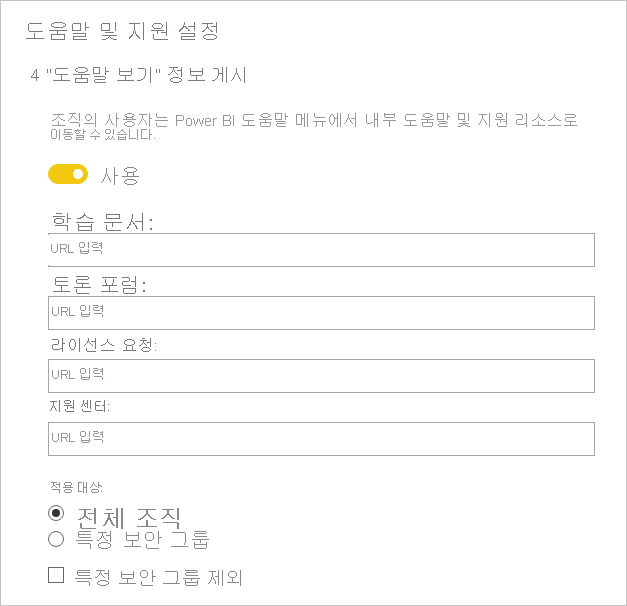

# 테넌트 관리자 설정 지침

이 문서는 조직 내 Power BI 환경 설정과 구성을 담당하는 Power BI 관리자를 대상으로 작성되었습니다.

이 지침에서는 Power BI 경험 개선에 유용하거나 조직이 위험에 노출될 수 있는 특정 테넌트 설정을 소개합니다. 관리자는 테넌트를 항상 조직의 정책과 프로세스에 맞추어 조정하는 것이 좋습니다.

[테넌트 설정](../admin/service-admin-portal.md#tenant-settings)은 [관리 포털](https://app.powerbi.com/admin-portal/tenantSettings)에서 관리되며 [Power BI 서비스 관리자](../admin/service-admin-administering-power-bi-in-your-organization.md#administrator-roles-related-to-power-bi)가 구성할 수 있습니다. 테넌트 설정이 많으면 소수의 사용자만 기능과 특징을 사용하게 될 수도 있습니다. 따라서 필요한 보안 그룹을 계획할 수 있도록 설정에 먼저 익숙해지는 것이 좋습니다. 동일한 보안 그룹을 여러 설정에 적용할 수도 있습니다.

## Power BI 경험 개선

### "도움말 보기" 정보 게시

내부의 Power BI 관련 사이트는 [Microsoft Teams](/microsoftteams) 또는 다른 협업 플랫폼을 사용해 설정하는 것이 좋습니다. 이러한 사이트는 교육 문서를 저장하고, 토론을 호스팅하고, 라이선스를 요청하거나 지원에 응답하는 데 사용할 수 있습니다.

이렇게 하는 경우 **"도움말 보기" 정보 게시** 설정을 _전체 조직_에 대해 사용하는 것이 좋습니다. 이 설정은 **도움말 및 지원 설정** 그룹에서 찾을 수 있습니다. 다음에 대한 URL 설정이 가능합니다.

- 교육 문서
- 토론 포럼
- 라이선스 요청
- 지원 센터

이 URL은 Power BI 도움말 메뉴의 링크로 사용할 수 있습니다.

> [!NOTE]
> **라이선스 요청** URL을 제공하면 개별 사용자는 Power BI Pro 60일 무료 평가판에 등록할 수 없습니다. 대신 해당 사용자는 내부 사이트로 이동해 무료 또는 Pro 라이선스 취득 방법을 안내받게 됩니다.

## 위험 관리
위험을 관리하는 설정은 Power BI 테넌트에서 거버넌스 정책을 설정하는 데 도움이 될 수 있습니다. 그러나 거버넌스 설정은 보안 측정값이 아닙니다. 예를 들어 **데이터 내보내기** 설정을 사용하지 않도록 설정하면 Power BI 사용자 인터페이스에서 기능을 제거하고 이런 식으로 Power BI 사용자가 조직의 거버넌스 정책을 준수하도록 하는 데에는 도움이 되지만, 결정된 사용자가 다른 옵션을 사용하여 데이터를 내보내지 못하도록 하지는 않습니다. 보안 측면에서 데이터 세트에 대한 읽기 권한이 있는 Power BI 사용자는 이 데이터 세트를 쿼리할 수 있는 권한을 가지며, Power BI 사용자 인터페이스에서 사용할 수 있는 기능에 관계없이 결과를 유지할 수 있습니다.
### 서비스 중단 또는 인시던트에 대한 전자 메일 알림 받기

테넌트가 서비스 중단 또는 인시던트에 영향을 받는 경우 전자 메일 알림을 받을 수 있습니다. 이렇게 하면 관련 인시던트에 미리 대응할 수 있습니다.

**서비스 중단 또는 인시던트에 대한 전자 메일 알림 받기** 설정을 사용하는 것이 좋습니다. 이 설정은 **도움말 및 지원 설정** 그룹에서 찾을 수 있습니다. _메일 사용이 가능한_ 보안 그룹을 하나 이상 할당합니다.

### 정보 보호

정보 보호 기능을 사용하면 Power BI 서비스의 데이터를 내보낼 때 암호화나 워터마크 같은 보호 설정을 적용할 수 있습니다.

정보 보호와 관련된 테넌트 설정에는 두 가지가 있습니다. 기본적으로 이 두 설정은 전체 조직에서 사용하지 않도록 설정되어 있습니다.

중요한 데이터를 처리하고 보호해야 할 때는 이 설정을 사용하는 것이 좋습니다. 자세한 내용은 [Power BI의 데이터 보호](../admin/service-security-data-protection-overview.md)를 참조하세요.

### 작업 영역 만들기

사용자가 작업 영역을 생성하지 못하도록 제한할 수 있습니다. 이렇게 하면 조직 내에서 생성되는 영역을 관리할 수 있습니다.

> [!NOTE]
> 현재 이전 작업 영역 환경과 새 작업 영역 환경 사이에 전환 기간이 있습니다. 이 테넌트 설정은 새 환경에만 적용됩니다.

**작업 영역 만들기** 설정은 기본적으로 전체 조직에서 사용하도록 설정되어 있습니다. 이 설정은 **작업 영역 설정** 그룹에서 찾을 수 있습니다.

보안 그룹은 하나 이상 할당하는 것이 좋습니다. 이 그룹에는 작업 영역 생성 권한을 부여하거나 _거부_할 수 있습니다.

문서에는 작업 영역 생성 권한이 없는 사용자가 새 영역을 요청하는 방법에 대한 지침을 포함해야 합니다.

### 외부 사용자와 콘텐츠 공유

사용자는 조직 외부인과 보고서 및 대시보드를 공유할 수 있습니다.

**외부 사용자와 콘텐츠 공유** 설정은 기본적으로 전체 조직에서 사용하도록 설정되어 있습니다. 이 설정은 **내보내기 및 공유 설정** 그룹에서 찾을 수 있습니다.

보안 그룹은 하나 이상 할당하는 것이 좋습니다. 이 그룹에게는 외부 사용자와의 콘텐츠 공유 권한이 부여되거나 _거부_될 수 있습니다.

### 웹에 게시

[웹에 게시](../collaborate-share/service-publish-to-web.md) 기능은 공개 보고서를 웹에 게시하는 데 사용됩니다. 이 기능을 잘못 사용하면 기밀 정보가 웹에서 실시간으로 노출될 위험이 있습니다.

**웹에 게시** 설정은 기본적으로 전체 조직에서 사용하도록 설정되어 있지만 관리자가 아닌 사용자는 embed 태그 생성 기능이 제한됩니다. 이 설정은 **내보내기 및 공유 설정** 그룹에서 찾을 수 있습니다.

사용하도록 설정하는 경우 보안 그룹을 하나 이상 할당하는 것이 좋습니다. 이 그룹에는 보고서 게시 권한을 부여하거나 _거부_할 수 있습니다.

또한 embed 코드 작동 방식을 선택할 수도 있습니다. 기본적으로 **기존 코드만 허용**으로 설정되어 있습니다. 사용자가 embed 태그를 생성할 경우 Power BI 관리자에게 문의하라는 메시지가 표시됩니다.

또한 [웹 embed 태그로 게시](https://app.powerbi.com/admin-portal/embedCodes)를 정기적으로 검토하는 것이 좋습니다. 태그 때문에 비공개 정보나 기밀 정보가 게시된다면 태그를 제거합니다.

### 데이터 내보내기

사용자가 대시보드 타일이나 보고서의 시각적 개체에서 데이터를 내보내지 못하도록 제한할 수 있습니다.

**데이터 내보내기** 설정은 기본적으로 전체 조직에서 사용하도록 설정되어 있습니다. 이 설정은 **내보내기 및 공유 설정** 그룹에서 찾을 수 있습니다.

보안 그룹은 하나 이상 할당하는 것이 좋습니다. 이 그룹에는 보고서 게시 권한을 부여하거나 _거부_할 수 있습니다.

> [!IMPORTANT]
> 이 설정을 사용하지 않으면 [Excel에서 분석](../collaborate-share/service-analyze-in-excel.md) 및 Power BI 서비스 [라이브 연결](../connect-data/desktop-report-lifecycle-datasets.md#using-a-power-bi-service-live-connection-for-report-lifecycle-management) 기능의 사용도 제한됩니다.

> [!NOTE]
> 사용자의 데이터 내보내기를 허용하는 경우 [데이터 보호](../admin/service-security-data-protection-overview.md)를 적용해 보호 계층을 추가할 수 있습니다. 구성된 경우 권한이 없는 사용자는 민감도 레이블이 적용된 콘텐츠를 내보낼 수 없습니다.

### 외부 게스트 사용자가 조직의 콘텐츠를 편집 및 관리하도록 허용

외부 게스트 사용자가 Power BI 콘텐츠를 편집 및 관리할 수 있습니다. 자세한 내용은 [Azure AD B2B에서 외부 게스트 사용자에게 Power BI 콘텐츠 배포](../admin/service-admin-azure-ad-b2b.md)를 참조하세요.

**외부 게스트 사용자가 조직의 콘텐츠를 편집 및 관리하도록 허용** 설정은 기본적으로 전체 조직에서 사용하지 않도록 설정되어 있습니다. 이 설정은 **내보내기 및 공유 설정** 그룹에서 찾을 수 있습니다.

외부 사용자에게 콘텐츠 편집 및 관리 권한을 부여해야 할 경우 보안 그룹을 하나 이상 할당하는 것이 좋습니다. 이 그룹에는 보고서 게시 권한을 부여하거나 _거부_할 수 있습니다.

### 개발자 설정

[Power BI 콘텐츠 포함](../developer/embedded/embedding.md)과 관련된 테넌트 설정에는 두 가지가 있습니다. 아래에 이 계정과 키의 예제가 나와 있습니다.

- 앱에 콘텐츠 포함(기본적으로 사용하도록 설정됨)
- 서비스 주체가 Power BI API를 사용하도록 허용(기본적으로 사용할 수 없도록 설정됨)

개발자 API를 사용하여 콘텐츠를 포함하지 않으려는 경우 사용하지 않도록 설정하는 것이 좋습니다. 또는 그 작업을 수행할 특정 보안 그룹을 구성하세요.

## 다음 단계

이 문서와 관련된 보다 자세한 내용을 알아보려면 다음 리소스를 참조하세요.

- [Power BI 관리란?](../admin/service-admin-administering-power-bi-in-your-organization.md)
- [관리 포털에서 Power BI 관리](../admin/service-admin-portal.md)
- 궁금한 점이 더 있나요? [Power BI 커뮤니티에 질문합니다.](https://community.powerbi.com/)
- 제안? [Power BI 개선을 위한 아이디어 제공](https://ideas.powerbi.com)