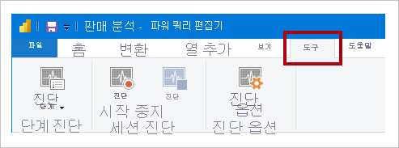

# <a name="monitor-report-performance-in-power-bi"></a>Power BI에서 보고서 성능 모니터링

[Power BI Premium 메트릭 앱](../admin/service-premium-metrics-app.md)을 사용하여 Power BI Desktop에서 보고서 성능을 모니터링하고, 병목 상태가 발생하는 위치를 확인하고, 보고서 성능을 향상시키는 방법을 알아봅니다.

성능 모니터링은 다음 상황과 관련이 있습니다.

- 가져오기 데이터 모델 새로 고침이 느린 경우.
- DirectQuery 또는 Live Connection 보고서가 느린 경우.
- 모델 계산이 느린 경우.

느린 쿼리 또는 보고서 시각적 개체가 지속적인 최적화의 중심이 되어야 합니다.

## <a name="use-query-diagnostics"></a>쿼리 진단 사용

Power BI Desktop에서 [쿼리 진단](/power-query/QueryDiagnostics)을 사용하여 쿼리를 미리 보거나 적용할 때 파워 쿼리가 수행하는 작업을 확인합니다. 또한 _진단 단계_ 함수를 사용하여 쿼리 단계마다 자세한 평가 정보를 기록합니다. 결과는 파워 쿼리에서 사용할 수 있으며, 변환을 적용하여 쿼리 실행에 대한 이해를 높일 수 있습니다.

> [!NOTE]
> 쿼리 진단은 현재 미리 보기 기능이므로 _옵션 및 설정_ 에서 사용하도록 설정해야 합니다. 사용하도록 설정되면 **도구** 리본 탭의 Power Query 편집기 창에서 해당 명령을 사용할 수 있습니다.



## <a name="use-performance-analyzer"></a>성능 분석기 사용

Power BI Desktop에서 [성능 분석기](../create-reports/desktop-performance-analyzer.md)를 사용하여 시각적 개체 및 DAX 수식과 같은 각 보고서 요소의 상태를 확인할 수 있습니다. 이 방법은 성능 문제의 원인이 쿼리인지 시각적 개체 렌더링인지 확인하는 데 특히 유용합니다.

## <a name="use-sql-server-profiler"></a>SQL Server Profiler 사용

[SQL Server Profiler](/sql/tools/sql-server-profiler/sql-server-profiler)를 사용하여 느린 쿼리를 식별할 수도 있습니다.

> [!NOTE]
> SQL Server Profiler는 [SQL Server Management Studio](/sql/ssms/download-sql-server-management-studio-ssms)의 일부로 사용할 수 있습니다.

데이터 원본이 다음 중 하나인 경우 SQL Server Profiler를 사용하세요.

- SQL Server
- SQL Server Analysis Services
- Azure Analysis Services

> [!CAUTION]
> Power BI Desktop은 진단 포트에 연결하는 기능을 지원합니다. 진단 포트를 사용하면 진단을 위해 다른 도구를 연결하여 추적을 수행할 수 있습니다. Power Desktop 데이터 모델 변경은 지원되지 않습니다. 데이터 모델 변경 시 손상 및 데이터 손실이 발생할 수 있습니다.

SQL Server Profiler 추적을 만들려면 다음 지침을 따르세요.

1. Power BI Desktop 보고서를 엽니다(그러면 다음 단계에서 쉽게 포트를 찾고 열려 있는 다른 보고서를 닫을 수 있습니다).
1. Power BI Desktop이 사용 중인 포트를 확인하려면 PowerShell(관리자 권한으로) 또는 명령 프롬프트에서 다음 명령을 입력합니다.
    ```powershell
    netstat -b -n
    ```
    애플리케이션 및 해당 열린 포트의 목록이 출력됩니다. **msmdsrv.exe** 에서 사용하는 포트를 찾아 나중에 사용할 수 있도록 적어 둡니다. 이것이 Power BI Desktop의 인스턴스입니다.
1. SQL Server Profiler를 Power BI Desktop 보고서에 연결하려면 다음 지침을 따르세요.
    1. SQL Server Profiler를 엽니다.
    1. SQL Server Profiler의 _파일_ 메뉴에서 _새 추적_ 을 선택합니다.
    1. **서버 유형** 에서 _Analysis Services_ 를 선택합니다.
    1. **서버 이름** 에 _localhost:[이전에 기록한 포트]_ 를 입력합니다.
    1. _실행_ 을 클릭합니다. 이제 SQL Server Profiler 추적이 라이브 상태이며, Power BI Desktop 쿼리를 능동적으로 프로파일링합니다.
1. Power BI Desktop 쿼리가 실행되면 해당 지속 시간과 CPU 시간을 볼 수 있습니다. 데이터 원본 유형에 따라 쿼리가 실행된 방식을 나타내는 다른 이벤트가 표시될 수 있습니다. 이 정보를 사용하여 어느 쿼리가 병목 상태인지 확인할 수 있습니다.

SQL Server Profiler 사용의 이점은 SQL Server (관계형) 데이터베이스 추적을 사용할 수 있다는 것입니다. 이 추적은 [데이터베이스 엔진 튜닝 관리자](/sql/relational-databases/performance/start-and-use-the-database-engine-tuning-advisor)에 대한 입력이 될 수 있습니다. 이렇게 하면 데이터 원본을 조정하는 방법에 대한 권장 사항을 받을 수 있습니다.

## <a name="monitor-premium-metrics"></a>Premium 메트릭 모니터링

Power BI Premium 용량의 경우, **Power BI Premium 메트릭 앱** 을 사용하여 Power BI Premium 구독의 상태와 용량을 모니터링하세요. 자세한 내용은 [Power BI Premium 메트릭 앱](../admin/service-premium-metrics-app.md)을 참조하세요.

## <a name="next-steps"></a>다음 단계

이 문서에 대한 자세한 내용은 다음 리소스를 참조하세요.

- [쿼리 진단](/power-query/QueryDiagnostics)
- [성능 분석기](../create-reports/desktop-performance-analyzer.md)
- [Power BI의 보고서 성능 문제 해결](report-performance-troubleshoot.md)
- [Power BI Premium 메트릭 앱](../admin/service-premium-metrics-app.md)
- 궁금한 점이 더 있나요? [Power BI 커뮤니티에 질문합니다.](https://community.powerbi.com/)
- 제안? [Power BI 개선을 위한 아이디어 제공](https://ideas.powerbi.com/)
