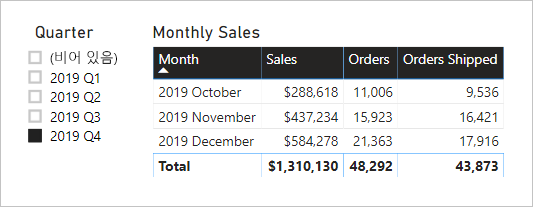

# <a name="active-vs-inactive-relationship-guidance"></a>활성 및 비활성 관계 지침

이 문서는 Power BI Desktop을 개발하는 데이터 모델러를 대상으로 합니다. 언제 활성 또는 비활성 모델 관계를 만들지에 대한 지침을 제공합니다. 기본적으로 활성 관계는 필터를 다른 테이블에 전파합니다. 그러나 비활성 관계는 DAX 식이 관계를 활성화(사용)하는 경우에만 필터를 전파합니다.

[!INCLUDE [relationships-prerequisite-reading](includes/relationships-prerequisite-reading.md)]

## <a name="active-relationships"></a>활성 관계

일반적으로 가능한 경우 항상 활성 관계를 정의하는 것이 좋습니다. 이들은 보고서 작성자가 모델을 사용하고 사용자가 질문 및 답변을 사용하는 범위와 가능성을 확장합니다.

항공사 비행 정시성(OTP)을 분석하도록 디자인된 가져오기 모델의 예를 살펴보겠습니다. 이 모델에는 비행편당 하나의 행을 저장하는 팩트 유형 테이블인 **Flight** 테이블이 있습니다. 각 행은 비행 날짜, 비행 번호, 출발 및 도착 공항, 지연 시간(분)을 기록합니다. 공항마다 하나의 행을 저장하는 차원 유형 테이블인 **Airport** 테이블도 있습니다. 각 행은 공항 코드, 공항 이름 및 국가를 설명합니다.

다음은 두 테이블의 부분 모델 다이어그램입니다.


**Flight** 테이블과 **Airport** 테이블 사이에는 두 가지 모델 관계가 있습니다. **Flight** 테이블에서 **DepartureAirport** 및 **ArrivalAirport** 열은 **Airport** 테이블의 **Airport** 열과 연결되어 있습니다. 별모양 스키마 디자인에서 **Airport** 테이블은 [롤플레잉 차원](star-schema.md#role-playing-dimensions)으로 설명됩니다. 이 모델에서 두 역할은 _출발 공항_ 및 _도착 공항_입니다.

이 디자인은 관계형 별모양 스키마 디자인에 적합하지만 Power BI 모델에는 적합하지 않습니다. 모델 관계는 필터 전파를 위한 경로이고 이러한 경로는 결정적이어야 하기 때문입니다. 그래서 한 모델이 두 테이블 간에 여러 활성 관계를 가질 수 없는 것입니다. 따라서 이 예제에서 설명한 것처럼 한 관계는 활성 상태이고 다른 관계는 비활성 상태(파선으로 표시)입니다. 구체적으로 **ArrivalAirport** 열과의 관계가 활성 상태입니다. 즉 **Airport** 테이블에 적용된 필터가 **Flight** 테이블의 **ArrivalAirport** 열에 자동으로 전파됩니다.

이 모델 디자인은 데이터를 보고할 수 있는 방법에 심각한 제한을 가져옵니다. 특히 **Airport** 테이블을 필터링하여 출발 공항의 비행편 세부 정보를 자동으로 격리할 수 없습니다. 보고 요구 사항에 따라 출발 및 도착 공항을 _동시에_ 필터링(또는 그룹화)해야 하므로 두 개의 활성 관계가 필요합니다. 이 요구 사항을 Power BI 모델 디자인으로 변환하는 것은 모델에 공항 테이블이 두 개 있어야 함을 의미합니다.

향상된 모델 디자인은 다음과 같습니다.


이제 모델에는 두 개의 공항 테이블 **Departure Airport** 및 **Arrival Airport**가 있습니다. 이러한 테이블과 **Flight** 테이블 간의 모델 관계가 활성화됩니다. 또한 **Departure Airport** 및 **Arrival Airport** 테이블의 열 이름 앞에는 _Departure_ 또는 _Arrival_이라는 접두사가 붙습니다.

이 향상된 모델 디자인에서 다음과 같은 보고서 디자인을 만들 수 있습니다.


보고서 페이지는 멜버른을 출발 공항으로 필터링하고 도착 공항을 기준으로 테이블 시각적 개체 그룹을 필터링합니다.

> [!NOTE]
> 가져오기 모델의 경우 추가 테이블의 모델 크기가 증가하고 새로 고침 시간이 길어집니다. 이는 [가져오기 모델링을 위한 데이터 축소 방법](import-modeling-data-reduction.md) 문서에 설명된 권장 사항과 모순됩니다. 그러나 이 예제에서는 활성 관계만 있어야 한다는 요구 사항이 이러한 권장 사항을 재정의합니다.
>
> 또한 차원 유형 테이블에는 팩트 유형 테이블보다 적은 행 수가 포함되는 것이 일반적입니다. 따라서 증가된 모델 크기와 새로 고침 시간이 과도하게 커질 가능성이 없습니다.

### <a name="refactoring-methodology"></a>리팩터링 방법

다음은 단일 롤플레잉 차원 유형 테이블에서 _역할당 하나의 테이블을 사용_하는 디자인으로 모델을 리팩터링하는 방법입니다.

1. 비활성 관계를 모두 제거합니다.
2. 롤플레잉 차원 유형 테이블의 이름을 해당 역할을 보다 잘 설명하도록 변경하는 것이 좋습니다. 이 예제에서 **Airport** 테이블이 **Flight** 테이블의 **ArrivalAirport** 열과 연결되어 있으므로 이름이 **Arrival Airport**로 바뀝니다.
3. 롤플레잉 테이블의 복사본을 만들고 해당 역할을 반영하는 이름을 지정합니다. 가져오기 테이블인 경우 계산된 테이블을 정의하는 것이 좋습니다. DirectQuery 테이블인 경우 파워 쿼리 쿼리를 복제할 수 있습니다.

    이 예제에서는 다음 계산된 테이블 정의를 사용하여 **Departure Airport** 테이블을 만들었습니다.

    ```dax
    Departure Airport = 'Arrival Airport'
    ```

4. 새 테이블과 연결되는 활성 관계를 만듭니다.
5. 테이블이 해당 역할을 정확하게 반영하도록 테이블의 열 이름을 변경하는 것이 좋습니다. 이 예제에서 모든 열에는 _Departure_ 또는 _Arrival_이라는 접두사가 붙습니다. 이러한 이름을 통해 보고서 시각적 개체에 기본적으로 자체 설명적이고 모호하지 않은 레이블이 포함됩니다. 또한 질문 및 답변 환경을 개선하여 사용자가 질문을 쉽게 작성할 수 있습니다.
6. 롤플레잉 테이블에 설명을 추가하는 것이 좋습니다. (**필드** 창에서 보고서 작성자가 테이블 위에 커서를 올려 놓으면 도구 설명에 설명이 표시됩니다.) 이러한 방식으로 모든 추가 필터 전파 세부 정보를 보고서 작성자에게 전달할 수 있습니다.

## <a name="inactive-relationships"></a>비활성 관계

특정 상황에서 비활성 관계는 특별한 보고 요구 사항을 해결할 수 있습니다.

이제 다른 모델 및 보고 요구 사항을 살펴보겠습니다.

- 한 판매 모델에 **Sales** 테이블이 포함되어 있으며, 이 테이블에는 두 개의 날짜 열 **OrderDate** 및 **ShipDate**가 있습니다.
- **Sales** 테이블의 각 행은 단일 주문을 기록합니다.
- 날짜 필터는 항상 유효한 날짜를 저장하는 **OrderDate** 열에 적용됩니다.
- 하나의 측정값에만 **ShipDate** 열에 대한 날짜 필터 전파가 필요합니다. 이 열에는 (주문이 배송될 때까지) BLANK를 포함할 수 있습니다.
- 주문 _및_ 배송 날짜 기간을 동시에 필터링(또는 그룹화)할 필요는 없습니다.

다음은 두 테이블의 부분 모델 다이어그램입니다.


**Sales** 테이블과 **Date** 테이블 사이에는 두 가지 모델 관계가 있습니다. **Sales** 테이블에서 **OrderDate** 및 **ShipDate** 열은 **Date** 테이블의 **Date** 열과 관련이 있습니다. 이 모델에서 **Date** 테이블에 대한 두 역할은 _주문 날짜_ 및 _배송 날짜_입니다. **OrderDate** 열과의 관계가 활성 상태입니다.

여섯 개 측정값은 하나를 제외하고 모두 **OrderDate** 열을 기준으로 필터링해야 합니다. 그러나 **Orders Shipped** 측정값은 **ShipDate** 열을 기준으로 필터링해야 합니다.

**Orders** 측정값의 정의는 다음과 같습니다. 필터 컨텍스트 내에서 **Sales** 테이블의 행 수만 계산합니다. **Date** 테이블에 적용된 모든 필터는 **OrderDate** 열로 전파됩니다.

```dax
Orders = COUNTROWS(Sales)
```

**Orders Shipped** 측정값의 정의는 다음과 같습니다. [USERELATIONSHIP](/dax/userelationship-function-dax) DAX 함수를 사용합니다. 이 함수는 식을 계산하는 동안에만 특정 관계에 대한 필터 전파를 활성화합니다. 이 예제에서는 **ShipDate** 열과의 관계가 사용됩니다.

```dax
Orders Shipped =
CALCULATE(
    COUNTROWS(Sales)
    ,USERELATIONSHIP('Date'[Date], Sales[ShipDate])
)
```

이 모델 디자인에서 다음과 같은 보고서 디자인을 만들 수 있습니다.



보고서 페이지는 분기 2019 Q4를 기준으로 필터링됩니다. 테이블 시각적 개체는 월별로 그룹화되고 테이블에 다양한 판매 통계가 표시됩니다. **Orders** 측정값과 **Orders Shipped** 측정값은 서로 다른 결과를 생성합니다. 각 측정값은 동일한 요약 논리(**Sales** 테이블의 행 수)를 사용하지만 **Date** 테이블 필터 전파는 서로 다릅니다.

분기 슬라이서에는 BLANK 항목이 포함되어 있습니다. 이 슬라이서 항목은 [테이블 확장](../transform-model/desktop-relationships-understand.md#regular-relationships)의 결과로 표시됩니다. 각 **Sales** 테이블 행에는 주문 날짜가 있지만 일부 행에는 BLANK 배송 날짜가 있습니다. 이러한 주문은 아직 배송되지 않은 것입니다. 테이블 확장은 비활성 관계도 고려하므로 BLANK가 관계의 다 쪽에 있는 BLANK 또는 데이터 무결성 문제로 인해 나타날 수 있습니다.

## <a name="recommendations"></a>권장 사항

요약하자면 가능하면 항상 활성 관계를 정의하는 것이 좋습니다. 이들은 보고서 작성자가 모델을 사용하고 사용자가 질문 및 답변을 사용하는 범위와 가능성을 확장합니다. 즉, 모델에서 롤플레잉 차원 유형 테이블을 복제해야 함을 의미합니다.

그러나 특정 상황에서는 롤플레잉 차원 유형 테이블에 대해 하나 이상의 비활성 관계를 정의할 수 있습니다. 다음과 같은 경우 이 디자인을 고려할 수 있습니다.

- 보고서 시각적 개체에서 여러 역할로 동시에 필터링할 필요가 없는 경우
- USERELATIONSHIP DAX 함수를 사용하여 관련 모델 계산에 대한 특정 관계를 활성화하는 경우

## <a name="next-steps"></a>다음 단계

이 문서와 관련된 보다 자세한 내용을 알아보려면 다음 리소스를 참조하세요.

- [Power BI Desktop의 모델 관계](../transform-model/desktop-relationships-understand.md)
- [별모양 스키마 및 Power BI에서의 중요성 이해](star-schema.md)
- [관계 문제 해결 지침](relationships-troubleshoot.md)
- 궁금한 점이 더 있나요? [Power BI 커뮤니티에 질문합니다.](https://community.powerbi.com/)
- 제안? [Power BI 개선을 위한 아이디어 제공](https://ideas.powerbi.com/)
