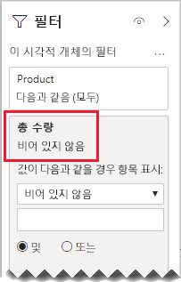

# <a name="bi-directional-relationship-guidance"></a>양방향 관계 지침

이 문서는 Power BI Desktop을 개발하는 데이터 모델러를 대상으로 합니다. 언제 양방향 모델 관계를 만들지에 대한 지침을 제공합니다. 양방향 관계는 _양방향으로_ 필터링하는 관계입니다.

[!INCLUDE [relationships-prerequisite-reading](includes/relationships-prerequisite-reading.md)]

일반적으로 양방향 관계는 최소한으로 사용하는 것이 좋습니다. 모델 쿼리 성능에 부정적인 영향을 줄 수 있으며 보고서 사용자에게 혼란스러운 환경이 될 수 있습니다.

양방향 필터링이 특정 요구 사항을 해결할 수 있는 세 가지 시나리오는 다음과 같습니다.

- [특수 모델 관계](#special-model-relationships)
- ["데이터 포함" 슬라이서 항목](#slicer-items-with-data)
- [차원 간 분석](#dimension-to-dimension-analysis)

## <a name="special-model-relationships"></a>특수 모델 관계

양방향 관계는 다음 두 가지 특수 모델 관계 유형을 만들 때 중요한 역할을 합니다.

- **일 대 일**: 모든 일 대 일 관계는 양방향이어야 하며 다르게 구성할 수 없습니다. 일반적으로 이러한 유형의 관계는 만들지 않는 것이 좋습니다. 전체 설명 및 대체 디자인은 [일 대 일 관계 지침](relationships-one-to-one.md)을 참조하세요.
- **다 대 다**: 두 차원 유형 테이블을 연결하는 경우 브리징 테이블이 필요합니다. 양방향 필터는 브리징 테이블 간에 필터가 전파되도록 하기 위해 필요합니다. 자세한 내용은 [다 대 다 관계 지침(다 대 다 차원 연결)](relationships-many-to-many.md#relate-many-to-many-dimensions)를 참조하세요.

## <a name="slicer-items-with-data"></a>"데이터 포함" 슬라이서 항목

양방향 관계는 데이터가 존재하는 위치로 항목을 제한하는 슬라이서를 제공할 수 있습니다. (Excel PivotTables 및 슬라이서에 대해 잘 알고 있는 경우 이는 Power BI 데이터 세트 또는 Analysis Services 모델에서 데이터를 소싱하는 경우의 기본 동작입니다.) 그 의미를 설명하는 데 도움이 되도록 먼저 다음 모델 다이어그램을 살펴보겠습니다.


첫 번째 테이블의 이름은 **Customer**이고 **Country-Region**, **Customer**, **CustomerCode**라는 3개의 열이 있습니다. 두 번째 테이블의 이름은 **Product**이고 **Color**, **Product**, **SKU**라는 3개의 열이 있습니다. 세 번째 테이블의 이름은 **Sales**이고 **CustomerCode**, **OrderDate**, **Quantity**, **SKU**라는 4개의 열이 있습니다. **Customer** 및 **Product** 테이블은 차원 유형 테이블이며 각 테이블에는 **Sales** 테이블과 일 대 다 관계가 있습니다. 각 관계는 단일 방향으로 필터링됩니다.

양방향 필터링이 작동하는 방식을 설명하기 위해 모델 다이어그램이 테이블 행을 표시하도록 수정되었습니다. 이 문서의 모든 예제는 이 데이터를 기반으로 합니다.

> [!NOTE]
> Power BI Desktop 모델 다이어그램에는 테이블 행을 표시할 수 없습니다. 이 문서에서는 명확한 예제로 설명을 지원하기 위해 표시한 것입니다.


세 테이블의 행 세부 정보는 다음 글머리 기호 목록에 설명되어 있습니다.

- **Customer** 테이블에는 다음 2개의 행이 있습니다.
  - **CustomerCode** CUST-01, **Customer** Customer-1, **Country-Region** United States
  - **CustomerCode** CUST-02, **Customer** Customer-2, **Country-Region** Australia
- **Product** 테이블에는 다음 3개의 행이 있습니다.
  - **SKU** CL-01, **Product** T-shirt, **Color** Green
  - **SKU** CL-02, **Product** Jeans, **Color** Blue
  - **SKU** AC-01, **Product** Hat, **Color** Blue
- **Sales** 테이블에는 다음 3개의 행이 있습니다.
  - **OrderDate** January 1 2019, **CustomerCode** CUST-01, **SKU** CL-01, **Quantity** 10
  - **OrderDate** February 2 2019, **CustomerCode** CUST-01, **SKU** CL-02, **Quantity** 20
  - **OrderDate** March 3 2019, **CustomerCode** CUST-02, **SKU** CL-01, **Quantity** 30

이제 다음 보고서 페이지를 살펴보겠습니다.


페이지는 두 개의 슬라이서와 하나의 카드 시각적 개체로 구성되어 있습니다. 첫 번째 슬라이서는 **Country-Region**용이며 다음 2개의 항목이 있습니다. Australia 및 United States. 현재 오스트레일리아를 기준으로 조각화되어 있습니다. 두 번째 슬라이서는 **Product**용이며 다음 3개의 항목이 있습니다. Hat, Jeans 및 T-shirt. 항목은 선택되지 않았습니다(필터링된 _제품이 없음_을 의미). 카드 시각적 개체는 수량 30을 표시합니다.

보고서 사용자가 오스트레일리아를 기준으로 조각화되는 경우 **Product** 슬라이서를 데이터가 오스트레일리아 판매량에 _연결_되는 항목을 표시하도록 제한해야 할 수 있습니다. 이는 "데이터 포함" 슬라이서 항목을 표시할 때와 같은 의미입니다. **Product** 테이블과 **Sales** 테이블 간의 관계를 구성하여 양방향으로 필터링하는 방법으로 이 동작을 수행할 수 있습니다.


이제 **Product** 슬라이서에 단일 항목 T-shirt가 나열됩니다. 이 항목은 오스트레일리아 고객에게 판매되는 유일한 제품을 나타냅니다.


먼저 보고서 사용자에 대해 이 디자인이 작동하는지 신중하게 고려하는 것이 좋습니다. 일부 보고서 사용자에게는 이 환경이 혼란스러울 수 있습니다. 이들은 슬라이서와 상호 작용할 때 다른 슬라이서 항목이 동적으로 표시되거나 사라지는 이유를 이해하지 못합니다.

"데이터 포함" 슬라이서 항목을 표시하기로 결정한 경우 양방향 관계를 구성하지 않는 것이 좋습니다. 양방향 관계에서는 더 많은 처리가 필요하므로, 특히 모델의 양방향 관계 수가 증가할수록, 쿼리 성능에 부정적인 영향을 줄 수 있습니다.

동일한 결과를 얻는 더 좋은 방법은 다음과 같습니다. 양방향 필터를 사용하는 대신 **Product** 슬라이서 자체에 시각적 개체 수준 필터를 적용할 수 있습니다.

이제 **Product** 테이블과 **Sales** 테이블 간의 관계가 더 이상 양방향에서 필터링되지 않는 경우를 살펴보겠습니다. 다음 측정값 정의가 **Sales** 테이블에 추가되었습니다.

```dax
Total Quantity = SUM(Sales[Quantity])
```

"데이터 포함" **Product** 슬라이서 항목을 표시하려면 "비어 있지 않음" 조건을 사용하여 **Total Quantity** 측정값을 기준으로 필터링하면 됩니다.



## <a name="dimension-to-dimension-analysis"></a>차원 간 분석

양방향 관계와 관련된 다른 시나리오에서는 브리징 테이블과 같은 팩트 유형 테이블을 처리합니다. 이러한 방식으로 다른 차원 유형 테이블의 필터 컨텍스트에서 차원 유형 테이블 데이터의 분석을 지원합니다.

이 문서의 예제 모델을 사용하여 다음 질문에 대답할 수 있는 방법을 살펴보겠습니다.

- 오스트레일리아 고객에게 판매된 색은 몇 가지입니까?
- 청바지를 구매한 국가는 몇 개입니까?

두 질문은 모두 브리징 팩트 유형 테이블에서 데이터를 요약하지 _않고_ 대답할 수 있습니다. 그러나 필터는 하나의 차원 유형 테이블에서 다른 테이블로 전파되어야 합니다. 필터가 팩트 유형 테이블을 통해 전파되면 [DISTINCTCOUNT](/dax/distinctcount-function-dax) DAX 함수(또한 [MIN](/dax/min-function-dax) 및 [MAX](/dax/max-function-dax) DAX 함수)를 사용하여 차원 유형 테이블 열의 요약을 얻을 수 있습니다.

팩트 유형 테이블이 브리징 테이블처럼 동작하기 때문에 다 대 다 관계 지침에 따라 두 개의 차원 유형 테이블을 연결할 수 있습니다. 양방향으로 필터링하려면 하나 이상의 관계를 구성해야 합니다. 자세한 내용은 [다 대 다 관계 지침(다 대 다 차원 연결)](relationships-many-to-many.md#relate-many-to-many-dimensions)를 참조하세요.

그러나 이 문서에 설명된 대로 이 디자인은 성능에 부정적인 영향을 미칠 수 있으며, 사용자가 ["데이터 포함" 슬라이서 항목](#slicer-items-with-data)과 관련된 결과를 경험할 수 있습니다. 따라서 [CROSSFILTER](/dax/crossfilter-function) DAX 함수를 대신 사용하여 _측정값 정의에서_ 양방향 필터링을 활성화하는 것이 좋습니다. CROSSFILTER 함수는 식을 계산하는 동안 필터 방향을 수정하거나 심지어 관계를 사용하지 않도록 설정하는 데 사용할 수 있습니다.

**Sales** 테이블에 추가된 다음 측정값 정의를 살펴보세요. 이 예제에서는 **Customer** 테이블과 **Sales** 테이블 간의 모델 관계가 _단일 방향_으로 필터링하도록 구성되었습니다.

```dax
Different Countries Sold =
CALCULATE(
    DISTINCTCOUNT(Customer[Country-Region]),
    CROSSFILTER(
        Customer[CustomerCode],
        Sales[CustomerCode],
        BOTH
    )
)
```

**Different Countries Sold** 측정값 식을 계산하는 동안 **Customer** 테이블과 **Sales** 테이블 간의 관계가 양방향으로 필터링됩니다.

다음 표에서는 판매된 각 제품에 대한 통계를 시각적으로 표시합니다. **Quantity** 열은 단순히 수량 값의 합계입니다. **Different Countries Sold** 열은 제품을 구매한 모든 고객의 국가-지역 값 수를 나타냅니다.


## <a name="next-steps"></a>다음 단계

이 문서와 관련된 보다 자세한 내용을 알아보려면 다음 리소스를 참조하세요.

- [Power BI Desktop의 모델 관계](../transform-model/desktop-relationships-understand.md)
- [별모양 스키마 및 Power BI에서의 중요성 이해](star-schema.md)
- [일 대 일 관계 지침](relationships-one-to-one.md)
- [다 대 다 관계 지침](relationships-many-to-many.md)
- [관계 문제 해결 지침](relationships-troubleshoot.md)
- 궁금한 점이 더 있나요? [Power BI 커뮤니티에 질문합니다.](https://community.powerbi.com/)
- 제안? [Power BI 개선을 위한 아이디어 제공](https://ideas.powerbi.com/)

