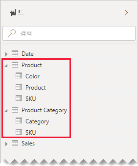
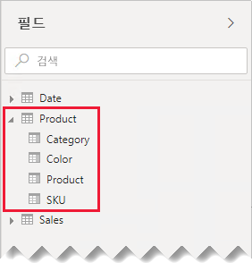
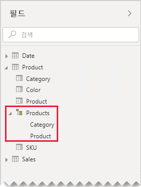
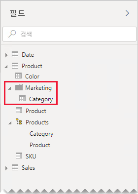

# 일 대 일 관계 지침

이 문서는 Power BI Desktop을 개발하는 데이터 모델러를 대상으로 합니다. 일 대 일 모델 관계 작업에 대한 지침을 제공합니다. 일 대 일 관계는 양쪽 테이블이 각각 공통 및 고유 값의 열을 포함하는 경우에 만들 수 있습니다.

[!INCLUDE [relationships-prerequisite-reading](includes/relationships-prerequisite-reading.md)]

일 대 일 관계를 포함하는 두 가지 시나리오가 있습니다.

- [중복 제거 차원](#degenerate-dimensions): 팩트 유형 테이블에서 [중복 제거 차원](star-schema.md#degenerate-dimensions)을 파생시킬 수 있습니다.
- [행 데이터가 여러 테이블에 걸쳐 있음](#row-data-spans-across-tables): 단일 비즈니스 엔터티 또는 주제가 두 개 이상의 모델 테이블로 로드됩니다. 해당 데이터는 다른 데이터 저장소에서 원본으로 제공될 수 있기 때문입니다. 이 시나리오는 차원 유형 테이블에 공통적일 수 있습니다. 예를 들어 마스터 제품 세부 정보는 운영 판매 시스템에 저장되고 보조 제품 세부 정보는 다른 원본에 저장됩니다.

    그러나 두 팩트 유형의 테이블을 일 대 일 관계로 연결하는 것은 드문 경우입니다. 팩트 유형 테이블의 차원 및 세분성이 같아야 하기 때문입니다. 또한 각 팩트 유형 테이블에는 모델 관계가 생성될 수 있도록 고유한 열이 필요합니다.

## 중복 제거 차원

팩트 유형 테이블의 열이 필터링 또는 그룹화에 사용되는 경우 별도의 테이블에서 해당 열을 사용할 수 있게 하는 것을 고려할 수 있습니다. 이러한 방식으로 필터 또는 그룹화에 사용되는 열을 팩트 행을 요약하는 데 사용되는 열과 분리할 수 있습니다. 이러한 분리는 다음과 같은 효과가 있습니다.

- 스토리지 공간 축소
- 모델 계산 단순화
- 쿼리 성능 향상에 기여
- 보고서 작성자에게 보다 직관적인 **필드** 창 환경 제공

판매 주문 정보를 두 열에 저장하는 원본 판매 테이블을 살펴보세요.

**OrderNumber** 열에는 주문 번호가 저장되고 **OrderLineNumber** 열에는 주문 내 줄의 시퀀스가 저장됩니다.

다음 모델 다이어그램에서 주문 번호 및 주문 라인 번호 열이 **Sales** 테이블에 로드되지 않은 것을 확인할 수 있습니다. 대신 해당 값을 사용하여 **SalesOrderLineID**라는 [서로게이트 키](star-schema.md#surrogate-keys) 열을 만듭니다. (키 값은 주문 번호에 1,000을 곱한 다음 주문 라인 번호를 추가하여 계산됩니다.)

**Sales Order** 테이블은 보고서 작성자에게 다음 3개의 열이 있는 풍부한 환경을 제공합니다. **Sales Order**, **Sales Order Line** 및 **Line Number**. 계층 구조도 포함됩니다. 이러한 테이블 리소스는 주문 및 주문 라인을 통해 필터링, 그룹화 또는 드릴다운해야 하는 보고서 디자인을 지원합니다.

**Sales Order** 테이블이 판매 데이터에서 파생되므로 각 테이블에는 정확히 동일한 수의 행이 있어야 합니다. 또한 각 **SalesOrderLineID** 열 사이에 일치하는 값이 있어야 합니다.

## 행 데이터가 여러 테이블에 걸쳐 있음

다음 2개의 일 대 일 관계 차원 유형 테이블을 포함하는 예를 살펴보세요. **Product** 및 **Product Category**. 각 테이블은 가져온 데이터를 나타내며 고유한 값을 포함하는 **SKU**(Stock-Keeping Unit) 열을 포함합니다.

다음은 두 테이블의 부분 모델 다이어그램입니다.

첫 번째 테이블의 이름은 **Product**이고 **Color**, **Product**, **SKU**라는 3개의 열이 있습니다. 두 번째 테이블의 이름은 **Product Category**이고 **Category**와 **SKU**라는 2개의 열이 있습니다. 일 대 일 관계가 두 **SKU** 열을 연결합니다. 이 관계는 일 대 일 관계가 항상 그렇듯이 양방향으로 필터링됩니다.

관계 필터 전달의 작동 방식을 설명하는 데 도움이 되도록 모델 다이어그램이 테이블 행을 표시하도록 수정되었습니다. 이 문서의 모든 예제는 이 데이터를 기반으로 합니다.

> [!NOTE]
> Power BI Desktop 모델 다이어그램에는 테이블 행을 표시할 수 없습니다. 이 문서에서는 명확한 예제로 설명을 지원하기 위해 표시한 것입니다.

두 테이블의 행 세부 정보는 다음 글머리 기호 목록에 설명되어 있습니다.

- **Product** 테이블에는 다음 3개의 행이 있습니다.
  - **SKU** CL-01, **Product** T-shirt, **Color** Green
  - **SKU** CL-02, **Product** Jeans, **Color** Blue
  - **SKU** AC-01, **Product** Hat, **Color** Blue
- **Product Category** 테이블에는 다음 2개의 행이 있습니다.
  - **SKU** CL-01, **Category** Clothing
  - **SKU** AC-01, **Category** Accessories

**Product Category** 테이블에는 제품 SKU CL-02에 대한 행이 포함되어 있지 않습니다. 이 문서의 뒷부분에서 이 누락된 행의 결과를 설명합니다.

**필드** 창에서 보고서 작성자는 다음 두 테이블에서 제품 관련 필드를 찾습니다. **Product** 및 **Product Category**.

두 테이블의 필드가 테이블 시각적 개체에 추가될 때 어떤 일이 발생하는지 알아보겠습니다. 이 예제에서 **SKU** 열의 원본은 **Product** 테이블입니다.

제품 SKU CL-02의 **Category** 값이 BLANK라는 점인 이유는 이 제품의 **Product Category** 테이블에 행이 없기 때문입니다.

### 권장 사항

행 데이터가 여러 모델 테이블에 걸쳐 있을 경우 가능하면 일 대 일 모델 관계를 만들지 않는 것이 좋습니다. 그 이유는 다음과 같습니다. 이 디자인에서는

- 필요한 것보다 많은 테이블을 나열하여 **필드** 창이 혼잡해질 수 있습니다.
- 관련 필드가 여러 테이블로 분산되기 때문에 보고서 작성자가 이들을 찾기 어려울 수 있습니다.
- 계층 구조를 만드는 기능이 제한됩니다. 해당 수준이 _동일한 테이블_의 열을 기반으로 해야 하기 때문입니다.
- 테이블 사이에 전체 행과 일치하는 항목이 없는 경우 예기치 않은 결과가 생성됩니다.

구체적인 권장 사항은 일 대 일 관계가 _내부 아일랜드_ 또는 _교차 아일랜드_인지에 따라 달라집니다. 관계 평가에 대한 자세한 내용은 [Power BI Desktop의 모델 관계(관계 평가)](../desktop-relationships-understand.md#relationship-evaluation)를 참조하세요.

### 내부 아일랜드 일 대 일 관계

테이블 사이에 일 대 일 _내부 아일랜드_ 관계가 있는 경우 데이터를 단일 모델 테이블로 통합하는 것이 좋습니다. 이 동작은 파워 쿼리 쿼리를 병합하여 수행합니다.

다음 단계는 일 대 일 관계 데이터를 통합하고 모델링하는 방법을 제공합니다.

1. **쿼리 병합**: [두 쿼리를 결합](../desktop-shape-and-combine-data.md#combine-queries)할 경우 각 쿼리에서 데이터의 완전성을 고려해야 합니다. 하나의 쿼리에 전체 행 집합(예: 마스터 목록)이 포함된 경우 다른 쿼리와 병합합니다. 기본 조인 유형인 _왼쪽 우선 외부 조인_을 사용하도록 병합 변환을 구성합니다. 이 조인 유형을 사용하면 첫 번째 쿼리의 모든 행을 유지하고 두 번째 쿼리의 일치하는 행으로 보충합니다. 두 번째 쿼리의 모든 필수 열을 첫 번째 쿼리로 확장합니다.
2. **쿼리 로드 비활성화**: 두 번째 쿼리의 [로드를 비활성화](import-modeling-data-reduction.md#disable-power-query-query-load)해야 합니다. 그러면 결과를 모델 테이블로 로드하지 않습니다. 이 구성은 데이터 모델 저장소 크기를 줄이고 **필드** 창을 깔끔하게 정리하는 데 도움이 됩니다.

    이 예제에서 보고서 작성자는 이제 **필드** 창에 **Product**라는 단일 테이블을 찾을 수 있습니다. 이 테이블이 모든 제품 관련 필드를 포함합니다.

    
3. **누락 값 바꾸기**: 두 번째 쿼리에 일치하지 않는 행이 있는 경우 해당 행에서 파생된 열에 NULL이 표시됩니다. 해당하는 경우 NULL을 토큰 값으로 대체하는 것이 좋습니다. 보고서 작성자가 열 값을 기준으로 필터링하거나 그룹화하는 경우 보고서 시각적 개체에 BLANK가 표시될 수 있기 때문에 누락 값을 바꾸는 것이 특히 중요합니다.

    다음 테이블 시각적 개체에서 제품 SKU CL-02의 범주가 이제 _[Undefined]_ 로 표시됩니다. 쿼리에서 null 범주가 이 토큰 텍스트 값으로 바꼈습니다.

    

4. **계층 구조 만들기**: 현재 통합된 테이블의 _열 간_에 관계가 존재하는 경우 계층 구조를 만드는 것이 좋습니다. 그러면 보고서 작성자가 시각적 개체 드릴링 기회를 빠르게 식별할 수 있습니다.

    이 예제에서 보고서 작성자는 이제 다음 두 가지 수준이 있는 계층 구조를 사용할 수 있습니다. **Category** 및 **Product**.

    

개별 테이블이 필드를 구성하는 데 도움이 되는 경우에도 단일 테이블로 통합하는 것이 좋습니다. 필드를 계속 구성할 수는 있지만, 대신 _표시 폴더_를 사용합니다.

이 예제에서는 보고서 작성자가 **Marketing** 표시 폴더에서 **Category** 필드를 찾을 수 있습니다.

모델에서 일 대 일 내부 아일랜드 관계를 정의하기로 결정하는 경우, 가능하면 연결된 테이블에 일치하는 행이 있어야 합니다. 일 대 일 내부 아일랜드 관계는 [강력한 관계](../desktop-relationships-understand.md#strong-relationships)로 평가되므로 데이터 무결성 문제는 보고서 시각적 개체에 BLANK로 표시될 수 있습니다. (이 문서에 나오는 첫 번째 테이블 시각적 개체에서 BLANK 그룹화의 예를 볼 수 있습니다.)

### 교차 아일랜드 일 대 일 관계

테이블 사이에 일 대 일 _교차 아일랜드_ 관계가 있는 경우 데이터 원본에서 데이터를 미리 통합하지 않는 한 대체 모델 디자인이 없습니다. Power BI는 일 대 일 모델 관계를 [약한 관계](../desktop-relationships-understand.md#weak-relationships)로 평가합니다. 따라서 연결된 테이블에 일치하는 행이 있어야 합니다. 쿼리 결과에서 일치하지 않는 행이 제거되기 때문입니다.

두 테이블의 필드가 테이블 시각적 개체에 추가되고 테이블 간에 약한 관계가 있는 경우 어떻게 되는지 살펴보겠습니다.

테이블에 2개의 행만 표시됩니다. **Product Category** 테이블에 일치하는 행이 없으므로 제품 SKU CL-02가 누락되었습니다.

## 다음 단계

이 문서와 관련된 보다 자세한 내용을 알아보려면 다음 리소스를 참조하세요.

- [Power BI Desktop의 모델 관계](../desktop-relationships-understand.md)
- [별모양 스키마 및 Power BI에서의 중요성 이해](star-schema.md)
- [관계 문제 해결 지침](relationships-troubleshoot.md)
- 궁금한 점이 더 있나요? [Power BI 커뮤니티에 질문합니다.](https://community.powerbi.com/)
- 제안? [Power BI 개선을 위한 아이디어 제공](https://ideas.powerbi.com/)
