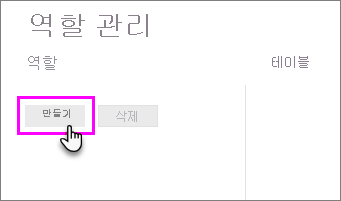
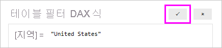

## <a name="define-roles-and-rules-in-power-bi-desktop"></a>Power BI Desktop의 역할 및 규칙 정의
Power BI Desktop 내에서 역할 및 규칙을 정의할 수 있습니다. Power BI에 게시할 때 역할 정의도 게시됩니다.

보안 역할을 정의하려면 다음 단계를 수행합니다.

1. Power BI Desktop 보고서에 데이터를 가져오거나 DirectQuery 연결을 구성합니다.
   
   > [!NOTE]
   > Analysis Services 라이브 연결을 위해 Power BI Desktop 내에서 역할을 정의할 수 없습니다. Analysis Services 모델 내에서 이를 수행해야 합니다.
   > 
   > 
2. **모델링** 탭에서 **역할 관리**를 선택합니다.
   
   
3. **역할 관리** 창에서 **만들기**를 선택합니다.
   
   
4. **역할**에서 역할 이름을 입력합니다. 
5. **테이블**에서 DAX 규칙을 적용할 테이블을 선택합니다.
6. **테이블 필터 DAX 식** 상자에 DAX 식을 입력합니다. 이 식은 true 또는 false 값을 반환합니다. 예: ```[Entity ID] = “Value”```.
      
   

   > [!NOTE]
   > 이 식에 *username()* 을 사용할 수 있습니다. *username()* 은 Power BI Desktop 내에서 *도메인\사용자 이름*의 형식을 취합니다. Power BI 서비스 및 Power BI Report Server 내에서 사용자의 UPN(사용자 계정 이름) 형식입니다. 또는 항상 사용자 계정 이름 형식(*username\@contoso.com*)으로 사용자를 반환하는 *userprincipalname()* 을 사용할 수 있습니다.
   > 
   > 

7. DAX 식을 만든 후 식의 유효성을 검사하기 위해 식 상자 위에 확인 표시를 선택합니다.
      
   
   
   > [!NOTE]
   > 이 식 상자에서는 보통 세미콜론 구분자를 사용하는 로캘(예: 프랑스, 독일)에서도 쉼표를 사용하여 DAX 함수 인수를 구분합니다. 
   >
   >
   
8. **저장**을 선택합니다.

Power BI Desktop 내에서는 사용자를 역할에 할당할 수 없습니다. Power BI 서비스에서 할당합니다. *username()* 또는 *userprincipalname()* DAX 함수를 사용하고 적절한 관계를 구성하여 Power BI Desktop 내에서 동적 보안을 사용할 수 있습니다. 

