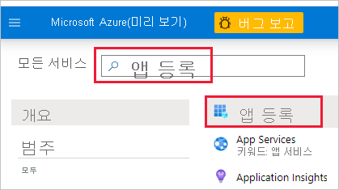
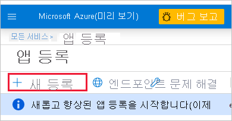

1. [Microsoft Azure](https://ms.portal.azure.com/#allservices)에 로그인합니다.

2. **앱 등록** 을 검색하고 **앱 등록** 링크를 클릭합니다.

    

3. **새 등록** 을 클릭합니다.

    

4. 필수 정보를 입력합니다.
    * **이름** - 애플리케이션의 이름을 입력합니다.
    * **지원되는 계정 유형** - 지원되는 계정 유형을 선택합니다.
    * (선택 사항) **리디렉션 URI** - 필요한 경우 URI를 입력합니다.

5. **등록** 을 클릭합니다.

6. 등록한 후에는 **개요** 탭에서 *애플리케이션 ID* 를 확인할 수 있습니다. 나중에 사용할 수 있도록 *애플리케이션 ID* 를 복사하여 저장합니다.

    