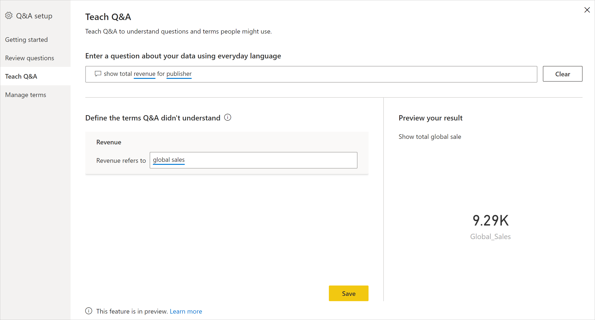

# Power BI Q&A 교육을 위한 질문 및 답변 도구 소개(미리 보기)

Power BI 질문 및 답변 ‘도구’를 사용하면 사용자의 자연어 환경을 개선할 수 있습니다.  디자이너나 관리자는 자연어 엔진을 조작하고 다음 세 가지 영역에서 기능을 개선할 수 있습니다. 

- 사용자의 질문 검토
- 질문을 이해하도록 Q&A 교육
- Q&A 교육에 사용된 용어 관리

이러한 전용 도구 기능 외에도 Power BI Desktop의 **모델링** 탭에는 더 많은 옵션이 제공됩니다.  

- 동의어
- 행 레이블
- 질문 및 답변에서 숨기기
- 언어 스키마 구성(고급)

## 질문 및 답변 도구 시작

질문 및 답변 도구는 Power BI Desktop에서만 사용할 수 있으며, 현재 가져오기 모드만 지원합니다.

1. Power BI Desktop을 열고 질문 및 답변을 사용하여 시각적 개체를 만듭니다. 
2. 시각적 개체의 모서리에서 기어 아이콘을 선택합니다. 

    

    시작 페이지가 열립니다.  

    

### 필드 동의어

모델에 속하는 모든 테이블 및 열을 보려면 **필드 동의어**를 선택합니다. 이 보기를 사용하면 사용자에게 도움이 되는 열과 일치하는 대체 이름을 추가할 수 있습니다. 질문 및 답변에서 열 또는 테이블을 숨길지 여부를 선택할 수도 있습니다.

확장하기 위해 테이블 중 하나를 클릭하면 아래와 비슷한 대화 상자가 표시됩니다.

이 대화 상자에는 데이터 세트에 대해 질문할 때 사용자가 사용할 수 있는 모든 열과 테이블 및 해당 용어/동의어가 표시됩니다. 모든 용어를 한 곳에서 빠르게 볼 수 있으며 여러 열에 대해 용어를 추가 또는 제거할 수 있습니다. 

- 용어 추가 - 매출이라는 필드가 있는 경우 수익이라는 용어를 추가 하여, 사용자가 매출이라는 단어 대신 이 단어를 사용하도록 결정할 수 있습니다. 새 용어를 빠르게 추가하려면 더하기 기호를 클릭합니다.

- 질문 및 답변에 포함 - 이 옵션을 선택하면 질문 및 답변에서 열 또는 테이블을 생략할 수 있습니다. 그러면 열이나 테이블이 표시되지 않고 그 결과도 표시되지 않습니다. 날짜를 다루는 경우 열을 포함하지 않기로 결정할 수 있습니다. 날짜 필드 또는 외래 키가 여러 개 있는 경우 날짜 필드 중 하나를 제외한 모든 날짜 필드를 제거하도록 결정할 수 있습니다. 그러면 사용자가 날짜 관련 질문을 할 때 올바른 날짜 열이 선택됩니다.

- 권장 용어 - 질문 및 답변은 또한 용어/동의어를 빠르게 추가할 수 있도록 추천 엔진에서 검색된 추천 용어를 권장합니다. 추천이 추가되지 않는 경우에도 여전히 작동하지만, 사용자에게 주황색 점선이 표시됩니다. 이는 질문 및 답변에서 답변을 가지고 있지만 확실하지 않음을 나타냅니다. 추천 동의어가 올바른 경우에는 + 아이콘을 클릭하여 동의어로 사용할 수 있습니다. 추천이 올바르지 않으면 용어를 제거하는 x를 클릭하여, 용어/동의어로 사용되지 않고 질문 및 답변 내에서 작동하지 않도록 합니다. 추천은 Office 사전에서 지원되며 보고서 내에서 발견된 이름 바꾸기에서도 제공됩니다.

### 질문 검토

**질문 검토**를 선택하여 Power BI 서비스에서 테넌트에 사용 중인 데이터 세트 목록을 확인합니다. **질문 검토** 페이지에는 데이터 세트 소유자, 작업 영역 및 마지막으로 새로 고친 날짜도 표시됩니다. 여기서 데이터 세트를 선택하고 사용자의 질문을 확인할 수 있습니다. 데이터는 인식되지 않은 단어도 표시합니다. 여기에 표시된 모든 데이터는 지난 28일간의 데이터입니다.

### 질문 및 답변 학습

**Q&A 교육** 섹션에서는 단어를 인식하도록 질문 및 답변을 교육할 수 있습니다. 먼저 질문 및 답변에서 인식할 수 없는 단어가 포함된 질문을 입력합니다. 질문 및 답변에서 해당 용어의 정의를 묻는 메시지가 표시됩니다. 단어가 나타내는 항목에 해당하는 필터 또는 필드 이름을 입력합니다. 그러면 질문 및 답변에서 원래 질문을 다시 해석합니다. 결과가 만족스러우면 입력을 저장할 수 있습니다. 자세한 내용은 [Q&A 교육](q-and-a-tooling-teach-q-and-a.md)을 참조하세요.

### 용어 관리

Q&A 교육 섹션에서 저장한 모든 항목이 여기에 표시되므로 정의한 용어를 검토하거나 삭제할 수 있습니다. 현재 기존 정의를 편집할 수 없으므로 용어를 다시 정의하려면 해당 용어를 삭제하고 다시 만들어야 합니다.

### 질문 제안

> [!NOTE]
> 질문 및 답변 시각적 개체의 모든 인스턴스에 대해 제안된 질문이 표시됩니다. 각 질문 및 답변 시각적 개체에 대해 별도의 제안 집합을 만들 수는 없습니다.
> 
> 

설치를 수행하지 않고 질문 및 답변 시각적 개체는 시작하기 위한 몇 가지 질문을 제안합니다. 이러한 질문은 데이터 모델을 기반으로 자동 생성됩니다. **질문 제안**에서 자동 생성된 질문을 사용자의 질문으로 덮어쓸 수 있습니다.

시작하려면 텍스트 상자에 추가할 질문을 입력합니다. 미리 보기 섹션에서 질문 및 답변 시각적 개체에 표시되는 결과를 볼 수 있습니다. 

:::image type="content" source="media/q-and-a-tooling-intro/power-bi-qna-suggest-questions.png" alt-text="질문 및 답변 제안":::
 
**추가** 단추를 선택하여 이 질문을 **제안된 질문**에 추가합니다. 추가 질문은 모두 이 목록의 끝에 추가됩니다. 질문은 이 목록에서와 같은 순서로 질문 및 답변 시각적 개체에 표시됩니다. 

:::image type="content" source="media/q-and-a-tooling-intro/power-bi-qna-save-suggest-questions.png" alt-text="제안된 질문 저장":::
 
**저장**을 선택하여 질문 및 답변 시각적 개체에 제안된 질문의 목록을 표시합니다. 

## 기타 질문 및 답변 설정

### 행 레이블 설정

행 레이블을 사용하면 테이블에서 단일 행을 가장 잘 나타내는 열(또는 ‘필드’)을 정의할 수 있습니다.** 예를 들어 ‘Customer’라는 테이블의 경우 행 레이블은 일반적으로 ‘표시 이름’입니다. 이 추가 메타데이터를 제공하면 사용자가 ‘고객별 매출 표시’를 입력할 때 질문 및 답변에서 보다 유용한 시각적 개체를 그릴 수 있습니다. ‘Customer’를 테이블로 처리하는 대신, ‘표시 이름’을 사용하고 각 고객의 매출을 표시하는 가로 막대형 차트를 표시할 수 있습니다. 행 레이블 모델링 보기만 설정할 수 있습니다. 

1. Power BI Desktop에서 모델링 보기를 선택합니다.

2. 테이블을 선택하여 **속성** 창을 표시합니다.

3. **행 레이블** 상자에서 필드를 선택합니다.

## 언어 스키마 구성(고급)

Power BI의 질문 및 답변 내에서 기본 자연어 결과의 점수 및 가중치 변경을 포함하여 자연어 엔진을 완전히 교육하고 개선할 수 있습니다. 방법을 알아보려면 [질문 및 답변 언어 스키마 편집 및 관용구 추가](q-and-a-tooling-advanced.md)를 참조하세요.

## 다음 단계

자연어 엔진을 개선하기 위한 여러 가지 모범 사례가 있습니다. 자세한 내용은 [질문 및 답변 모범 사례](q-and-a-best-practices.md)를 참조하세요.
