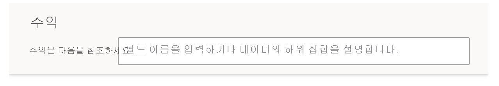

# Power BI 질문 및 답변에서 질문과 용어를 이해하도록 질문 및 답변 학습

질문 및 답변 설정의 **Q&A 교육** 섹션에서 인식하지 못한 자연어 질문과 용어를 이해하도록 질문 및 답변을 교육합니다. 먼저 질문 및 답변에서 인식하지 못한 단어가 포함된 질문을 제출합니다. 그러면 질문 및 답변에서 해당 용어를 정의하라는 메시지가 표시됩니다. 단어가 나타내는 항목에 해당하는 필터 또는 필드 이름을 입력합니다. 그러면 질문 및 답변에서 원래 질문을 다시 해석합니다. 결과가 만족스러우면 저장합니다.

> [!NOTE]
> Q&A 교육 기능은 가져오기 모드만 지원합니다. 또한 아직 온-프레미스 또는 Azure Analysis Services 데이터 원본에 연결하는 기능은 지원되지 않습니다. 이 제한 사항은 Power BI의 후속 릴리스에서 제거될 예정입니다.

## Q&A 교육 시작

1. Power BI Desktop의 **모델링** 리본에서 **질문 및 답변 설정** > **Q&A 교육**을 선택합니다.

    

2. 질문 및 답변에서 인식할 수 없는 용어가 포함된 문장을 입력하고 **저장**을 선택합니다.

3. 빨간색 밑줄이 표시된 단어를 선택합니다. 

    질문 및 답변에서 추천 단어가 제공되고, 올바른 용어 정의를 입력하라는 메시지가 표시됩니다. 
    
3. **질문 및 답변에서 이해할 수 없는 용어 정의** 아래에 용어 정의를 입력합니다.

    

4. **저장**을 선택하여 업데이트된 시각적 개체를 미리 봅니다.

5. 다음 질문을 입력하거나 **X**를 선택하여 닫습니다.

보고서를 서비스에 다시 게시해야 변경 내용이 보고서 사용자에게 표시됩니다.

## 명사 및 형용사 정의

질문 및 답변에 다음 두 가지 유형의 용어를 학습시킬 수 있습니다.

- 명사
- 형용사

### 명사 동의어 정의

데이터 작업을 할 때 필드 이름을 대체 이름으로 가리킬 수 있는 경우가 많습니다. ‘Sales’를 예로 들 수 있습니다. ‘revenue’ 등의 많은 단어나 문구가 매출을 가리킬 수 있습니다. 열 이름이 ‘Sales’이고 보고서 사용자가 ‘revenue’를 입력하면, 질문 및 답변에서 질문에 적절하게 답변하기 위한 올바른 열을 선택하지 못할 수 있습니다. 이 경우 ‘Sales’와 ‘revenue’가 동일한 항목을 가리킨다고 질문 및 답변에 알리려고 합니다.

질문 및 답변은 인식할 수 없는 단어가 Microsoft Office의 정보를 사용하는 명사인 경우 자동으로 검색합니다. 질문 및 답변에서 명사를 검색하면 다음과 같은 방식으로 메시지가 표시됩니다.

- <your term> **의미** 

데이터의 용어를 상자에 채웁니다.

데이터 모델에서 필드가 아닌 다른 항목을 제공하는 경우 원치 않는 결과가 나타날 수 있습니다.

### 형용사 필터 조건 정의

기본 데이터의 조건 역할을 하는 용어를 정의해야 하는 경우도 있습니다. ‘Awesome Publishers’를 예로 들 수 있습니다. ‘Awesome’은 X개 제품을 게시한 게시자만 선택하는 조건일 수 있습니다. 질문 및 답변은 형용사를 검색하여 다른 프롬프트를 표시하려고 합니다.

- <field name> **=**  

상자에 조건을 채웁니다.

정의할 수 있는 몇 가지 예제 조건은 다음과 같습니다.

- 국가가 미국임
- 국가가 미국이 아님
- 제품 > 100
- 제품이 100개보다 많음
- 제품 = 100
- 제품이 100개임
- 제품 < 100
- 제품이 100개보다 적음

이 예에서 '제품'은 열 이름 이거나 측정값일 수 있습니다. 

질문 및 답변 식 자체에서 집계를 지정할 수도 있습니다. 예를 들어, ‘인기 제품’이 최소 100개 단위를 판매한 제품인 경우 ‘판매 단위 합계 > 100개’를 사용하여 제품을 인기 제품으로 정의할 수 있습니다.  

:::image type="content" source="media/q-and-a-tooling-teach-q-and-a/power-bi-qna-popular-products.png" alt-text="'인기 제품' 정의":::

도구에서는 단일 조건만 정의할 수 있습니다. 더 복잡한 조건을 정의하려면 DAX를 사용하여 계산 열 또는 측정값을 만든 다음, 도구 섹션을 사용하여 해당 열 또는 측정값의 단일 조건을 만듭니다.

## 용어 관리

정의를 입력한 후에 돌아가서 수정 사항을 모두 확인하고 편집하거나 삭제할 수 있습니다. 

1. **질문 및 답변 설정**에서 **용어 관리** 섹션으로 이동합니다.

2. 더 이상 필요하지 않은 용어를 삭제합니다. 현재, 용어를 편집할 수는 없습니다. 용어를 다시 정의하려면 용어를 삭제하고 새로 정의합니다.

    

## 다음 단계

자연어 엔진을 개선하기 위한 여러 가지 모범 사례가 있습니다. 자세한 내용은 [질문 및 답변 모범 사례](q-and-a-best-practices.md)를 참조하세요.
