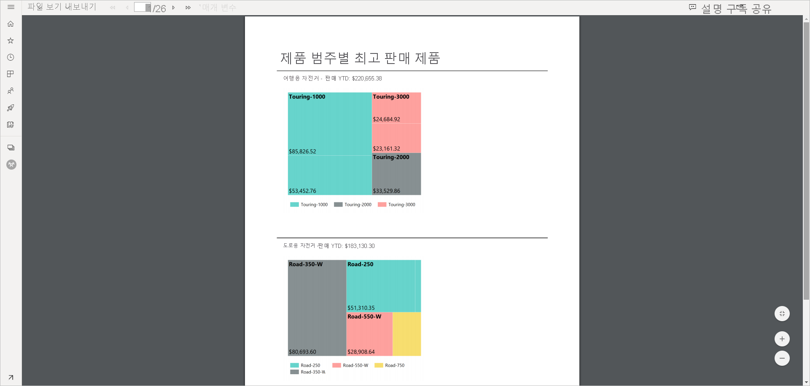
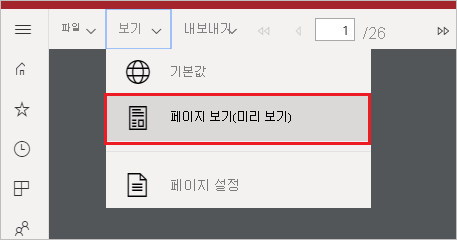
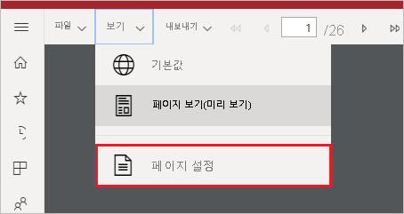
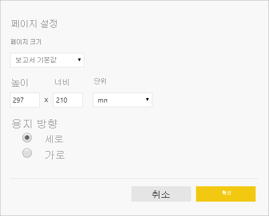

# Power BI 서비스에서 페이지를 매긴 보고서의 보고서 뷰 설정

[!INCLUDE [applies-to](../includes/applies-to.md)] [!INCLUDE [yes-service](../includes/yes-service.md)] [!INCLUDE [yes-paginated](../includes/yes-paginated.md)] [!INCLUDE [yes-premium](../includes/yes-premium.md)] [!INCLUDE [no-desktop](../includes/no-desktop.md)] 

Power BI 서비스에서 페이지를 매긴 보고서를 렌더링할 때 기본 보기는 HTML 기반의 대화형 보기입니다. PDF 등의 고정 페이지 형식을 위한 다른 보고서 뷰는 새로운 페이지 보기 옵션입니다.

**기본 대화형 보기**

**페이지 보기**

페이지 보기에서 렌더링된 보고서는 기본 보기와 다르게 보입니다. 페이지를 매긴 보고서의 일부 속성 및 개념은 고정 페이지에만 적용됩니다. 이 보기는 보고서를 인쇄하거나 내보낼 때의 보기와 비슷합니다. 매개 변수 값과 같은 일부 요소를 여전히 변경할 수 있지만 열 정렬 및 토글 같은 다른 대화형 기능은 없습니다.

페이지 보기는 브라우저의 PDF 뷰어에서 지원하는 확대, 축소 및 페이지에 맞추기와 같은 기능을 모두 지원합니다.

## 페이지 보기로 전환

페이지를 매긴 보고서를 열면 기본적으로 대화형 보기에서 렌더링됩니다. 보고서에 매개 변수가 있는 경우에는 매개 변수를 선택한 다음 보고서를 봅니다.

1. 도구 모음에서 **보기** > **페이지 보기** 를 선택합니다.

    

2. 도구 모음의 **보기** 메뉴에서 **페이지 설정** 을 선택하여 페이지 보기의 설정을 변경할 수 있습니다. 

    
    
    **페이지 설정** 대화 상자에는 페이지 보기의 **페이지 크기** 및 **방향** 을 설정하는 옵션이 있습니다. 페이지 설정을 적용한 후에는 나중에 페이지를 인쇄할 때 같은 옵션이 적용됩니다.
   
    

3. 대화형 보기로 다시 전환하려면 **보기** 드롭다운 상자에서 **기본값** 을 선택합니다.

## 브라우저 지원

페이지 보기는 Google Chrome 및 Microsoft Edge 브라우저에서 지원됩니다. 브라우저에서 PDF 보기를 사용하도록 설정해야 합니다. 이러한 브라우저에서는 기본적으로 설정되어 있습니다.

Internet Explorer 및 Safari에서는 페이지 보기가 지원되지 않으므로 해당 옵션을 사용할 수 없습니다. 또한 모바일 디바이스의 브라우저나 네이티브 Power BI 모바일 앱에서도 지원되지 않습니다.  

## 다음 단계

- [Power BI 서비스에서 페이지를 매긴 보고서 보기](../consumer/paginated-reports-view-power-bi-service.md)
- [Power BI Premium에서 페이지를 매긴 보고서란?](paginated-reports-report-builder-power-bi.md)
