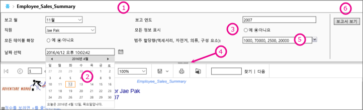
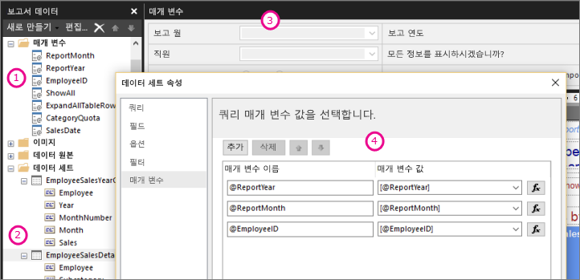

# Power BI 보고서 작성기의 보고서 매개 변수

[!INCLUDE [applies-to](../includes/applies-to.md)] [!INCLUDE [yes-service](../includes/yes-service.md)] [!INCLUDE [yes-paginated](../includes/yes-paginated.md)] [!INCLUDE [yes-premium](../includes/yes-premium.md)] [!INCLUDE [no-desktop](../includes/no-desktop.md)] 

이 토픽에서는 Power BI 보고서 작성기 보고서 매개 변수의 일반적인 용도와 설정할 수 있는 속성 등에 대해 설명합니다. 보고서 매개 변수를 사용하면 보고서 데이터를 제어하고, 관련된 보고서를 서로 연결하고, 다양하게 보고서를 표현할 수 있습니다. 보고서 매개 변수는 보고서 작성기에서 만드는 페이지를 매긴 보고서에서 사용할 수 있습니다.

##  매개 변수의 일반적인 용도

 다음은 매개 변수를 사용하는 가장 일반적인 몇 가지 방법입니다.  
  
**페이지를 매긴 보고서 데이터 제어**
  
- 변수를 포함하는 데이터 세트 쿼리를 작성하여 데이터 원본에서 페이지를 매긴 보고서 데이터를 필터링합니다.  
  
- 사용자가 값을 지정하여 페이지를 매긴 보고서의 데이터를 사용자 지정할 수 있도록 합니다. 예를 들어 매출 데이터의 시작 날짜와 종료 날짜에 대한 두 개의 매개 변수를 제공합니다.  
  
**보고서 프레젠테이션 다양화**
  
- 사용자가 값을 지정하여 보고서 모양을 사용자 지정할 수 있도록 합니다. 예를 들어 테이블에서 중첩된 모든 행 그룹을 확장하거나 축소할 것인지 여부를 나타내는 부울 매개 변수를 제공합니다.  
  
- 사용자는 식에 매개 변수를 포함하여 보고서 데이터 및 모양을 사용자 지정할 수 있습니다.  
  
##  매개 변수가 사용된 보고서 보기

매개 변수가 있는 보고서를 보는 경우 보고서 뷰어 도구 모음에 각 매개 변수가 표시되므로 대화형으로 값을 지정할 수 있습니다. 다음 그림에서는 @ReportMonth, @ReportYear, @EmployeeID, @ShowAll, @ExpandTableRows, @CategoryQuota 및 @SalesDate 매개 변수를 포함하는 매개 변수 영역을 보여줍니다.  

  
1. **매개 변수 창** 보고서 뷰어 도구 모음에 프롬프트와 각 매개 변수에 대한 기본값이 표시됩니다. 매개 변수 창에서 매개 변수 레이아웃을 사용자 지정할 수 있습니다.  
  
2. **@SalesDate 매개 변수**@SalesDate 매개 변수는 **DateTime** 데이터 형식입니다. 날짜 선택 프롬프트가 입력란 옆에 표시됩니다. 이 날짜를 수정하려면 입력란에 새 날짜를 입력하거나 달력 컨트롤을 사용합니다.  
  
3. **@ShowAll 매개 변수**@ShowAll 매개 변수는 **부울** 데이터 형식입니다. 라디오 단추를 사용하여 **True** 또는 **False** 를 지정합니다.  
  
4. **매개 변수 영역 핸들 표시 또는 숨기기** 보고서 뷰어 도구 모음에서 이 화살표를 클릭하여 매개 변수 창을 표시하거나 숨깁니다.  
  
5. **@CategoryQuota 매개 변수**@CategoryQuota 매개 변수는 **Float** 데이터 형식이므로 숫자 값을 갖습니다.  @CategoryQuota은 다중 값 허용하도록 설정됩니다.  
  
6. **보고서 보기**  매개 변수 값을 입력한 후 **보고서 보기** 를 클릭하여 보고서를 실행합니다. 모든 매개 변수에 기본값이 있는 경우 보고서를 처음으로 볼 때 보고서가 자동으로 실행됩니다.  
  
##  매개 변수 만들기

몇 가지 다른 방법으로 보고서 매개 변수를 만들 수 있습니다.
  
> [!NOTE]
>  일부 데이터 원본은 매개 변수를 지원하지 않습니다.
  
**매개 변수가 있는 저장 프로시저 또는 데이터 세트 쿼리**
  
 변수를 포함하는 데이터 세트 쿼리 또는 입력 매개 변수를 포함하는 데이터 세트 저장 프로시저를 추가합니다. 각 변수 또는 입력 매개 변수에 대해 데이터 세트 매개 변수가 생성되며 각 데이터 세트 매개 변수에 대해 보고서 매개 변수가 생성됩니다.  
  

  
 보고서 작성기의 이 이미지는 다음을 보여 줍니다.  
  
1.  보고서 데이터 창의 보고서 매개 변수  
  
2.  매개 변수가 있는 데이터 세트.  
  
3.  매개 변수 창  
  
4.  데이터 세트 속성 대화 상자에 나열된 매개 변수.  
  
**수동으로 매개 변수 만들기**
  
보고서 데이터 창에서 매개 변수를 수동으로 만듭니다. 사용자가 보고서 내용이나 모양을 사용자 지정하기 쉽게 대화형으로 값을 입력할 수 있도록 보고서 매개 변수를 구성할 수 있습니다. 사용자가 미리 구성된 값을 변경하지 못하도록 보고서 매개 변수를 구성할 수도 있습니다.  
  
> [!NOTE]  
>  매개 변수는 서버에서 독립적으로 관리되므로, 새 매개 변수 설정을 사용하여 주 보고서를 다시 게시해도 보고서의 기존 매개 변수 설정을 덮어쓰지 않습니다.  

### 매개 변수 값

 다음은 보고서에서 매개 변수 값을 선택할 수 있는 옵션입니다.  
  
- 드롭다운 목록에서 단일 매개 변수 값을 선택합니다.  
  
- 드롭다운 목록에서 여러 매개 변수 값을 선택합니다.  
  
- 드롭다운 목록에서 단일 매개 변수의 값을 선택합니다. 이 선택에 따라 드롭다운 목록에서 다른 매개 변수에 사용할 수 있는 값이 결정됩니다. 이들은 연계 매개 변수입니다. 연계 매개 변수를 사용하면 수천 개 값의 매개 변수 값을 관리 가능한 수치로 연속적으로 필터링할 수 있습니다. 자세한 내용은 [페이지를 매긴 보고서에서 연계 매개 변수 사용](../guidance/paginated-report-cascading-parameter.md)을 참조하세요.
  
- 매개 변수의 기본값이 생성되었으므로 먼저 매개 변수 값을 선택하지 않고 보고서를 실행합니다.  
  
##  보고서 매개 변수 속성

 보고서 속성 대화 상자를 사용하여 보고서 매개 변수 속성을 변경할 수 있습니다. 다음 표에는 각 매개 변수에 대해 설정할 수 있는 속성이 요약되어 있습니다.  
  
|속성|Description|  
|--------------|-----------------|  
|이름|매개 변수의 대/소문자를 구분하는 이름을 입력합니다. 이 이름은 문자로 시작해야 하고 문자, 숫자 및 밑줄(_)을 포함할 수 있습니다. 이름에 공백은 포함할 수 없습니다. 자동으로 생성된 매개 변수의 경우 이름이 데이터 세트 쿼리의 매개 변수와 일치합니다. 기본적으로 수동으로 만든 매개 변수는 ReportParameter1과 유사합니다.|  
|prompt|보고서 뷰어 도구 모음에서 매개 변수 옆에 표시되는 텍스트입니다.|  
|데이터 형식|보고서 매개 변수는 다음 데이터 형식 중 하나여야 합니다.   **부울**. 사용자가 라디오 단추에서 True 또는 False를 선택합니다.   **날짜/시간**. 사용자가 달력 컨트롤에서 날짜를 선택합니다.   **정수**. 사용자가 입력란에 값을 입력합니다.   **부동**. 사용자가 입력란에 값을 입력합니다.   **텍스트**. 사용자가 입력란에 값을 입력합니다.   매개 변수에 대해 사용할 수 있는 값이 정의된 경우 사용자는 데이터 형식이 **DateTime** 인 경우에도 드롭다운 목록에서 값을 선택합니다.|  
|빈 값 허용|매개 변수 값에 빈 문자열이나 공백을 허용하려면 이 옵션을 선택합니다.   매개 변수에 대한 유효한 값을 지정할 경우 공백 값을 유효한 값 중 하나로 허용하려면 지정한 값 중 하나로 공백 값을 포함시켜야 합니다. 이 옵션을 선택하면 사용 가능한 값에 공백이 자동으로 포함되지 않습니다.|  
|Null 값 허용|매개 변수 값이 Null이 될 수 있도록 허용하려면 이 옵션을 선택합니다.   매개 변수에 대한 유효한 값을 지정할 경우 null을 유효한 값 중 하나로 허용하려면 지정한 값 중 하나로 null을 포함시켜야 합니다. 이 옵션을 선택하면 사용 가능한 값에 Null이 자동으로 포함되지 않습니다.|  
|다중 값 허용|사용자가 선택할 수 있는 드롭다운 목록을 만드는 데 사용 가능한 값을 제공합니다. 이렇게 하면 데이터 세트 쿼리에서 유효한 값만 제출되도록 할 수 있습니다.   매개 변수의 값이 드롭다운 목록에 표시되는 다중 값이 될 수 있도록 허용하려면 이 옵션을 선택합니다. Null 값은 허용되지 않습니다. 이 옵션을 선택하면 매개 변수 드롭다운 목록의 사용 가능한 값 목록에 확인란이 추가되고 목록의 맨 위에 **모두 선택** 에 대한 확인란이 포함됩니다. 사용자는 원하는 값을 선택할 수 있습니다.   값을 제공하는 데이터가 빠르게 변동될 경우 사용자에게 표시되는 목록이 최신 상태가 아닐 수도 있습니다.|  
|표시|보고서가 실행될 때 보고서 맨 위에 보고서 매개 변수를 표시하려면 이 옵션을 선택합니다. 이 옵션을 설정하면 사용자가 런타임에 매개 변수 값을 선택할 수 있습니다.|  
|숨김|게시된 보고서에서 보고서 매개 변수를 숨기려면 이 옵션을 선택합니다. 보고서 매개 변수 값은 여전히 보고서 URL, 구독 정의 또는 보고서 서버에 설정할 수 있습니다.|  
|내부|보고서 매개 변수를 숨기려면 이 옵션을 선택합니다. 게시된 보고서에서 보고서 매개 변수는 보고서 정의에서만 볼 수 있습니다.|  
|사용 가능한 값|매개 변수에 대해 사용 가능한 값을 지정한 경우에는 유효한 값이 항상 드롭다운 목록으로 표시됩니다. 예를 들어 **DateTime** 매개 변수에 사용할 수 있는 값을 제공하면 날짜에 대한 드롭다운 목록이 달력 컨트롤 대신 매개 변수 창에 표시됩니다.   값 목록이 보고서와 하위 보고서 간에 일관되도록 하려면 데이터 원본과 연관된 데이터 세트의 모든 쿼리에 단일 트랜잭션을 사용하도록 데이터 원본에서 옵션을 설정할 수 있습니다.   **보안 참고** 데이터 형식이 **텍스트** 인 매개 변수를 포함하는 보고서에서는 사용 가능한 값 목록(유효한 값 목록이라고도 함)을 사용해야 하며, 보고서를 실행하는 사용자에게 보고서의 데이터를 보는 데 필요한 권한만 부여해야 합니다.|  
|기본값|쿼리 또는 정적 목록에서 기본값을 설정합니다.   매개 변수마다 기본값이 있을 경우에는 보고서를 처음으로 볼 때 보고서가 자동으로 실행됩니다.|  
|고급|이 매개 변수가 보고서의 데이터에 직접 또는 간접으로 영향을 주는지를 나타내는 값인 보고서 정의 특성 **UsedInQuery** 를 설정합니다.   **새로 고칠 시기 자동으로 결정**  보고서 프로세서가 이 값에 대한 설정을 결정하도록 하려면 이 옵션을 선택합니다. 보고서 프로세서가 이 매개 변수에 대한 직접 또는 간접 참조가 있는 데이터 세트 쿼리를 검색하거나 보고서에 하위 보고서가 있으면 **True** 입니다.   **항상 새로 고침**  보고서 매개 변수가 데이터 세트 쿼리 또는 매개 변수 식에 직접 또는 간접으로 사용되는 경우 이 옵션을 선택합니다. 이 옵션은 **UsedInQuery** 를 True로 설정합니다.   **새로 고침 안 함**  보고서 매개 변수가 데이터 세트 쿼리 또는 매개 변수 식에 직접 또는 간접으로 사용되지 않는 경우 이 옵션을 선택합니다. 이 옵션은 **UsedInQuery** 를 False로 설정합니다.   **주의** **새로 고침 안 함** 옵션은 신중하게 사용해야 합니다. 보고서 서버에서 **UsedInQuery** 는 보고서 데이터와 렌더링된 보고서의 캐시 옵션 및 스냅샷 보고서의 매개 변수 옵션을 제어하는 데 사용됩니다. **새로 고침 안 함** 을 잘못 설정하면 잘못된 보고서 데이터 또는 보고서가 캐시되거나 스냅샷 보고서에 일치하지 않는 데이터가 포함될 수 있습니다. |  
  
##   데이터 세트 쿼리  
 데이터 세트 쿼리에서 데이터를 필터링하려면 결과 집합에서 포함하거나 제외할 값을 지정하여 검색된 데이터를 제한하는 제한 절을 포함합니다.  
  
 데이터 원본에 쿼리 디자이너를 사용하여 매개 변수가 있는 쿼리를 작성할 수 있습니다.  
  
-   Transact-SQL 쿼리의 경우 다양한 데이터 원본이 매개 변수에 대한 다양한 구문을 지원합니다. 위치 또는 이름으로 쿼리에서 식별되는 매개 변수의 범위를 지원합니다. 관계형 쿼리 디자이너에서 매개 변수가 있는 쿼리를 만들려면 필터에 대해 매개 변수 옵션을 선택해야 합니다.   
  
-   Microsoft SQL Server Analysis Services 같은 다차원 데이터 원본을 기반으로 하는 쿼리의 경우 쿼리 디자이너에서 지정하는 필터를 기반으로 매개 변수를 만들 것인지 여부를 지정할 수 있습니다. 
  
##   게시된 보고서의 매개 변수 관리  
 보고서를 디자인할 때는 보고서 매개 변수가 보고서 정의에 저장되고, 보고서를 게시할 때는 보고서 매개 변수가 보고서 정의와 별개로 저장되고 관리됩니다.  
  
 게시된 보고서의 경우 다음을 사용할 수 있습니다.  
  
-   **보고서 매개 변수 속성.** 보고서 정의로부터 독립적으로 보고서 서버에서 보고서 매개 변수 값을 직접 변경합니다.  
  
-   **보고서 구독** 구독을 통해 데이터를 필터링하고 보고서를 전달하는 매개 변수 값을 지정할 수 있습니다. 
  
 게시된 보고서에 대한 매개 변수 속성은 보고서 정의를 다시 게시할 경우 유지됩니다. 보고서 정의가 동일한 보고서로 다시 게시되고 매개 변수 이름 및 데이터 형식이 그대로 유지되면 속성 설정도 그대로 유지됩니다. 보고서 정의에서 매개 변수를 추가 또는 삭제하거나 데이터 형식 또는 기존 매개 변수의 이름을 변경할 경우 게시된 보고서의 매개 변수 속성을 변경해야 할 수 있습니다.  
  
 매개 변수를 수정할 수 없는 경우도 있습니다. 보고서 매개 변수가 데이터 세트 쿼리에서 기본값을 가져오는 경우 이 값을 게시된 보고서에 맞게 수정하거나 보고서 서버에서 수정할 수 없습니다. 런타임 시 사용되는 값은 쿼리를 실행할 때 결정되거나 식 기반 매개 변수의 경우 식을 계산할 때 결정됩니다.  
  
 보고서 실행 옵션이 매개 변수 처리 방법에 영향을 줄 수 있습니다. 스냅샷으로 실행되는 보고서는 쿼리에 매개 변수의 기본값이 포함되지 않는 한 쿼리에서 파생된 매개 변수를 사용할 수 없습니다.  
  
##   구독의 매개 변수  
 요청 시 또는 스냅샷에 대한 구독을 정의하고 구독을 처리하는 중에 사용할 매개 변수 값을 지정할 수 있습니다.  
  
-   **요청 시 실행 보고서.**  요청 시 실행 보고서의 경우 보고서에 대해 나열된 각 매개 변수의 게시된 값과는 다른 매개 변수 값을 지정할 수 있습니다. 예를 들어 *Time Period* 매개 변수를 사용하여 현재 날짜, 주 또는 월에 해당하는 고객 서비스 요청을 반환하는 서비스 호출 보고서가 있다고 가정합니다. 보고서의 기본 매개 변수 값이 **today** 로 설정된 경우 구독에서는 다른 매개 변수 값(예: **week** 또는 **month**)을 사용하여 주 또는 월을 나타내는 숫자가 포함된 보고서를 생성할 수 있습니다.  
  
## 다음 단계

- [Power BI Premium에서 페이지를 매긴 보고서란?](paginated-reports-report-builder-power-bi.md)  
- [페이지를 매긴 보고서에서 연계 매개 변수 사용](../guidance/paginated-report-cascading-parameter.md)
