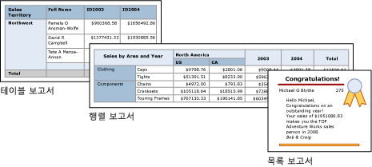

# Power BI 보고서 작성기의 테이블, 행렬 및 목록

[!INCLUDE [applies-to](../includes/applies-to.md)] [!INCLUDE [yes-service](../includes/yes-service.md)] [!INCLUDE [yes-paginated](../includes/yes-paginated.md)] [!INCLUDE [yes-premium](../includes/yes-premium.md)] [!INCLUDE [no-desktop](../includes/no-desktop.md)] 

보고서 작성기에서 테이블, 행렬 및 목록은 행과 열로 구성된 셀에 페이지를 매긴 보고서 데이터를 표시하는 *데이터 영역* 입니다. 셀에는 보통 텍스트, 날짜, 숫자 등의 텍스트 데이터가 포함되지만 계기, 차트, 또는 보고서 항목(예: 이미지)도 포함될 수 있습니다. 테이블, 행렬, 목록을 통틀어서 *테이블릭스* 데이터 영역이라고도 합니다.  
  
 테이블, 행렬 및 목록 템플릿은 셀에 데이터를 표시할 수 있는 유동적 눈금인 테이블릭스 데이터 영역에 작성됩니다. 테이블 및 행렬 템플릿에서 셀은 행과 열로 구성됩니다. 템플릿은 일반적인 기본 테이블릭스 데이터 영역의 변형이므로 템플릿 형식의 조합으로 데이터를 표시할 수 있으며, 보고서를 개발할 때 다른 데이터 영역의 기능을 포함하도록 테이블, 행렬 또는 목록을 변경할 수 있습니다. 예를 들어 테이블을 추가했는데 용도에 맞지 않으면 열 그룹을 추가해 테이블을 행렬로 만들 수 있습니다.  
  
 테이블 및 행렬 데이터 영역은 중첩된 테이블, 행렬, 목록, 차트 및 계기를 포함하여 복잡한 데이터 관계를 표시할 수 있습니다. 테이블 및 행렬은 테이블 형식 레이아웃을 사용하며 해당 데이터는 단일 데이터 원본을 기반으로 단일 데이터 세트에서 가져옵니다. 테이블과 행렬의 주요 차이점은, 테이블은 행 그룹만 포함할 수 있고 행렬은 행 그룹과 열 그룹을 모두 포함할 수 있다는 점입니다.  
  
 목록은 이 두 항목과 약간 다릅니다. 목록은 여러 피어 테이블 또는 행렬을 포함할 수 있는 자유 레이아웃을 지원하며, 각각은 다른 데이터 세트의 데이터를 사용합니다. 또한 목록은 송장 등의 양식에도 사용할 수 있습니다.  
  
 다음 그림에서는 테이블, 행렬 또는 목록이 포함된 간단한 보고서를 보여 줍니다.  

  
##   테이블  
 세부 데이터를 표시하거나, 데이터를 행 그룹으로 구성하거나, 두 가지 모두를 수행할 때 테이블을 사용합니다. 테이블 템플릿에는 테이블 머리글 행 및 데이터를 위한 정보 행이 있는 세 열이 들어 있습니다. 다음 그림에서는 디자인 화면에서 선택한 초기 테이블 템플릿을 보여 줍니다.  

  
 단일 필드, 여러 필드를 기준으로 하거나 사용자 고유의 식을 작성하여 데이터를 그룹화할 수 있습니다. 중첩된 그룹이나 인접한 독립 그룹을 만들고 그룹화된 데이터의 집계된 값을 표시하거나 합계를 그룹에 추가할 수 있습니다. 예를 들어 테이블에 **범주** 라는 행 그룹이 있는 경우 보고서의 총 합계 외에도 각 그룹의 소계를 추가할 수 있습니다. 테이블의 모양을 개선하고 뚜렷하게 표시할 데이터를 강조하려면 셀을 병합하고 데이터 및 테이블 제목에 서식을 적용할 수 있습니다.  
  
 처음에 정보 데이터나 그룹화된 데이터를 숨길 수 있으며 드릴다운 토글을 포함하여 사용자가 표시할 데이터의 양을 대화형으로 선택하도록 할 수 있습니다.  
  
##   행렬  
 피벗 테이블 또는 크로스탭처럼 집계된 데이터 요약을 행 및 열로 그룹화하여 표시할 때 행렬을 사용합니다. 그룹의 행과 열 수는 각 행 및 열 그룹의 고유 값 수에 따라 결정됩니다. 다음 그림에서는 디자인 화면에서 선택한 초기 행렬 템플릿을 보여 줍니다.  

 
 행 및 열 그룹의 여러 필드나 식으로 데이터를 그룹화할 수 있습니다. 런타임에 보고서 데이터 및 데이터 영역이 결합되면 열 그룹에는 열이, 행 그룹에는 행이 추가되면 페이지에서 행렬이 가로와 세로 방향으로 확장됩니다. 행렬 셀에는 셀이 속한 행 및 열 그룹의 교차점으로 한정된 집계 값이 표시됩니다. 예를 들어 행렬에 판매량 합계를 표시하는 행 그룹 하나(Category)와 열 그룹 두 개(Territory, Year)가 있는 경우 보고서에서는 두 개의 셀에 Category 그룹의 각 값에 대한 판매량 합계가 표시됩니다. 셀의 범위가 되는 두 교차점은 Category/Territory 및 Category/Year입니다. 이 행렬에는 중첩된 그룹과 인접 그룹이 포함될 수 있습니다. 중첩된 그룹에는 부모-자식 관계가 있으며 인접 그룹에는 피어 관계가 있습니다. 행렬 내에 있는 중첩된 행 및 열 그룹의 일부 및 모든 수준에 대해 부분합을 추가할 수 있습니다.  
  
 행렬 데이터를 보다 읽기 쉽게 만들고 뚜렷하게 표시할 데이터를 강조하려면 셀을 가로 또는 세로로 병합하거나 분할하고 데이터 및 그룹 제목에 서식을 적용할 수 있습니다.  
  
 또한 처음에 정보 데이터를 숨기는 드릴다운 토글을 포함할 수도 있습니다. 사용자는 필요한 경우 이 토글을 클릭하여 내용을 자세히 또는 간략히 볼 수 있습니다.  
  
##   목록  
 자유 형식 레이아웃을 만들 때 목록을 사용합니다. 이를 사용하면 모눈 레이아웃에 제한되지 않고 목록 안에서 필드를 자유롭게 배치할 수 있습니다. 목록을 사용하여 여러 데이터 세트 필드를 표시하는 폼을 디자인할 수 있으며, 그룹화된 데이터를 위해 여러 데이터 영역을 나란히 표시하기 위한 컨테이너로 목록을 사용할 수도 있습니다. 예를 들어 직원 레코드나 환자 레코드에서 목록에 대한 그룹을 정의하고, 테이블, 차트 및 이미지를 추가하고, 각 그룹 값에 대해 테이블 및 그래픽 형식으로 값을 표시할 수 있습니다.  

  
##   데이터 준비  
 테이블, 행렬 및 목록 데이터 영역에는 데이터 세트의 데이터가 표시됩니다. 데이터 세트의 데이터를 검색하는 쿼리를 사용하거나 테이블, 행렬 또는 목록의 속성을 설정하여 데이터를 준비할 수 있습니다.  
  
 보고서 데이터 세트에 대한 데이터를 검색하는 데 사용되는 Transact-SQL 같은 쿼리 언어는 데이터의 하위 세트만 포함하도록 필터를 적용하고 Null 값 또는 빈 값을 보고서의 가독성을 높이는 상수로 바꾸고, 데이터를 정렬 및 그룹화하여 데이터를 준비할 수 있습니다.  
  
 보고서의 테이블, 행렬 또는 목록 데이터 영역에서 데이터를 준비하려는 경우에는 데이터 영역 또는 데이터 영역 내의 셀에 대해 속성을 설정합니다. 데이터를 필터링하거나 정렬하려는 경우에는 데이터 영역에 대해 속성을 설정합니다. 예를 들어 데이터를 정렬하려면 정렬할 열과 정렬 방향을 지정합니다. 필드에 다른 값을 제공하려는 경우에는 필드를 표시하는 셀 텍스트의 값을 설정합니다. 예를 들어 필드가 비어 있거나 null인 경우 Blank를 표시하려면 식을 사용해 해당 값을 설정합니다.  
  
##   테이블, 행렬 또는 목록을 작성하고 구성  
 보고서에 테이블 또는 행렬을 추가할 때 테이블 및 행렬 마법사를 사용해도 되고 보고서 작성기에서 제공하는 템플릿에서 수동으로 작성해도 됩니다. 목록은 목록 템플릿에서 수동으로 작성합니다.  
  
 마법사는 테이블 또는 행렬을 빠르게 작성 및 구성하는 과정을 단계별로 안내합니다. 마법사를 완료한 후 또는 테이블릭스 데이터 영역을 처음부터 작성하는 경우에는 테이블 또는 행렬을 보다 자세하게 구성하고 상세하게 설정할 수 있습니다. 데이터 영역에서 마우스 오른쪽 단추를 클릭하면 표시되는 대화 상자를 사용하면 페이지 나누기, 머리글/바닥글 반복 및 표시 여부, 표시 옵션, 필터 및 정렬에 가장 일반적으로 사용되는 속성을 쉽게 설정할 수 있습니다. 그러나 테이블릭스 데이터 영역에서는 보다 많은 속성이 추가로 제공되는데, 이들 속성은 보고서 작성기의 속성 창에서만 설정할 수 있습니다. 예를 들어 테이블, 행렬 또는 목록의 데이터 세트가 비어 있을 때 메시지를 표시하려면 속성 창의 NoRowsMessage 테이블릭스 속성에서 메시지 텍스트를 지정할 수 있습니다.  
  
##   테이블릭스 템플릿 간에 변경  
 초기 테이블릭스 템플릿만 선택할 수 있는 것은 아닙니다. 그룹, 합계 및 레이블을 추가하다 보면 테이블릭스 디자인의 수정이 필요할 수 있습니다. 예를 들어 테이블로 시작했지만 나중에 정보 행을 삭제하고 열 그룹을 추가할 수 있습니다.  
  
 원하는 테이블릭스 기능을 추가하여 테이블, 행렬 또는 목록을 계속 개발할 수 있습니다. 테이블릭스 기능에는 세부 데이터를 표시하는 기능이나 그룹화된 데이터의 집계를 행과 열에 표시하는 기능이 포함됩니다. 중첩된 그룹, 독립적인 인접 그룹 또는 재귀적 그룹을 만들 수 있습니다. 그룹화된 데이터를 필터링하고 정렬할 수 있으며 그룹 정의에 여러 개의 그룹 식을 포함하여 그룹을 쉽게 결합할 수 있습니다.  
  
 또한 그룹 합계나 데이터 영역의 총합계도 추가할 수 있습니다. 드릴다운 보고서처럼 사용자가 숨겨진 데이터의 표시를 전환할 수 있도록 하고 보고서를 단순화하기 위해 행이나 열을 숨길 수 있습니다. 

## 다음 단계

- [Power BI Premium에서 페이지를 매긴 보고서란?](paginated-reports-report-builder-power-bi.md)
