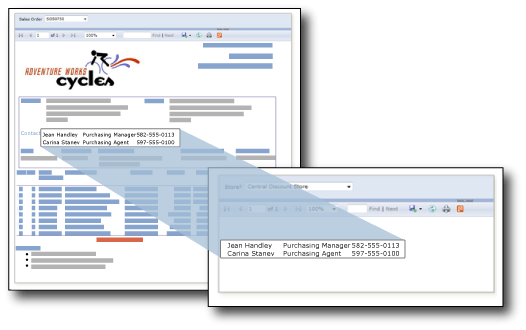

# Power BI 페이지를 매긴 보고서의 하위 보고서

*하위 보고서*는 페이지를 매긴 주 보고서의 본문 안에 페이지를 매긴 다른 보고서를 표시하는 페이지를 매긴 보고서 항목입니다. 보고서의 하위 보고서는 개념적 측면에서 웹 페이지의 프레임과 유사하며 보고서 내에 다른 보고서를 포함하는 데 사용합니다. 모든 보고서를 하위 보고서로 사용할 수 있습니다. 하위 보고서로 표시되는 보고서를 부모 보고서와 같은 Premium 작업 영역에 저장합니다. 하위 보고서에 부모 보고서가 매개 변수를 전달하도록 디자인할 수 있습니다. 하위 보고서의 각 인스턴스에 데이터 필터링 매개 변수를 사용하여 하위 보고서를 데이터 영역 내에서 반복할 수 있습니다.  
  
   
  
 위의 그림에서 주 Sales Order 보고서에 표시된 연락처 정보는 실제로 Contacts 하위 보고서에서 가져온 것입니다.  
  
Power BI Report Builder에서 페이지가 매겨진 보고서 정의(.rdl) 파일을 만들고 수정합니다. SQL Server Reporting Services에 저장된 하위 보고서를 Power BI 서비스 Premium 작업 영역에 업로드할 수 있습니다. 주 보고서와 하위 보고서를 같은 작업 영역에 게시해야 합니다. [Power BI Report Builder](https://go.microsoft.com/fwlink/?linkid=2086513)를 설치합니다.
  
## Report Builder 및 Power BI 서비스 사용

Power BI Report Builder는 컴퓨터의 페이지를 매긴 보고서(로컬 보고서라고 함) 또는 Power BI 서비스 보고서에서 사용할 수 있습니다.  Report Builder를 처음으로 열면 Power BI 계정에 로그인하라는 메시지가 표시됩니다. 표시되지 않으면 오른쪽 위 모서리에서 **로그인**을 선택합니다.

:::image type="content" source="media/subreports/report-builder-sign-in.png" alt-text="Power BI에 로그인":::

로그인하면 **파일** 메뉴의 **열기** 및 **다른 이름으로 저장** 옵션에 대한 Power BI Report Builder의 **PowerBI 서비스** 옵션이 표시됩니다. **Power BI 서비스** 옵션을 선택하여 보고서를 저장하면 Power BI Report Builder와 Power BI 서비스 간에 라이브 연결이 만들어집니다. 

:::image type="content" source="media/subreports/report-builder-subreport-open-service.png" alt-text="Power BI 서비스에서 열기":::

## Power BI 서비스에 로컬 보고서 저장

주 보고서에 하위 보고서를 추가하려면 먼저 보고서 두 개를 만들고 같은 Power BI Premium 작업 영역에 저장해야 합니다. 

1. 기존 로컬 보고서를 열려면 **파일** 메뉴에서 **열기** > **이 PC**를 선택하고 .rdl 파일을 선택합니다.  

2. **파일** 메뉴에서 **다른 이름으로 저장** > **Power BI 서비스**를 선택합니다.  자세한 내용은 [Power BI 서비스에 페이지를 매긴 보고서 게시](paginated-reports-save-to-power-bi-service.md)를 참조하세요.

    > [!NOTE]
    > Power BI 서비스에서 시작하여 보고서를 업로드할 수도 있습니다. 자세한 내용은 [Power BI 서비스에 페이지를 매긴 보고서 게시](paginated-reports-save-to-power-bi-service.md)를 참조하세요.

3. **다른 이름으로 저장** 대화 상자에서 페이지를 매긴 보고서를 저장할 수 있는 Power BI Premium 작업 영역을 선택합니다.  Premium 작업 영역에는 이름 옆에 다이아몬드 아이콘()이 있습니다.

    :::image type="content" source="media/subreports/report-builder-subreport-save-as-service.png" alt-text="Power BI 서비스에 다른 이름으로 저장":::

4. **저장**을 선택합니다.

## 보고서에 하위 보고서 추가

같은 Premium 작업 영역에 보고서를 모두 저장했으므로 다른 보고서를 하위 보고서로 추가할 수 있습니다. 하위 보고서를 추가하는 방법에는 두 가지가 있습니다. 

1. **삽입** 리본에서 **하위 보고서** 단추를 선택하거나 보고서 캔버스를 마우스 오른쪽 단추로 클릭하고 **삽입** > **하위 보고서**를 선택합니다.

    :::image type="content" source="media/subreports/report-builder-insert-subreport.png" alt-text="보고서에 하위 보고서 삽입":::

    **하위 보고서 속성** 대화 상자가 열립니다.  

2. **찾아보기** 단추를 선택하고 > 하위 보고서로 사용할 보고서로 이동하고 > **이름** 텍스트 상자에서 하위 보고서의 이름을 지정합니다.

3. [매개 변수](#use-parameters-in-subreports)를 포함하여 필요에 따라 다른 속성을 구성합니다.

## 하위 보고서에서 매개 변수 사용  
 부모 보고서에서 하위 보고서로 매개 변수를 전달하려면 하위 보고서로 사용하는 보고서에 보고서 매개 변수를 정의합니다. 하위 보고서를 부모 보고서에 배치하면 부모 보고서에서 하위 보고서의 보고서 매개 변수에 전달할 값 및 보고서 매개 변수를 선택할 수 있습니다.  
  
> [!NOTE]  
> 하위 보고서에서 선택하는 매개 변수는 *쿼리* 매개 변수가 아닌 *보고서* 매개 변수입니다.  
  
 하위 보고서를 보고서의 본문이나 데이터 영역에 배치할 수 있습니다. 하위 보고서를 데이터 영역에 배치하면 하위 보고서는 데이터 영역에 있는 그룹 또는 행의 인스턴스마다 반복됩니다. 그룹 또는 행의 값을 하위 보고서에 전달할 수 있습니다. 하위 보고서 값 속성에서 하위 보고서 매개 변수에 전달하려는 값을 포함하는 필드의 식을 사용합니다.  
  
 매개 변수 및 하위 보고서를 사용하는 방법에 대한 자세한 내용은 SQL Server Reporting Services 설명서의 [하위 보고서 및 매개 변수 추가](https://docs.microsoft.com/sql/reporting-services/report-design/add-a-subreport-and-parameters-report-builder-and-ssrs)를 참조하세요.  

## Report Builder에서 페이지를 매긴 보고서 미리 보기

Report Builder에서 보고서를 미리 볼 수 있습니다.

- **홈** 리본에서 **실행**을 선택합니다. 

Report Builder는 디자인 도구이므로 보고서 미리 보기가 Power BI 서비스에서 보고서를 렌더링하는 것과 다르게 보일 수 있습니다.

### 미리 보기에 대한 정보

- Report Builder는 보고서에 사용된 데이터 원본의 자격 증명을 저장하지 않습니다.  Report Builder는 미리 보기 중에 각 자격 증명 집합을 요구합니다.  
- 보고서 데이터 원본이 온-프레미스에 있는 경우 Power BI 작업 영역에 보고서를 저장한 후 게이트웨이를 구성해야 합니다.
- 미리 보기 중에 Report Builder에 오류가 발생하면 일반 메시지가 반환됩니다.  오류를 디버그하기 어려운 경우 Power BI 서비스에서 보고서를 렌더링할 수도 있습니다.  

## 고려 사항

### 연결 유지 관리

Report Builder는 파일을 닫을 때 Power BI에 대한 연결을 유지하지 않습니다.  Power BI 작업 영역에 저장된 하위 보고서를 사용하여 로컬 주 보고서로 작업할 수 있습니다. 보고서를 닫기 전에 주 보고서를 Power BI 작업 영역에 저장해야 합니다.  그렇지 않으면 Power BI 서비스에 대한 라이브 연결이 없기 때문에 미리 보기 중에 '찾을 수 없음' 메시지가 표시될 수 있습니다.  이 경우 하위 보고서로 이동하여 해당 속성을 선택합니다.  Power BI 서비스에서 하위 보고서를 다시 엽니다.  이렇게 하면 연결이 다시 설정되어 다른 모든 하위 보고서는 잘 작동됩니다.

### 하위 보고서 이름 바꾸기

작업 영역에서 하위 보고서의 이름을 바꾸는 경우 주 보고서에서 이름 참조를 수정해야 합니다. 그렇지 않으면 하위 보고서가 렌더링되지 않습니다. 주 보고서는 여전히 하위 보고서 항목 내에 오류 메시지와 함께 렌더링됩니다.

## 대량 보고서 마이그레이션

대량 보고서를 Power BI로 마이그레이션하는 경우에는 [RdlMigration 도구](../guidance/migrate-ssrs-reports-to-power-bi.md)를 사용하는 것이 좋습니다.  중복된 하위 보고서 이름을 처리하도록 RdlMigration 도구가 업데이트되었습니다.  두 개 이상의 보고서가 같은 이름을 공유하지만 다른 하위 디렉터리에 있는 경우 중복된 하위 보고서 이름이 발생할 수 있습니다.  유일한 이름으로 확인되지 않으면 첫 번째 하위 보고서만 인식됩니다.

Report Builder를 사용하여 대량 보고서를 마이그레이션하려면 먼저 하위 보고서를 사용하는 것이 좋습니다. 보고서 이름의 중복을 방지하려면 각 보고서를 Power BI 작업 영역에 저장합니다.

## 하위 보고서와 보고서 공유

앞서 언급했듯이 주 보고서와 하위 보고서는 같은 작업 영역에 있어야 합니다. 그렇지 않으면 하위 보고서가 렌더링되지 않습니다. 주 보고서를 공유하는 경우에도 하위 보고서를 공유해야 합니다. 앱에서 주 보고서를 공유하는 경우 해당 앱에 하위 보고서도 포함해야 합니다. 사용자 또는 사용자 그룹에 직접 주 보고서를 공유하는 경우 각 하위 보고서를 같은 사용자 또는 사용자 그룹 집합으로 공유해야 합니다.
  
## 다음 단계

[Power BI 페이지를 매긴 보고서의 하위 보고서 문제 해결](subreports-troubleshoot.md)

[Power BI 서비스에서 페이지를 매긴 보고서 보기](../consumer/paginated-reports-view-power-bi-service.md)

궁금한 점이 더 있나요? [Power BI 커뮤니티를 이용하세요.](https://community.powerbi.com/)
