# <a name="configure-power-bi-report-server-with-azure-application-proxy"></a>Azure 애플리케이션 프록시를 사용하여 Power BI Report Server 구성

이 문서에서는 Azure Active Directory 애플리케이션 프록시를 사용하여 Power BI Report Server 및 SSRS(SQL Server Reporting Services) 2016 이상에 연결하는 방법을 알아봅니다. 회사 네트워크에서 멀리 떨어진 사용자는 이 통합을 통해 클라이언트 브라우저에서 Power BI Report Server 및 Reporting Services에 액세스하고 Azure AD(Active Directory)로 보호될 수 있습니다. [Azure Active Directory 애플리케이션 프록시](/azure/active-directory/manage-apps/application-proxy)를 통해 온-프레미스 애플리케이션 원격으로 액세스하는 방법을 자세히 알아보세요.

## <a name="environment-details"></a>환경 세부 정보

만든 예제에서 다음과 같은 값을 사용했습니다. 

- 도메인: umacontoso.com
- Power BI Report Server: PBIRSAZUREAPP.umacontoso.com
- SQL Server 데이터 원본: SQLSERVERAZURE.umacontoso.com

## <a name="configure-power-bi-report-server"></a>Power BI Report Server 구성

Azure VM에서 Power BI Report Server를 설치한 후 다음 단계를 사용하여 Power BI Report Server 웹 서비스 및 웹 포털 URL을 구성합니다.

1. 포트 80(https URL을 구성한 경우 포트 443)에 대한 VM 방화벽에서 인바운드 및 아웃바운드 규칙을 만듭니다. 또한 TCP 프로토콜에 대해 Azure Portal에서 Azure VM에 대한 인바운드 및 아웃바운드 규칙을 만듭니다(포트 80).
2. 작업 환경에서 VM에 대해 구성된 DNS 이름은 `pbirsazureapp.eastus.cloudapp.azure.com`입니다.
3. **고급** 탭 > **추가** 단추 > **호스트 헤더 이름 선택**을 선택하고 표시된 대로 호스트 이름(DNS 이름)을 추가하여 Power BI Report Server 외부 웹 서비스 및 웹 포털 URL을 구성합니다.

    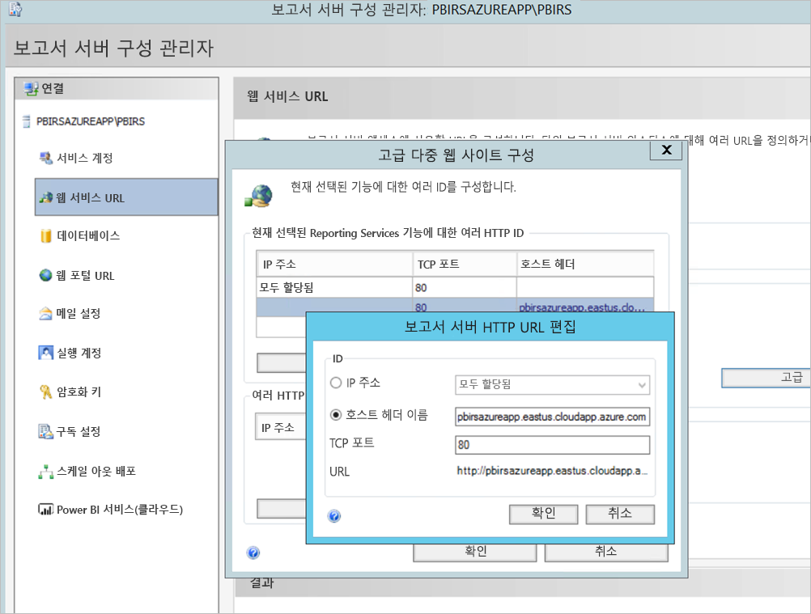

1. 웹 서비스와 웹 포털 섹션 모두에 대해 이전 단계를 수행하고 보고서 서버 Configuration Manager에 등록된 URL을 가져왔습니다.

    - `https://pbirsazureapp.eastus.cloudapp.azure.com/ReportServer`
    - `https://pbirsazureapp.eastus.cloudapp.azure.com/Reports`

2. Azure Portal 네트워킹 섹션에 VM에 대한 두 개의 IP 주소가 표시됩니다. 

    - **퍼블릭 IP** 
    - **프라이빗 IP** 
    
    퍼블릭 IP 주소는 가상 머신 외부에서 액세스하는 데 사용됩니다.

3. 따라서 VM(Power BI Report Server)에 호스트 파일 항목을 추가하여 퍼블릭 IP 주소와 호스트 이름 `pbirsazureapp.eastus.cloudapp.azure.com`을 포함했습니다.
4. VM을 다시 시작하면 동적 IP 주소가 변경될 수 있으며 호스트 파일에 올바른 IP 주소를 다시 추가해야 할 수 있습니다. 이를 방지하기 위해 Azure Portal에서 퍼블릭 IP 주소를 정적으로 설정할 수 있습니다.
5. 위에서 언급한 변경 내용을 적용한 후 웹 서비스 및 웹 포털 URL에 액세스할 수 있어야 합니다.
6. 서버의 URL `https://pbirsazureapp.eastus.cloudapp.azure.com/ReportServer`에 액세스할 때 자격 증명을 묻는 메시지가 세 번 표시되고 빈 화면이 표시됩니다.
7. 다음 레지스트리 항목을 추가합니다.

    `HKEY\_LOCAL\_MACHINE \SYSTEM\CurrentControlset\Control \Lsa\ MSV1\_0` 레지스트리 키

1. 새 값 `BackConnectionHostNames`, 다중 문자열 값을 추가하고 호스트 이름 `pbirsazureapp.eastus.cloudapp.azure.com`을 제공합니다.

그 후에는 서버에 있는 URL에도 액세스할 수 있습니다.

## <a name="configure-power-bi-report-server-to-work-with-kerberos"></a>Kerberos를 사용하도록 Power BI Report Server 구성

### <a name="1-configure-the-authentication-type"></a>1. 인증 형식 구성

Kerberos 제한 위임을 허용하도록 Report Server에 대한 인증 형식을 구성해야 합니다. 이 구성은 **rsreportserver.config** 파일 내에서 수행됩니다.

rsreportserver.config 파일 내에서 **Authentication/AuthenticationTypes** 섹션을 찾습니다.

RSWindowsNegotiate가 표시되어 있고 인증 형식 목록에서 첫 번째인지 확인하려고 합니다. 다음과 유사하게 나타납니다.

```
<AuthenticationTypes>

    <RSWindowsNegotiate/>

</AuthenticationTypes>
```

구성 파일을 변경해야 하는 경우 보고서 서버 Configuration Manager에서 **보고서 서버 서비스를 중지했다가 다시 시작하여** 변경 내용이 적용되도록 합니다.

### <a name="2-register-service-principal-names-spns"></a>2. SPN(서비스 사용자 이름) 등록

관리자 권한으로 명령 프롬프트를 열고 다음 단계를 수행합니다.

다음 명령을 사용하여 계정 **Power BI Report Server 서비스 계정**에 다음 SPN을 등록합니다.

```
setspn -s http/ Netbios name\_of\_Power BI Report Server\_server<space> Power BI Report Server\_ServiceAccount

setspn -s http/ FQDN\_of Power BI Report Server\_server<space> Power BI Report Server\_ServiceAccount
```

다음 명령을 사용하여 SQL Server 서비스 계정에 다음 SPN을 등록합니다(SQL Server의 기본 인스턴스).

```
setspn -s MSSQLSVC/FQDN\_of\_SQL\_Server: 1433 (PortNumber) <SQL service service account>

setspn -s MSSQLSVC/FQDN\_of\_SQL\_Server<SQL service service account>
```

### <a name="3-configure-delegation-settings"></a>3. 위임 설정 구성

Report Server 서비스 계정에 대한 위임 설정을 구성해야 합니다.

1. Active Directory 사용자 및 컴퓨터를 엽니다.
2. Active Directory 사용자 및 컴퓨터 내에서 Report Server 서비스 계정의 속성을 엽니다.
3. 프로토콜 전송을 사용하여 제한된 위임을 구성하려고 합니다. 제한된 위임을 사용하여 위임하려고 하는 서비스를 노출해야 합니다.
4. **Report Server 서비스 계정**을 마우스 오른쪽 단추로 클릭하고 **속성**을 선택합니다.
5. **위임** 탭을 선택합니다.
6. **지정한 서비스에 대한 위임용으로만 이 사용자 트러스트**를 선택합니다.
7. **모든 인증 프로토콜 사용**을 선택합니다.
8. **이 계정이 위임된 자격 증명을 표시할 수 있는 서비스**에서 **추가**를 선택합니다.
9. 새 대화 상자에서 **사용자 또는 컴퓨터**를 선택합니다.
10. **SQL Server 서비스의 서비스 계정**을 입력하고 **확인**을 선택합니다.

    MSSQLSVC로 시작됩니다.

1. SPN을 추가합니다.
2. **확인**을 선택합니다. 이제 목록에서 SPN이 표시됩니다.

이러한 단계는 Kerberos 인증 메커니즘을 사용하도록 Power BI Report Server를 구성하고 로컬 머신에서 작동하는 데이터 원본에 대한 테스트 연결을 설정하는 데 유용합니다.

## <a name="configure-azure-application-proxy-connector"></a>Azure 애플리케이션 프록시 커넥터 구성

[애플리케이션 프록시 커넥터와 관련된 구성](/azure/active-directory/manage-apps/application-proxy-add-on-premises-application#add-an-on-premises-app-to-azure-ad)에 대한 문서를 참조하세요.

Power BI Report Server에 애플리케이션 프록시 커넥터를 설치했지만 별도의 서버에서 구성하고 위임이 올바르게 설정되어 있는지 확인할 수 있습니다.

### <a name="ensure-the-connector-is-trusted-for-delegation"></a>커넥터를 위임에 대해 신뢰할 수 있는지 확인

커넥터가 보고서 서버 애플리케이션 풀 계정에 추가된 SPN에 위임되도록 신뢰할 수 있는지 확인합니다.

보고서 서버 Azure AD 애플리케이션 프록시 서비스가 사용자 ID를 SharePoint 애플리케이션 풀 계정에 위임할 수 있도록 KCD(Kerberos 제한된 위임)를 구성합니다. 애플리케이션 프록시 커넥터에서 Azure AD에서 인증된 사용자에 대한 Kerberos 티켓을 검색할 수 있도록 하여 KCD를 구성합니다. 그런 다음 해당 서버에서 컨텍스트를 대상 애플리케이션(이 경우 Power BI Report Server)에 전달합니다.

KCD를 구성하려면 각 커넥터 컴퓨터에 대해 다음 단계를 반복합니다.

1. 도메인 관리자로 도메인 컨트롤러에 로그인하고 **Active Directory 사용자 및 컴퓨터**를 엽니다.
2. 커넥터가 실행 중인 컴퓨터를 찾습니다.
3. 컴퓨터를 두 번 클릭한 후 **위임** 탭을 선택합니다.
4. 위임 설정이 **지정된 서비스에 대한 위임용으로만 이 컴퓨터 트러스트**로 설정되어 있는지 확인합니다. 그런 다음, **모든 인증 프로토콜 사용**을 선택합니다.
5. **추가**를 선택하고 **사용자 또는 컴퓨터**를 선택합니다.
6. Power BI Report Server에 사용할 서비스 계정을 입력합니다. 이 계정은 보고서 서버 구성 내에서 SPN을 추가한 계정입니다.
7. **확인**을 클릭합니다. 
8. 변경 내용을 저장하려면 **확인**을 다시 클릭합니다.

## <a name="publish-through-azure-ad-application-proxy"></a>Azure AD 애플리케이션 프록시를 통해 게시

이제 Azure AD 애플리케이션 프록시를 구성할 준비가 되었습니다.

다음 설정을 사용하여 애플리케이션 프록시를 통해 Power BI Report Server를 게시합니다. 애플리케이션 프록시를 통해 애플리케이션을 게시하는 방법에 대한 단계별 지침은 [Azure AD 애플리케이션 프록시를 사용하여 애플리케이션 게시](/azure/active-directory/manage-apps/application-proxy-add-on-premises-application#add-an-on-premises-app-to-azure-ad)를 참조하세요.

- **내부 URL**: 커넥터가 회사 네트워크에서 연결할 수 있는 보고서 서버의 URL을 입력합니다. 커넥터가 설치된 서버에서 이 URL에 연결할 수 있는지 확인합니다. 애플리케이션 프록시를 통해 게시된 하위 경로 문제를 방지하기 위해 `https://servername/`과 같은 최상위 도메인을 사용하는 것이 가장 좋습니다. 예를 들어, `https://servername/`을 사용하고, `https://servername/reports/` 또는 `https://servername/reportserver/`는 사용하지 않습니다. `https://pbirsazureapp.eastus.cloudapp.azure.com/`를 사용하여 환경을 구성했습니다.

    > [!NOTE]
    > 보고서 서버에 대한 보안 HTTPS 연결을 사용하는 것이 좋습니다. 자세한 내용은 [기본 모드 보고서에서 SSL 연결 구성](/sql/reporting-services/security/configure-ssl-connections-on-a-native-mode-report-server)을 참조하세요.

- **외부 URL** : Power BI 모바일 앱에서 연결할 퍼블릭 URL을 입력합니다. 예를 들어, 사용자 지정 도메인을 사용하는 경우 `https://reports.contoso.com`처럼 보일 수 있습니다. 사용자 지정 도메인을 사용하려면 해당 도메인에 대한 인증서를 업로드하고, DNS 레코드로 애플리케이션의 기본 msappproxy.net 도메인을 가리킵니다. 자세한 내용은 [Azure AD 애플리케이션 프록시에서 사용자 지정 도메인 작업](/azure/active-directory/manage-apps/application-proxy-configure-custom-domain)을 참조하세요.

외부 URL을 환경에 대한 `https://pbirsazureapp-umacontoso2410.msappproxy.net/`으로 구성했습니다.

- **사전 인증 방법**: Azure Active Directory
- **커넥터 그룹:** 기본값입니다.

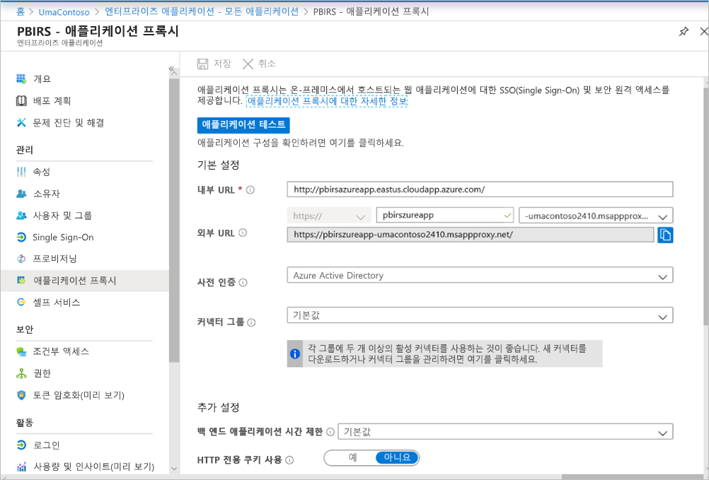

**추가 설정** 섹션에서 어떤 변경도 수행하지 않았습니다. 기본 옵션을 사용하도록 구성되어 있습니다.

> [!IMPORTANT]
> 애플리케이션 프록시를 구성하는 경우 **백 엔드 애플리케이션 시간 제한** 속성이 **기본값**(85초)으로 설정되어 있는지 확인합니다. 실행하는 데 85초 이상 걸리는 보고서가 있는 경우 이 속성을 가능한 최대 시간 제한 값인 **장기**(180초)로 설정합니다. **장기**로 구성하면 모든 보고서는 180초 내에 완료되어야 합니다. 그렇지 않으면 시간 제한으로 인해 오류가 발생합니다.


### <a name="configure-single-sign-on"></a>Single Sign-On 구성

앱이 게시된 후에는 다음 단계에 따라 Single Sign-On 설정을 구성합니다.

1. 포털의 애플리케이션 페이지에서 **Single Sign-On**을 선택합니다.
2. **Single Sign-On 모드**로 **Windows 통합 인증**을 선택합니다.
3. **내부 애플리케이션 SPN**을 이전에 설정한 값으로 설정합니다. 다음 단계를 사용하여 이 값을 식별할 수 있습니다.

    - Kerberos 티켓이 만들어지도록 보고서를 실행 하거나 데이터 원본에 대한 테스트 연결을 수행합니다.
    - 보고서/테스트 연결을 성공적으로 실행한 후 명령 프롬프트를 열고 `klist` 명령을 실행합니다. 결과 섹션에 `http/` SPN이 포함된 티켓이 표시됩니다. 이 SPN이 Power BI Report Server로 구성한 SPN과 동일한 경우 이 섹션에서 해당 SPN을 사용합니다.

1. 커넥터에 대한 **위임된 로그인 ID**를 선택하여 사용자를 대신하여 사용합니다. 자세한 내용은 [다른 온-프레미스 및 클라우드 ID로 작업](/azure/active-directory/manage-apps/application-proxy-configure-single-sign-on-with-kcd#working-with-different-on-premises-and-cloud-identities)을 참조하세요.

    사용자 계정 이름을 사용하는 것이 좋습니다. 이 샘플에서는 **사용자 계정 이름** 옵션을 사용하도록 구성했습니다.

    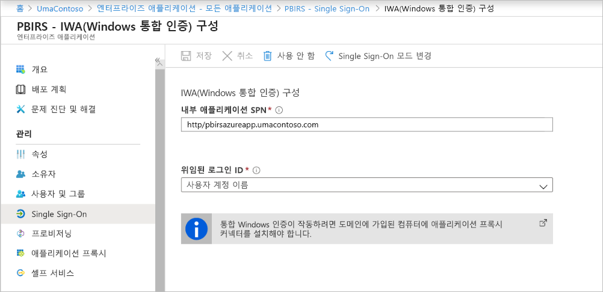

1. **저장**을 클릭하여 변경 내용을 저장합니다.

### <a name="finish-setting-up-your-application"></a>애플리케이션 설정 완료

애플리케이션 설정을 완료하려면 **사용자 및 그룹** 섹션으로 이동하고 이 애플리케이션에 액세스할 사용자를 할당합니다.

1. **리디렉션 URL** 및 **고급 설정**에 대해 다음과 같이 Power BI Report Server 애플리케이션에 대한 앱 등록의 **인증** 섹션을 구성합니다.

    - 새 리디렉션 URL을 만들고 **형식** = **웹** 및 **리디렉션 URI** = `https://pbirsazureapp-umacontoso2410.msappproxy.net/`을 지정하여 구성합니다.
    - **고급 설정** 섹션에서 **로그아웃 URL**을 `https://pbirsazureapp-umacontoso2410.msappproxy.net/?Appproxy=logout`로 구성합니다.

    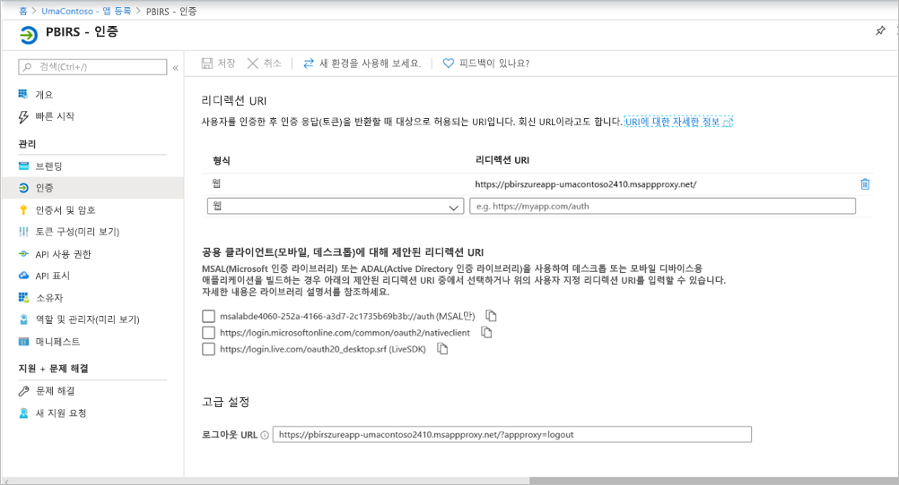

1. **암시적 권한 부여**, **기본 클라이언트 유형** 및 **지원되는 계정 유형**에 대해 다음을 지정하여 Power BI Report Server 애플리케이션에 대한 앱 등록 **인증** 섹션을 계속 구성합니다.

    - **암시적 권한 부여**를 **ID 토큰**으로 설정합니다.
    - **기본 클라이언트 유형**을 **아니요**로 설정합니다.
    - **지원되는 계정 유형**을 **이 조직 디렉터리의 계정만(UmaContoso만 – 단일 테넌트)** 으로 설정합니다.

    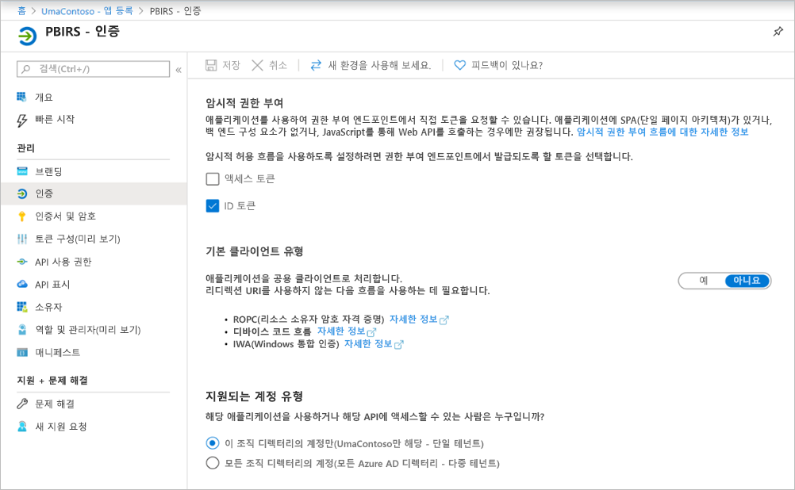

1. Single Sign-On이 설정되고 URL `https://pbirsazureapp-umacontoso2410.msappproxy.net`이 작동하면 로그인하는 데 사용한 계정이 Power BI Report Server에서 사용 권한이 제공된 계정과 동기화되었는지 확인해야 합니다.

1. 먼저 로그인에 사용할 사용자 지정 도메인을 구성하고 확인해야 합니다.
2. 이 경우 umacontoso.com이라는 도메인을 구매하고 항목을 사용하여 DNS 영역을 구성했습니다. `onmicrosoft.com` 도메인을 사용하여 온-프레미스 AD와 동기화할 수도 있습니다.

    [자습서: Azure App Service에 기존 사용자 지정 DNS 이름 매핑](/Azure/app-service/app-service-web-tutorial-custom-domain)을 참조하세요.

1. 사용자 지정 도메인에 대한 DNS 항목을 성공적으로 확인한 후에는 포털에서 도메인에 해당하는 상태가 **확인됨**으로 표시되는 것을 볼 수 있습니다.

    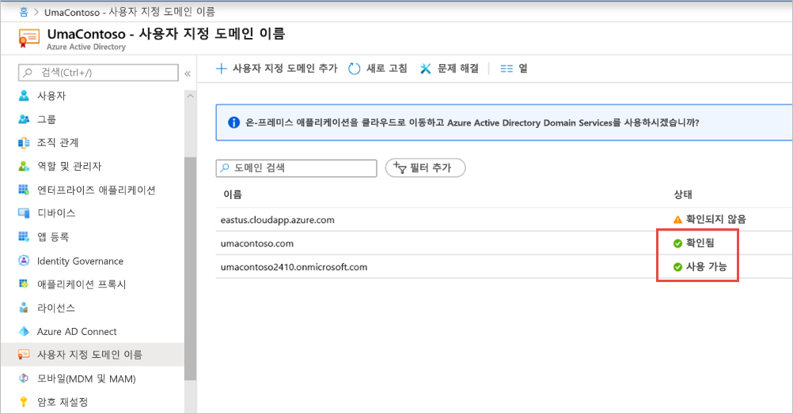

1. 도메인 컨트롤러 서버에 Microsoft Azure AD Connect를 설치하고 Azure AD와 동기화되도록 구성합니다.

    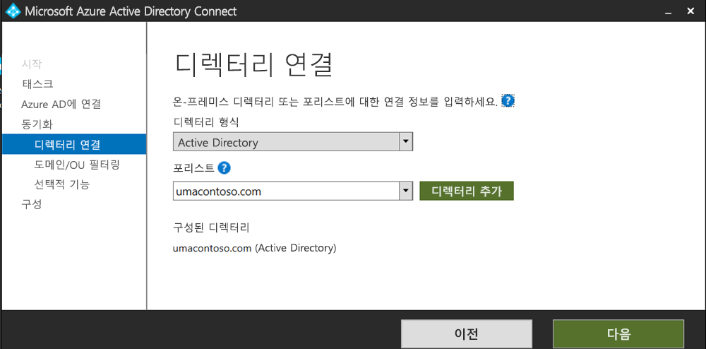

1. Azure AD가 온-프레미스 AD와 동기화되면 Azure Portal에서 다음과 같은 상태가 표시됩니다.

    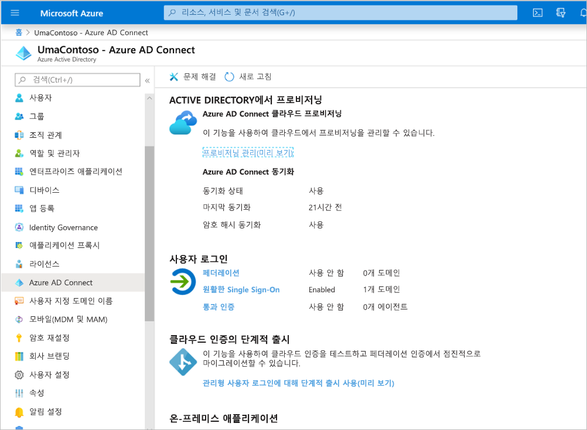

1. 또한 동기화가 성공적으로 완료되면 도메인 컨트롤러에서 AD 도메인 및 트러스트를 엽니다. Active Directory 도메인 및 트러스트 > 속성을 마우스 오른쪽 단추로 클릭하고 UPN을 추가합니다. 작업 환경에서 `umacontoso.com`은 구매한 사용자 지정 도메인입니다.

1. UPN을 추가한 후에는 Azure AD 계정 및 온-프레미스 AD 계정이 연결되고 인증 중에 토큰이 인식되도록 UPN을 사용하여 사용자 계정을 구성할 수 있어야 합니다.

    이전 단계를 수행한 후에는 AD 도메인 이름이 **사용자 로그온 이름** 섹션의 드롭다운 목록에 나열됩니다. 사용자 이름을 구성하고 AD 사용자 속성의 **사용자 로그온 이름** 섹션에 있는 드롭다운 목록에서 도메인을 선택합니다.

    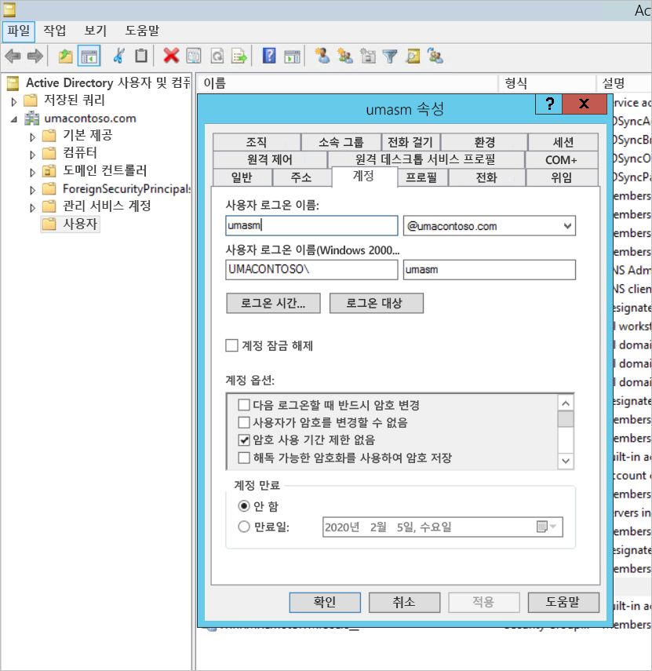

1. AD 동기화가 성공적으로 완료되면 Azure Portal에서 애플리케이션의 **사용자 및 그룹** 섹션 아래에 온-프레미스 AD 계정이 표시됩니다. 계정에 대한 원본은 **Windows Server AD**입니다.
2. `umasm@umacontoso.com`을 사용하여 로그인하는 것은 Windows 자격 증명 `Umacontoso\umasm`을 사용하는 것과 같습니다.

    온-프레미스 AD를 구성하고 Azure AD와 동기화하려는 경우 이러한 이전 단계가 적용됩니다.

    위의 단계를 구현하면 로그인이 성공합니다.

    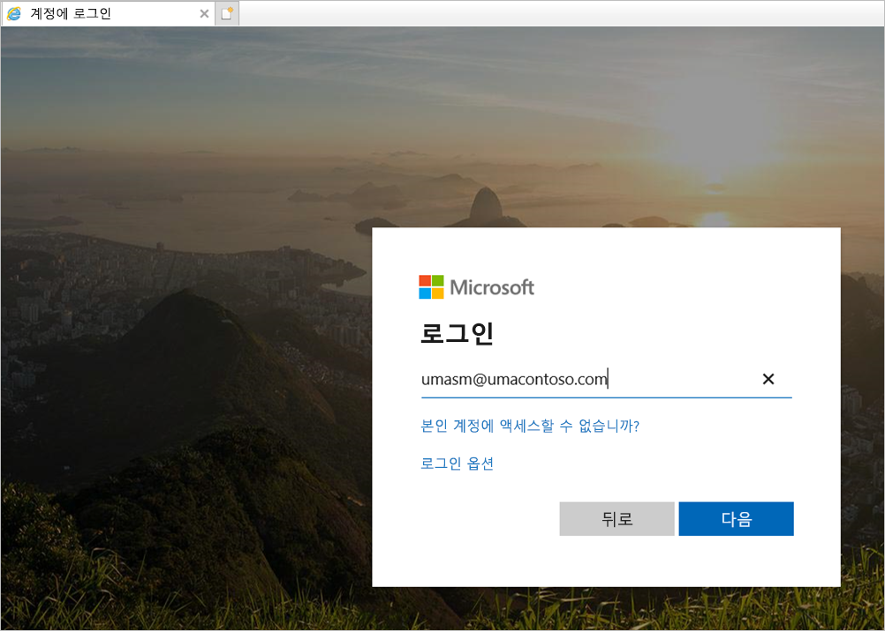

    그런 다음, 웹 포털이 표시됩니다.

    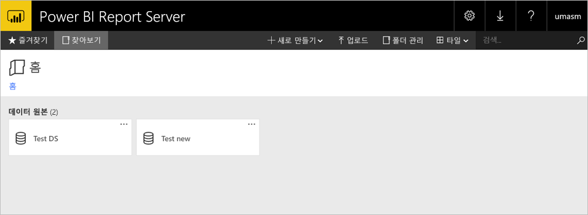

    인증으로 Kerberos를 사용하여 데이터 원본에 대한 테스트 연결이 성공하면 다음이 수행됩니다.

    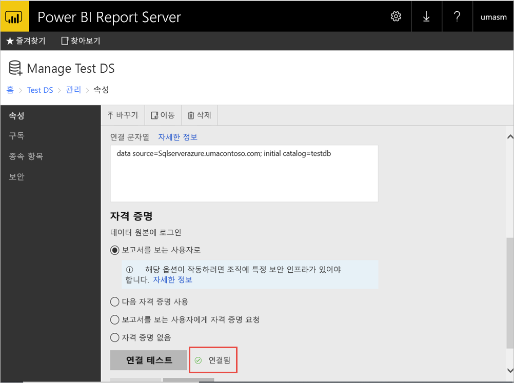

## <a name="access-from-power-bi-mobile-apps"></a>Power BI 모바일 앱에서 액세스

### <a name="configure-the-application-registration"></a>애플리케이션 등록 구성

Power BI 모바일 앱이 Power BI Report Server에 연결되고 액세스할 수 있으려면 이 문서의 앞부분에 나오는 [Azure AD 애플리케이션 프록시를 통해 게시](#publish-through-azure-ad-application-proxy)에서 자동으로 만들어진 애플리케이션 등록을 구성해야 합니다.

1. Azure Active Directory **개요** 페이지에서 **앱 등록**을 선택합니다.
2. **모든 애플리케이션** 탭에서 Power BI Report Server용을 만든 애플리케이션을 검색합니다.
3. 해당 애플리케이션을 선택한 다음, **인증**을 선택합니다.
4. 사용 중인 플랫폼에 따라 다음 리디렉션 URI를 추가합니다.

    Power BI Mobile **iOS**용 앱을 구성하는 경우 퍼블릭 클라이언트(모바일 및 데스크톱) 형식의 다음 리디렉션 URI를 추가합니다.

    - `msauth://code/mspbi-adal%3a%2f%2fcom.microsoft.powerbimobile`
    - `msauth://code/mspbi-adalms%3a%2f%2fcom.microsoft.powerbimobilems`
    - `mspbi-adal://com.microsoft.powerbimobile`
    - `mspbi-adalms://com.microsoft.powerbimobilems`

    Power BI Mobile **Android**용 앱을 구성하는 경우 퍼블릭 클라이언트 유형(모바일 및 데스크톱)의 다음 리디렉션 URI를 추가합니다.

    - `urn:ietf:wg:oauth:2.0:oob`
    - `mspbi-adal://com.microsoft.powerbimobile`
    - `msauth://com.microsoft.powerbim/g79ekQEgXBL5foHfTlO2TPawrbI%3D`
    - `msauth://com.microsoft.powerbim/izba1HXNWrSmQ7ZvMXgqeZPtNEU%3D`

    Power BI Mobile iOS 및 Android용 앱을 구성하는 경우, iOS에 대해 구성된 리디렉션 URI 목록에 퍼블릭 클라이언트 유형(모바일 및 데스크톱)의 다음 리디렉션 URI를 추가합니다.

    - `urn:ietf:wg:oauth:2.0:oob`

    > [!IMPORTANT]
    > 애플리케이션이 올바르게 작동하려면 리디렉션 URI를 추가해야 합니다.

### <a name="connect-from-the-power-bi-mobile-apps"></a>Power BI 모바일 앱에서 연결

1. Power BI 모바일 앱에서 보고서 서버 인스턴스에 연결합니다. 연결하려면 애플리케이션 프록시를 통해 게시한 애플리케이션의 **외부 URL**을 입력합니다.
2. **연결**을 선택합니다. Azure Active Directory 로그인 페이지로 이동됩니다.
3. 사용자에 대한 올바른 자격 증명을 입력하고 **로그인**을 선택합니다. 보고서 서버의 요소가 표시됩니다.

## <a name="next-steps"></a>다음 단계

[Azure AD 애플리케이션 프록시를 사용하여 Power BI Mobile에 대한 원격 액세스 설정](/azure/active-directory/manage-apps/application-proxy-integrate-with-power-bi)

궁금한 점이 더 있나요? [Power BI 커뮤니티에 질문합니다.](https://community.powerbi.com/)
