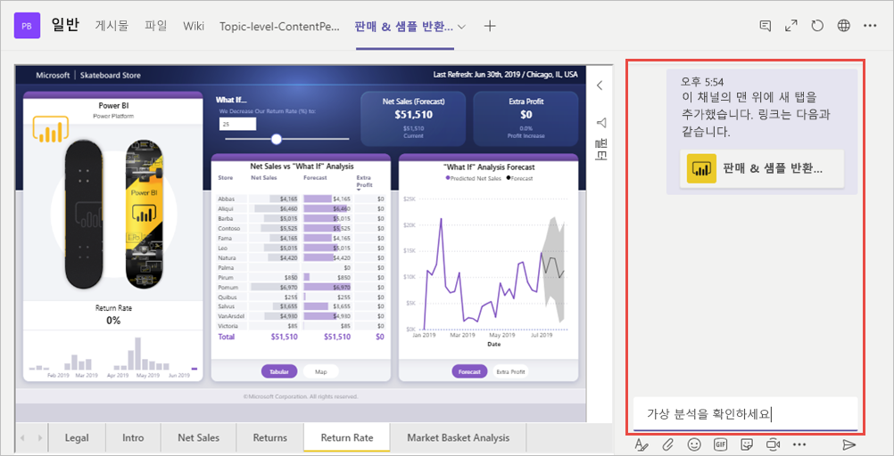

# Microsoft Teams의 Power BI 탭을 사용하여 보고서 포함

Microsoft Teams의 업데이트된 Power BI 탭을 사용하여 Microsoft Teams 채널 및 채팅에 대화형 보고서를 쉽게 포함할 수 있습니다.

Microsoft Teams의 Power BI 탭을 사용하여 동료가 팀에서 사용하는 데이터를 찾고 팀 채널 내에서 데이터에 대해 논의할 수 있습니다.

## 요구 사항

**Microsoft Teams의 Power BI 탭**이 작동하려면 다음이 필요합니다.

- Power BI Pro 라이선스 또는 보고서는 Power BI 라이선스를 포함한 [Power BI Premium 용량(EM 또는 P SKU)](service-premium-what-is.md)에 포함됩니다.
- Microsoft Teams의 Power BI 탭입니다.
- 사용자는 Power BI 서비스에 로그인하여 Power BI 라이선스를 활성화해야 보고서를 사용할 수 있습니다.
- 사용자에게 보고서를 볼 권한이 있어야 합니다.

## 보고서 포함
Microsoft Teams 채널 또는 채팅에 보고서를 포함하려면 아래 설명된 대로 보고서를 추가합니다.

1. Microsoft Teams에서 원하는 채널 또는 채팅을 열고 **+** 아이콘을 선택합니다.

    

2. Power BI 탭을 선택합니다.

    

3. 제공된 옵션을 사용하여 작업 영역, 공유한 항목 또는 Power BI 앱에서 보고서를 선택합니다.

    

4. 탭 이름은 보고서 이름과 일치하도록 자동으로 업데이트되지만 변경할 수 있습니다. 

5. **저장**을 누릅니다.

## 지원되는 보고서

탭에서는 다음과 같은 보고서를 포함할 수 있습니다.

- 대화형 및 페이지를 매긴 보고서
- 내 작업 영역, 새 작업 영역 환경 및 클래식 작업 영역의 보고서
- Power BI 앱의 보고서

## 보고서에 액세스 권한 부여

Microsoft Teams에 보고서를 포함해도 보고서를 볼 권한이 사용자에게 자동으로 부여되지 않습니다. [사용자가 Power BI에서 보고서를 볼 수 있도록 허용](service-share-dashboards.md)해야 합니다. 해당 팀의 Office 365 그룹을 사용하면 더 쉬워집니다. 

> [!IMPORTANT]
> Power BI 서비스 내에서 보고서를 볼 수 있는 사람이 누구인지 확인하고 목록에 없는 사람에게 액세스 권한을 부여합니다.

팀의 모든 사용자가 포함된 보고서에 액세스할 수 있도록 하는 한 가지 방법은 Power BI의 단일 작업 영역에 저장하고 작업 영역에 대한 액세스 권한을 팀의 Office 365 그룹에 제공하는 것입니다.

## 대화 시작

Teams에 Power BI 보고서 탭을 추가하면 Teams에서는 자동으로 보고서와 함께 탭 대화를 만듭니다. 

- 오른쪽 위 모서리에서 **탭 대화 표시**를 선택합니다.

    

    첫 번째 설명은 보고서의 링크입니다. 해당 Teams 채널의 모든 사용자가 대화에서 보고서를 보고 토론할 수 있습니다.

    

## 알려진 문제 및 제한 사항

- Power BI는 Microsoft Teams에서 지원하는 것과 동일한 지역화된 언어를 지원하지 않습니다. 결과적으로 포함된 보고서 내에 적절한 지역화가 표시되지 않을 수 있습니다.
- Power BI 대시보드는 Microsoft Teams의 Power BI 탭에 포함될 수 없습니다.
- Power BI 라이선스 또는 보고서에 대한 권한이 없는 사용자에게는 “콘텐츠를 사용할 수 없습니다.”라는 메시지가 표시됩니다.
- Internet Explorer 10을 사용하는 경우 문제가 발생할 수 있습니다. <!--You can look at the [browsers support for Power BI](consumer/end-user-browsers.md) and for [Office 365](https://products.office.com/office-system-requirements#Browsers-section). -->
- Microsoft Teams의 Power BI 탭에서는 [URL 필터](service-url-filters.md)를 지원하지 않습니다.
- 국가별 클라우드에서는 새 Power BI 탭을 사용할 수 없으며, 새 Power BI 앱의 새 작업 영역 환경 작업 영역 또는 보고서를 지원하지 않는 이전 버전을 사용할 수 있습니다. 
- 탭이 저장되면 탭 설정을 통해 탭 이름을 변경할 수 없습니다. [이름 바꾸기] 옵션을 사용하여 변경합니다.

## 다음 단계
- [동료 및 다른 사용자와 대시보드 공유](service-share-dashboards.md)  
- [Power BI에서 앱 만들기 및 배포](service-create-distribute-apps.md)  
- [Power BI 프리미엄이란?](service-premium-what-is.md)

궁금한 점이 더 있나요? [Power BI 커뮤니티에 질문합니다.](https://community.powerbi.com/)
