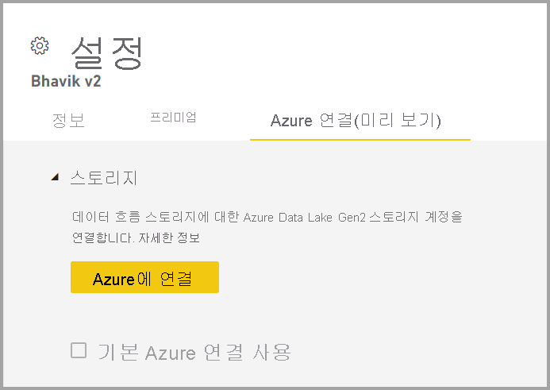
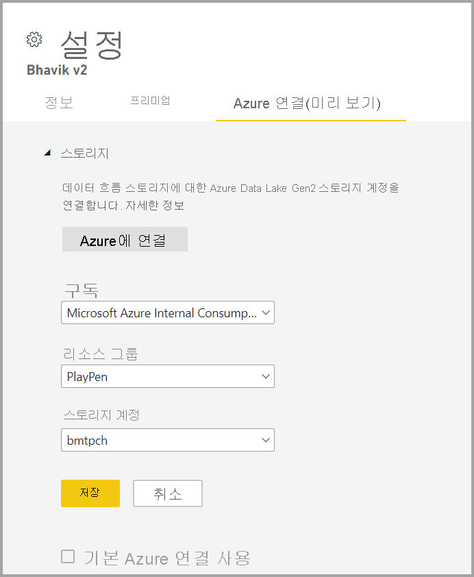

# Azure Data Lake Gen 2를 사용하도록 데이터 흐름 스토리지 구성 

Power BI에 사용되는 데이터는 기본적으로 Power BI에서 제공하는 내부 스토리지에 저장됩니다. 데이터 흐름 및 ADLS Gen2(Azure Data Lake Storage Gen 2)를 통합하면 조직의 Azure Data Lake Storage Gen2 계정에 데이터 흐름을 저장할 수 있습니다.

사용할 ADLS Gen 2 저장소를 구성하는 방법에는 두 가지가 있습니다. 테넌트 할당 ADLS Gen 2 계정을 사용하거나 작업 영역 수준에서 자체 ADLS Gen 2 저장소를 가져올 수 있습니다. 

## 필수 구성 요소

자체 ADLS Gen 2 계정을 가져오려면 스토리지 계정, 리소스 그룹 또는 구독 계층에서 소유자 권한이 있어야 합니다. 관리자인 경우에도 자신에게 소유자 권한을 할당해야 합니다. 

또한 ADLS Gen 2 계정은 Power BI 테넌트와 동일한 지역에 배포해야 합니다. 리소스의 위치가 동일한 지역에 없는 경우 오류가 발생합니다.

마지막으로, 관리 포털에서 모든 ADLS Gen 2에 연결할 수 있지만, 작업 영역에 직접 연결하는 경우 연결하기 전에 먼저 작업 영역에 데이터 흐름이 없는지 확인해야 합니다.

## 작업 영역에서 Azure Data Lake Gen 2에 연결
데이터 흐름이 없는 작업 영역으로 이동합니다. **Azure 연결** 이라는 새 탭에 대한 **작업 영역 설정** 을 선택합니다. **Azure 연결** 탭을 선택한 다음, **스토리지** 섹션을 선택합니다.

 
테넌트가 이미 ADLS Gen 2를 구성한 경우 **기본 Azure 연결 사용** 옵션이 표시됩니다. 두 가지 옵션이 있습니다. **기본 Azure 연결 사용** 이라는 상자를 선택하여 테넌트 구성 ADLS Gen 2를 사용하거나 **Azure에 연결** 을 선택하여 새 Azure Storage 계정을 가리킵니다. 

**Azure에 연결** 을 선택하면 Power BI는 액세스 권한이 있는 Azure 구독 목록을 검색합니다. 드롭다운을 입력하고 ADLS Gen2 플래그를 나타내는 계층 구조 네임스페이스 옵션이 사용되는 유효한 Azure 구독, 리소스 그룹 및 스토리지 계정을 선택합니다.

 
선택된 후 **저장** 을 선택하며, 이제 작업 영역을 자체 ADLS Gen2 계정에 성공적으로 연결했습니다. Power BI는 필요한 권한으로 스토리지 계정을 자동으로 구성하고 데이터가 기록될 Power BI 파일 시스템을 설정합니다. 이때 해당 작업 영역 내에 있는 모든 데이터 흐름의 데이터는 이 파일 시스템에 직접 기록됩니다. 해당 파일 시스템을 다른 Azure 서비스와 함께 사용하여 모든 조직 또는 부서 데이터의 단일 원본을 만들 수 있습니다.

## 작업 영역 또는 테넌트에서 Azure Data Lake Gen 2 분리

작업 영역 수준에서 연결을 제거하려면 먼저 작업 영역의 모든 데이터 흐름이 삭제되었는지 확인해야 합니다. 모든 데이터 흐름이 제거되면 작업 영역 설정에서 **연결 끊기** 를 선택합니다. 테넌트에도 동일하게 적용되지만, 테넌트 수준에서 연결을 끊으려면 먼저 테넌트 스토리지 계정에서 모든 작업 영역의 연결이 끊어졌는지 확인해야 합니다.

## Azure Data Lake Gen 2 사용 안 함

**관리 포털** 의 **데이터 흐름** 에서 사용자가 해당 기능을 사용하는 액세스 권한을 사용하지 않도록 설정할 수 있고 작업 영역 관리자가 자체 Azure Storage를 가져오도록 허용하지 않을 수 있습니다.

## 다음 단계
다음 문서에서는 데이터 흐름 및 Power BI에 관한 자세한 정보를 제공합니다.

* [데이터 흐름 및 셀프 서비스 데이터 준비 소개](dataflows-introduction-self-service.md)
* [데이터 흐름 만들기](dataflows-create.md)
* [데이터 흐름 구성 및 사용](dataflows-configure-consume.md)
* [데이터 흐름의 프리미엄 기능](dataflows-premium-features.md)
* [데이터 흐름에서 AI 사용](dataflows-machine-learning-integration.md)
* [데이터 흐름 제한 사항 및 고려 사항](dataflows-features-limitations.md)
* [데이터 흐름 모범 사례](dataflows-best-practices.md)