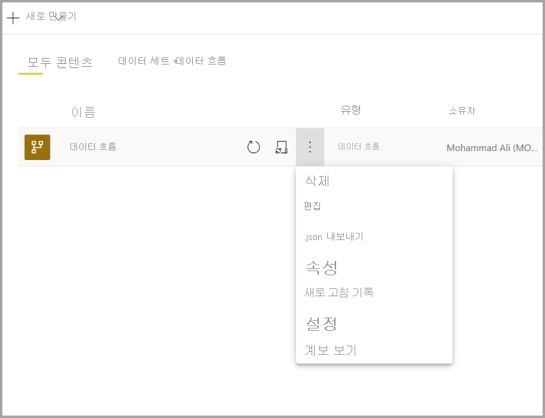
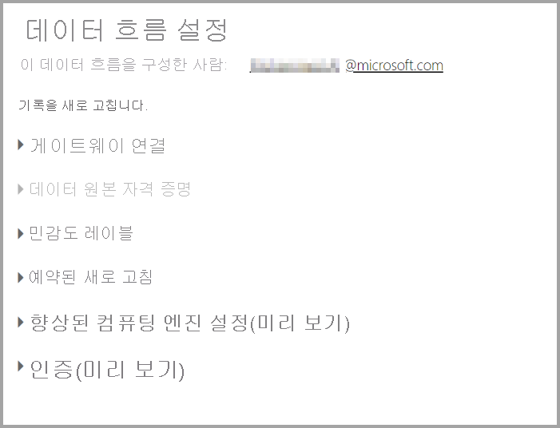
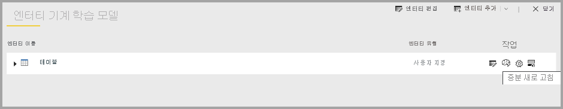
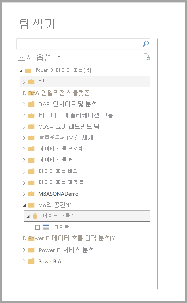

# 데이터 흐름 구성 및 사용

데이터 흐름을 사용하면 여러 원본의 데이터를 통합하고 모델링을 위해 해당 통합 데이터를 준비할 수 있습니다. 데이터 흐름을 만들 때마다 데이터 흐름의 데이터를 새로 고치라는 메시지가 표시됩니다. 데이터가 Power BI Desktop 내부 데이터 세트에서 사용되거나 연결된 엔터티 또는 계산된 엔터티로 참조되기 전에 데이터 흐름을 새로 고쳐야 합니다.

## 데이터 흐름 구성

데이터 흐름의 새로 고침을 구성하려면 **기타** 메뉴(줄임표)를 선택하고 **설정** 을 선택합니다.

다음 섹션에서 설명하는 것처럼 **설정** 옵션은 데이터 흐름의 다양한 옵션을 제공합니다.

* **소유권 가져오기:** 데이터 흐름의 소유자가 아닌 경우 해당 설정의 대부분을 사용할 수 없습니다. 데이터 흐름의 소유권을 가져오려면 **인수** 를 선택하여 제어권을 가져옵니다. 필요한 액세스 수준이 있는지 확인하기 위해 자격 증명을 제공하라는 메시지가 표시됩니다.

* **게이트웨이 연결:** 이 섹션에서는 데이터 흐름이 게이트웨이를 사용하는지 여부를 선택하고 사용할 게이트웨이를 선택할 수 있습니다. 

* **데이터 원본 자격 증명:** 이 섹션에서는 사용 중인 자격 증명을 선택하며 데이터 원본에 대한 인증 방법을 변경할 수 있습니다.

* **민감도 레이블:** 여기에서 데이터 흐름에 있는 데이터의 민감도를 정의할 수 있습니다. 민감도 레이블에 관한 자세한 내용은 [Power BI에서 민감도 레이블을 적용하는 방법](../../admin/service-security-apply-data-sensitivity-labels.md)을 참조하세요.

* **예약된 새로 고침:** 여기에서 선택한 데이터 흐름을 새로 고치는 시간을 정의할 수 있습니다. 데이터 흐름은 데이터 세트와 동일한 빈도로 새로 고칠 수 있습니다.

* **향상된 컴퓨팅 엔진 설정:** 여기에서 데이터 흐름을 컴퓨팅 엔진 내에 저장할지 여부를 정의할 수 있습니다. 컴퓨팅 엔진을 사용하면 이 데이터 흐름을 참조하는 후속 데이터 흐름이 병합과 조인 및 기타 변환을 훨씬 더 빠르게 수행할 수 있습니다. 또한 데이터 흐름에 대해 DirectQuery를 수행할 수 있습니다. **켜기** 를 선택하면 데이터 흐름이 DirectQuery 모드에서 항상 지원되며 모든 참조가 엔진을 활용합니다. **최적화됨** 을 선택하면 이 데이터 흐름에 대한 참조가 있는 경우에만 엔진이 사용됩니다. **끄기** 를 선택하면 이 데이터 흐름에서 컴퓨팅 엔진 및 DirectQuery 기능을 사용할 수 없습니다.

* **보증:** 데이터 흐름이 인증 또는 승격되는지 여부를 정의할 수 있습니다. 

## 데이터 흐름 새로 고침
데이터 흐름은 서로를 기반으로 구성 요소 역할을 합니다. ‘원시 데이터’라는 데이터 흐름과 ‘원시 데이터’ 데이터 흐름에 대한 연결된 엔터티를 포함하는 ‘변환된 데이터’라는 연결된 엔터티가 있다고 가정합니다.   ‘원시 데이터’ 데이터 흐름의 새로 고침 예약이 트리거되면 완료 시 해당 데이터 흐름을 참조하는 모든 데이터 흐름이 트리거됩니다. 이 기능은 새로 고침의 체인 효과를 만들기 때문에 데이터 흐름을 수동으로 예약하지 않아도 됩니다. 연결된 엔터티 새로 고침을 처리할 때 알아야 할 몇 가지 미묘한 차이가 있습니다.

* 연결된 엔터티는 동일한 작업 영역에 있는 경우에만 새로 고침에 의해 트리거됩니다.

* 원본 엔터티를 새로 고치고 있는 경우 연결된 엔터티는 편집하지 못하도록 잠깁니다. 참조 체인에 있는 데이터 흐름을 하나라도 새로 고치지 못하면 모든 데이터 흐름이 이전 데이터로 롤백됩니다(데이터 흐름 새로 고침은 작업 영역 내에서 트랜잭션임).

* 원본 새로 고침 완료에 의해 트리거되는 경우에는 참조된 엔터티만 새로 고칩니다. 모든 엔터티를 예약하려면 연결된 엔터티에서도 새로 고침 예약을 설정해야 합니다. 이중 새로 고침을 방지하려면 연결된 데이터 흐름에서 새로 고침 일정을 설정하지 마세요.

**새로 고침 취소** 데이터 흐름은 데이터 세트와 달리 새로 고침을 취소하는 기능을 지원합니다. 새로 고침이 오래 실행되는 경우 데이터 흐름 옵션(데이터 흐름 옆의 줄임표)을 선택한 다음, **새로 고침 취소** 를 선택할 수 있습니다.

**증분 새로 고침(프리미엄 전용)** 데이터 흐름은 증분 방식으로 새로 고치도록 설정될 수도 있습니다. 이렇게 하려면 증분 새로 고침을 위해 설정할 데이터 흐름을 선택하고 증분 새로 고침 아이콘을 선택합니다.

증분 새로 고침을 설정하면 날짜 범위를 지정하는 매개 변수가 데이터 흐름에 추가됩니다. 증분 새로 고침을 설정하는 방법에 관한 자세한 내용은 [파워 쿼리의 증분 새로 고침](/power-query/dataflows/incremental-refresh) 문서를 참조하세요.

증분 새로 고침을 설정하면 안 되는 경우도 있습니다.

* 데이터 흐름을 참조하는 연결된 엔터티는 증분 새로 고침을 사용하면 안 됩니다. 데이터 흐름은 쿼리 폴딩을 지원하지 않습니다(엔터티가 DirectQuery를 지원하는 경우에도). 

* 데이터 흐름을 참조하는 데이터 세트는 증분 새로 고침을 사용하지 않아야 합니다. 데이터 흐름에 대한 새로 고침은 일반적으로 성능이 우수하므로 증분 새로 고침이 필요하지 않습니다. 새로 고침이 너무 오래 걸리면 컴퓨팅 엔진 또는 DirectQuery 모드를 사용하는 것이 좋습니다.

## 데이터 흐름 사용

데이터 흐름은 다음 세 가지 방법으로 사용할 수 있습니다.

* 다른 데이터 흐름 작성자가 데이터를 사용할 수 있도록 데이터 흐름에서 연결된 엔터티 만들기

* 사용자가 보고서를 만드는 데 데이터를 이용할 수 있도록 데이터 흐름에서 데이터 세트 만들기

* CDM 형식에서 읽을 수 있는 외부 도구에서 연결 만들기

**Power BI Desktop에서 사용** 데이터 흐름을 사용하려면 Power BI Desktop을 실행하고 **데이터 가져오기** 대화 상자에서 **Power BI 데이터 흐름 커넥터** 를 선택합니다.

> [!NOTE]
> Power BI 데이터 흐름 커넥터는 현재 로그인한 사용자와 다른 자격 증명 세트를 사용합니다. 이는 다중 테넌트 사용자를 지원하기 위해 의도된 것입니다.

연결하려는 데이터 흐름 및 엔터티를 선택합니다. 

> [!NOTE]
> 데이터 흐름 또는 엔터티가 어떤 작업 영역에 있는지, 그리고 프리미엄 또는 비프리미엄 작업 영역에서 정의되었는지와 관계없이 해당 항목에 연결할 있습니다.

DirectQuery를 사용할 수 있는 경우 DirectQuery 또는 가져오기를 통해 엔터티에 연결할지 여부를 선택하라는 메시지가 표시됩니다. 

DirectQuery 모드에서는 로컬에서 대규모 데이터 세트를 신속하게 조사할 수 있습니다. 그러나 추가 변환은 수행할 수 없습니다. 

가져오기를 사용하여 데이터를 Power BI로 가져오며 가져오기를 사용하려면 데이터 흐름과 별도로 데이터 세트를 새로 고쳐야 합니다.

## 다음 단계
다음 문서에서는 데이터 흐름 및 Power BI에 관한 자세한 정보를 제공합니다.

* [데이터 흐름 및 셀프 서비스 데이터 준비 소개](dataflows-introduction-self-service.md)
* [데이터 흐름 만들기](dataflows-create.md)
* [Azure Data Lake Gen 2를 사용하도록 데이터 흐름 스토리지 구성](dataflows-azure-data-lake-storage-integration.md)
* [데이터 흐름의 프리미엄 기능](dataflows-premium-features.md)
* [데이터 흐름에서 AI 사용](dataflows-machine-learning-integration.md)
* [데이터 흐름 제한 사항 및 고려 사항](dataflows-features-limitations.md)
* [데이터 흐름 모범 사례](dataflows-best-practices.md)