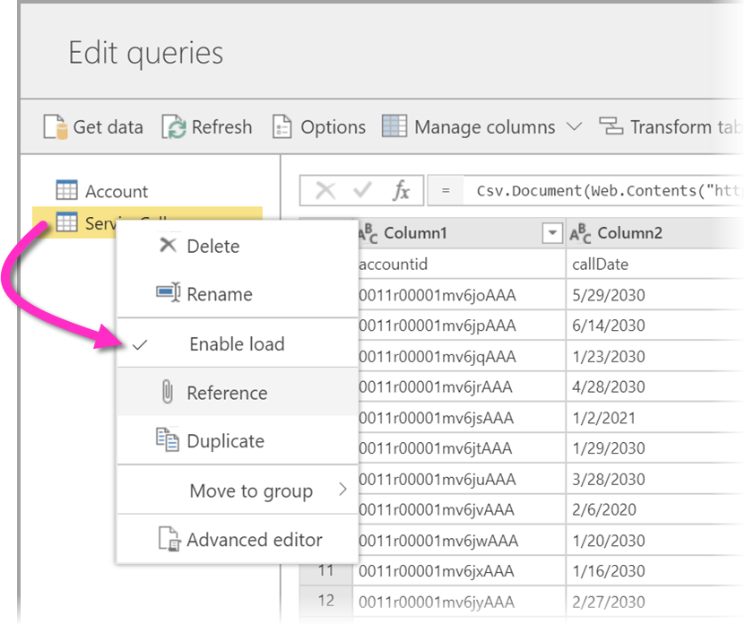
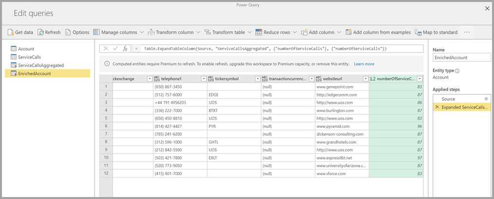

# 데이터 흐름 만들기
**데이터 흐름** 은 Power BI 서비스의 작업 영역에서 만들고 관리하는 ‘엔터티’(엔터티는 테이블과 유사함) 컬렉션입니다. **엔터티/테이블** 은 데이터를 저장하는 데 사용되는 필드 세트로, 데이터베이스 내의 테이블과 매우 유사합니다. 데이터 흐름이 만들어진 작업 영역에서 직접 데이터 흐름의 엔터티/테이블을 추가 및 편집할 수 있고 데이터 새로 고침 일정도 관리할 수 있습니다.

데이터 흐름을 만들려면, 브라우저에서 Power BI 서비스를 시작하고 다음 화면에 표시된 것처럼 왼쪽 탐색 창에서 **작업 영역** 을 선택합니다(Power BI 서비스의 *내 작업영역* 에서는 데이터 흐름을 사용할 수 없음). 새 데이터 흐름을 만들 새 작업 영역을 만들 수도 있습니다.

새 데이터 흐름을 기반으로 만들거나 빌드하는 방법에는 여러 가지가 있습니다.

* [새 엔터티 정의를 사용하여 데이터 흐름 만들기](#create-a-dataflow-using-define-new-entities)
* [연결된 엔터티를 사용하여 데이터 흐름 만들기](#create-a-dataflow-using-linked-entities)
* [계산된 엔터티를 사용하여 데이터 흐름 만들기](#create-a-dataflow-using-a-computed-entity)
* [가져오기/내보내기를 사용하여 데이터 흐름 만들기](#create-a-dataflow-using-importexport)

다음 섹션에서는 데이터 흐름을 만드는 관련 방법을 각각 자세히 살펴봅니다.

## 새 엔터티 정의를 사용하여 데이터 흐름 만들기

새 엔터티 정의 옵션을 사용하여 새 엔터티/테이블을 정의하고 새 데이터 원본에 연결할 수 있습니다.

데이터 원본을 선택하면 다음 이미지에 표시된 대로 데이터 원본에 연결할 때 사용할 계정을 비롯한 연결 설정을 입력하라는 메시지가 표시됩니다.

데이터 원본에 연결되면 엔터티에 사용할 데이터를 선택할 수 있습니다. 데이터 및 원본을 선택하면 나중에 설정 프로세스에서 선택하는 빈도로 데이터 흐름의 데이터를 계속 새로 고치도록 Power BI가 데이터 원본에 다시 연결합니다.

엔터티에 사용할 데이터를 선택하면 데이터 흐름 편집기를 사용하여 해당 데이터를 데이터 흐름에 사용하는 데 필요한 형식으로 구성하거나 변환할 수 있습니다. 

## 연결된 엔터티를 사용하여 데이터 흐름 만들기

연결된 엔터티를 사용하여 데이터 흐름을 만들면 다른 데이터 흐름에 정의된 기존 엔터티를 읽기 전용 방식으로 참조할 수 있습니다. 다음 목록에서는 이 접근 방식을 선택할 수 있는 몇 가지 이유를 설명합니다.

* 날짜 엔터티 또는 정적 조회 테이블과 같은 여러 데이터 흐름에서 엔터티를 다시 사용하려면 엔터티를 한 번 만든 다음, 다른 데이터 흐름에서 참조해야 합니다.

* 데이터 원본에 대한 여러 새로 고침을 생성하지 않으려면 연결된 엔터티를 사용하여 데이터를 저장하고 캐시 역할을 수행하는 것이 좋습니다. 이렇게 하면 모든 후속 소비자가 해당 엔터티를 이용하여 기본 데이터 원본에 대한 부하를 줄일 수 있습니다.

* 두 엔터티 간에 병합을 수행해야 하는 경우.

> [!NOTE]
> 연결된 엔터티는 Power BI Premium에서만 사용할 수 있습니다.

## 계산된 엔터티를 사용하여 데이터 흐름 만들기

계산된 엔터티를 사용하여 데이터 흐름을 만들면 연결된 엔터티를 참조하고 데이터 흐름을 기반으로 쓰기 전용 방식으로 작업을 수행할 수 있습니다. 결과는 데이터 흐름의 일부인 새 엔터티입니다. 연결된 엔터티를 계산된 엔터티로 변환하려면 병합 작업에서 새 쿼리를 만들고, 엔터티를 편집 또는 변환하려는 경우에는 엔터티의 참조 또는 중복을 만들면 됩니다.

### 계산된 엔터티를 만드는 방법

엔터티 목록이 있는 데이터 흐름이 있으면 해당 엔터티에서 계산을 수행할 수 있습니다.
Power BI 서비스의 데이터 흐름 제작 도구에서 **엔터티 편집** 을 선택한 후 계산된 엔터티의 기초로 사용하고 계산을 수행할 엔터티를 마우스 오른쪽 단추로 클릭합니다. 상황에 맞는 메뉴에서 **참조** 를 선택합니다.
엔터티가 계산된 엔터티로 적합하려면 다음 이미지에 표시된 대로 **로드 사용** 선택 항목이 선택되어 있어야 합니다. 이 상황에 맞는 메뉴를 표시할 엔터티를 마우스 오른쪽 단추로 클릭합니다.

**로드 사용** 을 선택하여 해당 소스가 참조된 엔터티인 새 엔터티를 만듭니다. 다음 이미지에 표시된 대로 아이콘이 변경되어 **계산된** 아이콘이 표시됩니다.

새로 만든 엔터티에서 수행하는 모든 변환은 Power BI 데이터 흐름 스토리지에 이미 상주하는 데이터에서 실행됩니다. 즉, 쿼리가 데이터를 가져온 외부 데이터 원본(예: 데이터를 끌어온 SQL Database)에 대해 실행되지 않고 데이터 흐름 스토리지에 상주하는 데이터에서 수행됩니다.

**예제 사용 사례** 계산된 엔터티로 어떤 종류의 변환을 수행할 수 있나요? 스토리지 내 계산을 수행하는 경우 Power BI 또는 M 편집기의 변환 사용자 인터페이스를 사용하여 일반적으로 지정하는 모든 변환이 지원됩니다.

다음과 같은 예를 고려해 보세요. Dynamics 365 구독의 모든 고객에 대한 원시 데이터가 포함된 ‘계정’ 엔터티가 있습니다. 해당 연도에 매일 다른 계정에서 수행한 지원 통화 데이터가 포함되어 있는 서비스 센터의 *ServiceCalls* 원시 데이터도 있습니다.

*ServiceCalls* 의 데이터로 ‘계정’ 엔터티를 보강하려 한다고 가정해 보겠습니다.
먼저 *ServiceCalls* 에서 데이터를 집계하여 작년에 각 계정에 대해 수행된 지원 통화 수를 계산해야 합니다.

다음으로는 ‘계정’ 엔터티를 *ServiceCallsAggregated* 엔터티와 병합하여 보강된 *계정* 테이블을 계산할 것입니다.

그러면 다음 이미지에 *EnrichedAccount* 로 표시된 것과 같은 결과를 볼 수 있습니다.

됐습니다. 변환은 원본 데이터가 아니라 Power BI Premium 구독에 상주하는 데이터 흐름의 데이터에서 수행됩니다.

> [!NOTE]
> 계산된 엔터티는 프리미엄 전용 기능입니다.

## CDM 폴더를 사용하여 데이터 흐름 만들기

CDM 폴더에서 데이터 흐름을 만들면 CDM(Common Data Model) 형식의 다른 애플리케이션에서 작성된 엔터티를 참조할 수 있습니다. ADLS Gen 2에 저장된 CDM 형식 파일의 전체 경로를 입력하라는 메시지가 표시됩니다.

 

다음 목록의 설명대로 CDM 폴더에서 데이터 흐름을 만들기 위한 몇 가지 요구 사항이 있습니다.

* PBI가 파일에 액세스하려면 ADLS Gen 2 계정에 적절한 권한이 설정되어 있어야 합니다.

* 사용자가 데이터 흐름을 만들려고 할 때 ADLS Gen 2 계정에 액세스할 수 있어야 합니다.

* CDM 폴더에서 데이터 흐름을 만드는 기능은 새 작업 영역 환경에서’만’ 사용할 수 있습니다.

* URL은 JSON 파일의 직접 파일 경로이고 ADLS Gen 2 엔드포인트를 사용해야 합니다. blob.core는 지원되지 않습니다.

## 가져오기/내보내기를 사용하여 데이터 흐름 만들기

가져오기/내보내기를 사용하여 데이터 흐름을 만들면 파일에서 데이터 흐름을 가져올 수 있습니다. 이 방법은 데이터 흐름 복사본을 오프라인으로 저장하거나 작업 영역 간에 데이터 흐름을 이동하려는 경우에 유용합니다. 

데이터 흐름을 내보내려면 직접 만든 데이터 흐름을 선택하고 **기타** 메뉴 항목(줄임표)을 선택하여 옵션을 확장한 다음, **export .json** 을 선택합니다. CDM 형식으로 표현된 데이터 흐름의 다운로드를 시작하라는 메시지가 표시됩니다.

데이터 흐름을 가져오려면 가져오기 상자를 선택하고 파일을 업로드합니다. Power BI에서 데이터 흐름을 만들고 데이터 흐름을 있는 그대로 저장하거나 추가 변환을 수행할 수 있습니다.

## 다음 단계

데이터 흐름을 만들면 Power BI Desktop 및 Power BI 서비스를 사용하여 Power BI 데이터 흐름에 지정하는 데이터를 기반으로 한 데이터 세트, 보고서, 대시보드 및 앱을 만들 수 있으므로 비즈니스 활동에 대한 인사이트를 얻을 수 있습니다. 다음 문서에서는 데이터 흐름의 일반적인 사용 시나리오를 자세히 설명합니다.

* [데이터 흐름 및 셀프 서비스 데이터 준비 소개](dataflows-introduction-self-service.md)
* [데이터 흐름 구성 및 사용](dataflows-configure-consume.md)
* [Azure Data Lake Gen 2를 사용하도록 데이터 흐름 스토리지 구성](dataflows-azure-data-lake-storage-integration.md)
* [데이터 흐름의 프리미엄 기능](dataflows-premium-features.md)
* [데이터 흐름에서 AI 사용](dataflows-machine-learning-integration.md)
* [데이터 흐름 제한 사항 및 고려 사항](dataflows-features-limitations.md)
* [데이터 흐름 모범 사례](dataflows-best-practices.md)