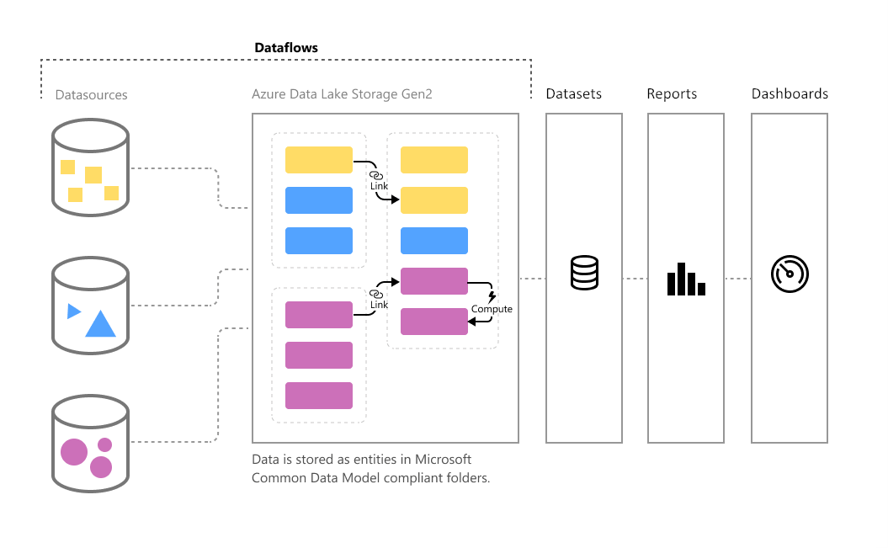

# 데이터 흐름 및 셀프 서비스 데이터 준비 소개

데이터 볼륨이 증가함에 따라 잘 구성된 실행 가능 정보로 데이터를 랭글링하는 문제도 증가하고 있습니다. 우리는 시각적 개체, 보고서 및 대시보드를 채워 빠르게 데이터 볼륨을 실행 가능한 인사이트로 전환할 수 있는 분석 준비가 된 데이터가 필요합니다. Power BI의 빅 데이터용 셀프 서비스 데이터 준비를 사용하면 몇 번의 클릭만으로 데이터를 Power BI 인사이트로 전환할 수 있습니다.

## 데이터 흐름을 사용하는 경우

데이터 흐름은 다음 시나리오를 지원하도록 디자인되었습니다.

* Power BI 내부에서 여러 데이터 세트 및 보고서가 공유할 수 있는 재사용 가능한 변환 논리를 만듭니다. 데이터 흐름은 기본 데이터 요소의 재사용 가능성을 높이므로 클라우드 또는 온-프레미스 데이터 원본에 대한 별도의 연결을 만들 필요가 없습니다.

* 자체 Azure Data Lake Gen 2 스토리지에서 데이터를 공개하여 다른 Azure 서비스를 원시 기본 데이터에 연결할 수 있습니다.

* 기본 시스템에 연결하는 대신 분석가가 데이터 흐름에 연결하도록 함으로써 단일 정보 출처를 만들어 액세스할 데이터 및 보고서 작성자에게 데이터를 공개하는 방법을 제어할 수 있습니다. 또한 데이터를 산업 표준 정의에 매핑하여 Power Platform의 다른 서비스 및 제품을 사용할 수 있는 깔끔하게 조정된 보기를 만들 수 있습니다.

* 대규모 데이터 볼륨을 사용하고 대규모로 ETL을 수행하려는 경우 Power BI Premium을 사용하여 데이터 흐름을 더 효율적으로 스케일링하고 유연성을 높일 수 있습니다. 데이터 흐름은 광범위한 클라우드 및 온-프레미스 원본을 지원합니다. 

* 분석가가 기본 데이터 원본에 직접 액세스할 수 없도록 합니다. 보고서 작성자가 데이터 흐름을 기반으로 빌드할 수 있으므로 기본 데이터 원본에 대한 액세스를 몇몇 개인에게만 허용한 다음, 분석가가 빌드 기반으로 사용할 데이터 흐름에 대한 액세스를 제공하는 것이 더 편리할 수 있습니다. 이 접근 방식을 사용하면 기본 시스템에 대한 부하가 감소하며 관리자는 시스템이 새로 고침에서 로드되는 시기를 더 세밀하게 제어할 수 있습니다.

데이터 흐름을 만들면 Power BI Desktop 및 Power BI 서비스를 사용하여 Common Data Model을 활용한 데이터 세트, 보고서, 대시보드 및 앱을 만들어 비즈니스 활동에 대한 깊이 있는 인사이트를 얻을 수 있습니다. 데이터 흐름 새로 고침 예약은 데이터 세트와 마찬가지로 데이터 흐름을 만든 작업 영역에서 직접 관리합니다.

## 다음 단계
이 문서에는 Power BI의 빅 데이터용 셀프 서비스 데이터 준비에 대한 개요와 이 기능을 사용할 수 있는 여러 방법이 제공되어 있습니다. 

다음 문서에서는 데이터 흐름 및 Power BI에 관한 자세한 정보를 제공합니다.

* [데이터 흐름 만들기](dataflows-create.md)
* [데이터 흐름 구성 및 사용](dataflows-configure-consume.md)
* [Azure Data Lake Gen 2를 사용하도록 데이터 흐름 스토리지 구성](dataflows-azure-data-lake-storage-integration.md)
* [데이터 흐름의 프리미엄 기능](dataflows-premium-features.md)
* [데이터 흐름에서 AI 사용](dataflows-machine-learning-integration.md)
* [데이터 흐름 제한 사항 및 고려 사항](dataflows-features-limitations.md)

공통 데이터 모델에 대한 자세한 내용은 해당 개요 문서를 참조할 수 있습니다.
* [Common Data Model - 개요](https://docs.microsoft.com/powerapps/common-data-model/overview)