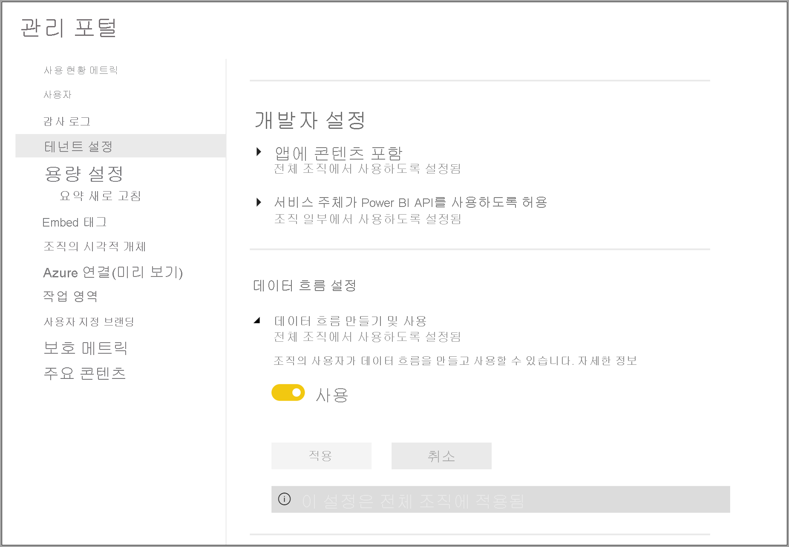
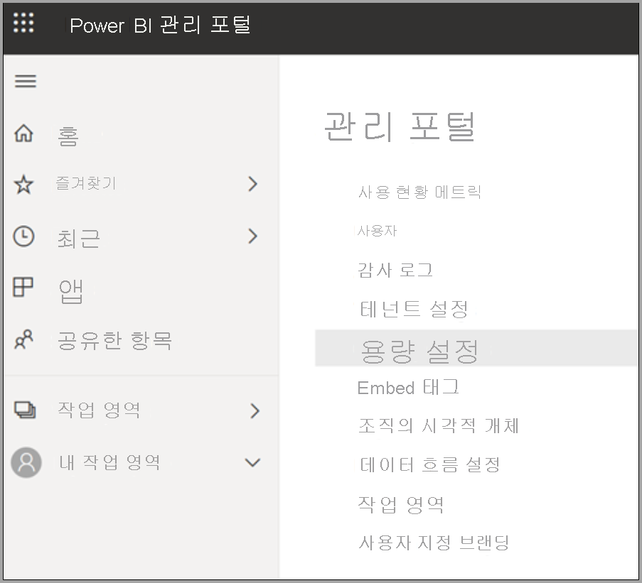
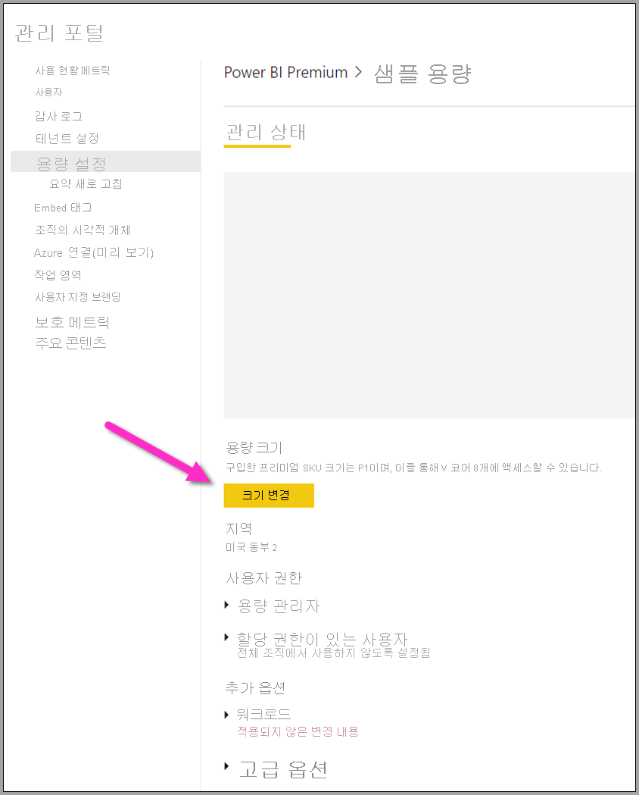

# Power BI Premium 데이터 흐름 워크로드 구성

Power BI Premium 구독에서 데이터 흐름 워크로드를 만들 수 있습니다. Power BI는 ‘워크로드’ 개념을 사용하여 프리미엄 콘텐츠를 설명합니다. 워크로드에는 데이터 세트, 페이지를 매긴 보고서, 데이터 흐름 및 AI가 포함됩니다. ‘데이터 흐름’ 워크로드를 사용하면 데이터 흐름 셀프 서비스 데이터 준비를 사용하여 데이터를 수집, 변환, 통합 및 보강할 수 있습니다. Power BI Premium 데이터 흐름은 **관리 포털** 에서 관리됩니다.

다음 섹션에서는 조직에서 데이터 흐름을 사용하도록 설정하는 방법, 프리미엄 용량의 설정을 구체화하는 방법 및 일반적인 사용 지침을 설명합니다.

## Power BI Premium에서 데이터 흐름 사용

Power BI Premium 구독에서 데이터 흐름을 사용하기 위한 첫 번째 요구 사항은 조직을 위한 데이터 흐름을 만들고 사용하도록 설 하는 것입니다. **관리 포털** 에서 **테넌트 설정** 을 선택하고 다음 그림에 표시된 대로 **데이터 흐름 설정** 아래의 슬라이더를 **사용** 으로 전환합니다.

데이터 흐름 워크로드를 사용하도록 설정하면 기본 설정으로 구성됩니다. 이러한 설정은 원하는 대로 조정할 수 있습니다. 다음으로 이러한 설정이 있는 위치에 대해 설명하고, 각 설정에 대해 설명하며, 값을 변경하여 데이터 흐름 성능을 최적화할 수 있는 시기를 이해하는 데 도움을 줍니다.

## 데이터 흐름 설정 구체화

데이터 흐름을 사용하도록 설정한 다음에는 **관리 포털** 을 사용하여 데이터 흐름을 만드는 방법과 Power BI Premium 구독의 리소스를 사용하는 방법을 변경하거나 구체화할 수 있습니다. 다음 단계에서는 데이터 흐름 설정을 조정하는 방법을 보여 줍니다.

1. **관리 포털** 에서 **테넌트 설정** 을 선택하여 생성된 모든 용량을 나열합니다. 설정을 관리할 용량을 선택합니다.

    

2. Power BI Premium 용량에는 데이터 흐름에 사용할 수 있는 리소스가 반영됩니다. 다음 그림에 표시된 대로 **크기 변경** 단추를 선택하여 용량의 크기를 변경할 수 있습니다.

    

3. 용량 설정에서 **워크로드** 를 확장하여 데이터 흐름 설정을 구성할 수 있습니다.

    

4. **워크로드** 섹션에서 **데이터 흐름** 영역으로 스크롤합니다. 다음 이미지는 용량에 대한 데이터 흐름 워크로드의 동작을 제어하거나 구체화하는 데 사용할 수 있는 설정을 보여 줍니다.

    

다음 표에서는 데이터 흐름 설정에 대한 기본적인 설명을 제공합니다.

| **관리 섹션** | **설정 이름** | **설명** |
|---------|---------|---------|
| **용량 크기** | **크기 변경** | 현재 선택한 용량이 용량을 변경하는 옵션과 함께 나열됩니다. 이 설정을 변경하여 용량을 스케일 업하거나 다운할 수 있습니다. |
| **작업** | **최대 메모리(%)** | 데이터 흐름이 용량으로 사용할 수 있는 사용 가능한 메모리의 최대 비율입니다. |
| **작업** | **향상된 데이터 흐름 컴퓨팅 엔진** | 대규모 데이터 볼륨으로 작업할 때 컴퓨팅된 엔터티를 최대 20배 더 빠르게 계산하려면 이 옵션을 사용하도록 설정합니다.  **새 엔진을 활성화하려면 용량을 다시 시작해야 합니다.**  자세한 내용은 [향상된 데이터 흐름 컴퓨팅 엔진](../../admin/service-admin-premium-workloads.md#enhanced-dataflows-compute-engine)을 참조하세요. |
| **작업** | **컨테이너 크기** | 데이터 흐름에서 각 엔터티에 대해 데이터 흐름이 사용하는 컨테이너의 최대 크기입니다. 기본값은 700MB입니다. 자세한 내용은 [컨테이너 크기](../../admin/service-admin-premium-workloads.md#container-size)를 참조하세요. |
| **작업** | **컴퓨팅 엔진 메모리(%)** | 컴퓨팅 엔진에 할당된 메모리의 최대 백분율입니다. 기본값은 30%입니다. |

다음 섹션에서는 각 설정에 대해 자세히 설명하고 어떻게 데이터 흐름 워크로드에 영향을 주는지에 대해 설명합니다.

### 데이터 흐름 워크로드 옵션 이해

데이터 흐름 워크로드 옵션은 비유를 통해 간단하게 설명할 수 있습니다. ‘용량 크기’ 또는 사용하는 Power BI Premium 인스턴스 유형은 ‘레스토랑’이라고 생각할 수 있습니다. 레스토랑에는 ‘주방’에 해당하는 ‘워크로드 메모리’가 있습니다. ‘컴퓨팅 엔진’은 ‘오븐’이라고 할 수 있습니다. 마지막으로 ‘컨테이너’는 어느 정도 실력을 갖춘 ‘요리사’입니다. 데이터 흐름 워크로드 옵션을 평가하려면 성대한 저녁 식사나 매우 중요한 저녁 식사를 위해 음식을 준비한다고 생각해 보세요. 중요한 손님이 오고 있고 손님이 도착하는 시간까지 저녁 식사를 준비하여 제공해야 합니다.

각 설정에 대한 지침을 설명하고 제공할 때 이 레스토랑 비유를 사용합니다. Power BI Premium을 사용할 때 가장 먼저 선택하는 옵션이기 때문에 최상위 수준인 프리미엄 용량에서 시작합니다.

#### 프리미엄 용량 SKU - 하드웨어 스케일 업

Power BI Premium 워크로드는 프런트 엔드 및 백 엔드 코어를 함께 사용하여 다양한 워크로드 유형에서 신속한 쿼리를 제공합니다. [용량 노드](../../admin/service-premium-what-is.md#capacity-nodes) 문서에는 사용 가능한 각 워크로드 제품의 현재 사양을 보여 주는 차트가 포함되어 있습니다. 용량이 A3 이상이면 컴퓨팅 엔진을 활용할 수 있습니다. 따라서 향상된 컴퓨팅 엔진을 사용하려는 경우 [용량 노드](../../admin/service-premium-what-is.md#capacity-nodes)에서 시작합니다. 

레스토랑 비유에서 용량 선택은 고급 레스토랑을 선택하는 것과 같습니다. 더 높은 비용을 통해 프런트 엔드 코어, 백 엔드 코어 및 기타 메모리 증가로 인한 더 높은 수준의 성능을 예측할 수 있습니다. 더 큰 레스토랑으로 이동하면 더 큰 주방, 더 뛰어난 요리사를 이용할 수 있으며, 이는 Power BI Premium에서 더 높은 SKU로 업그레이드하여 CPU 속도 향상, 작업당 메모리 증가, 더 많은 병렬 처리 추가와 같은 이점을 제공하는 것과 유사합니다.

#### 최대 메모리 - 데이터 흐름에 대한 전용 용량 지정 

**최대 메모리(%)** 설정은 데이터 흐름 워크로드에 대해 제공되는 메모리 중에서 프리미엄 용량에 사용 가능한 실제 메모리의 백분율입니다. 데이터 흐름 워크로드에 대해 최대 전체 용량을 효과적으로 전용으로 지정할 수 있으며, 용량은 설정한 할당에 따라 동적으로 스케일 업됩니다. 레스토랑 비유에서 주방을 더 크게 만들면 더 많은 음식을 요리할 수 있습니다. 마찬가지로 데이터 흐름에 대한 용량의 워크로드 크기를 늘리면 더 많은 데이터 흐름을 허용할 수 있습니다. 동적 리소스 거버넌스가 있으면 ‘최대 메모리(%)’ 구성 옵션을 사용하여 데이터 흐름 워크로드에 대해 100%의 메모리를 전용으로 지정할 수 있습니다. 리소스 거버넌스를 사용하기보다는 용량의 메모리를 데이터 흐름 워크로드에 사용 가능하게 하려는 아주 드문 경우입니다. 레스토랑 비유에서는 손님을 위한 특정 음식 준비를 위해 주방을 사용하도록 하여 전체 주방을 해당 작업 전용으로 사용하는 것과 유사합니다. 물론 더 많은 공간을 전용으로 지정한다고 해서 더 맛있는 음식을 제공하거나 더 빨리 제공할 수 있는 것은 아닙니다. 이 부분은 다음 섹션에서 설명합니다.

#### 컨테이너 크기 - 새로 고침 또는 메모리 부족 문제

다음으로 **컨테이너 크기(MB)** 설정에 대해 살펴보겠습니다. 내부적으로 데이터 흐름은 ‘매시업 컨테이너’라는 프로세스를 사용하여 ETL 프로세스를 평가합니다. 엔진은 쿼리 논리를 이러한 컨테이너로 분할하고 병렬로 처리할 수 있습니다. 컨테이너 수는 동시 처리를 효과적으로 제공하고 성능을 향상시킵니다. 이러한 컨테이너는 첫 번째로 **용량** 의 제약을 받고, 두 번째로 **최대 메모리(%)** 의 제약을 받으며, 다음으로 컨테이너 설정에서 특별히 할당한 메모리양(기본적으로 700MB임)의 제약을 받습니다. 따라서 하드웨어 메모리의 양을 늘리고 컨테이너 크기를 늘릴 수 있지만, 그렇게 하면 병렬 작업이 줄어들며 컨테이너 내에서 특정 ETL 프로세스에 더 많은 메모리를 전용으로 지정합니다. 컨테이너 수는 백 엔드 코어 수의 3배로 제한됩니다. 이 제한은 컨테이너는 너무 작게 만들 수 없고 이후에는 많은 병렬 컨테이너가 있을 수 있기 때문에 중요합니다. 컨테이너를 만들 수 있는 최소 크기는 200MB입니다. 컨테이너 크기는 쿼리 수준으로 범위가 지정됩니다. 즉, 쿼리가 다른 쿼리를 참조하는 경우를 제외하고 각 쿼리는 자체 컨테이너에서 실행되며, 이런 경우 동일한 컨테이너의 일부로 새로 고쳐집니다.

레스토랑 비유로 돌아가서, 요리 수는 적지만 주방에서 요리에 더 집중할 수 있다면 주문 유형과 음식의 복잡도에 따라 음식을 훨씬 더 빠르게 요리할 수 있습니다. 여기서 장단점은 요리사 수는 적지만 더 많은 시간을 준비에 집중할 수 있다는 점입니다. 마찬가지로 컨테이너 크기 측정값을 1200 ~ 1500MB로 늘리면 개수는 더 적지만 더 복잡한 ETL 작업(집계, 조인, 피벗, 행 또는 열 조작 등의 작업)에서 성능 향상을 확인할 수 있습니다. 이는 각 컨테이너에 더 많은 메모리를 제공하기 때문이며, 그렇게 하면 컨테이너 수는 줄어듭니다. 비유를 통해 알 수 있듯이 주문이 너무 많으면 실제로 주방에서 음식 나오는 속도가 느려집니다. 바로 컨테이너 크기에 대해 생각해 볼 수 있는 방법입니다. 복잡한 엔터티 작업을 완료해야 하는 경우 이 리소스를 늘리면 할당된 메모리가 더 적은 컨테이너로 나누어지기 때문에 성능과 병렬 처리를 교환하게 됩니다.

요약하면 사용되는 쿼리에 따라 컨테이너 크기를 최적화할 수 있습니다. 예를 들어 원본에서 엔터티로 데이터를 로드만 하는 경우 데이터를 끌어와서 작업을 수행하고 데이터를 스토리지에 로드할 필요가 없습니다. 이런 경우 로드 및 새로 고침 작업의 속도를 향상시켜야 하기 때문에 최대한 많은 병렬 처리를 원합니다. 반대로 복잡한 필터, 조인, 집계 등 더 많은 변환 작업을 추가하는 경우에는 메모리에서 이러한 변환 작업 중 일부를 처리하는 데 필요할 수 있기 때문에 훨씬 더 많은 메모리가 필요할 수 있습니다. 용량에서 실행되는 다른 데이터 흐름 작업이 있는 경우 해당 작업의 속도가 느려져서 실행 슬롯을 포함하도록 강제로 큐에 넣을 수 있습니다. 이러한 이유로 **Power BI Premium Capacity Metrics** 앱은 데이터 흐름, 새로 고침 성능 및 전체 용량의 모니터링 및 관리를 지원합니다. [Power BI Premium 용량 메트릭](../../admin/service-premium-capacity-optimize.md#what-content-is-using-up-my-capacity) 앱을 사용하여 용량을 기준으로 필터링한 다음, 작업 영역 콘텐츠의 성능 메트릭을 검토할 수 있습니다. 프리미엄 용량에 저장된 모든 콘텐츠에 대해 지난 7일간의 시간별 성능 메트릭 및 리소스 사용량을 검토할 수 있습니다. 따라서 데이터 흐름 성능을 조사하려면 이 앱에서 시작하는 것이 좋습니다.

#### 향상된 컴퓨팅 엔진 - 성능을 향상시킬 수 있는 기회

비유에서 [향상된 컴퓨팅 엔진](dataflows-premium-features.md#the-enhanced-compute-engine)은 오븐과 유사합니다. Power BI는 컴퓨팅 엔진을 사용하여 쿼리 및 새로 고침 작업을 처리합니다. 향상된 컴퓨팅 엔진은 표준 엔진보다 향상된 기능이며, 데이터를 SQL 캐시에 로드하여 작동하고 SQL을 사용하여 엔터티 변환, 새로 고침 작업을 가속화하며 DirectQuery 연결을 사용합니다. 엔진을 오븐과 비교하는 경우 고급 오븐을 활용하면 음식을 더욱 빠르게, 더욱 효과적으로 요리할 수 있습니다. 컴퓨팅 엔터티에 대해 **켜기** 또는 **최적화됨** 으로 구성된 경우 비즈니스 논리에서 허용하면 Power BI는 SQL을 사용하여 성능을 향상시킵니다. 엔진을 **켜기** 로 설정하면 DirectQuery 연결에도 제공됩니다. 비유를 통해 알 수 있듯이 특정 음식은 오븐이 필요하지 않고 사용하지 않아도 될 수 있습니다. 향상된 컴퓨팅 엔진도 유사한 방식으로 생각할 수 있습니다. 즉, 데이터 흐름 사용에서 향상된 컴퓨팅 엔진을 제대로 활용하고 있는지 확인하는 것입니다.

> [!NOTE]
> 향상된 컴퓨팅 엔진은 일부 지역에서 아직 사용할 수 없습니다.

## 일반적인 시나리오에 대한 지침

이 섹션에서는 Power BI Premium에서 데이터 흐름 워크로드를 사용하는 일반적인 시나리오에 대한 지침을 제공합니다.

### 느린 새로 고침 시간

느린 새로 고침 시간은 일반적으로 병렬 처리 문제입니다. 다음 옵션을 순서대로 검토해야 합니다.

1. 느린 새로 고침 시간의 주요 개념은 데이터 준비의 특성입니다. 이 문서 앞부분에서 설명한 레스토랑 비유에서 이미 음식을 준비해서 제공하기를 기다리고 있다고 생각해 보세요. 이 시나리오에서는 최소 준비 시간으로 인해 음식을 훨씬 빠르게 요리할 수 있습니다. 마찬가지로 데이터 원본을 활용하여 실제로 준비를 수행하고 사전 쿼리 논리를 수행하여 느린 새로 고침 시간을 최적화할 때마다 그렇게 해야 합니다. 특히 SQL과 같은 관계형 데이터베이스를 원본으로 사용하는 경우 원본에서 초기 쿼리를 실행할 수 있는지 여부를 확인하고 데이터 원본에 대한 초기 추출 데이터 흐름에 해당 원본 쿼리를 사용합니다. 원본 시스템에서 네이티브 쿼리를 사용할 수 없는 경우 데이터 흐름 [엔진이 데이터 원본으로 접을 수 있는](https://docs.microsoft.com/power-query/power-query-folding) 작업을 수행합니다.

2. 동일한 용량에서 새로 고침 시간 분산을 평가합니다. 새로 고침 작업은 많은 컴퓨팅이 필요한 프로세스입니다. 레스토랑 비유를 사용할 때 새로 고침 시간 분산은 레스토랑의 손님 수를 제한하는 것과 유사합니다. 레스토랑에서 손님을 예약하고 용량을 계획하는 것처럼 사용량이 가장 많지 않은 시기에도 새로 고침 작업을 고려해야 합니다. 이렇게 하면 용량에 대한 부담을 완화하는 데 큰 도움이 될 수 있습니다.

3. 워크로드에 지정된 전체 메모리양을 늘립니다. 이런 경우를 주방의 크기로 생각해 보세요. 이 리소스 구체화는 주방에 적합한 요리사 수를 조정하는 것과 유사합니다. 이 작업은 **최대 메모리(%)** 설정을 조정하고 최대 100%까지 늘려서 수행합니다.

4. 컨테이너에 대한 메모리양을 줄여 컨테이너를 더 많이 허용합니다. Gordon Ramsey 같이 유명하고 실력 있는 요리사를 고용하는 대신 실력은 있지만 비용이 저렴한 요리사를 고용하는 것으로 생각할 수 있습니다. 따라서 주방에서 더 많은 요리를 하지만 요리사는 더 적은 업무를 수행할 수 있습니다. 그러면 컨테이너는 더 많아지지만 더 적은 메모리가 사용됩니다.

5. 이전 단계를 모두 수행하면 더 많은 요리를 하고 더 큰 주방을 사용할 수 있기 때문에 훨씬 더 높은 수준의 병렬 처리를 허용합니다.
    
6. 이 섹션의 단계에서 원하는 병렬 처리 수준을 제공하지 않는 경우 용량을 더 높은 SKU로 업그레이드하는 것이 좋습니다. 그런 다음 이 섹션의 이전 단계를 다시 수행합니다.

### 메모리 부족 예외

**메모리 부족 예외** 가 발생하면 컨테이너와 메모리의 성능을 높여야 합니다. 다음 단계를 수행합니다.

1. 컨테이너의 메모리를 늘립니다. 이 단계는 이전 섹션에서 설명한 대로 별 하나짜리 요리사와 많은 요리사를 고용하는 것과 유사합니다.

2. 워크로드에 대한 메모리를 늘리고 컨테이너에 대한 메모리를 더 늘립니다. 비유에서는 더 큰 주방을 만들고 더 수준 높은 요리사를 고용하게 됩니다.

3. 이러한 변경으로도 원하는 수준의 병렬 처리가 제공되지 않으면 더 높은 Power BI Premium SKU를 고려해야 합니다.

### 컴퓨팅 엔진을 사용하여 성능 개선

워크로드에서 컴퓨팅 엔진을 트리거하여 항상 성능이 개선되도록 하려면 다음 단계를 수행하세요.

**동일한 작업 영역에 있는 컴퓨팅된 엔터티 및 연결된 엔터티의 경우:**

1. ‘수집’의 경우 전체 데이터 세트 크기가 줄어드는 경우에만 필터를 사용하여 최대한 빨리 스토리지로 데이터를 가져오는 데 집중합니다. 변환 논리를 이 단계와 별도로 유지하고 엔진은 초기 재료 수집에 집중할 수 있도록 하는 것이 좋습니다. 다음으로 연결된 엔터티 또는 컴퓨팅된 엔터티를 사용하여 동일한 작업 영역에 있는 별도의 데이터 흐름으로 변환 논리 및 비즈니스 논리를 구분합니다. 이렇게 하면 엔진에서 계산을 활성화하고 가속화할 수 있습니다. 비유에서는 주방의 음식 준비와 유사합니다. 음식 준비는 일반적으로 원재료를 모으는 것과 구분되는 고유한 단계이며 음식을 오븐에 넣기 전에 꼭 필요한 단계입니다. 마찬가지로 컴퓨팅 엔진을 활용하려면 먼저 별도로 논리를 준비해야 합니다.

2. 병합, 조인, 변환 및 [기타](https://docs.microsoft.com/power-query/power-query-folding#transformations-that-can-achieve-folding)와 같이 접는 작업을 수행해야 합니다.

3. Building dataflows [게시된 지침 및 제한 사항 내에서](dataflows-features-limitations.md#dataflows-in-premium) 데이터 흐름을 작성합니다.

DirectQuery를 사용할 수도 있습니다.

### 컴퓨팅 엔진이 켜져 있지만 성능이 느림

컴퓨팅 엔진이 켜져 있지만 성능이 느리다고 표시되는 경우를 조사할 때는 다음 단계를 수행하세요.

1. 작업 영역 간에 존재하는 컴퓨팅된 엔터티와 연결된 엔터티를 제한합니다.

2. 컴퓨팅 엔진을 사용하는 초기 새로 고침이 켜져 있으면 데이터가 레이크 및 캐시에 기록됩니다. 이러한 이중 쓰기는 새로 고침이 더 느려짐을 의미합니다.

3. 데이터 흐름이 여러 데이터 흐름에 연결되어 있는 경우 모든 새로 고침이 동시에 수행되지 않도록 원본 데이터 흐름의 새로 고침을 예약해야 합니다.

## 다음 단계
다음 문서에서는 데이터 흐름 및 Power BI에 관한 자세한 정보를 제공합니다.

* [데이터 흐름 및 셀프 서비스 데이터 준비 소개](dataflows-introduction-self-service.md)
* [데이터 흐름 만들기](dataflows-create.md)
* [데이터 흐름 구성 및 사용](dataflows-configure-consume.md)
* [Azure Data Lake Gen 2를 사용하도록 데이터 흐름 스토리지 구성](dataflows-azure-data-lake-storage-integration.md)
* [데이터 흐름에서 AI 사용](dataflows-machine-learning-integration.md)
* [데이터 흐름 제한 사항 및 고려 사항](dataflows-features-limitations.md)
