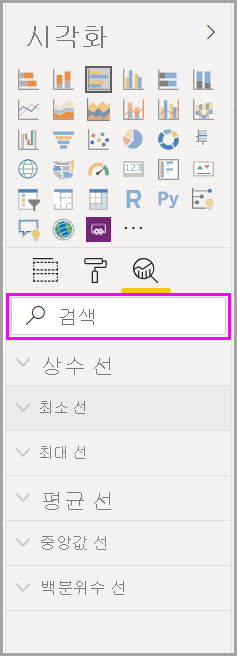
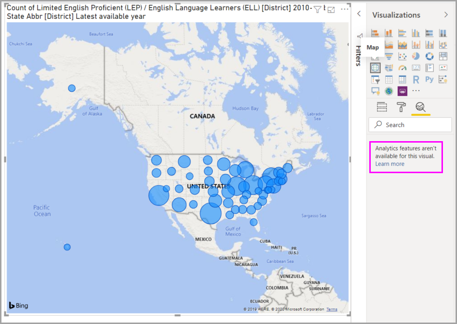

# Power BI Desktop의 분석 창 사용

Power BI Desktop의 **분석** 창에서 시각적 개체에 동적 *참조 선*을 추가하고, 중요한 추세 또는 통찰력에 대한 포커스를 제공할 수 있습니다. **분석** 아이콘과 창은 Power BI Desktop의 **시각화** 영역에 있습니다.

> [!NOTE]
> **분석** 창은 Power BI Desktop 캔버스에서 시각적 개체를 선택하는 경우에만 나타납니다.

## 분석 창 내에서 검색

Power BI Desktop의 2018년 2월 릴리스(버전 2.55.5010.201 이상)부터 **시각화** 창의 하위 섹션인 **분석** 창 내에서 검색할 수 있습니다. **분석** 아이콘을 선택하면 검색 상자가 표시됩니다.

## 분석 창 사용

**분석** 창을 사용하여 다음과 같은 유형의 동적 참조 선을 만들 수 있습니다.

* X축 상수 선
* Y축 상수 선
* 최소 선
* 최대 선
* 평균 선
* 중간 선
* 백분위수 선
* 대칭 음영

> [!NOTE]
> 모든 시각적 개체 유형에 모든 선을 사용할 수 있는 것은 아닙니다.

다음 섹션에서는 시각화에 **분석** 창 및 동적 참조 선을 사용하는 방법을 보여 줍니다.

시각적 개체에 사용 가능한 동적 참조 선을 보려면 단계를 수행하세요.

1. 시각적 개체를 선택하거나 만든 후 **시각화** 섹션에서 **분석** 아이콘을 선택합니다.

    

2. 만들려는 선 유형을 선택하여 해당 옵션을 확장합니다. 이 경우에는 **평균 선**을 선택하겠습니다.

    

3. 새 선을 만들려면 **+&nbsp;추가**를 선택합니다. 그런 다음 선의 이름을 지정할 수 있습니다. 텍스트 상자를 두 번 클릭하고 이름을 입력합니다.

    이제 선에 대한 모든 종류의 옵션이 생겼습니다. 선의 **색**, **투명도** 백분율, **선 스타일**, **위치**(시각적 개체의 데이터 요소 대비)를 지정할 수 있습니다. **데이터 레이블**을 포함할지 여부도 선택할 수 있습니다. 선의 기준이 되는 시각적 개체 측정값을 지정하려면 시각적 개체의 데이터 요소로 자동으로 채워지는 **측정값** 드롭다운 목록을 선택합니다. 여기서는 측정값으로 **문화권**을 선택하고, 레이블을 *문화권 평균*으로 지정하고, 기타 옵션 몇 가지를 사용자 지정하겠습니다.

    

4. 데이터 레이블을 표시하려면 **데이터 레이블**을 **끄기**에서 **켜기**로 변경합니다. 이렇게 하면 데이터 레이블에 대한 추가 옵션 전체가 표시됩니다.

    

5. **분석** 창의 **평균 선** 항목 옆에 표시되는 숫자를 잘 보세요. 현재 시각적 개체에 있는 동적 선의 수와 유형을 알려줍니다. **경제성**에 **최대 선**을 추가하고 **분석** 창을 보면 이제 이 시각적 개체에 **최대 선** 동적 참조 선이 적용된 것을 확인할 수 있습니다.

    

선택한 시각적 개체에 동적 참조 선을 적용할 수 없는 경우(이 경우에는 **맵** 시각적 개체), **분석** 창을 선택하면 다음 메시지가 표시됩니다.

**분석** 창을 통해 동적 참조 선을 만들면 여러 종류의 흥미로운 통찰력을 강조 표시할 수 있습니다.

동적 참조 선을 적용할 수 있는 시각적 개체 확장을 비롯해 더 많은 기능이 추가될 예정입니다. 새 기능에 대한 소식을 자주 확인하세요.

## 예측 적용

데이터 원본에 시간 데이터가 있는 경우 *예측* 기능을 사용할 수 있습니다. 시각적 개체를 선택한 다음 **분석** 창의 **예측** 섹션을 확장하면 됩니다. **예측 길이** 또는 **신뢰 구간** 등의 여러 입력을 지정하여 예측을 수정할 수 있습니다. 다음 그림은 예측이 적용된 기본 선 시각적 개체를 보여 줍니다. 상상력을 사용하고 예측을 다양하게 실험하여 모델에 적용할 수 있는 방법을 확인합니다.

> [!NOTE]
> 예측 기능은 꺾은선형 차트 시각적 개체에만 사용할 수 있습니다.

## 제한 사항

동적 참조 선을 사용하는 기능은 사용 중인 시각적 개체의 유형을 기반으로 합니다. 다음 목록은 이러한 제한을 보다 자세히 설명합니다.

다음 시각적 개체에 *x축 상수 선*, *y축 상수 선*, *대칭 음영*을 사용할 수 있습니다.

* 분산형 차트

다음 시각적 개체에는 *상수 선*, *최소 선*, *최대 선*, *평균 선*, *중간 선*, *백분위수 선*을 사용할 수 있습니다.

* 영역 차트
* 묶은 가로 막대형 차트
* 묶은 세로 막대형 차트
* 꺾은선형 차트
* 분산형 차트

다음 시각적 개체는 **분석** 창에서 상수 선만 사용할 수 있습니다. 

* 누적 영역 차트
* 누적 가로 막대형 차트
* 누적 세로 막대형 차트
* 폭포 차트
* 100% 누적 가로 막대형 차트
* 100% 누적 세로 막대형 차트

다음 시각적 개체는 시간 데이터가 있는 경우 *추세선*을 사용할 수 있습니다.

* 영역 차트
* 묶은 세로 막대형 차트
* 꺾은선형 차트
* 꺾은선형 및 묶은 세로 막대형 차트

마지막으로 다음을 포함한 많은 시각적 개체에는 현재 동적 선을 적용할 수 없습니다.

* 깔때기형
* 꺾은선형 및 묶은 세로 막대형 차트
* 꺾은선형 및 누적 세로 막대형 차트
* 리본 차트
* 도넛형 차트, 계기, 행렬, 원형 차트, 테이블과 같은 비카티전 시각적 개체

*백분위수 선*은 Power BI Desktop에서 가져온 데이터를 사용할 경우 또는 **Analysis Service 2016** 이상, **Azure Analysis Services**를 실행하는 서버의 모델 또는 Power BI 서비스의 데이터 세트에 연결할 경우에만 사용할 수 있습니다.

## 다음 단계

Power BI Desktop으로 모든 종류의 작업을 수행할 수 있습니다. 해당 기능에 대한 자세한 내용은 다음 리소스를 확인하세요.

* [Power BI Desktop의 새로운 기능](../fundamentals/desktop-latest-update.md)
* [Power BI Desktop 받기](../fundamentals/desktop-get-the-desktop.md)
* [Power BI Desktop이란?](../fundamentals/desktop-what-is-desktop.md)
* [Power BI Desktop을 사용한 쿼리 개요](desktop-query-overview.md)
* [Power BI Desktop의 데이터 형식](../connect-data/desktop-data-types.md)
* [Power BI Desktop에서 데이터 셰이핑 및 결합](../connect-data/desktop-shape-and-combine-data.md)
* [Power BI Desktop에서 일반적인 작업 수행](desktop-common-query-tasks.md)
