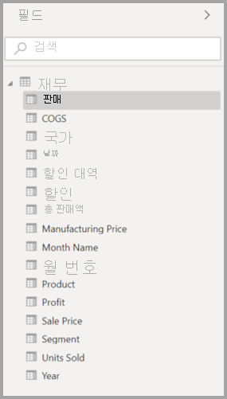
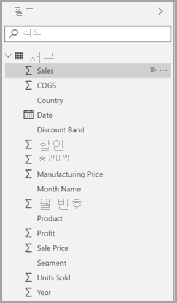
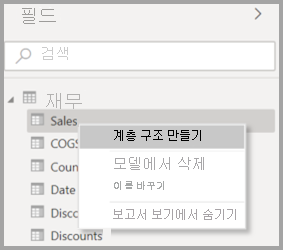
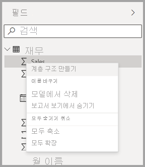
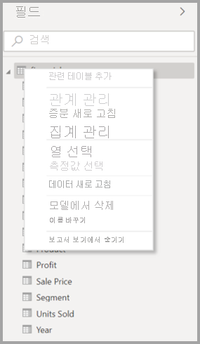
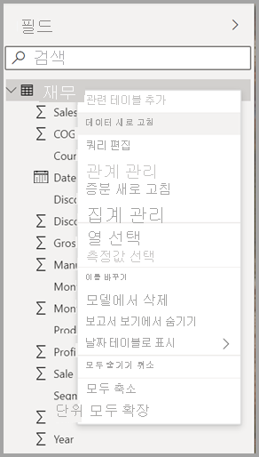
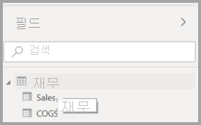
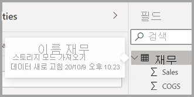
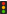

# Power BI Desktop(미리 보기)의 필드 목록 사용

2020년 11월 업데이트부터 Power BI Desktop의 모델 뷰, 데이터 뷰, 보고서 뷰 전체에서 **필드** 목록을 통합합니다. 이러한 뷰를 통합함으로써 뷰 전체에서 기능 및 UI(사용자 인터페이스)에 대한 일관성이 유지되며, 고객 의견이 해결됩니다.

뷰 전체에 대한 변경 내용은 다음과 같습니다.

* 아이콘 체계
* 검색 기능
* 컨텍스트 메뉴 항목
* 비슷한 끌어서 놓기 동작
* 도구 설명
* 내게 필요한 옵션 기능 향

Power BI Desktop 사용 편의성 향상을 위한 것입니다. 변경 내용은 일반적인 데이터 워크플로에 미치는 영향이 매우 적습니다.

## 새 필드 목록을 사용하도록 설정(미리 보기)

통합 필드 목록은 **모델** 뷰로 시작되며 이후 다른 뷰에 대해 사용하도록 설정됩니다. 통합 필드 뷰를 사용하도록 설정하려면 Power BI Desktop에서 **파일 > 옵션 및 설정 > 옵션** 으로 이동한 다음 왼쪽 창에서 **미리 보기 기능** 을 선택합니다. 미리 보기 기능 섹션에서 **새 필드 목록** 옆에 있는 확인란을 선택합니다.

선택 항목을 적용하려면 Power BI Desktop을 다시 시작하라는 메시지가 표시됩니다.

## 필드 목록 변경

다음 표에서는 필드 목록 업데이트를 보여 줍니다. 

|**원본 필드 목록(모델 뷰)**  | **새 필드 목록(모델 뷰)**  |
|:---------:|:---------:|
|**원래 이름** |**새로 만들기** |
|**아이콘 및 UI**       ||
|     |    |
|**상황에 맞는 메뉴 - 필드**       ||
|     |    |
|**상황에 맞는 메뉴 - 테이블**       ||
|     |    |
|**도구 설명**       ||
|     |    |

새 필드 목록 아이콘도 있습니다. 다음 표에서는 원래 아이콘과 그에 상응하는 새 아이콘을 보여 주고 각 아이콘에 대해 간략하게 설명합니다. 

|원래 아이콘  |새 아이콘  |설명  |
|:---------:|:---------:|:---------|
|     |           |필드 목록의 폴더         |
|     |         |숫자 필드: 숫자 필드는 합계, 평균 등을 구할 수 있는 집계입니다. 집계는 데이터와 함께 가져오고, 보고서의 기반이 되는 데이터 모델에서 정의됩니다. 자세한 내용은 [Power BI 보고서의 집계](../create-reports/service-aggregates.md)를 참조하세요.         |
|     |         |숫자가 아닌 데이터 형식의 계산 열: 열 값을 정의하는 DAX(Data Analysis Expressions) 수식을 사용하여 만드는 숫자가 아닌 새 열입니다. [계산 열](desktop-calculated-columns.md)에 대해 자세히 알아보세요.        |
|     |          |숫자 계산 열: 열 값을 정의하는 DAX(Data Analysis Expressions) 수식을 사용하여 만드는 새 열입니다. [계산 열](desktop-calculated-columns.md)에 대해 자세히 알아보세요.         |
|     |          |측정값: 측정값에는 하드 코드된 고유한 수식이 있습니다. 보고서를 보는 사용자는 계산을 변경할 수 없습니다. 예를 들어 합계인 경우 합계만 될 수 있습니다. 값은 열에 저장되지 않습니다. 시각적 개체에서의 해당 위치만 사용하여, 즉석에서 계산됩니다. 자세한 내용은 [측정값 이해](desktop-measures.md)를 참조하세요.         |
|     |         |측정값 그룹.         |
|     |         |KPI: 측정 가능한 목표에 대해 만든 진행률의 정도를 알리는 시각적 신호입니다. [KPI(핵심 성과 지표)](../visuals/power-bi-visualization-kpi.md) 시각적 개체에 대해 자세히 알아보세요.         |
|     |           |필드 계층 구조: 화살표를 선택하여 계층 구조를 구성하는 필드를 확인합니다. 자세한 내용을 보려면 [계층 구조를 만들고 사용하는 방법](https://www.youtube.com/watch?v=q8WDUAiTGeU)에 대한 YouTube의 Power BI 동영상을 시청하세요.         |
|     |         |지역 데이터: 이러한 위치 필드는 지도 시각화를 만드는 데 사용할 수 있습니다.         |
|     |          |ID 필드: 이 아이콘이 있는 필드는 고유 필드이며, 중복된 값이 있는 경우에도 모든 값을 표시하도록 설정됩니다. 예를 들어 데이터에 ‘Robin Smith’라는 서로 다른 두 사람에 대한 레코드가 있을 수 있으며, 각 레코드는 고유한 것으로 처리됩니다. 합계가 계산되지 않습니다.         |
|     |          |매개 변수: 매개 변수를 설정하여 보고서 및 데이터 모델의 일부(예: 쿼리 필터, 데이터 원본 참조, 측정값 정의 등)가 하나 이상의 매개 변수 값에 따라 달라지도록 합니다. 자세한 내용은 [쿼리 매개 변수](https://powerbi.microsoft.com/blog/deep-dive-into-query-parameters-and-power-bi-templates/)에 대한 Power BI 블로그 게시물을 참조하세요.         |
|     |         |기본 제공 날짜 테이블이 있는 달력 날짜 필드.         |
|     |          |계산된 테이블: 이미 모델에 로드된 데이터를 기반으로 하는 DAX(Data Analysis Expressions) 수식을 사용하여 만든 테이블입니다. 이는 중간 계산에 가장 적합하며 모델의 일부로 저장할 수 있습니다.         |
|     |         |경고: 오류가 있는 계산 필드입니다. 예를 들어 DAX 식의 구문이 잘못된 것일 수 있습니다.         |
|     |         |그룹: 이 열의 값은 그룹 및 bin 기능을 사용한 다른 열의 값 그룹화를 기반으로 합니다. [그룹화 및 범주화를 사용](../create-reports/desktop-grouping-and-binning.md)하는 방법을 알아볼 수 있습니다.         |
| 원래 아이콘 없음    |          |변경 내용 검색 측정값: 자동 페이지 새로 고침을 위해 페이지를 구성할 때 페이지의 나머지 시각적 요소를 업데이트해야 하는지 여부를 결정하기 위해 쿼리되는 [변경 내용 검색 측정값](../create-reports/desktop-grouping-and-binning.md)을 구성할 수 있습니다.         |

## 다음 단계

다음 문서에도 관심이 있을 수 있습니다.

* [Power BI Desktop에서 계산 열 만들기](desktop-calculated-columns.md)
* [Power BI Desktop에서 그룹화 및 범주화 사용](../create-reports/desktop-grouping-and-binning.md)
* [Power BI Desktop 보고서에서 눈금선 및 눈금에 맞춤 사용](../create-reports/desktop-gridlines-snap-to-grid.md)

