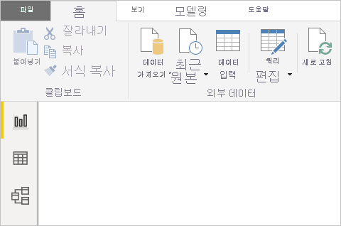
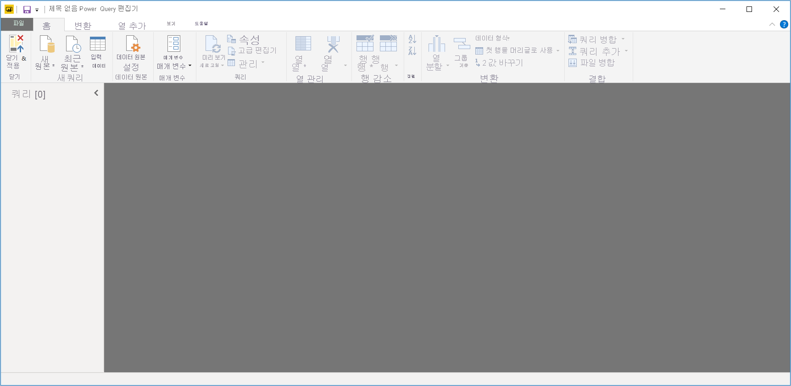
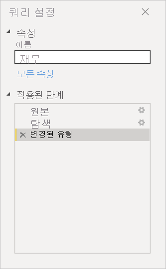
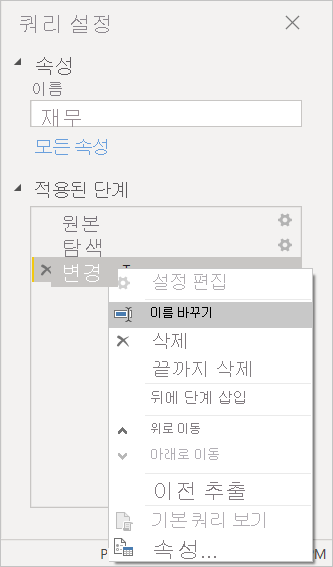
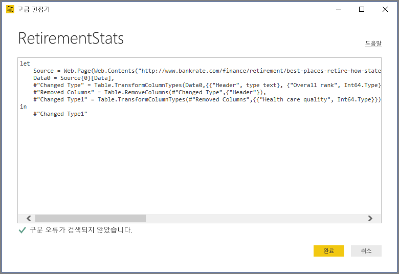
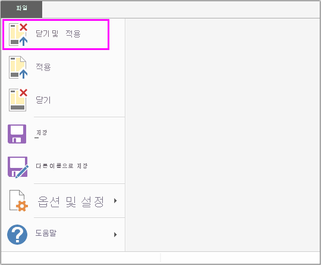
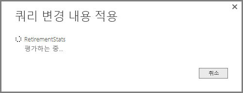
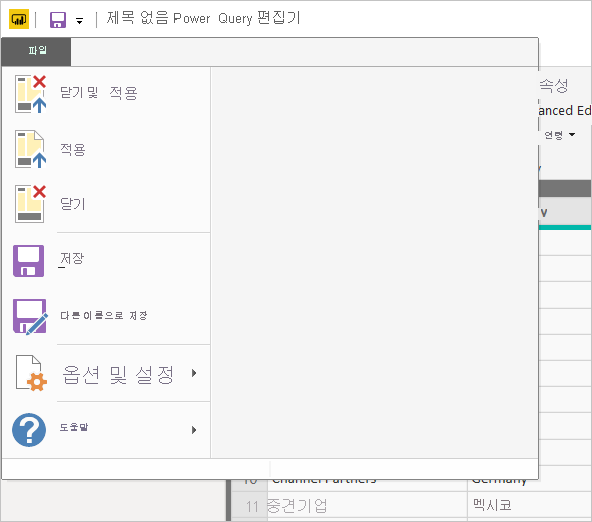

# Power BI Desktop을 사용한 쿼리 개요
Power BI Desktop을 사용하면 데이터 세계에 연결하여 강력하고 근본적인 보고서를 만들고, 다른 사용자와 작업을 공유할 수 있습니다. 이러한 사용자는 해당 작업을 기반으로 하여 비즈니스 인텔리전스 작업을 확장할 수 있습니다.

Power BI Desktop에는 세 가지 보기가 있습니다.

* **보고서** 보기 – 표시하고자 하는 대로 정렬되고 복수의 페이지를 가진 뛰어난 시각화를 작성하기 위해 생성한 쿼리를 사용하고 타인과 공유할 수 있습니다.
* **데이터** 보기 – 측정값을 추가하고 새 열을 생성하며 관계를 관리할 수 있는 데이터 모델 형식의 보고서의 데이터를 볼 수 있습니다.
* **관계** 보기 – 사용자의 데이터 모델에 설정되고 필요에 따라 관리 또는 수정하는 관계의 그래픽 표현을 가져옵니다.

이 보기들은 Power BI Desktop의 왼쪽에 있는 세 개의 아이콘 중 하나를 선택하여 액세스합니다. 다음 그림에서는 아이콘 옆에 노란색 줄로 표시된 **보고서** 보기가 선택되었습니다.  

 
Power BI Desktop은 Power Query 편집기와 함께 제공됩니다. Power Query 편집기를 사용하여 하나 이상의 데이터 원본에 연결하고, 요구 사항에 맞게 데이터의 모양을 지정하고 변환한 다음, 해당 모델을 Power BI Desktop에 로드합니다.

이 문서는 Power Query 편집기에서 데이터로 작업하는 방법에 대한 개요를 제공하지만 더 자세히 알아볼 내용이 있습니다. 이 문서의 끝에서 지원되는 데이터 형식에 관한 자세한 지침 링크를 찾을 수 있습니다. 또한 데이터에 연결, 데이터 모양 지정, 관계 만들기 및 시작하는 방법에 대한 지침도 찾을 수 있습니다.

그러나 우선은 Power Query 편집기를 살펴보겠습니다.

## 파워 쿼리 편집기
Power Query 편집기를 사용하려면 Power BI Desktop의 **홈** 탭에서 **쿼리 편집**을 선택합니다.  

데이터 연결이 없는 경우, Power Query 편집기는 데이터를 받을 준비가 된 빈 창으로 나타납니다.  

쿼리가 로드되면 Power Query 편집기는 더 흥미로워집니다. 다음 웹 데이터 원본에 연결한 경우, Power Query 편집기는 데이터에 대한 정보를 로드하며, 그 후에는 모양을 지정할 수 있습니다.

[*https://www.bankrate.com/retirement/best-and-worst-states-for-retirement/*](https://www.bankrate.com/retirement/best-and-worst-states-for-retirement/)

데이터 연결이 설정되면 Power Query 편집기는 다음과 같이 표시됩니다.

1. 리본 메뉴에서 이제 많은 단추가 활성화되어 쿼리의 데이터를 조작할 수 있습니다.
2. 왼쪽 창에 쿼리가 나열되며 선택, 보기 및 모양 지정에 사용할 수 있습니다.
3. 가운데 창에 선택한 쿼리의 데이터가 표시되고 모양 지정에 사용할 수 있습니다.
4. **쿼리 설정** 창이 나타나고, 쿼리의 속성과 적용된 단계를 나열합니다.  
   
   

리본, 쿼리 창, 데이터 뷰 및 쿼리 설정 창의 네 가지 각 영역을 살펴보겠습니다.

## 쿼리 리본
Power Query 편집기의 리본 메뉴는 다음 네 개의 탭으로 구성됩니다. **홈**, **변환**, **열 추가**, 그리고 **보기**입니다.

**홈** 탭에는 일반적인 쿼리 태스크가 있습니다.

데이터에 연결하고 쿼리 작성 프로세스를 시작하려면 **새 원본**을 선택합니다. 가장 일반적인 데이터 원본을 제공하는 메뉴가 나타납니다.  

사용 가능한 데이터 원본에 대한 자세한 내용은 **데이터 원본**을 참조하세요. 예제 및 단계를 포함하여 데이터에 연결하는 방법에 대한 자세한 내용은 **데이터에 연결**을 참조하세요.

**변환** 탭은 다음과 같은 일반적인 데이터 변환 작업에 대한 액세스를 제공합니다.

* 열 추가 또는 제거
* 데이터 형식 변경 
* 열 분할 
* 기타 데이터 기반 작업

데이터를 변환하는 방법에 대한 자세한 내용과 예제는 다음 [자습서를 참조하세요. Power BI Desktop에서 데이터를 셰이핑하고 결합합니다](../connect-data/desktop-shape-and-combine-data.md).

**열 추가** 탭에서는 열 추가, 열 데이터 형식 지정 및 사용자 지정 열 추가와 관련된 추가 작업을 제공합니다. 다음 그림은 **열 추가** 탭을 보여 줍니다.  

리본 메뉴의 **보기** 탭은 특정 창이 표시되는지 여부를 전환하는 데 사용됩니다. 또한 고급 편집기를 표시하는 데 사용됩니다. 다음 그림은 **보기** 탭을 보여 줍니다.  

리본에서 사용할 수 있는 많은 작업은 가운데 창에서 열이나 다른 데이터를 마우스 오른쪽 단추로 클릭하여 사용할 수도 있습니다.

## 왼쪽(쿼리) 창
왼쪽 창 또는 **쿼리** 창에는 활성 쿼리 수와 쿼리 이름이 표시됩니다. 왼쪽 창에서 쿼리를 선택하면 해당 데이터가 가운데 창에 표시되며, 여기서 요구 사항에 맞게 데이터 모양을 지정하고 변환할 수 있습니다. 다음 그림은 쿼리가 포함된 왼쪽 창을 보여줍니다.  

## 가운데(데이터) 창
가운데 창 또는 **데이터** 창에 선택한 쿼리의 데이터가 표시됩니다. 이 창에서 **쿼리** 보기의 작업이 대부분 수행됩니다.

다음 그림에서는 이전에 설정된 웹 데이터 연결을 보여줍니다. **제품** 열을 선택되고, 헤더를 마우스 오른쪽 단추로 클릭하여 사용할 수 있는 메뉴 항목을 표시합니다. 이러한 오른쪽 클릭 메뉴 항목은 대부분 리본 탭의 단추와 동일합니다.  

오른쪽 클릭 메뉴 항목(또는 리본 단추)을 선택하면 쿼리가 데이터에 단계를 적용합니다. 또한 쿼리 자체의 일부로 단계를 저장합니다. 단계는 다음 섹션에 설명된 대로 **쿼리 설정** 창에 순차적으로 기록됩니다.  

## 오른쪽(쿼리 설정) 창
오른쪽 창 또는 **쿼리 설정** 창에는 쿼리와 관련된 모든 단계가 표시됩니다. 예를 들어 다음 그림에서 **쿼리 설정** 창의 **적용된 단계** 섹션은 **Overall score** 열의 형식을 방금 변경했다는 사실을 반영합니다.

쿼리에 모양 지정 단계를 추가로 적용하면 **적용된 단계** 섹션에 캡처됩니다.

기본 데이터는 변경되지 ‘않는다는 것’을 알고 있어야 합니다. 대신 Power Query 편집기는 데이터 보기를 조정하고 모양을 구성합니다. 또한 Power Query 편집기의 해당 데이터에 대한 모양 및 수정된 보기를 기반으로 발생하는 기본 데이터와의 상호 작용에 대한 보기를 셰이핑하고 조정합니다.

**쿼리 설정** 창에서 단계의 이름을 바꾸거나, 단계를 삭제하거나, 단계를 적절하게 다시 정렬할 수 있습니다. 이렇게 하려면 **적용된 단계** 섹션에서 단계를 마우스 오른쪽 단추로 클릭하고 나타나는 메뉴에서 선택합니다. 모든 쿼리 단계는 **적용된 단계** 창에 나타난 순서대로 수행됩니다.

## 고급 편집기
**고급 편집기**를 사용하면 각 단계에서 Power Query 편집기가 만드는 코드를 볼 수 있습니다. 또한 사용자 고유의 셰이핑 코드를 만들 수 있습니다. 고급 편집기를 시작하려면 리본 메뉴에서 **보기**를 선택한 다음 **고급 편집기**를 선택합니다. 기존 쿼리 코드를 보여 주는 창이 나타납니다.  

**고급 편집기** 창에서 코드를 직접 편집할 수 있습니다. 창을 닫으려면 **완료** 또는 **취소** 단추를 선택합니다.  

## 작업 내용 저장
원하는 위치에 쿼리가 있는 경우 Power Query 편집기의 **파일** 메뉴에서 **닫기 및 적용**을 선택합니다. 이 작업은 변경 내용을 적용하고 편집기를 닫습니다.  

Power BI Desktop은 진행 상태를 대화 상자로 표시합니다.  

준비가 되면 Power BI Desktop이 작업을 *.pbix* 파일 양식으로 저장할 수 있습니다.

작업을 저장하려면 다음 그림과 같이 **파일** \> **저장**(또는 **파일** \> **다른 이름으로 저장**)을 선택합니다.  

## 다음 단계
Power BI Desktop에서 모든 종류의 작업을 수행할 수 있습니다. 해당 기능에 대한 자세한 내용은 다음 리소스를 확인하세요.

* [Power BI Desktop이란?](../fundamentals/desktop-what-is-desktop.md)
* [Power BI Desktop의 데이터 원본](../connect-data/desktop-data-sources.md)
* [Power BI Desktop에서 데이터에 연결](../connect-data/desktop-connect-to-data.md)
* [자습서: Power BI Desktop에서 데이터 셰이핑 및 결합](../connect-data/desktop-shape-and-combine-data.md)
* [Power BI Desktop의 일반적인 쿼리 작업 수행](desktop-common-query-tasks.md)