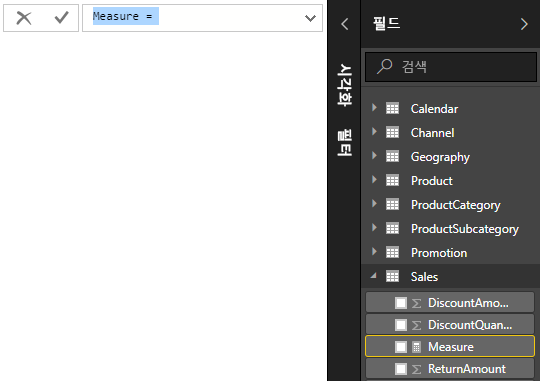
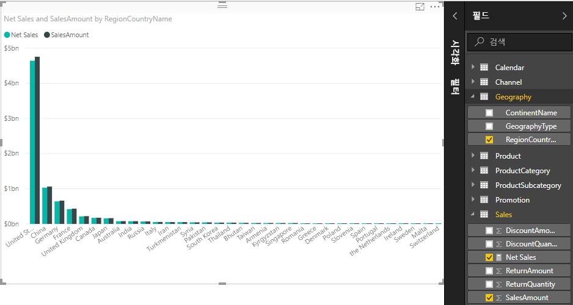
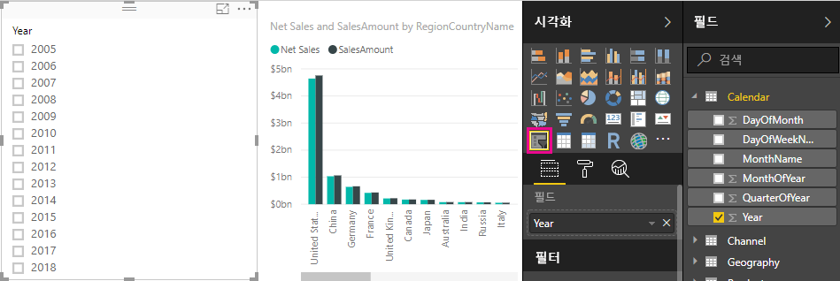
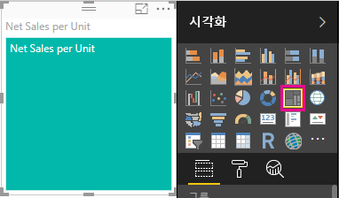

# 자습서:  Power BI Desktop에서 고유한 측정값 만들기
측정값을 사용하여 Power BI Desktop에서 가장 강력한 데이터 분석 솔루션 중 일부를 만들 수 있습니다. 측정값은 보고서를 조작할 때 데이터에서 계산을 수행하여 도움을 줍니다. 이 자습서에서는 Power BI Desktop에서 고유한 기본 측정값을 이해하고 만드는 과정을 안내합니다.

## 필수 조건

- 이 자습서는 Power BI Desktop을 사용하여 고급 모델을 만드는 방법을 이미 알고 있는 Power BI 사용자를 위한 것입니다. 데이터 가져오기 및 쿼리 편집기를 사용하여 데이터 가져오기, 여러 가지 관련 테이블 사용, 보고서 캔버스에 필드 추가와 같은 작업을 이미 알고 있어야 합니다. Power BI Desktop을 처음 사용하는 경우 [Power BI Desktop 시작](../fundamentals/desktop-getting-started.md)을 확인해야 합니다.
  
- 이 자습서에서는 가상 회사 Contoso의 온라인 판매 데이터가 포함된 [Contoso Sales Sample for Power BI Desktop](https://download.microsoft.com/download/4/6/A/46AB5E74-50F6-4761-8EDB-5AE077FD603C/Contoso%20Sales%20Sample%20for%20Power%20BI%20Desktop.zip) 파일을 사용합니다. 이 데이터는 데이터베이스에서 가져오기 때문에 데이터 원본에 연결하거나 쿼리 편집기에서 볼 수 없습니다. 컴퓨터에 파일을 다운로드하고 압축을 풉니다.

## 자동 측정값

Power BI Desktop에서 측정값을 만들면 대부분 자동으로 만들어집니다. Power BI Desktop에서 측정값을 만드는 방법을 보려면 다음 단계를 수행합니다.

1. Power BI Desktop에서 **파일** > **열기** 를 선택하고 *Contoso Sales Sample for Power BI Desktop.pbix* 파일을 찾은 다음, **열기** 를 선택합니다.

2. **필드** 창에서 **Sales** 테이블을 확장합니다. 그런 다음, **SalesAmount** 필드 옆의 확인란을 선택하거나 **SalesAmount** 를 보고서 캔버스로 끌어옵니다.

    새로운 세로 막대형 차트 시각화가 표시되어 **Sales** 테이블의 **SalesAmount** 열에 있는 모든 값의 합계를 보여 줍니다.

    

**필드** 창에서 시그마 아이콘 이 있는 모든 필드(열)는 숫자이며, 해당 값을 집계할 수 있습니다. Power BI Desktop에서는 많은 값(**SalesAmount** 에 대한 2백만 개의 행)이 포함된 테이블을 표시하는 대신 숫자 데이터 형식이 검색되는 경우 자동으로 측정값을 만들고 계산하여 데이터를 집계합니다. 합계는 숫자 데이터 형식에 대한 기본 집계이지만, 평균 또는 개수와 같은 다른 집계를 쉽게 적용할 수 있습니다. 모든 측정값은 일종의 집계를 수행하므로 측정값을 이해하려면 기본적으로 집계를 이해해야 합니다. 

차트 집계를 변경하려면 다음 단계를 수행합니다.

1. 보고서 캔버스에서 **SalesAmount** 시각화를 선택합니다.  

1. **시각화** 창의 **값** 영역에서 **SalesAmount** 오른쪽에 있는 아래쪽 화살표를 선택합니다. 

1. 메뉴가 표시되면 **평균** 을 선택합니다. 

    시각화가 **SalesAmount** 필드에 있는 모든 판매액 값의 평균으로 변경됩니다.

    

원하는 결과에 따라 집계 유형을 변경할 수 있습니다. 그러나 모든 집계 유형이 모든 숫자 데이터 형식에 적용되는 것은 아닙니다. 예를 들어 **SalesAmount** 필드의 경우 합계 및 평균이 유용하고 최솟값 및 최댓값도 적용할 수 있습니다. 그러나 개수는 **SalesAmount** 필드에 적합하지 않은데, 해당 값이 숫자이지만 실제로는 통화이기 때문입니다.

측정값에서 계산된 값은 보고서 조작에 대한 응답으로 변경됩니다. 예를 들어 **RegionCountryName** 필드를 **Geography** 테이블에서 기존 **SalesAmount** 차트로 끌면 이 필드는 각 국가의 평균 판매량을 표시하도록 변경됩니다.

보고서 조작으로 인해 측정값의 결과가 변경되면 측정값의 ‘컨텍스트’에 영향을 준 것입니다.  실제로 보고서 시각화를 조작할 때마다 측정값이 결과를 계산하여 표시하는 컨텍스트가 변경됩니다.

## 고유한 측정값 만들기 및 사용

대부분의 경우 Power BI Desktop은 선택한 필드 및 집계 유형에 따라 자동으로 값을 계산하여 반환합니다. 그러나 보다 복잡한 고유 계산을 수행하기 위해 고유한 측정값을 만들어야 하는 경우도 있습니다. Power BI Desktop에서는 DAX(Data Analysis Expressions) 수식 언어로 고유한 측정값을 만들 수 있습니다. 

DAX 수식에서는 Excel 수식과 동일한 함수, 연산자 및 구문을 많이 사용합니다. 그러나 DAX의 함수는 관계형 데이터에서 작동하고 보고서를 조작할 때 보다 동적인 계산을 수행하도록 설계되었습니다. 합계 및 평균과 같은 간단한 집계에서 보다 복잡한 통계 및 필터링 함수까지 모든 작업을 수행하는 DAX 함수는 200가지가 넘습니다. DAX에 대해 자세히 알아보는 데 도움이 되는 많은 리소스가 있습니다. 이 자습서를 완료한 후에는 [Power BI Desktop의 DAX 기본 사항](desktop-quickstart-learn-dax-basics.md)을 참조하세요.

고유한 측정값을 만들면 이를 ‘모델’ 측정값이라고 하며 선택한 테이블의 **필드** 목록에 추가됩니다.  모델 측정값의 몇 가지 장점은 원하는 대로 이름을 지정하여 쉽게 식별하도록 만들 수 있고, 다른 DAX 식의 인수로 사용할 수 있으며, 복잡한 계산을 빠르게 수행하도록 지정할 수 있다는 것입니다.

### 빠른 측정

Power BI Desktop의 2018년 2월 릴리스부터 많은 일반적인 계산이 ‘빠른 측정’으로 제공되어 창에 입력한 내용에 따라 DAX 수식을 만들 수 있습니다.  이러한 빠르고 강력한 계산은 DAX를 학습하거나 고유한 사용자 지정 측정값을 시드하는 데도 적합합니다. 

다음 방법 중 하나를 사용하여 빠른 측정을 만듭니다. 
 - **필드** 창의 테이블에서 마우스 오른쪽 단추를 클릭하거나 **추가 옵션**( **...** )을 선택한 다음, 목록에서 **새 빠른 측정** 을 선택합니다.

 - Power BI Desktop 리본 **홈** 탭의 **계산** 에서 **새 빠른 측정** 을 선택합니다.

빠른 측정 만들기 및 사용에 대한 자세한 내용은 [빠른 측정 사용](desktop-quick-measures.md)을 참조하세요.

### 측정값 만들기

총 판매액에서 할인 및 반품액을 빼서 순매출액을 분석하려 한다고 가정합니다. 시각화에 있는 컨텍스트에 대해 SalesAmount의 합계에서 DiscountAmount 및 ReturnAmount의 합계를 빼는 측정값이 필요합니다. **필드** 목록에는 순매출액에 대한 필드가 없지만 고유한 측정값을 만들어 순매출액을 계산할 수 있는 구성 요소가 있습니다. 

측정값을 만들려면 다음 단계를 수행합니다.

1. **필드** 창에서 **Sales** 테이블을 마우스 오른쪽 단추로 클릭하거나 테이블을 마우스로 가리키고 **추가 옵션**( **...** )을 선택합니다. 

1. 메뉴가 표시되면 **새 측정값** 을 선택합니다. 

    이렇게 하면 새 측정값이 **Sales** 테이블에 저장되어 쉽게 찾을 수 있습니다.
    
    
    
    Power BI Desktop 리본 **홈** 탭의 **계산** 그룹에서 **새 측정값** 을 선택하여 새 측정값을 만들 수도 있습니다.
    
    
    
    >[!TIP]
    >측정값을 리본에서 만들면 원하는 테이블에 만들 수 있지만 사용하려는 위치에 만들면 더 쉽게 찾을 수 있습니다. 이 경우 먼저 **Sales** 테이블을 선택하여 활성화한 다음, **새 측정값** 을 선택합니다. 
    
    수식 입력줄이 보고서 캔버스 위쪽으로 표시되어 측정값의 이름을 바꾸고 DAX 수식을 입력할 수 있습니다.
    
    
    
1. 기본적으로 새로운 각 측정값의 이름은 ‘측정값’으로 지정됩니다.  이 이름을 바꾸지 않을 경우 추가되는 새 측정값의 이름은 ‘측정값 2’, ‘측정값 3’ 등으로 지정됩니다.   이 측정값을 더욱 식별하기 쉽게 만들려고 하므로 수식 입력줄에서 ‘측정값’을 강조 표시한 다음, ‘Net Sales’로 변경합니다.  
    
1. 수식 입력을 시작합니다. 등호 기호 뒤에 먼저 *Sum* 을 입력합니다. 입력하면 드롭다운 제안 목록이 표시되어 입력한 문자로 시작하는 모든 DAX 함수를 보여 줍니다. 필요한 경우 아래로 스크롤하여 목록에서 **SUM** 을 선택한 다음, **Enter** 키를 누릅니다.
    
    
    
    SUM 함수에 전달할 수 있는 사용 가능한 열의 드롭다운 제안 목록과 함께 여는 괄호가 나타납니다.
    
    
    
1. 식은 항상 여는 괄호와 닫는 괄호 사이에 나타납니다. 이 예제의 식에는 SUM 함수에 전달할 단일 인수(**SalesAmount** 열)가 포함되어 있습니다. 목록에 **Sales(SalesAmount)** 값만 남을 때까지 *SalesAmount* 를 입력합니다. 

    테이블 이름 뒤에 오는 열 이름은 열의 정규화된 이름이라고 합니다. 정규화된 열 이름을 사용하면 수식을 읽기가 더 쉽습니다.
    
    
    
1. 목록에서 **Sales[SalesAmount]** 를 선택하고 닫는 괄호를 입력합니다.
    
    > [!TIP]
    > 구문 오류는 닫는 괄호가 누락되거나 잘못 배치되어 발생하는 경우가 가장 많습니다.
    
    
    
1. 수식 내에서 다른 두 열을 뺍니다.

    a. 첫 번째 식의 닫는 괄호 뒤에 공백, 빼기 연산자(-), 공백을 차례로 입력합니다. 

    b. 다른 SUM 함수를 입력하고 **Sales[DiscountAmount]** 열을 인수로 선택할 수 있을 때까지 *DiscountAmount* 를 입력합니다. 닫는 괄호를 추가합니다. 

    c. 공백, 빼기 연산자, 공백, **Sales[ReturnAmount]** 를 인수로 사용하는 또 다른 SUM 함수, 닫는 괄호를 차례로 입력합니다.
    
    
    
1. **Enter** 키를 누르거나 수식 입력줄에서 **커밋**(확인 표시 아이콘)을 선택하여 수식을 완성하고 유효성을 검사합니다. 

    이제 유효성을 검사한 **Net Sales** 측정값을 **필드** 창의 **Sales** 테이블에서 사용할 수 있습니다.
    
    
    
1. 수식을 입력할 공간이 부족하거나 별도의 줄에 넣으려면 수식 입력줄 오른쪽에 있는 아래쪽 화살표를 선택하여 더 많은 공간을 제공합니다. 

    아래쪽 화살표가 위쪽 화살표로 바뀌고 큰 상자가 표시됩니다.

    

1. **Alt** + **Enter** 를 눌러 별도의 줄에 입력하거나 **Tab** 키를 눌러 탭 간격을 추가하는 방법으로 수식의 일부를 구분합니다.

   

### 보고서에서 측정값 사용
**Net Sales** 측정값을 보고서 캔버스에 추가하고 보고서에 추가하는 다른 모든 필드에 대해 순매출액을 계산합니다. 

국가별 순매출액을 확인하려면:

1. **Sales** 테이블에서 **Net Sales** 측정값을 선택하거나 이 측정값을 보고서 캔버스로 끌어서 놓습니다.
    
1. **Geography** 테이블에서 **RegionCountryName** 필드를 선택하거나 이 필드를 **Net Sales** 차트로 끌어옵니다.
    
    
    
1. 국가별 순매출액과 총 판매액의 차이를 확인하려면 **SalesAmount** 필드를 선택하거나 차트로 끌어옵니다. 

    

    이제 차트에는 두 가지 측정값, Power BI에서 자동으로 합계를 구한 **SalesAmount** 와 사용자가 수동으로 만든 **Net Sales** 측정값이 사용됩니다. 각 측정값은 또 다른 필드인 **RegionCountryName** 의 컨텍스트에서 계산되었습니다.
    
### 슬라이서와 함께 측정값 사용

슬라이서를 추가하여 연도별로 순매출액 및 판매액을 추가로 필터링합니다.
    
1. 차트 옆에 있는 빈 영역을 선택합니다. **시각화** 창에서 **테이블** 시각화를 선택합니다. 

    그러면 보고서 캔버스에 빈 테이블 시각화가 만들어집니다.
    
    
    
1. **Calendar** 테이블에서 새로운 빈 테이블 시각화로 **Year** 필드를 끌어옵니다. 
    
    **Year** 는 숫자 필드이므로 Power BI Desktop에서 해당 값의 합계를 계산합니다. 합계는 집계처럼 잘 작동하지 않습니다. 이에 대한 내용은 다음 단계에서 다룹니다.

    
    
3. **시각화** 창의 **값** 상자에서 **Year** 옆의 아래쪽 화살표를 선택한 다음, 목록에서 **요약 안 함** 을 선택합니다. 이제 테이블에 개별 연도가 나열됩니다.
    
    
    
4.  **시각화** 창에서 **슬라이서** 아이콘을 선택하여 테이블을 슬라이서로 변환합니다. 시각화에 목록 대신 슬라이더가 표시되면 슬라이더의 아래쪽 화살표에서 **목록** 을 선택합니다.

    
    
5.  **Year** 슬라이서에서 값을 선택하여 이에 따라 **Net Sales and Sales Amount by RegionCountryName**(RegionCountryName별 순매출액 및 판매액) 차트를 필터링합니다. **Net Sales** 및 **SalesAmount** 측정값이 다시 계산되고 결과가 선택한 **Year** 필드의 컨텍스트에 표시됩니다. 
    
    

### 다른 측정값에서 측정값 사용

판매 단위당 순매출액이 가장 높은 제품을 확인하려 한다고 가정합니다. 순매출액을 판매 단위 수량으로 나누는 측정값이 필요합니다. **Net Sales** 측정값의 결과를 **Sales[SalesQuantity]** 의 합계로 나누는 새 측정값을 만듭니다.

1.  **필드** 창에서 **Sales** 테이블에 **Net Sales per Unit** 이라는 새 측정값을 만듭니다.
    
1. 수식 입력줄에서 *Net Sales* 를 입력하기 시작합니다. 추가할 수 있는 항목이 제안 목록에 표시됩니다. **[Net Sales]** 를 선택합니다.
    
    
    
1. 여는 대괄호( **[** )만 입력하여 다른 측정값을 참조할 수도 있습니다. 수식에 추가할 측정값만 제안 목록에 표시됩니다.
    
    
    
1. 공백, 나누기 연산자(/), 다른 공백, SUM 함수를 차례로 입력한 다음, *Quantity* 를 입력합니다. 이름에 *Quantity* 가 포함된 모든 열이 제안 목록에 표시됩니다. **Sales[SalesQuantity]** 를 선택한 다음, 닫는 괄호를 입력하고 **Enter** 키를 누르거나 **커밋**(확인 표시 아이콘)을 선택하여 수식의 유효성을 검사합니다. 

    결과 수식이 다음과 같이 표시됩니다.
    
    `Net Sales per Unit = [Net Sales] / SUM(Sales[SalesQuantity])`
    
1. **Sales** 테이블에서 **Net Sales per Unit** 측정값을 선택하거나 보고서 캔버스의 빈 영역으로 끌어옵니다. 

    차트에 판매된 모든 제품에 대한 단위당 순매출액이 표시됩니다. 이 차트는 많은 정보를 제공하지 않습니다. 이에 대한 내용은 다음 단계에서 다룹니다.
    
    
    
1. 다른 모양으로 보려면 차트 시각화 유형을 **Treemap** 으로 변경합니다.
    
    
    
1. **Product Category** 필드를 선택하거나 이 필드를 트리맵이나 **시각화** 창의 **Group** 필드로 끌어옵니다. 이제 몇 가지 유용한 정보가 제공됩니다.
    
    
    
7. **ProductCategory** 필드를 제거하고 대신 **ProductName** 필드를 차트로 끌어옵니다. 
    
    
    
   이제 모두 완료했습니다. 즐거운 경험이었을 것입니다! 시각화를 필터링하고 서식을 지정하는 다양한 방법을 실험해 보세요.

## 학습한 내용
측정값을 활용하면 다양한 기능을 통해 데이터에서 원하는 인사이트를 얻을 수 있습니다. 수식 입력줄을 사용하여 측정값을 만들고, 가장 적합한 이름을 지정하고, DAX 제안 목록을 사용하여 적합한 수식 요소를 찾아 선택하는 방법을 배웠습니다. 또한 측정값의 계산 결과가 다른 필드 또는 수식의 다른 식에 따라 변경되는 컨텍스트에 대해 검토했습니다.

## 다음 단계
- 자동으로 많은 일반적인 측정값을 계산하는 Power BI Desktop 빠른 측정에 대해 자세히 알아보려면 [빠른 측정을 사용하여 일반적이고 강력한 계산 수행](desktop-quick-measures.md)을 참조하세요.
  
- DAX 수식을 잘 이해하고 고급 측정값을 만들려면 [Power BI Desktop의 DAX 기본 사항](desktop-quickstart-learn-dax-basics.md)을 참조하세요. 이 문서에서는 구문, 함수 및 컨텍스트에 대한 보다 철저한 이해와 같은 DAX의 기본 개념에 중점을 둡니다.
  
- 잊지 말고 [DAX(Data Analysis Expressions) 참조](/dax/index)를 즐겨찾기에 추가하세요. 이 참조에서는 DAX 구문, 연산자 및 200개가 넘는 DAX 함수에 대한 자세한 내용을 확인할 수 있습니다.