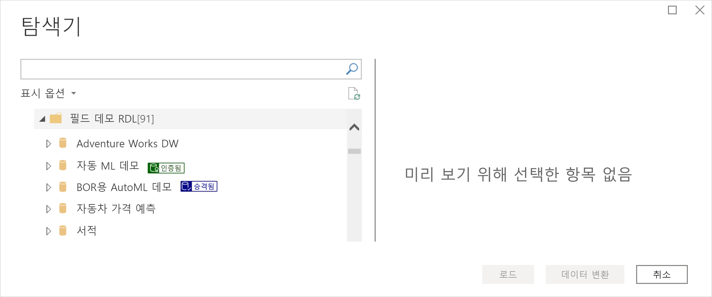
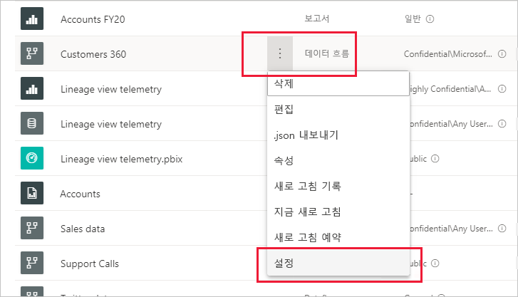
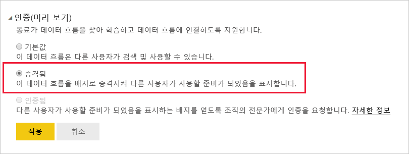
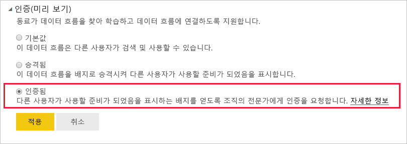

# 데이터 흐름 승격 또는 인증(미리 보기)

Power BI는 중요한 고품질 데이터 흐름의 가시성을 높일 수 있는 두 가지 방법(**승격** 및 **인증**)을 제공합니다.

* **승격**: 승격을 통해 사용자는 중요하고 다른 사용자가 사용할 가치가 있다고 생각하는 데이터 흐름을 강조할 수 있습니다. 이 옵션은 조직 내에서 데이터 흐름의 협업 분산을 권장합니다. 데이터 흐름 소유자 또는 데이터 흐름이 있는 작업 영역에 대한 쓰기 권한이 있는 모든 멤버는 공유할 가치가 있다고 생각할 경우 데이터 흐름을 승격할 수 있습니다.

* **인증**: 인증은 권한 있는 검토자가 데이터 흐름을 확인했으며, 조직 전체에서 사용할 준비가 된 안정적이고 신뢰할 수 있는 데이터 원본임을 의미합니다. Power BI 테넌트 관리자가 정의한, 선택된 검토자 그룹이 인증할 데이터 흐름을 결정합니다. 특정 데이터 흐름이 인증되어야 한다고 생각하지만 인증할 수 있는 권한이 없는 사용자는 테넌트 관리자에게 문의해야 합니다.

  데이터 흐름 인증은 [Power BI 테넌트 관리자가 사용하도록 설정](../admin/service-admin-setup-certification.md)한 경우에만 가능합니다.

데이터 흐름을 승격하거나 인증하는 것을 ‘보증’이라고 합니다.  Power BI 보고서 작성자는 다양한 데이터 흐름 중에서 선택할 수 있는 경우가 많으며, 보증을 통해 안정적이고 신뢰할 수 있는 데이터 흐름으로 안내할 수 있습니다.

보증 데이터 흐름은 Power BI의 여러 위치에서 명확하게 레이블이 지정되어 있으므로 보고서 작성자가 필요한 경우 안정적인 데이터를 쉽게 찾을 수 있으며, 관리자와 보고서 작성자는 조직 전체에서 사용되는 방식을 추적할 수 있습니다.

아래 이미지는 파워 쿼리에서 승격 및 인증된 데이터 흐름을 쉽게 확인하는 방법을 보여 줍니다.

이 문서에서는 다음을 설명합니다.
* 데이터 흐름 승격(데이터 흐름 소유자 또는 데이터 흐름이 있는 작업 영역에서 멤버 권한이 있는 모든 사용자)
* 데이터 흐름 인증(테넌트 관리자가 결정한 신뢰할 수 있는 데이터 흐름 인증자)

데이터 흐름 인증을 설정하는 방법(테넌트 관리자)에 대한 자세한 내용은 [데이터 세트 및 데이터 흐름 인증 설정](../admin/service-admin-setup-certification.md)을 참조하세요.

## 데이터 흐름 승격

데이터 흐름을 승격하려면, 승격할 데이터 흐름이 있는 작업 영역에 대한 쓰기 권한이 있어야 합니다.

1. 작업 영역의 데이터 흐름 목록으로 이동합니다.
 
1. 승격할 데이터 흐름에서 **추가 옵션**(...)을 선택한 다음, **설정**을 선택합니다.

    

1. 보증 섹션을 펼치고 **승격됨**을 선택합니다.

    

1. **적용**을 선택합니다.

## 데이터 흐름 인증

이 섹션은 테넌트 관리자가 데이터 흐름 인증 권한을 부여한 사용자를 위해 작성되었습니다. 데이터 흐름 인증은 중요한 역할을 합니다. 이 섹션에서는 수행하는 인증 프로세스에 대해 설명합니다.

1. 인증할 데이터 흐름이 있는 작업 영역에 대한 쓰기 권한을 얻습니다. 데이터 흐름 소유자 또는 작업 영역에 대한 관리자 권한이 있는 사용자가 부여할 수 있습니다. 

1. 데이터 흐름을 신중하게 검토하고 인증할 가치가 있는지 확인합니다.

1. 데이터 흐름을 인증하려는 경우 데이터 흐름이 있는 작업 영역으로 이동합니다.
 
1. 해당 데이터 흐름을 찾고 **추가 옵션**(...)을 클릭한 다음, **설정**을 선택합니다.

    

1. 보증 섹션을 펼치고 **인증됨**을 클릭합니다. 

    

2. **적용**을 클릭합니다.

## 다음 단계

* [데이터 세트 및 데이터 흐름 인증 설정](../admin/service-admin-setup-certification.md)
* 궁금한 점이 더 있나요? [Power BI 커뮤니티에 질문합니다.](https://community.powerbi.com/)