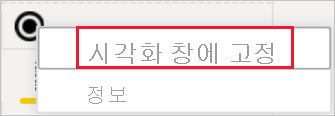
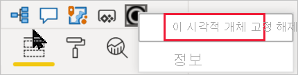

# Power BI 보고서의 시각화

[!INCLUDE[consumer-appliesto-yyyn](../includes/consumer-appliesto-yyyn.md)]    

시각화(줄여서 시각적 개체라고 함)는 데이터에서 발견된 인사이트를 표시합니다. Power BI 보고서에 시각적 개체가 하나 있는 단일 페이지가 포함될 수도 있고 시각적 개체로 가득한 여러 페이지가 포함될 수도 있습니다. Power BI 서비스에서 시각적 개체를 [보고서에서 대시보드에 고정](../create-reports/service-dashboard-pin-tile-from-report.md)할 수 있습니다.

보고서 *디자이너* 와 보고서 *소비자* 사이를 구분하는 것이 중요합니다.  보고서를 빌드하거나 수정하는 사용자는 디자이너입니다.  디자이너는 보고서 및 보고서의 기본 데이터 세트를 편집할 수 있는 권한이 있습니다. 즉, Power BI Desktop에서는 데이터 보기에서 데이터 세트를 열고 보고서 보기에서 시각적 개체를 만들 수 있습니다. Power BI service 서비스에서는 [편집용 보기](../consumer/end-user-reading-view.md)의 보고서 편집기에서 데이터 세트 또는 보고서를 열 수 있습니다. 보고서 또는 대시보드가 [사용자와 공유](../consumer/end-user-shared-with-me.md)되는 경우 사용자는 보고서 *소비자* 입니다. 사용자는 보고서와 시각적 개체를 보고 조작할 수 있지만, *‘디자이너’* 만큼 다양한 변경 작업을 수행할 수는 없습니다.

Power BI 시각화 창에서 바로 사용할 수 있는 다양한 시각적 개체 유형이 있습니다.

[Microsoft AppSource 커뮤니티 사이트](https://appsource.microsoft.com)에서 더 많은 Power BI 시각적 개체를 사용할 수 있습니다. AppSource에서 Microsoft 및 커뮤니티에서 제공하는 Power BI 시각적 개체를 찾아보고 [다운로드](https://appsource.microsoft.com/marketplace/apps?page=1&product=power-bi-visuals)할 수 있습니다.

Power BI를 처음 사용하거나 복습이 필요하면, 아래 링크를 사용하여 Power BI 시각화의 기본 사항을 알아봅니다.  또는, 목차(문서의 왼쪽에 있는)를 사용하여 훨씬 더 유용한 정보를 찾아봅니다.

## Power BI에서 시각적 개체 추가

보고서의 페이지에 [시각화를 만듭니다](power-bi-report-add-visualizations-i.md). [사용 가능한 시각화 및 사용 가능한 시각화 자습서의 목록](power-bi-visualization-types-for-reports-and-q-and-a.md)을 찾아봅니다. 

## 파일 또는 AppSource에서 시각화 업로드

직접 만든 또는 [Microsoft AppSource 커뮤니티 사이트](https://appsource.microsoft.com/marketplace/apps?product=power-bi-visuals)에서 찾은 시각적 개체를 추가합니다. 창의성을 발휘하고 싶으신가요? 소스 코드를 더 자세히 살펴보고 [개발자 도구](../developer/visuals/environment-setup.md)를 사용하여 새로운 시각적 개체를 만들고 [커뮤니티와 공유](../developer/visuals/office-store.md)하세요. Power BI 시각적 개체를 개발하는 방법을 자세히 알아보려면 [Power BI 시각적 개체 개발](../developer/visuals/develop-circle-card.md)을 참조하세요.

## 시각화 창 개인 설정

시각화 창에서 Power BI 시각적 개체를 추가하거나 제거하여 시각화 창을 개인 설정할 수 있습니다. 시각화 창에서 기본 시각적 개체를 제거한 경우 창을 기본값으로 복원하여 모든 기본 시각적 개체를 다시 가져올 수 있습니다.

### 시각화 창에 시각적 개체 추가

여러 보고서에서 동일한 시각적 개체를 사용하는 경우 시각화 창에 시각적 개체를 추가할 수 있습니다. 시각적 개체 추가는 AppSource 시각적 개체, 조직 시각적 개체 및 파일 시각적 개체에 적용됩니다. 시각적 개체를 추가하려면 시각적 개체를 마우스 오른쪽 단추로 클릭합니다.

시각적 개체가 고정되면 다른 기본 시각적 개체와 함께 라이브로 이동합니다. 이제 시각적 개체가 로그인한 계정에 연결되었므로, 로그인했다고 가정할 경우 사용자가 새로 작성하는 모든 보고서에 이 시각적 개체가 자동으로 포함됩니다. 더 이상 정기적으로 사용하는 특정 시각적 개체를 모든 단일 보고서에 추가할 필요가 없습니다.

### 시각화 창에서 시각적 개체 제거

시각적 개체를 더 이상 정기적으로 사용하지 않는 경우 해당 개체를 마우스 오른쪽 단추로 클릭하고 시각화 창에서 제거할 수 있습니다. 기본, 파일, 조직, AppSource 시각적 개체 등 모든 유형의 시각적 개체를 시각화 창에서 제거할 수 있습니다.

### 시각화 창 복원

시각화 창 복원은 기본 시각적 개체에만 적용됩니다. 시각화 창에 추가된 시각적 개체는 영향을 받지 않으며 시각화 창에서 사용할 수 있는 상태로 유지됩니다. 시각화 창에서 AppSource 또는 파일 시각적 개체를 제거하려면 수동으로 이 작업을 수행해야 합니다.

시각화 창을 기본값으로 복원하려면 추가 옵션을 클릭하고 **기본 시각적 개체복원** 을 선택합니다.

## 시각화 유형 변경

[시각화 유형을 변경](power-bi-report-change-visualization-type.md)하여 어떤 것이 데이터와 가장 최적으로 작동하는지 봅니다.

## 시각화 고정

Power BI에서 원하는 방식의 시각화가 있는 경우 타일 형태로 [대시보드에 고정](../create-reports/service-dashboard-pin-tile-from-report.md)할 수 있습니다. 보고서에서 사용되는 시각화를 고정 후 변경한 경우, 대시보드의 타일은 변경되지 않습니다. 이 시각화가 꺾은선형 차트였다면 보고서에서 도넛형 차트로 변경했더라도 꺾은선형 차트는 그대로 유지됩니다.

## 제한 사항 및 고려 사항
- 데이터 원본 필드 수(측정값 또는 열)에 따라 시각적 개체가 느리게 로드될 수 있습니다.  가독성과 성능상의 이유로 모두 총10~20개 필드로 시각적 개체를 제한하는 것이 좋습니다. 

- 시각적 개체 상한은 100개의 필드(측정값 또는 열)입니다. 시각적 개체를 로딩하지 못하는 경우에는 필드 수를 줄이세요.

## 다음 단계

* [Power BI의 시각화 유형](power-bi-visualization-types-for-reports-and-q-and-a.md)
* [Power BI 시각적 개체](../developer/visuals/power-bi-custom-visuals.md)
