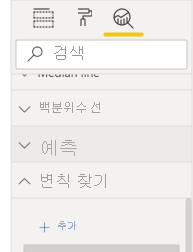
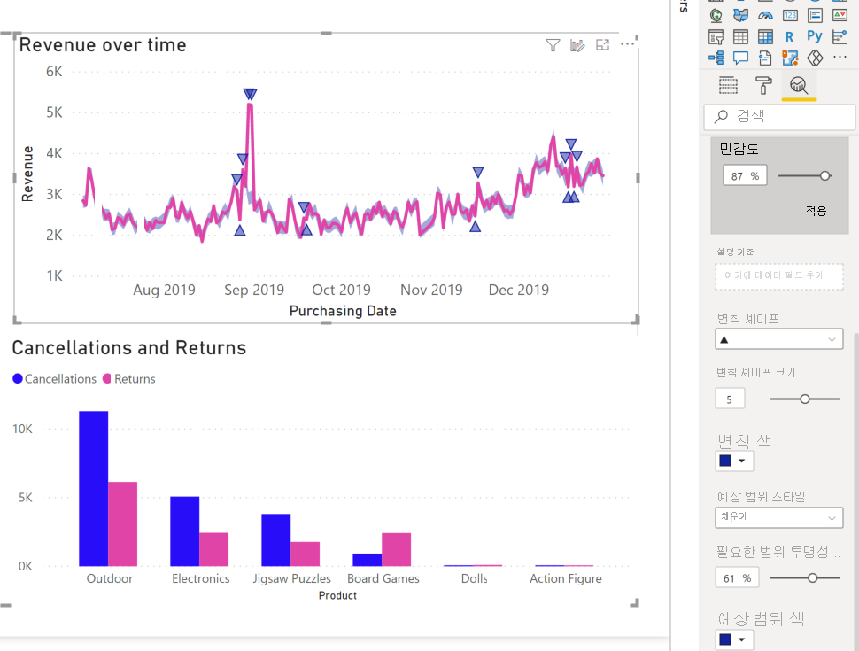

# 변칙 검색(미리 보기)

[!INCLUDE[consumer-appliesto-nyyn](../includes/consumer-appliesto-nyyn.md)]    

변칙 검색은 시계열 데이터에서 변칙을 자동으로 검색하여 꺾은선형 차트를 개선하는 데 도움이 됩니다. 또한 근본 원인 분석에 도움이 되는 변칙에 대한 설명을 제공합니다.  데이터를 조각화 및 분할하지 않고도 몇 번의 클릭만으로 손쉽게 정보를 찾을 수 있습니다. Power BI Desktop과 Power BI 서비스에서 모두 변칙을 만들고 볼 수 있습니다. 이 문서의 단계와 그림은 모두 Power BI Desktop에 해당합니다.

이 기능은 미리 보기 상태이므로 먼저 기능 스위치를 켜야 합니다. **파일** > **옵션 및 설정** > **옵션** > **미리 보기 기능** 으로 이동하고, **변칙 검색** 이 켜져 있는지 확인합니다.

:::image type="content" source="media/power-bi-visualization-anomaly-detection//preview-feature-switch.png" alt-text="변칙 검색 미리 보기 기능 스위치를 사용하도록 설정하는 방법을 보여 주는 스크린샷.":::
 
## 시작
이 자습서에서는 다양한 제품의 온라인 판매 데이터를 사용합니다. 이 자습서를 진행하려면 온라인 판매 시나리오의 [샘플 파일](https://github.com/microsoft/powerbi-desktop-samples/blob/master/Monthly%20Desktop%20Blog%20Samples/2020/2020SU09%20Blog%20Demo%20-%20September.pbix)을 다운로드하세요.

분석 창에서 차트를 선택하고 “변칙 찾기” 옵션을 추가하여 변칙 검색을 사용하도록 설정할 수 있습니다. 

 

 예를 들어 이 차트는 시간에 따른 수익을 보여 줍니다. 변칙 검색을 추가하면 변칙 및 예상 값 범위로 차트가 자동으로 보강됩니다. 값이 예상 경계를 벗어나면 변칙으로 표시됩니다. Anomaly Detector 알고리즘에 대한 자세한 내용은 이 [기술 블로그](https://techcommunity.microsoft.com/t5/ai-customer-engineering-team/overview-of-sr-cnn-algorithm-in-azure-anomaly-detector/ba-p/982798)를 참조하세요.

 
 
## 변칙 서식 지정

이 환경은 높은 수준의 사용자 지정이 가능합니다. 변칙의 모양, 크기 및 색은 물론 예상 범위의 색, 스타일 및 투명도도 지정할 수 있습니다. 알고리즘의 매개 변수를 구성할 수도 있습니다.  민감도를 늘리면 알고리즘이 데이터의 변경에 더 민감하게 반응합니다. 이 경우 약간의 편차도 변칙으로 표시됩니다. 민감도를 줄이면 알고리즘이 변칙을 고려할 때 좀 더 선택적으로 반응합니다.

 
 
## 설명
변칙을 검색하는 것 외에 데이터의 변칙을 자동으로 설명할 수도 있습니다. 사용자가 변칙을 선택하면, Power BI는 데이터 모델의 필드에 대해 분석을 실행하여 가능한 설명을 파악합니다. 이를 통해 변칙을 자연어로 설명하고, 해당 변칙과 관련된 요소를 설명 강도별로 정렬합니다. 8월 30일에는 수익이 $5187인데, 이는 예상 범위인 $2447~$3423을 초과합니다. 이 창에서 카드를 열어 설명에 대한 자세한 내용을 볼 수 있습니다.

 
### 설명 구성
분석에 사용되는 필드를 제어할 수도 있습니다. 예를 들어 판매자와 도시를 **설명 기준** 필드로 끌면 Power BI는 분석을 해당 필드로만 제한합니다. 이 경우 8월 31일의 변칙은 특정 판매자 및 특정 도시와 연결된 것으로 보입니다. 여기서 판매자 “Fabrikam”의 강도는 99%입니다. Power BI는 합계 값의 편차에 대한 차원을 기준으로 필터링할 때 예상 값과의 편차 비율로서 *강도* 를 계산합니다. 예를 들어 구성 요소 시계열 *Fabrikam* 및 변칙 지점에 대한 집계 시계열 *전체 수익* 간의, 실제 값에서 예상 값을 뺀 비율입니다. 이 카드를 열면 8월 31일에 이 판매자의 수익이 급증한 시각적 개체가 표시됩니다. **보고서에 추가** 옵션을 사용하여 이 시각적 개체를 페이지에 추가합니다.

## 제한 사항
- 변칙 검색은 축 필드의 시계열 데이터를 포함하는 꺾은선형 차트 시각적 개체에 대해서만 지원됩니다.
- 변칙 검색은 꺾은선형 차트 시각적 개체의 범례, 다중 값 또는 보조 값에 대해 지원되지 않습니다.
- 변칙 검색에는 데이터 요소가 12개 이상 필요합니다.
- 예측/최소/최대/평균/중앙값/백분위 수 선은 변칙 검색에서 작동하지 않습니다.
- SAP 데이터 원본에 대한 DirectQuery, Power BI Report Server, 그리고 Azure Analysis Services 및 SQL Server Analysis Services에 대한 라이브 연결은 지원되지 않습니다.
- 변칙 설명은 ‘다음으로 값으로 표시’ 옵션에서 작동하지 않습니다.
- 계층에서 다음 수준으로 이동하는 드릴다운은 지원되지 않습니다.
