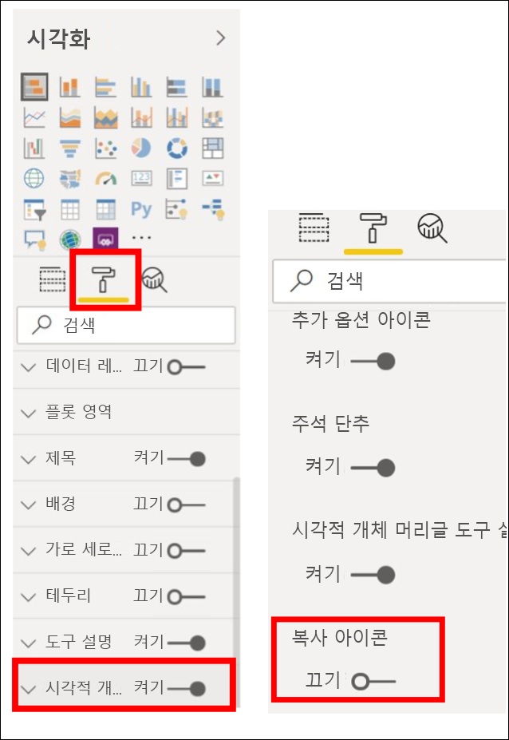

# 보고서 시각화 복사 및 붙여넣기

[!INCLUDE[consumer-appliesto-yyyn](../includes/consumer-appliesto-yyyn.md)]

이 문서에서는 시각적 개체를 복사하여 붙여넣는 두 가지 다른 방법을 설명합니다. 
* 보고서에서 시각적 개체를 복사하여 다른 보고서 페이지에 붙여넣기(보고서에 대한 편집 권한이 필요함)

* Power BI에서 시각적 개체의 이미지를 클립보드로 복사하고 다른 애플리케이션에 붙여넣기

## 동일한 보고서 내에서 복사하여 붙여넣기
Power BI 보고서의 시각적 개체를 보고서의 한 페이지에서 동일한 보고서의 동일한 페이지 또는 다른 페이지로 복사할 수 있습니다. 

시각화를 복사하고 붙여 넣으려면 보고서에 대한 편집 권한이 필요합니다. Power BI 서비스에서 이는 [편집용 보기](../consumer/end-user-reading-view.md)에서 보고서를 연다는 의미입니다. 

*대시보드*의 시각화는 Power BI 보고서 또는 다른 대시보드에 복사하여 붙여넣을 수 없습니다.

1. 하나 이상의 시각화가 있는 보고서를 엽니다.  

2. 시각화를 선택하고 **Ctrl +C** 를 사용하여 복사한 다음 **Ctrl +V** 를 사용하여 붙여넣습니다.      

   

## 시각적 개체를 이미지로 클립보드에 복사

Power BI 보고서 또는 대시보드에서 이미지를 공유하려고 했습니까? 이제 시각적 개체를 복사하여 붙여넣기를 지원하는 다른 애플리케이션에 붙여넣을 수 있습니다. 

시각적 개체의 정적 이미지를 복사하는 경우 메타데이터와 함께 시각적 개체의 복사본을 가져옵니다. 다음 내용이 포함됩니다.
* Power BI 보고서 또는 대시보드에 다시 연결
* 보고서 또는 대시보드의 제목
* 이미지에 기밀 정보가 포함되어 있는지 주의
* 마지막으로 업데이트된 타임스탬프
* 시각적 개체에 적용되는 필터

### 대시보드 타일에서 복사

1. 복사하려는 대시보드로 이동합니다.

2. 시각적 개체의 오른쪽 위 모퉁이에서 **기타 옵션(...)** 을 선택하고 **시각적 개체를 이미지로 복사**를 선택합니다. 

    

3. **시각적 개체를 복사할 준비가 되고** 대화 상자가 표시되면 **클립보드로 복사**를 선택합니다.

    

4. 시각적 개체가 준비되면 **Ctrl + V** 또는 오른쪽 단추로 클릭 > 붙여넣기를 사용하여 다른 애플리케이션에 붙여넣습니다. 아래 스크린샷에서는 시각적 개체를 Microsoft Word에 붙여넣었습니다. 

    

### 보고서 시각적 개체에서 복사 

1. 복사하려는 보고서로 이동합니다.

2. 시각적 개체의 오른쪽 위 모퉁이에서 **시각적 개체를 이미지로 복사** 아이콘을 선택합니다. 

    

3. **시각적 개체를 복사할 준비가 되고** 대화 상자가 표시되면 **클립보드로 복사**를 선택합니다.

    

4. 시각적 개체가 준비되면 **Ctrl + V** 또는 오른쪽 단추로 클릭 > 붙여넣기를 사용하여 다른 애플리케이션에 붙여넣습니다. 아래 스크린샷에서는 시각적 개체를 전자 메일에 붙여넣었습니다.

    

5. 보고서에 데이터 민감도 레이블이 적용된 경우에는 복사 아이콘을 선택할 때 경고가 표시됩니다.  

    

    민감도 레이블은 붙여넣은 시각적 개체 아래의 메타데이터에 추가됩니다. 

    

### 시각적 개체를 이미지로 복사하는 사용 관리
콘텐츠를 소유하거나 테넌트의 관리자인 경우 시각적 개체를 보고서 또는 대시보드의 이미지로 복사할 수 있는지 여부를 제어할 수 있습니다.

#### 특정 시각적 개체에 대한 이미지로 복사 사용 안 함
사용자가 특정 시각적 개체를 복사할 수 없도록 하려면 해당 시각적 개체에서 복사 아이콘을 제거하면 됩니다.
1. 페인트 롤러 아이콘을 선택하여 서식 창을 엽니다. 

1. **시각적 서식 지정** 카드를 엽니다.
1. **시각적 개체 헤더**로 아래로 스크롤하여 카드를 확장하고 **복사 아이콘**을 해제합니다.

    

1. **시각적 개체 헤더** 설정을 찾을 수 없는 경우 **보고서 설정**에서 최신 시각적 개체 헤더 옵션을 설정합니다. 

    

1. 변경 내용을 저장합니다. 다시 공유하고 필요에 따라 다시 게시합니다.

#### 사용자 그룹에 대한 이미지로 복사 사용 안 함

콘텐츠를 소유하거나 테넌트의 관리자인 경우 시각적 개체를 복사할 수 있는 사용자를 제어할 수 있습니다. 이 설정은 사용자가 Power BI 테넌트에서 액세스하는 모든 콘텐츠에 대해 *시각적 개체를 이미지로 복사*를 사용하지 않도록 설정합니다.
  
1. 관리 포털로 이동합니다.

1. **테넌트 설정**에서 **내보내기 및 공유 설정**을 선택합니다. 

    

1. 선택한 사용자 그룹에 대한 **시각적 개체 복사 및 붙여넣기**를 사용하지 않도록 설정합니다. 

1. 변경 내용을 저장하고, 지정된 그룹은 Power BI 전체에서 **시각적 개체를 이미지로 복사**를 사용할 수 없습니다. 
  

## 고려 사항 및 문제 해결

   

Q: 시각적 개체에서 복사 아이콘을 사용하지 않도록 설정하는 이유는 무엇인가요?    
A: 현재 네이티브 Power BI 시각적 개체와 인증된 시각적 개체를 지원합니다. 다음을 비롯한 특정 시각적 개체에 대한 지원이 제한됩니다. 
- ESRI 및 기타 지도 시각적 개체 
- Python 시각적 개체 
- R 시각적 개체 
- PowerApps 
- 인증되지 않은 사용자 지정 시각적 개체. 지원할 사용자 지정 시각적 개체에 대해서는 [사용자 지정 시각적 개체를 인증하는 방법](../developer/visuals/power-bi-custom-visuals-certified.md)에 대해 자세히 알아보세요. 

Q: 시각적 개체를 제대로 붙여넣지 않는 이유는 무엇인가요?    
A: 시각적 개체를 이미지로 복사하는 경우에는 다음과 같은 제한 사항이 있습니다. 
- 사용자 지정 시각적 개체의 경우 
    - 테마 및 색이 적용된 시각적 개체 
    - 붙여넣을 때 타일 크기 조정 
    - 애니메이션을 사용하는 사용자 지정 시각적 개체 
- 제약 조건 복사 
    - 새로 고정된 대시보드 타일을 복사할 수 없음 
    - Odata 필터 및 고정 상태(예: 개인 책갈피)를 사용하여 사용자를 콘텐츠로 리디렉션할 수 없음 
- 클립보드에서 HTML 형식 콘텐츠를 붙여넣는 기능이 제한된 애플리케이션은 시각적 개체에서 복사한 모든 항목을 렌더링하지 못할 수 있음 

## 다음 단계
[Power BI 보고서의 시각화](power-bi-report-visualizations.md)에 대해 자세히 알아보기

궁금한 점이 더 있나요? [Power BI 커뮤니티를 이용하세요.](https://community.powerbi.com/)

