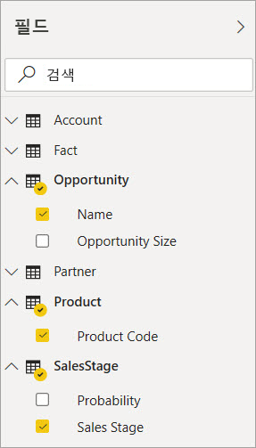

# 자습서:  Power BI 보고서에 Power Apps 시각적 개체 포함

이 자습서에서는 Power Apps 시각적 개체를 사용하여 Power BI 보고서에 포함되는 새 앱을 만듭니다. 이 앱은 해당 보고서의 다른 시각적 개체와 상호 작용합니다.

Power Apps 구독이 없는 경우 시작하기 전에 [무료 계정을 만듭니다](https://web.powerapps.com/signup?redirect=marketing&email=).

이 자습서에서는 다음 작업을 수행하는 방법을 알아봅니다.
> [!div class="checklist"]
> * Power BI 보고서에 Power Apps 시각적 개체 추가
> * Power Apps에서 작업하여 Power BI 보고서의 데이터를 사용하는 새 앱 만들기
> * 보고서에서 Power Apps 시각적 개체 보기 및 상호 작용

## 필수 조건

* [Google Chrome](https://www.google.com/chrome/browser/) 또는 [Microsoft Edge](https://www.microsoft.com/windows/microsoft-edge) 브라우저
* [기회 분석 샘플](https://docs.microsoft.com/power-bi/sample-opportunity-analysis#get-the-content-pack-for-this-sample)이 설치된 [Power BI 구독](https://docs.microsoft.com/power-bi/service-self-service-signup-for-power-bi)
* [Power Apps에서 앱을 만드는 방법](https://docs.microsoft.com/powerapps/maker/canvas-apps/data-platform-create-app-scratch) 및 [Power BI 보고서를 편집하는 방법](https://docs.microsoft.com/power-bi/service-the-report-editor-take-a-tour)에 대한 이해

## 새 앱 만들기
보고서에 Power Apps 시각적 개체를 추가하면 Power Apps와 Power BI 간의 라이브 데이터 연결과 함께 Power Apps Studio가 시작됩니다.

1. 기회 분석 샘플 보고서를 열고 *예정된 기회* 페이지를 선택합니다. 

2. 일부 보고서 타일을 이동하고 크기를 조정하여 새 시각적 개체의 공간을 확보합니다.

    

2. 시각화 창에서 Power Apps 아이콘을 선택한 다음 확보한 공간에 맞게 시각적 개체의 크기를 조정합니다.

    

3. **필드** 창에서 **이름**, **제품 코드** 및 **영업 스테이지**를 선택합니다. 

    

4. Power Apps 시각적 개체에서 앱을 만들려는 Power Apps 환경을 선택한 다음 **새로 만들기**를 선택합니다.

    

    Power Apps Studio를 통해 Power BI에서 선택한 필드 중 하나를 표시하는 *갤러리*가 있는 기본 앱이 만들어졌음을 알 수 있습니다.

    

5.  화면의 절반만 차지하도록 갤러리의 크기를 조정합니다. 

6. 왼쪽 창에서 **Screen1**을 선택한 다음 화면의 **채우기** 속성을 "LightBlue"로 설정합니다(보고서에 더 잘 표시되도록).

    

6. 레이블 컨트롤을 위한 공간을 만듭니다. 

    

8. **갤러리**에서 텍스트 레이블 컨트롤을 삽입합니다.

   

7. 레이블을 시각적 개체 아래쪽으로 끕니다. **텍스트** 속성을 `"Opportunity Count: " & CountRows(Gallery1.AllItems)`로 설정합니다. 이제 데이터 집합의 총 기회 수가 표시됩니다.

    

    

7. 앱을 "기회 앱"이라는 이름으로 저장합니다. 

    

## 보고서에서 앱 보기
이제 앱을 Power BI 보고서에서 사용할 수 있으며, 동일한 데이터 원본을 공유하므로 다른 시각적 개체와 상호 작용합니다.

Power BI 보고서의 슬라이서에서 **1월**을 선택합니다. 이 경우 앱의 데이터를 포함하여 전체 보고서가 필터링됩니다.

앱의 기회 수는 보고서의 왼쪽 위에 있는 수와 일치합니다. 보고서에서 다른 항목을 선택할 수 있으며, 앱의 데이터가 업데이트됩니다.

## 리소스 정리
기회 분석 샘플을 더 이상 사용하지 않으려는 경우 대시보드, 보고서 및 데이터 세트를 삭제할 수 있습니다.

## 제한 사항 및 고려 사항
문제 해결 정보는 [Power BI용 Power Apps 시각적 개체](https://docs.microsoft.com/powerapps/maker/canvas-apps/powerapps-custom-visual#limitations-of-the-power-apps-visual)를 참조하세요.

## 다음 단계
[질문 및 답변 시각적 개체](power-bi-visualization-types-for-reports-and-q-and-a.md)    
[자습서: Power BI 보고서에 Power Apps 시각적 개체 포함](https://docs.microsoft.com/powerapps/maker/canvas-apps/powerapps-custom-visual)    
