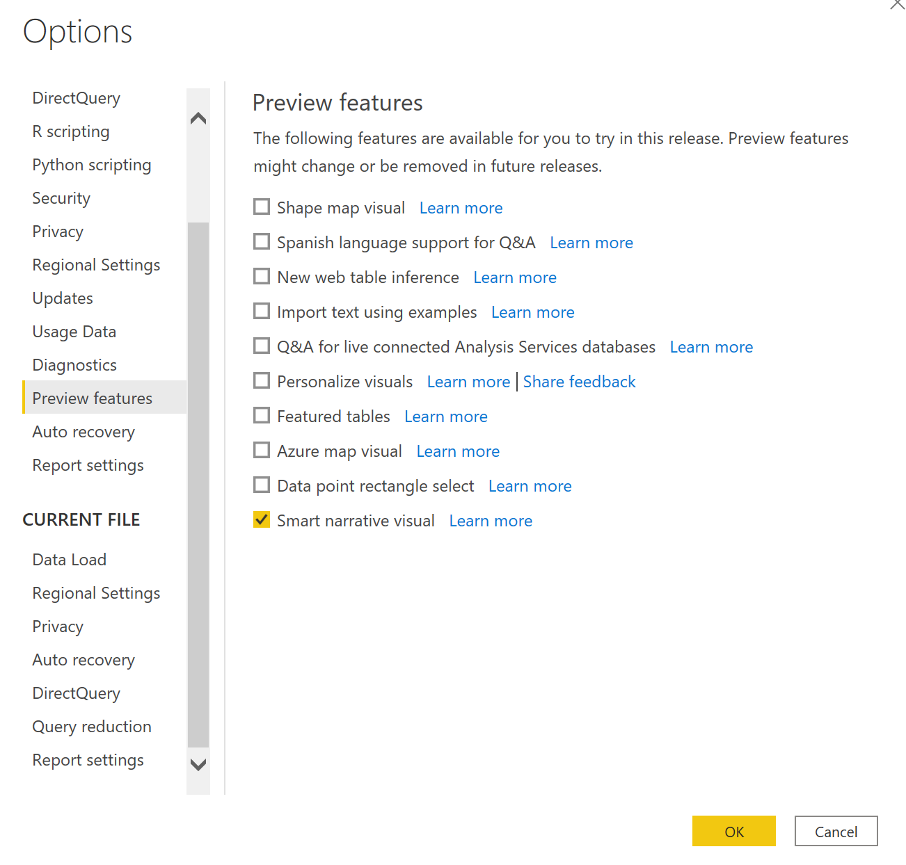
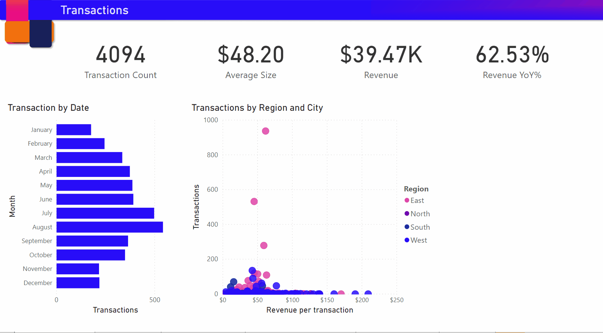
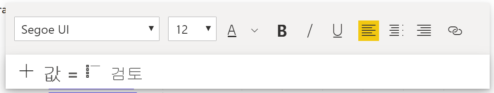
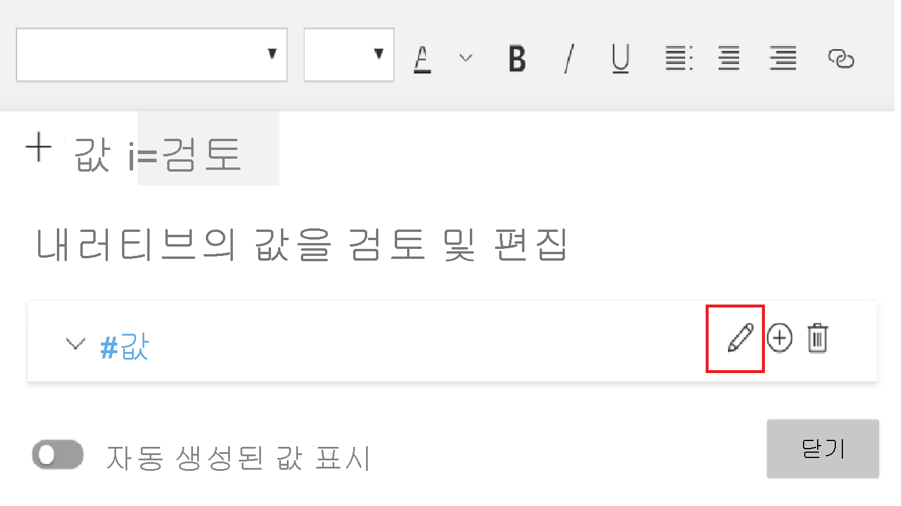
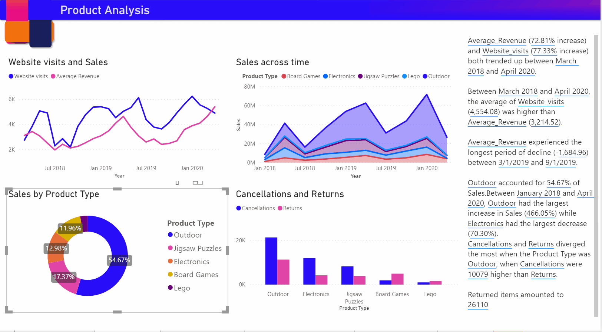

# 스마트 설명 만들기(미리 보기)

[!INCLUDE[consumer-appliesto-nyyn](../includes/consumer-appliesto-nyyn.md)]    

[!INCLUDE [power-bi-visuals-desktop-banner](../includes/power-bi-visuals-desktop-banner.md)]

스마트 설명 시각화는 사용자 지정할 수 있는 관련 기본 인사이트를 제공하여 시각적 개체 및 보고서를 빠르게 요약하는 데 도움이 됩니다.

이 기능 작성자를 사용하면 보고서에 설명을 추가하여 주요 사항을 처리하고, 추세를 가리키고, 언어를 편집하고, 특정 대상 그룹에 맞게 서식을 지정할 수 있습니다. 주요 사항이 추가된 보고서의 스크린샷을 PowerPoint에 붙여넣는 대신 이제 새로 고침할 때마다 업데이트되는 보고서에 설명을 추가할 수 있습니다. 최종 사용자는 설명을 사용하여 데이터를 이해하고, 핵심 포인트에 더 빠르게 도달하고, 다른 사람에게 데이터를 설명할 수 있습니다.

>[!NOTE]
> 이 기능은 미리 보기이므로 먼저 파일 > 옵션 및 설정 > 옵션 > 미리 보기 기능으로 이동하여 기능 스위치를 켜고 **스마트 설명 시각적 개체**가 켜져 있는지 확인해야 합니다.

이 설명서의 온라인 판매 시나리오에 사용되는 pbix는 [여기](https://github.com/microsoft/powerbi-desktop-samples/blob/master/Monthly%20Desktop%20Blog%20Samples/2020/2020SU09%20Blog%20Demo%20-%20September.pbix)서 찾을 수 있습니다.

## 시작 

시각화 창에서 새 스마트 설명 아이콘을 클릭하여 요약을 자동으로 생성합니다.

 페이지의 모든 시각적 개체를 기반으로 만든 설명을 볼 수 있습니다. 예를 들어 아이콘을 클릭하면 이 보고서의 수익, 웹 사이트 방문, 판매와 관련된 시각적 개체의 요약을 자동으로 생성할 수 있습니다. Power BI는 자동으로 추세 분석을 수행하여 수익과 방문이 모두 증가했음을 보여 주고 어떤 종류의 증가인지도 계산합니다(이 경우에는 72% 증가).
 
 
 
 시각적 개체를 마우스 오른쪽 단추로 클릭하고 **‘요약’** 을 선택할 수도 있습니다. 그러면 해당 시각화의 자동 요약이 생성됩니다. 예를 들어 다양한 트랜잭션을 표시하는 분산형 차트에서 요약을 마우스 오른쪽 단추로 클릭하면 Power BI는 데이터를 분석하여 트랜잭션당 수익이 가장 높은 도시/지역과 가장 높은 트랜잭션 수를 표시합니다. 이러한 메트릭의 예상되는 값 범위도 보여 주므로 대부분의 도시의 트랜잭션당 수익이 $45 미만이고 트랜잭션 수가 10개 미만임을 알 수 있습니다.
 
  
 
 
 ## 요약 편집
 
 요약은 **사용자 지정** 기능이 뛰어나므로 일반 텍스트 상자에서 사용할 수 있는 것과 동일한 컨트롤을 사용하여 새 텍스트를 추가하거나 기존 텍스트를 편집할 수 있습니다. 예를 들어 텍스트를 굵게 설정하거나 텍스트 색을 변경할 수 있습니다.
 
  
  
  **동적 값**을 추가하여 요약을 사용자 지정하고 자체 인사이트를 추가할 수도 있습니다. 텍스트를 기존 필드 및 측정값에 매핑하거나 자연어를 사용하여 텍스트에 매핑할 새 측정값을 정의할 수 있습니다. 예를 들어 반환된 항목 수에 대한 정보를 추가하려면 gif에 표시된 것처럼 값 추가 환경을 사용할 수 있습니다. 동적 값을 추가할 수 있도록 Q&A 환경이 통합되었습니다. 입력할 때 Q&A 시각적 개체에서처럼 드롭다운에 제안 사항이 표시되며, 이를 값으로 저장할 수 있습니다.  따라서 Q&A에서 데이터 질문을 할 수 있을 뿐 아니라 DAX를 수행하지 않고도 자체 계산을 만들 수 있도록 범위가 확장되었습니다. 
  
   
  
  예를 들어 통화로 표시하거나 소수 자릿수를 지정하거나 천 단위 구분 기호를 지정하는 등 동적 값의 형식을 지정할 수 있습니다. 
   
   
   
   이렇게 하려면 요약의 값을 직접 클릭하여 형식을 지정하거나 텍스트 상자 컨트롤의 검토 탭에 있는 값에 해당하는 편집 단추를 클릭합니다. 
   
   
   
   검토 탭에서 이전에 정의된 값을 검토, 삭제 또는 다시 사용할 수도 있습니다.  더하기 아이콘을 클릭하면 요약에 값이 삽입됩니다. 아래쪽에서 옵션을 설정/해제하여 자동 생성된 값을 표시할 수도 있습니다.

"현재 데이터 및 필터는 이 값의 결과를 생성하지 않습니다"라는 숨겨진 요약 기호가 표시되는 경우가 있습니다. 그 이유는 흥미로운 내용이 없어서 일부 요약이 비어 있을 수 있기 때문입니다. 예를 들어 꺾은선형 차트에서 높은 값과 낮은 값을 살펴보는 요약은 평평한 선인 경우 비어 있을 수 있지만 다른 조건에서는 비어 있지 않을 수 있습니다. 이러한 기호는 요약을 편집하려고 할 때만 표시됩니다.

   
   
   ## 시각적 개체 상호 작용
   요약은 동적이며 교차 필터링 시 생성된 텍스트와 동적 값을 자동으로 업데이트합니다. 예를 들어 도넛형 차트에서 가전 제품을 선택하는 경우 보고서의 나머지 부분이 교차 필터로 이동하고 요약도 교차 필터링되어 전자 제품에 포커스가 지정됩니다.  이 경우 방문과 수익의 추세가 서로 다르므로 텍스트는 이를 반영하도록 업데이트됩니다. 추가한 반환 개수 값이 $4196로 업데이트됩니다. 교차 필터링할 때 빈 요약 중 일부가 업데이트될 수도 있습니다.
   
   
   
   고급 필터링을 수행할 수도 있습니다. 예를 들어 다양한 제품의 추세를 살펴보는 이 시각적 개체에서 특정 분기에만 관심이 있는 경우 관련 데이터 요소를 선택하여 해당 조각에 대한 요약을 업데이트할 수 있습니다.
   
   
   
   ## 제한 사항
   - 대시보드에 고정은 지원되지 않습니다.
   - 동적 값 및 조건부 형식 지정(예: 데이터 바인딩된 제목) 사용은 지원되지 않습니다.
   - Azure Analysis Services인 온-프레미스 AS는 지원되지 않습니다.
   - KPI, 카드, 여러 행 카드, 지도, 테이블, 행렬, R/Python 시각적 개체, 사용자 지정 시각적 개체는 요약을 지원하지 않습니다. 이러한 시각적 개체 중 일부는 향후 추가될 예정입니다.
   - 다른 열을 기준으로 그룹화된 열이 있는 시각적 개체와 데이터 그룹 필드에서 빌드된 시각적 개체에 대해서는 요약이 지원되지 않습니다. 
   - 시각적 개체 외부의 교차 필터링은 지원되지 않습니다.
   - 동적 값의 이름 변경이나 자동 생성된 동적 값 편집은 지원되지 않습니다.
   - QnA 산술, 총합계의 백분율과 같은 즉석 계산을 포함하는 시각적 개체 요약은 지원되지 않습니다.
   

