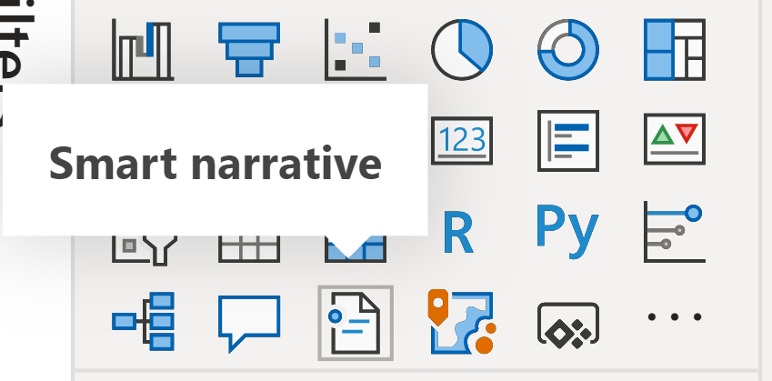

# 스마트 설명 요약 만들기(미리 보기)

[!INCLUDE[consumer-appliesto-nyyn](../includes/consumer-appliesto-nyyn.md)]    

[!INCLUDE [power-bi-visuals-desktop-banner](../includes/power-bi-visuals-desktop-banner.md)]

스마트 설명 시각화를 통해 시각적 개체와 보고서를 신속하게 요약할 수 있습니다. 사용자 지정할 수 있는 관련 혁신적 인사이트를 제공합니다.

보고서에서 스마트 설명 요약을 사용하여 주요 내용을 처리하고, 추세를 파악하고, 특정 대상 그룹에 대한 언어와 형식을 편집합니다. PowerPoint에서는 보고서의 주요 내용 스크린샷을 붙여넣는 대신 새로 고칠 때마다 업데이트되는 설명을 추가할 수 있습니다. 대상 그룹은 설명을 사용하여 데이터를 이해하고, 핵심 포인트에 더 빠르게 도달하고, 다른 사람에게 데이터를 설명할 수 있습니다.

>[!NOTE]
> 스마트 설명 기능은 미리 보기로 제공되므로 사용하려면 설정해야 합니다. Power BI에서 **파일** > **옵션 및 설정** > **옵션** > **미리 보기 기능** 으로 이동합니다. 그런 다음, **스마트 설명 시각적 개체** 를 선택합니다.
>
>

## 시작 
Justyna에서 스마트 설명을 사용하는 방법을 확인하고 아래의 자습서를 참조하여 직접 사용해 보세요.  이 자습서를 진행하려면 온라인 판매 시나리오의 [샘플 파일](https://github.com/microsoft/powerbi-desktop-samples/blob/master/Monthly%20Desktop%20Blog%20Samples/2020/2020SU09%20Blog%20Demo%20-%20September.pbix)을 다운로드하세요.

> [!VIDEO https://youtu.be/01UrT-z37sw]

**시각화 창** 에서 **스마트 설명** 아이콘을 선택하여 요약을 자동으로 생성합니다.

페이지의 모든 시각적 개체를 기반으로 한 설명이 표시됩니다. 예를 들어 샘플 파일에서 스마트 설명은 수익, 웹 사이트 방문 및 판매를 다루는 보고서의 시각적 개체 요약을 자동으로 생성할 수 있습니다. Power BI는 자동으로 추세를 분석하여 수익과 방문이 모두 증가했음을 보여줍니다. 증가를 계산하기도 합니다. 이 경우에는 72%입니다.
 

 
시각화에 대한 스마트 설명을 생성하려면 마우스 오른쪽 단추로 클릭한 다음, **요약** 를 선택합니다. 예를 들어 샘플 파일에서 다양한 트랜잭션을 표시하는 분산형 차트를 요약해 보세요. Power BI는 데이터를 분석하고, 트랜잭션당 수익이 가장 높고, 트랜잭션 수가 가장 많은 도시 또는 지역을 표시합니다. 스마트 설명에는 이러한 메트릭에 대해 예상되는 값 범위도 표시됩니다. 대부분의 도시는 트랜잭션당 $45 미만으로 생성되고 트랜잭션 수는 10개 미만으로 표시됩니다.
 
  

 
## 요약 편집
 
스마트 설명 요약은 사용자 지정이 가능합니다. 텍스트 상자 명령을 사용하여 기존 텍스트를 편집하거나 추가할 수 있습니다. 예를 들어 텍스트를 굵게 설정하거나 색을 변경할 수 있습니다.
 

  
요약을 사용자 지정하거나 자체 인사이트를 추가하려면 *동적 값* 을 사용합니다. 텍스트를 기존 필드 및 측정값에 매핑하거나 자연어를 사용하여 텍스트에 매핑할 새 측정값을 정의할 수 있습니다. 예를 들어 샘플 파일에서 반환된 항목 수에 대한 정보를 추가하려면 값을 추가합니다. 

값 이름을 입력할 때 질문 및 답변 시각적 개체에서와 같이 제안 목록에서 선택할 수 있습니다. 따라서 질문 및 답변 시각적 개체에서 데이터에 대해 질문을 하는 것 외에도 DAX(Data Analysis Expressions)를 사용하지 않고도 고유한 계산을 만들 수 있습니다. 
  

  
동적 값의 서식을 지정할 수도 있습니다. 예를 들어 샘플 파일에서 값을 통화로 표시하고, 소수 자릿수를 지정하고, 천 단위 구분 기호를 선택할 수 있습니다. 
   

   
동적 값의 서식을 지정하려면 요약에서 값을 선택하여 **검토** 탭에서 편집 옵션을 확인합니다. 또는 텍스트 상자에서 편집할 값 옆에 있는 편집 단추를 선택합니다. 
   

   
**검토** 탭을 사용하여 이전에 정의된 값을 검토, 삭제 또는 다시 사용할 수도 있습니다. 더하기 기호(+)를 선택하여 값을 요약에 삽입합니다. **검토** 탭의 아래쪽에 있는 옵션을 설정하여 자동으로 생성된 값을 표시할 수도 있습니다.

때때로 숨겨진 요약 기호가 스마트 설명에 표시됩니다. 현재 데이터 및 필터가 값에 대한 결과를 생성하지 않음을 나타냅니다. 사용할 수 있는 인사이트가 없으면 요약이 비어 있습니다. 예를 들어 샘플 파일의 꺾은선형 차트에서 차트의 선이 플랫인 경우 높은 값과 낮은 값의 요약이 비어 있을 수 있습니다. 그러나 요약은 다른 조건에서 나타날 수 있습니다. 숨겨진 요약 기호는 요약을 편집하려고 할 때만 표시됩니다.

   
## 시각적 개체 상호 작용
요약은 동적입니다. 교차 필터링 시 생성된 텍스트와 동적 값을 자동으로 업데이트합니다. 예를 들어 샘플 파일의 도넛형 차트에서 전자 제품을 선택하는 경우 보고서의 나머지 부분이 교차 필터링되고 요약도 교차 필터링되어 전자 제품에 초점을 맞춥니다.  

이 경우 방문과 수익의 추세가 서로 다르므로 요약 텍스트는 추세를 반영하도록 업데이트됩니다. 추가한 반환 개수 값이 $4196로 업데이트됩니다. 교차 필터링할 때 빈 요약을 업데이트할 수 있습니다.
   

   
고급 필터링을 수행할 수도 있습니다. 예를 들어 샘플 파일에서 여러 제품에 대한 추세를 시각적으로 살펴봅니다. 특정 분기의 추세에만 관심이 있는 경우 관련 데이터 요소를 선택하여 해당 추세에 대한 요약을 업데이트합니다.
   

   
## 제한 사항

스마트 설명 기능은 다음 기능을 지원하지 않습니다.
- 대시보드에 고정 
- 동적 값 및 조건부 서식 지정 사용(예: 데이터 바인딩된 제목)
- Azure Analysis Services, 온-프레미스 AS
- KPI, 카드, 여러 행 카드, 지도, 테이블, 행렬, R 시각적 개체 또는 Python 시각적 개체, 사용자 지정 시각적 개체 
- 열이 다른 열을 기준으로 그룹화되고 시각적 개체와 데이터 그룹 필드에서 빌드된 시각적 개체의 요약 
- 시각적 개체에서 교차 필터링
- 동적 값 이름 변경 또는 자동 생성된 동적 값 편집
- QnA 산술 및 총합계 비율과 같은 즉석 계산이 포함된 시각적 개체 요약 
- [계산 그룹](/analysis-services/tabular-models/calculation-groups)
   

