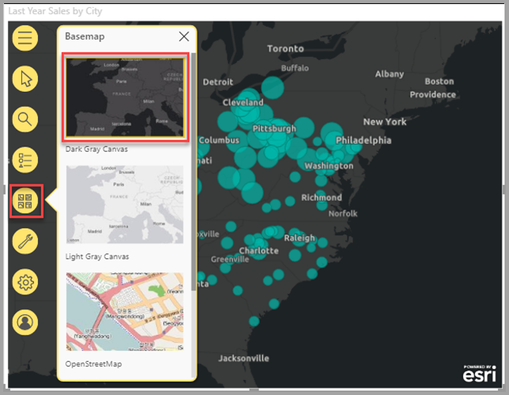

# Power BI에서 ArcGIS 지도 만들기

[!INCLUDE[consumer-appliesto-yyyn](../includes/consumer-appliesto-yyyn.md)]    

> [!NOTE]
> 이들 시각적 개체는 Power BI Desktop과 Power BI 서비스, 양쪽에서 모두 만들고 볼 수 있습니다. 이 문서의 단계와 그림은 모두 Power BI Desktop에 해당합니다.

이 개요는 ArcGIS Maps for Power BI를 만드는 사람의 관점에서 작성되었습니다. ‘디자이너’가 동료와 ArcGIS Maps for Power BI 지도를 공유하면, 동료가 지도를 보고 조작할 수 있지만 변경 내용을 저장할 수는 없습니다. ArcGIS 지도를 보는 방법에 대한 자세한 내용은 [ArcGIS Maps for Power BI 탐색](https://doc.arcgis.com/en/maps-for-powerbi/use/explore-maps.htm)을 참조하세요.

ArcGIS 지도와 Power BI의 조합은 지도에서 요소의 표현을 넘어서 완전히 새로운 수준으로 매핑합니다. 기본 지도, 위치 유형, 테마, 기호 스타일 및 참조 계층에서 선택하여 멋진 정보 제공용 지도 시각화를 만듭니다. 공간 분석과 지도의 신뢰할 수 있는 데이터 계층의 조합은 시각화에서 데이터의 심도 깊은 이해를 제공합니다. 모바일 디바이스에서 ArcGIS Maps for Power BI 지도를 만들 수는 없지만, 지도를 보고 조작할 수 있습니다.

> [!NOTE]
> ArcGIS Maps for Power BI는 현재 Power BI Report Server에 사용할 수 없습니다.

> [!TIP]
> GIS는 Geographic Information Systems(지리적 정보 시스템)의 약자입니다.

아래 예제에서는 2016 평균 가처분 소득의 인구 통계 계층에 대해 heatmap으로 지역 판매를 표시하는 데 진한 회색 캔버스를 사용합니다. 계속 읽으면 아시겠지만 ArcGIS Maps for Power BI를 사용하면 향상된 매핑 기능, 인구 통계 데이터, 훨씬 더 매력적인 지도 시각화가 제공되므로 최상의 스토리를 구성할 수 있습니다.

> [!TIP]
> [**Esri의 ArcGIS Maps for Power BI 페이지**](https://www.esri.com/powerbi)를 방문하여 다양한 예제를 참조하고 후기를 확인하세요. Esri의 **[ArcGIS Maps for Power BI 온라인](https://doc.arcgis.com/en/maps-for-powerbi/get-started/about-maps-for-power-bi.htm) 도움말**도 확인하세요.

## 사용자 승인

ArcGIS Maps for Power BI는 Esri([https://www.esri.com](https://www.esri.com/))에서 제공합니다. ArcGIS Maps for Power BI의 사용에는 Esri의 [사용 약관](https://go.microsoft.com/fwlink/?LinkID=826322) 및 [개인 정보 보호 정책](https://go.microsoft.com/fwlink/?LinkID=826323)이 적용됩니다. ArcGIS Maps for Power BI 시각적 개체를 사용할 Power BI 사용자는 승인 대화 상자를 수락해야 합니다. 이 대화 상자는 ArcGIS Maps for Power BI를 처음 사용할 때만 나타납니다.

## 필수 조건

이 자습서는 Power BI Desktop 및 PBIX [소매점 분석 샘플](https://download.microsoft.com/download/9/6/D/96DDC2FF-2568-491D-AAFA-AFDD6F763AE3/Retail%20Analysis%20Sample%20PBIX.pbix)을 사용합니다. Power BI 서비스를 사용하여 ArcGIS Maps for Power BI를 만들 수도 있습니다.

1. 메뉴 모음의 왼쪽 위 섹션에서 **파일** > **보고서 열기**를 선택합니다.
2. 로컬 머신에 저장된 **소매점 분석 샘플 PBIX 파일**을 찾습니다.
3. 보고서 뷰 에서 **소매점 분석 샘플**을 엽니다.
4. 선택  보고서에 새 페이지를 추가합니다.

## ArcGIS Maps for Power BI 지도 시각화 만들기

보고서에 지도를 추가하려면 다음 단계를 수행합니다.

1. 시각화 창에서 ArcGIS Maps for Power BI 아이콘을 선택합니다.

    

2. Power BI에서 빈 템플릿을 보고서 캔버스에 추가합니다. 이 개요에서는 Power BI에 포함된 **Standard** 버전을 사용합니다. 적절한 라이선스를 사용하여 유효한 ArGIS 계정에 로그인하면 더 많은 기능에 액세스할 수 있습니다. 자세한 내용은 [ArcGIS Maps for Power BI 온라인 도움말](https://doc.arcgis.com/en/maps-for-powerbi/get-started/account-types.htm)을 참조하세요.

    

3. **필드** 창에서 데이터 필드를 **위치** 필드로 끌거나 좌표를 **위도** 및/또는 **경도** 버킷으로 끕니다. 이 예제에서는 **Store > City**를 사용합니다.

    > [!NOTE]
    > ArcGIS Maps for Power BI는 선택한 필드가 지도상에서 도형으로 가장 적절하게 표시되는지 점으로 가장 적절하게 표시되는지 자동으로 감지합니다. 설정에서 기본값을 조정할 수 있습니다([ArcGIS Maps for Power BI 시각화 서식 지정](#format-the-arcgis-maps-for-power-bi-visualization) 참조).

    

4. **필드** 창에서 측정값을 **크기** 버킷으로 끌어 데이터가 표시되는 모양을 조정합니다. 이 예제에서는 **Sales > Last Year Sales**를 사용합니다.

    

첫 번째 ArcGIS Maps for Power BI 지도를 만들었습니다. 이제 기본 지도, 위치 유형, 테마 등을 사용하여 지도를 구체화하고 서식을 지정합시다.

## ArcGIS Maps for Power BI 시각화 서식 지정

**Power BI용 ArcGIS Maps** 서식 지정 기능에 액세스하려면 다음과 같이 수행합니다.

1. 시각화 창에서 **서식** 탭을 클릭하여 서식 지정 옵션을 확인합니다.

    

    ArcGIS Maps 서식 지정 옵션은 다음과 같습니다.

    * **계층:** 계층 목록(ToC)의 제목을 변경하고, 계층 목록을 켜거나 끄고, 지도 위에 목록을 고정하고, 고정된 목록의 위치를 정의합니다. 계층 목록은 기본적으로 켜져 있으며 확장된 지도 도구 에서 사용할 수 있습니다.
    * **지도 도구:** 탐색 도구를 켜거나 끄고, 현재 위치에서 지도 범위를 잠그고, 지도에서 인포그래픽 카드의 위치를 정의합니다. 확대 및 축소 단추는 기본적으로 꺼져 있습니다.
    * **위치 유형:** 데이터가 위치한 국가/지역을 지정하면 지도의 위치 정확도를 향상시킬 수 있습니다. 데이터가 단일 국가/지역에 있는 경우 드롭다운 목록에서 해당 국가/지역을 선택합니다. 글로벌 데이터인 경우 세계를 선택합니다.
    * **검색:** 검색 기능을 켜거나 끄고 핀의 기본 색을 변경합니다. 검색은 기본적으로 켜져 있으며 확장된 지도 도구 에서 사용할 수 있습니다.

### ArcGIS Maps for Power BI 지도 편집

지도 시각화에 데이터를 추가하면 지도 도구를 사용할 수 있게 됩니다.

> [!NOTE]
> 이 자습서에서는 ArcGIS Maps for Power BI **Standard** 버전에서 사용할 수 있는 기능과 옵션만 보여 줍니다. 적절한 라이선스를 사용하여 유효한 [ArcGIS 계정](https://doc.arcgis.com/en/maps-for-powerbi/get-started/account-types.htm)에 로그인하면 더 많은 기능에 액세스할 수 있습니다.

지도 도구를 확장하려면

1. 지도 도구 단추를 클릭하여 도구를 확장합니다.

    

지도 도구가 확장되어 사용 가능한 기능이 표시됩니다. 선택한 기능마다 자세한 옵션을 제공하는 작업 창이 열립니다.

> [!TIP]
> Esri는 ArcGIS Maps for Power BI 사용에 대한 [종합적인 설명서](https://go.microsoft.com/fwlink/?LinkID=828772)를 제공하고 있습니다.

#### 기본 지도 변경

기본 지도는 지도의 데이터에 배경 또는 시각적 컨텍스트를 제공합니다. 예를 들어 거리를 표시하는 기본 지도는 주소 데이터에 컨텍스트를 제공할 수 있습니다. **Standard** 계정을 사용하면 다음과 같은 4개의 기본 지도가 제공됩니다. 즉 진한 회색 캔버스, 연한 회색 캔버스, OpenStreetMap 및 도로 지도가 제공됩니다.

기본 지도를 변경하려면 다음 단계를 수행합니다.

1. **기본 지도** 단추 를 클릭하여 갤러리를 표시합니다.
2. **진한 회색 캔버스** 기본 지도를 선택합니다.

    

    새 기본 지도를 사용하여 지도가 업데이트됩니다.

자세한 내용은 ArcGIS Maps for Power BI 온라인 도움말의 [기본 지도 변경](https://doc.arcgis.com/en/maps-for-powerbi/design/change-the-basemap.htm)을 참조하세요.

#### 지도 계층 표시

ArcGIS Maps for Power BI에서는 계층을 통해 지리 데이터를 사용합니다. 계층은 맵을 만드는 데 사용되는 지리적 데이터의 논리적 컬렉션입니다. 지리적 분석의 기초이기도 합니다.

계층 목록을 표시하려면 지도 도구에서 **계층**  단추를 클릭합니다.

계층 목록에는 지도를 구성하는 각 계층이 표시되고, 각 계층에는 지도를 사용자 지정하고 사용하는 데 도움이 되는 자체 옵션 집합이 있습니다. 선택한 계층의 유형에 따라 메뉴에 표시되는 옵션이 다릅니다. 예를 들어 이 예제에서 만든 **도시** 계층과 같이 Power BI 데이터를 사용하여 만든 계층의 기호와 위치 유형을 변경할 수 있지만 이러한 옵션은 참조 또는 운전 시간 계층에 사용할 수 없습니다.

자세한 내용은 ArcGIS Maps for Power BI 온라인 도움말의 [계층 작업](https://doc.arcgis.com/en/maps-for-powerbi/design/work-with-layers.htm)을 참조하세요.

#### 위치 유형 지정

ArcGIS Maps for Power BI는 강력한 지리 지원 기술을 사용하여 지도의 위치 데이터를 정확하게 배치하고 기본적으로 데이터 형식에 따라 항목을 점이나 경계로 자동 렌더링합니다. 예를 들어 위도-경도 좌표는 지도상의 점으로 렌더링되는 반면 주 필드는 경계 또는 다각형으로 렌더링됩니다. 위치 유형을 지정하여 위치가 렌더링되는 방식을 변경할 수 있습니다.

위치 유형 기능을 사용하여 지도상 위치의 정확도를 향상시킬 수 있습니다. 시각화의 서식 창에서 국가/지역을 선택하거나(위치 유형 범주를 확장하고 적절한 국가/지역을 선택) 계층 옵션 창에서 전체 위치 유형 기능을 사용하여 더 많은 옵션에 액세스하면 신속하게 이 작업을 수행할 수 있습니다.

전체 **위치 유형** 기능은 계층 옵션 메뉴를 통해 액세스할 수 있으며, 데이터가 있는 국가/지역을 지정하는 것 외에도 데이터를 점으로 나타낼지 경계(다각형)로 나타낼지 선택할 수 있습니다. 일반적으로 경계는 국가, 시/도, 우편 번호 등의 표준 지리적 영역으로 정의됩니다. 데이터 위치의 경계 및 특정 국가/지역을 선택하면 구/군, 인구 조사 구역, 지구, 지방 자치단체 등 다양한 표준 경계 중에서 선택할 수 있습니다. 각 국가/지역에 다양한 위치 유형을 사용할 수 있습니다.

데이터의 위치 유형을 수정하려면 다음 단계를 수행합니다.

1. 계층 목록에서 작업하려는 데이터 레이어를 선택합니다.
2. **계층 옵션** 단추를 클릭하고 **위치 유형**을 선택합니다.

    

    기본값을 사용하여 위치를 지도상의 점으로 렌더링하고 **한 국가 > 미국**을 지정합니다.

    

자세한 내용은 ArcGIS Maps for Power BI 온라인 도움말의 [위치 유형 지정](https://doc.arcgis.com/en/maps-for-powerbi/design/specify-location-type.htm)을 참조하세요.

#### 지도의 기호 사용자 지정

ArcGIS Maps for Power BI는 필드 창의 값을 사용하여 지도에서 위치를 렌더링하는 방법을 지능적으로 결정합니다. **기호** 기능을 사용하면 기본 스타일을 수정하여 스토리텔링을 향상시킬 수 있습니다. 다른 지도 테마를 선택하고 지도의 위치를 나타내는 데 사용되는 기호와 색을 사용자 지정할 수 있습니다. 지도 시각적 개체의 필드 창에 추가한 값에 따라 다양한 지도 테마 및 스타일 지정 옵션을 사용할 수 있습니다.

계층의 기호를 변경하려면 다음 단계를 수행합니다.

1. 계층 목록에서 작업하려는 데이터 레이어를 선택합니다.

2. **계층 옵션** 단추를 클릭하고 **기호**를 선택합니다.

지도 테마 범주가 확장된 기호 창이 표시됩니다.

##### 지도 테마 변경

이 예제에서는 **위치** 및 **크기** 필드 모두에 값을 추가했으므로 지도는 기본적으로 **크기** 테마를 사용합니다.

지도 테마를 변경하려면 다음 단계를 수행합니다.

1. 다른 지도 테마 중 일부를 선택하여 지도가 어떻게 변경되는지 확인합니다.

    

2. **크기** 테마를 선택합니다.

자세한 내용은 ArcGIS Maps for Power BI 온라인 도움말의 [지도 테마 변경](https://doc.arcgis.com/en/maps-for-powerbi/design/change-the-map-theme.htm)을 참조하세요.

##### 계층 투명도

지도에 여러 계층이 포함된 경우 다른 계층의 항목이 계속 표시되도록 일정 수준의 투명도로 계층을 렌더링하는 것이 유용할 수 있습니다.

계층의 투명도 값을 설정하려면 다음 단계를 수행합니다.

1. **기호** 창에서 **투명도** 범주를 확장합니다.

2. 텍스트 상자에 백분율을 입력하거나 슬라이더를 왼쪽(덜 투명하게)이나 오른쪽(더 투명하게)으로 이동합니다.

##### 기호 스타일

기호 스타일을 사용하면 데이터가 지도에 표시되는 방법을 자세히 조정할 수 있습니다. 기본 기호 스타일은 선택한 위치 유형과 지도 테마를 기반으로 하며, 값이 포함된 필드 웰과 해당 값의 특성에 따라 사용 가능한 스타일 지정 옵션이 달라집니다.

기호 스타일을 변경하려면 다음 단계를 수행합니다.

1. **기호** 창에서 **기호 스타일** 범주를 확장합니다.

2. 기호 설정을 원하는 대로 변경합니다. 기호 모양, 색, 투명도, 윤곽선 색, 두께, 투명도를 선택합니다. 기호 크기 범주를 확장하여 이러한 옵션을 변경합니다. 데이터의 특성과 선택한 지도 테마에 따라 표시되는 옵션이 달라집니다.

    아래 예제는 **크기**로 설정된 지도 테마와 투명도, 스타일, 크기의 몇 가지 기호 스타일 조정을 보여 줍니다.

    

3. 스타일 지정 옵션을 설정한 다음 기호 창을 닫습니다.

### 데이터 분석

ArcGIS Maps for Power BI는 데이터의 패턴을 검색하고 지도로 매력적인 스토리텔링을 할 수 있는 여러 가지 도구를 제공합니다.

분석 기능은 다음과 같습니다.

- 지도상의 위치 선택
- 특정 주소, 장소 또는 관심 지점 검색
- 참조 계층을 추가하여 더 많은 컨텍스트 제공
- 지정된 반경 또는 운전 시간 영역 내의 위치 찾기
- 지도에 표시된 영역에 대한 인구 통계 세부 정보를 표시하는 카드 추가

#### 위치 선택

ArcGIS Maps for Power BI는 지도상의 위치를 선택할 수 있는 다양한 선택 도구를 제공합니다. 계층 목록에서 현재 선택된 계층 유형에 따라 표시되는 도구가 다릅니다.

선택 도구를 표시하려면 다음 단계를 수행합니다.

1. 지도 도구에서 **선택 도구** 단추 를 선택하여 도구 모음을 확장합니다.

    네 가지 선택 도구를 사용할 수 있습니다. 현재 활성 상태인 계층의 유형에 따라 **선택 도구** 메뉴에 표시되는 도구가 달라집니다. 이 예제의 지도에는 데이터 레이어만 포함되어 있으므로 **단일 선택** 및 **상자 선택** 도구만 표시됩니다.
    
    | **도구** | **설명** |
    | --- | --- |
    |  | **단일 선택** - 개별 위치를 클릭하는 데 사용할 수 있는 단일 선택 도구이며 기본 선택 도구입니다. 여러 위치를 선택하려면 Ctrl 키를 누른 상태에서 클릭합니다. 지도상의 데이터 위치를 클릭하면 선택되고 다른 시각화와의 상호 작용이 트리거됩니다. 참조 계층의 핀 또는 위치를 클릭하면 도구 설명이 표시됩니다. |
    |   | **상자 선택** - 사각형 선택기를 끌어 여러 위치를 선택하거나 개별 위치를 클릭하여 선택합니다. 선택 도구와 마찬가지로 참조 계층의 핀이나 위치를 클릭하면 도구 설명이 표시됩니다. 상자 선택 도구가 활성화되어 있으면 지도를 이동할 수 없습니다. |
    |   | **참조 계층 선택** - 지도에 [참조 계층](https://doc.arcgis.com/en/maps-for-powerbi/design/add-a-reference-layer.htm)를 추가한 경우 이 도구를 사용하면 참조 계층의 영역을 클릭하여 위치를 선택할 수 있습니다. 참조 계층의 구분된 영역 내에 있는 위치는 강조 표시됩니다. 지도의 다른 영역에 있는 위치는 사용할 수 없습니다. 이 도구는 지도에 하나 이상의 참조 계층이 포함되어 있고 참조 계층이 현재 활성화된 경우에만 표시됩니다. |
    |   | **운전 시간 선택** - 지도에 [운전 시간 영역](https://doc.arcgis.com/en/maps-for-powerbi/design/find-nearby-locations.htm)을 추가한 경우 운전 시간 영역 선택 도구를 사용하여 정의된 영역 내의 데이터 위치를 선택합니다. |
    
2. 지도에서 하나 이상의 위치를 선택합니다. 한 번에 최대 250개의 데이터 포인트를 선택할 수 있습니다.

자세한 내용은 ArcGIS Maps for Power BI 온라인 도움말의 [지도상의 위치 선택](https://doc.arcgis.com/en/maps-for-powerbi/design/select-features-on-the-map.htm)을 참조하세요.

#### 위치 고정

지도상의 특정 주소, 장소 또는 관심 지점을 고정합니다. 이 예제에서는 피츠버그 국제 공항을 검색합니다.

위치를 고정하려면 다음 단계를 수행합니다.

1. 지도 도구에서 **검색** 단추 를 선택하여 검색 창을 엽니다.
2. 검색 상자에 **Pittsburgh international** 키워드를 입력합니다.

    키워드에는 주소, 장소 또는 관심 지점이 포함될 수 있습니다. 입력할 때 유사한 키워드를 기준으로 유사한 최근 검색 또는 제안이 표시됩니다.

3. 결과 목록에서 **Pittsburgh International Airport**를 선택하고 **닫기**를 클릭합니다.

    지도에 기호가 나타나고 지도는 위치에 자동으로 확대합니다. 핀은 현재 세션 중에만 지도에 그대로 남아 있습니다. 고정된 위치를 지도와 함께 저장할 수는 없습니다. 고정된 위치는 계층 목록에도 계층으로 표시됩니다. 다른 계층을 사용할 때와 마찬가지로 계층의 이름을 바꾸거나, 계층을 표시하거나 숨기거나, 지도에서 제거할 수 있습니다.

4. 핀의 색을 변경하려면 지도 시각적 개체의 **서식** 창에서 **검색** 범주를 확장하고 새로운 색을 선택합니다.

> [!NOTE]
> **검색** 기능은 이전에 ArcGIS Maps for Power BI에서 사용할 수 있었던 핀 기능을 대체합니다.

자세한 내용은 ArcGIS Maps for Power BI 온라인 도움말의 [위치 고정](https://doc.arcgis.com/en/maps-for-powerbi/design/pin-locations.htm)을 참조하세요.

#### 참조 레이어 추가

참조 계층은 이미 지도에 표시된 Power BI 데이터의 컨텍스트를 제공합니다. 참조 계층은 가구 소득, 나이, 교육 등의 인구 통계 데이터를 포함할 수 있습니다. 또한 지도상의 위치 주변 영역에 대한 추가 정보를 제공하는, ArcGIS Online에서 사용할 수 있는 공개적으로 공유되는 기능 계층도 포함할 수 있습니다.

##### 인구 통계 계층 추가

Standard ArcGIS Maps for Power BI 계정에는 Power BI에서 상황에 맞게 데이터를 조정하는 데 유용한 큐레이팅된 미국 인구 통계 계층 선택이 포함됩니다.

인구 통계 계층을 추가하려면 다음 단계를 수행합니다.

1. 지도 도구에서 **분석 도구** 단추 를 클릭하여 도구 집합을 확장합니다.
2. **참조 계층** 단추 를 클릭합니다.

    **참조 계층** 창이 나타나고 **인구 통계** 탭과 해당 계층 선택이 표시됩니다.

3. 갤러리를 스크롤하여 지도에 추가하려는 계층의 썸네일에서 **추가**를 클릭합니다.

    이 예제에서는 **2016년 미국 평균 가구 소득** 계층을 찾아 **추가**를 클릭합니다.
    
    지도가 업데이트되어 새 계층이 표시됩니다.
    
    
    
인구 통계 참조 계층은 대화형입니다. 영역을 클릭하면 추가 정보가 포함된 도구 설명이 표시됩니다. **참조 선택** 도구를 사용하여 참조 계층의 영역에 속하는 [지도상의 영역을 선택](https://doc.arcgis.com/en/maps-for-powerbi/design/select-features-on-the-map.htm)할 수도 있습니다.

##### ArcGIS에서 참조 계층 추가

ArcGIS Maps for Power BI를 사용하면 ArcGIS에서 공개적으로 공유되는 기능 계층을 검색하여 데이터 레이어상의 위치 주변 영역에 대한 정보를 제공하는 수천 개의 참조 계층에 액세스할 수 있습니다. 유효한 ArcGIS 계정을 사용하여 ArcGIS Maps for Power BI에 로그인하면 조직의 콘텐츠, 조직의 그룹 또는 공개 콘텐츠를 검색할 수 있습니다. 이 예제에서는 Standard 계정을 사용하고 있으므로 공개적으로 공유된 콘텐츠만 검색 결과에 표시됩니다.

ArcGIS 참조 계층을 추가하려면 다음 단계를 수행합니다.

1. 참조 창에서 **ArcGIS** 탭을 클릭합니다.

2. 검색 필드에 **USA Congressional districts**를 입력하고 **Enter** 키를 누릅니다.

    몇 가지 가능한 결과로 갤러리가 채워집니다.

3. USA 116th Congressional Districts 계층을 찾아 추가를 클릭합니다.

    지도가 업데이트되어 새 계층이 표시됩니다.
    
    
    
ArcGIS 참조 계층은 대화형입니다. 영역을 클릭하면 추가 정보가 포함된 도구 설명이 표시됩니다. **참조 선택** 도구를 사용하여 참조 계층의 영역에 속하는 [지도상의 영역을 선택](https://doc.arcgis.com/en/maps-for-powerbi/design/select-features-on-the-map.htm)할 수도 있습니다.

#### 인근 위치 찾기

지도상 위치(고정된 위치 포함)를 시작 지점으로 사용하여 지도에서 인근 위치를 찾고 선택할 수 있습니다. 예를 들어 관심 있는 특정 위치를 검색하는 경우 지정된 운전 시간 또는 해당 위치로부터의 거리 내의 지도상 위치를 선택할 수 있습니다.

이 예제에서는 앞서 고정한 피츠버그 국제 공항을 시작 지점으로 사용하여 공항에서 100마일 이내의 위치를 찾습니다. 비슷한 단계를 사용하여 지정된 운전 시간 내의 위치를 찾습니다.

시작 지점으로부터 특정 운전 거리 내의 위치를 찾으려면 다음 단계를 수행합니다.

1. 지도 도구에서 **분석 도구** 단추 를 클릭하여 도구 집합을 확장합니다.

2. **운전 시간** 단추 를 클릭합니다.

    **운전 시간** 창이 표시됩니다.

3. 단일 선택 도구를 클릭하고 지도에서 앞서 고정한 **피츠버그 국제 공항** 위치를 선택합니다.
4. **검색 영역** 드롭다운 메뉴에서 **반경**을 선택하고 **100**마일의 거리를 지정합니다.
5. **확인**을 클릭합니다.

    고정된 공항 위치를 둘러싼 원이 지도에 표시됩니다. 운전 시간 창이 확장되어 운전 거리 영역의 스타일 옵션이 표시됩니다.
    
    
    
    운전 거리 영역은 계층 목록에도 계층으로 표시됩니다. 다른 계층을 사용할 때와 마찬가지로 계층의 이름을 바꾸거나, 계층을 표시하거나 숨기거나, 지도에서 제거할 수 있습니다.

6. 계층 목록에서 운전 시간 계층이 활성화된 상태로 운전 시간 선택 도구를 사용하여 운전 거리 영역을 클릭합니다.

    검색 영역에 속하는 위치를 선택합니다. 지도에서 선택되지 않은 위치는 더 작거나 더 투명하게 표시됩니다. 다른 시각화도 선택한 위치를 반영하도록 업데이트됩니다.

자세한 내용은 ArcGIS Maps for Power BI 온라인 도움말의 [인근 위치 찾기](https://doc.arcgis.com/en/maps-for-powerbi/design/find-nearby-locations.htm)를 참조하세요.

#### 인포그래픽 카드 추가

인포그래픽 카드는 참조 계층과 마찬가지로 지도상 영역에 대한 추가 세부 정보를 제공합니다. 인포그래픽 카드는 지도 위에 배치되며, 선택한 위치를 직접 둘러싸고 있는 영역 또는 현재 지도 범위에 표시된 일반적 영역에 대한 특정 인구 통계 정보를 표시합니다. 자세한 내용은 ArcGIS Maps for Power BI 온라인 도움말의 [인포그래픽 카드 추가](https://doc.arcgis.com/en/maps-for-powerbi/design/add-infographics.htm)를 참조하세요.

### 도움말 보기

Esri는 ArcGIS Maps for Power BI에 대한 종합적인 설명서를 제공하고 있습니다.

시각화에서 ArcGIS Maps for Power BI 온라인 도움말에 액세스하려면 다음 단계를 수행합니다.

1. 지도 도구에서 **설정** 단추 를 클릭합니다.

2. **설정** 창에서 **도움말** 단추를 클릭합니다.
3. 표시되는 확인 창에서 **확인**을 클릭합니다.

    ArcGIS Maps for Power BI 온라인 도움말이 브라우저 창에서 열립니다.
    
    - ArcGIS Maps for Power BI 온라인 도움말의 [질문과 대답](https://doc.arcgis.com/en/maps-for-powerbi/get-started/pbi-faq.htm#anchor5)에서 대답을 찾습니다.
    - **ArcGIS Maps for Power BI**와 관련된 Power BI [커뮤니티 스레드](https://go.microsoft.com/fwlink/?LinkID=828771)에서 질문하고 최신 정보를 찾고 문제를 보고하고 대답을 찾을 수 있습니다.
    - 개선을 위해 제안할 사항이 있으면 [Power BI 아이디어 목록](https://ideas.powerbi.com/)에 제출해 주십시오.
    
### 조직 내 ArcGIS Maps for Power BI 사용 관리

디자이너, Power BI 관리자, 사용자 관리자는 Power BI로 ArcGIS Maps for Power BI 사용을 관리할 수 있습니다. 아래 섹션에서는 각 역할이 수행할 수 있는 작업을 간략하게 설명합니다.

#### 디자이너 옵션

디자이너는 Power BI Desktop의 보안 탭에서 ArcGIS Maps for Power BI를 사용하지 않도록 설정할 수 있습니다. **파일**  >  **옵션 및 설정**을 선택한 다음 **옵션**  >  **보안**을 선택합니다. 기본적으로 ArcGIS Maps는 사용할 수 없게 되는 경우 로드되지 않습니다.

#### 관리자 옵션

관리자는 Power BI 서비스에서 모든 사용자에 대해 ArcGIS Maps for Power BI를 끌 수 있습니다. **설정** > **관리 포털** > **테넌트 설정**을 선택합니다. 사용하지 않도록 설정된 경우 Power BI의 시각화 창에 ArcGIS Maps for Power BI 아이콘이 더 이상 표시되지 않습니다.

#### 사용자 관리자 옵션

Power BI Desktop에서 **그룹 정책**을 사용하여 조직에 배포된 컴퓨터 전체에서 ArcGIS Maps for Power BI를 사용하지 않도록 설정할 수 있습니다.

| **Attribute** | **값** |
| --- | --- |
| 키 | Software\Policies\Microsoft\Power BI Desktop |
| valueName | EnableArcGISMaps |

1(10진수) 값이면 Power BI용 ArcGIS Maps를 사용할 수 있습니다.

0(10진수) 값이면 ArcGIS Maps for Power BI를 사용할 수 없습니다.

## 고려 사항 및 제한 사항

Power BI용 ArcGIS Maps는 다음과 같은 서비스 및 애플리케이션에서 사용할 수 있습니다.

| 서비스/애플리케이션 | 가용성 |
| --- | --- |
| Power BI Desktop | 예 |
| Power BI 서비스(powerbi.com) | 예 |
| Power BI 모바일 애플리케이션\* | 예 |
| Power BI 웹에 게시 | 아니요 |
| Power BI Embedded | 아니요 |
| Power BI 서비스 포함(powerbi.com) | 예 |
| Power BI Report Server | 아니요 |

\*Power BI([Standard 계정](https://doc.arcgis.com/en/maps-for-powerbi/get-started/account-types.htm))에 포함된 ArcGIS Maps for Power BI 시각화를 사용하여 만든 지도를 모바일 환경에서 볼 수 있습니다. ArcGIS의 프리미엄 콘텐츠가 포함된 지도는 모바일 환경에서 지원되지 않습니다.

Power BI용 ArcGIS Maps를 사용할 수 없는 서비스 또는 애플리케이션에서 시각화는 빈 Power BI 로고와 함께 빈 시각적 개체로서 표시합니다.

다음 표에서는 모든 Power BI 사용자가 사용할 수 있는 표준 기능과 로그인된 ArcGIS 사용자가 사용할 수 있는 기능을 비교합니다.

|  Standard(Power BI에 포함됨) |   ArcGIS 계정 사용 |
| --- | --- | --- |
| 기본 지도 |
| 4개의 기본 지도 | 모든 Esri 기본 지도 및 사용자 지정 기본 지도를 포함한 조직의 기본 지도에 대한 액세스 |
| 지오코딩 |
| 지도당 3,500개 위치 | 지도당 10,000개 위치 |
 | 매월 10,000개 위치 | 월간 한도 없음 |
| 참조 계층 |
| 미국 인구 통계를 포함하는 참조 계층 10개 | ArcGIS 조직의 모든 웹 지도 및 계층에 대한 액세스 |
 | ArcGIS의 공개적으로 공유되는 기능 계층 | ArcGIS의 공개적으로 공유되는 기능 계층 |
 | ArcGIS Living Atlas of the World 지도 및 계층(기능 서비스)에 대한 액세스 |
| 인포그래픽 |
| 미국 인구 통계 변수의 큐레이팅된 갤러리(7개 범주) | 미국 및 글로벌 인구 통계 변수를 포함하여 ArcGIS GeoEnrichment 데이터 브라우저에 대한 모든 권한 |
|

## 다음 단계

- [사용자와 공유한 ArcGIS 지도와 상호 작용](https://doc.arcgis.com/en/maps-for-powerbi/use/explore-maps.htm)
- [ArcGIS Maps for Power BI 업데이트를 발표하는 블로그 게시물](https://www.esri.com/arcgis-blog/?s=#ArcGIS%20Maps%20for%20Power%20BI)
- 궁금한 점이 더 있나요? [Power BI 커뮤니티에 질문합니다.](https://community.powerbi.com/)